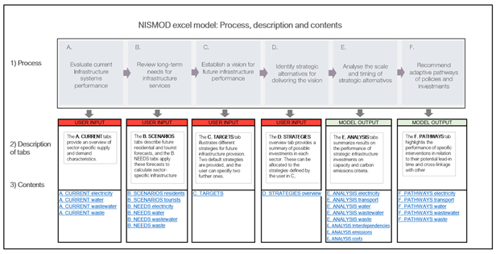
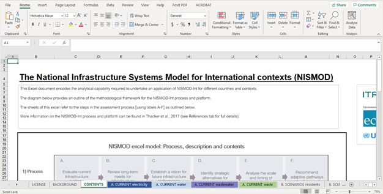
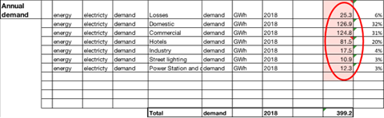
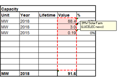
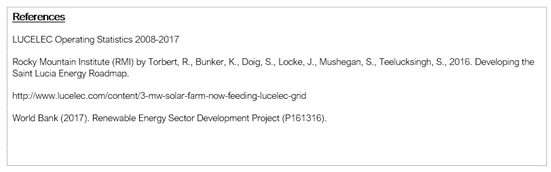
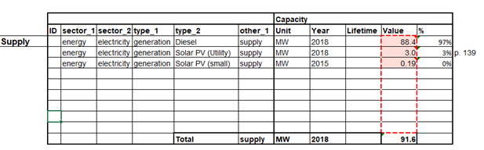
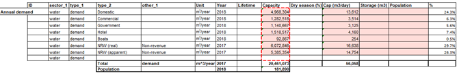
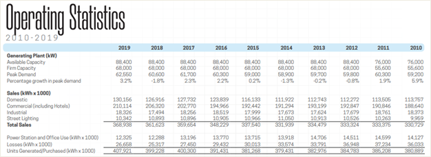

## Short description

This hands-on exercise introduces the National Infrastructure Systems
MODel -- International (NISMOD-Int) excel tool. The exercise provides an
overview of NISMOD's evidence-based infrastructure development process
and expounds on the process' first step of evaluating current
infrastructure performance. Examples are provided through application to
the Small Island Developing State of Saint Lucia.

## Learning objectives

-   Navigate the NISMOD excel tool
-   Evaluate infrastructure supply and demand using NISMOD
-   Input and update infrastructure data and associated confidence
    levels.

# Exercise content

## Activity 1- Introduction to the NISMOD excel tool

NISMOD was developed by the University of Oxford-led Infrastructure
Transitions Research Consortium (ITRC) in partnership with the United
Nations Office for Project Services (UNOPS). It is an evidence-based
infrastructure development modelling tool capable of analysing and
planning national infrastructure systems. It allows decision-makers to
evaluate current infrastructure performance, risks, and
interdependencies, test different infrastructure development strategies,
analyse their outcomes, and chart the best way forward
[@Adshead2018].

NISMOD can be applied to all the networked infrastructure systems:
energy, transportation, water, waste, and digital communications. Thus
far, the model has been successfully applied to varied developing
country contexts, including Palestine, Curaçao, and Saint Lucia
[@Ives2019; @Fuldauer2018; @Adshead2021].

The evidence-based infrastructure development process used involves
steps A-F shown in Figure 1.1 below.

-   [Steps A-B:]{.ul} Evidence-based infrastructure development involves
    first evaluating current infrastructure systems, then modelling
    future infrastructure needs via Steps A and B. Steps A and B require
    users to input key data such as a country's population, economy,
    available technology, and climate.

-   [Steps C-D:]{.ul} Steps C-D establish infrastructure performance
    targets and development visions and identify alternative strategies.
    The strategies developed are informed by policy documents,
    development plans, and stakeholder engagement.
-   [Steps E-F:]{.ul} Steps E-F conduct and illustrate strategy analyses
    based on target performance and make recommendations for
    implementation.

{width=100%}

**Figure 1.1:** Overview of the NISMOD evidence-based infrastructure
development process [@Adshead2018]

The NISMOD tool is housed in excel. The layout of the tool is displayed
in Figure 1.2. As seen in Figure 1.2, NISMOD consists of several sheet
tabs. The first three tabs, license, background, and content, introduce
the tool. The content tab contains the process, description, and
contents table illustrated in Figure 1.1. The contents row lists the
balance of the sheet tabs allocated to each step. These tabs contain the
calculations, analysis, and graphs needed at each step. The steps' tabs
are labelled with their letter. For example, Step A of the model
depicted in Figures 1.1 and 1.2 involves four tabs labelled:

1.  A. CURRENT electricity
2.  A. CURRENT water
3.  A. CURRENT wastewater
4.  A. CURRENT waste

{width=100%}

**Figure 1.2:** NISMOD excel tool layout [@Adshead2018]

Users are to input data required in Steps A-D in order to generate the
results displayed in Steps E-F. The data inputted is used to develop
scenarios, project infrastructure needs, and devise strategies to
reflect countries' policies and investment plans.

**Try It:** Navigate the NISMOD excel tool.

1.  Open the NISMOD excel file provided and read the information in the
    License, Background and Content tabs.
2.  Browse the tabs for Steps A-F to get familiar with the layout and
    contents of the tool.

## Activity 2- Introduction to Saint Lucia application

The NISMOD tool presented in this Hands-On is for the island of Saint
Lucia. The tool was used as part of the joint work done by the
University of Oxford UNOPS on Saint Lucia's National Infrastructure
Assessment [@Adshead2020]. NISMOD was used to model long-term
infrastructure strategies to meet national priorities in alignment with
the Sustainable Development Goals (SDGs) and the Paris Agreement
[@Adshead2020].

The NISMOD analysis focused on St. Lucia's energy, water, wastewater,
and solid waste systems. The transportation system could not be analysed
to the same extent due to significant data gaps, but was indirectly
considered (to be discussed in subsequent Hands-On sessions). Therefore,
the relevant steps in the tool (Steps A, B, E, and F), as shown in
Figure 1.1, contain tabs for electricity, water, wastewater, and waste.

The information used to populate NISMOD was obtained from a variety of
sources including national policy documents, plans, strategies, and
reports as well as in-country consultations. Where data was not
available from these sources, information from regional and
international studies were utilised. Given the importance of
communicating data confidence levels, NISMOD uses the method illustrated
in Figures 1.3 and 1.4 to indicate data confidence. Cells which contain
data from primary national sources are of high confidence and coloured
light pink. Cells with data originated from regional literature are
coloured dark pink for medium confidence and cells with data based on
global averages are coloured dark red for low data confidence.

{width=100%}

**Figure 1.3:** Confidence levels depiction method [@Adshead2018]

{width=100%}

**Figure 1.4:** Table in the A. CURRENT Electricity Tab showing data of
high confidence level [@Adshead2018]

Users should enter the best and most recently available information into
NISMOD. Where only medium or low confidence data can be found, effort
should be made to source primary data. Each tab where data is inputted
contains the data confidence table, notes on the source of data, as well
as a list of references. Figures 1.5 and 1.6 illustrate an example of
the notes and references included. Notes are accessed by hovering over a
cell.

{width=100%}

**Figure 1.5:** Table in the A. CURRENT Electricity tab showing data
source notes accessed by hovering over a cell [@Adshead2018]

{width=100%}

**Figure 1.6:** References listed in the A. CURRENT Electricity Tab at
the bottom on the sheet [@Adshead2018]

**Try It:** Go to the tabs for Steps A-F and carry out the following
activities:

1.  Read the introduction at the beginning of each tab and browse the
    summary charts and data/analysis displayed.
2.  Note the data confidence, data source comments, and references on
    each tab.

## Activity 3- Step A: Evaluating current infrastructure performance

As previously mentioned, the first step of the evidence-based
infrastructure development process for NISMOD involves assessing the
current performance of infrastructure systems. Step A's four tabs
evaluate Saint Lucia's current electricity, water, wastewater, and waste
systems by detailing the characteristics of the supply and demand
components in each system. The characteristics gathered for each system
vary slightly. The following sections explain the information to be
gathered for each infrastructure system tab.

A. CURRENT electricity

Critical information is collected for electricity supply, annual supply,
peak demand, and annual demand. As an example, Figure 1.7 depicts the
supply table in the tool.

{width=100%}

**Figure 1.7:** Supply table in the A. CURRENT Electricity tab
[@Adshead2018]

As seen in Figure 1.7, the following characteristics for each system
component needs to be defined:

-   **Sector_1:** Overarching infrastructure system.
-   **Sector_2:** Sub-sector within the infrastructure system. For
    example, in the energy sector this may be electricity or
    transportation.
-   **Type_1:** Broad type of component in the sub-sector, such as
    generation.
-   **Type_2:** Specific type of component in the sub-sector. For
    instance, electricity generation may be via diesel generators,
    nuclear reactors, natural gas, or renewable energy sources such as
    solar, wind, hydropower, geothermal, or biomass.
-   **Other_1:** Any further details on the system's components.
-   **Unit:** Unit of the capacity recorded. For example, this may be MW
    for peak electricity or GWh for annual supply or demand.
-   **Year:** Baseline year for the data. The Saint Lucia NISMOD used a
    baseline of 2018 (or the latest available data).
-   **Lifetime:** Design life of the component if known.
-   **Value:** Power or energy of electricity component based on the
    unit specified.

The "%" field is calculated by the tool in each tab for Step A. It
illustrates the percentage of total supply or demand capacity. NISMOD
also sums the total capacity value for each supply and demand group in
each Step A tab.

A. CURRENT water

Information for similar fields is collected for the disaggregated
supply, aggregated supply, peak demand, and annual demand of the water
sector. Disaggregated supply is broken down into each supply
infrastructure component including water treatment plants, raw intakes,
and desalination plants. Aggregated supply groups the individual
components into broader groups. As an example, Figure 1.8 illustrates
the table for annual demand.

{width=100%}

**Figure 1.8:** Annual demand table in the A. CURRENT water tab
[@Adshead2018]

The definitions of the fields, shown above, are as follows:

-   **Sector_1**[:]{.ul} Overarching infrastructure system.
-   **Type_1:** Type of system component. For the water sector this may
    be supply infrastructure or demand.
-   **Type_2:** Specific type of component. For supply, types of
    components include water treatment plants, raw intakes, and
    desalination. For demand, as seen in Figure 1.8, users are to
    specify the origin of the demand such as domestic, commercial, or
    hotel.

-   **Other_1:** Any other details on the system component. For example,
    for supply this would include the treatment type or process.
-   **Unit:** Unit of the capacity recorded.
-   **Year:** Baseline year for the data. The Saint Lucia NISMOD used a
    baseline of 2018 (or the latest available data).
-   **Lifetime:** Design life of the component if known.
-   **Capacity:** Volume of water per year supplied or demanded per
    infrastructure component based on the unit specified.
-   **Dry Season %:** For water supply infrastructure, this field
    details the percentage of full capacity available during the dry
    season.
-   **Cap (m3/day):** Daily capacity calculated as annual capacity
    divided by 365.
-   **Storage (m3):** Water supply infrastructure storage volume
    capacity.

A. CURRENT wastewater

Data is gathered for the supply, peak demand, and annual demand of the
wastewater system. The definition of the fields specific to the
wastewater system are as follows:

-   **Sector_1:** Overarching infrastructure system.
-   **Type_1:** Type of system component. For the wastewater sector this
    may be supply infrastructure or demand.
-   **Type_2:** Specific type of component. Supply types of components
    include wastewater treatment plants, sewerage networks, septic
    tanks, and pit latrines. Additionally, for this field, users are to
    specify the origin of demand.
-   **Other_1:** Any other details on the system component.
-   **Unit:** Unit of the capacity recorded.
-   **Year:** Baseline year for the data. The Saint Lucia NISMOD used a
    baseline of 2018 (or the latest available data).
-   **Lifetime:** Design life of the component if known.
-   **Treatment Value:** Volume of wastewater treated per year.
-   **Access Value:** Maximum volume of wastewater per year that can be
    treated or handled by the infrastructure component.
-   **Population:** Number of people served by the infrastructure
    component.

A. CURRENT waste

Similar information is collected for the solid waste system for
disaggregated supply, aggregated supply, and annual demand. The types of
information inputted are detailed below.

-   **Sector_1:** Overarching infrastructure system.

-   **Type_1:** Type of system component. For the waste sector this
    includes landfills, recycling, treatment, and unmanaged waste for
    supply as well as demand.
-   **Type_2:** Provides more details on the waste component. For
    supply, this would be the specific facility while for demand this
    field would contain the origin of the demand such as residential,
    commercial, agricultural, and biomedical.
-   **Type_3:** Further details of the component, such as mixed or
    separated waste for supply or for demand.
-   **Other_1:** Supply or demand component.
-   **Unit:** Unit of the capacity recorded. For Saint Lucia's waste
    sector, the units used were either tonnes or tonnes per year.
-   **Year:** Baseline year for the data. The Saint Lucia NISMOD used a
    baseline of 2018 (or the latest available data).

-   **Lifetime:** Design life of the component if known.

-   **Value:** Weight of waste supplied for treatment or disposal or
    demanded per infrastructure component based on the unit specified.

**Try It:** Become familiar with Step A tabs.

1.  Read all information in tabs A. CURRENT electricity, A. CURRENT
    water, A. CURRENT wastewater, and A. CURRENT waste.
2.  Match the overview provided above to each tab and note the
    percentage and summation calculations done by the tool.

## Activity 4 -- Insert your own data

**Try It:** Research and update the demand characteristics of the
electricity system with 2019 data as the tool currently has 2018 data.

1.  Search the [St. Lucia Electricity Services Limited (LUCELEC) 2019
    Annual
    Report](https://www.lucelec.com/sites/default/files/documents/LUCELEC-2019-Annual%20Report%20%28Interactive%29.pdf)
    provided for the Operating Statistics 2010-2019.
2.  Extract the MWh (1 MWh= 1 kWh x 1000) use for Domestic, Commercial
    (including hotels), Industrial, Street Lighting, Power Station and
    Office Use, and Losses as shown in Figure 1.9 below.

{width=100%}

**Figure 1.9:** Extract from the LUCELEC Operating Statistics 2010-2019
[@LUCELEC2020]

3.  Calculate the demand of hotels and the commercial electricity demand
    excluding hotels. Based on @Torbert2016, 20% of total electricity
    demand from commercial activities in St. Lucia originate from
    hotels. Therefore, hotel demand is equal to20% of the total
    commercial demand reported. Commercial demand (excluding hotels)
    would therefore be equal to 80% of total commercial demand.
4.  Convert all values obtained to GWh. 1 GWh = 1000 MWh
5.  Update the annual demand table in NISMOD tab A. CURRENT electricity,
    as shown in Table 1.1 below. The cells coloured yellow are the
    values to be changed. The cells coloured grey are calculated by the
    NISMOD tool.
6.  Ensure that the capacity value cells are coloured light pink in the
    tool as the information inputted is from a national document.

                 **Capacity**
  -------------- -------------- ------------ ------------------------------ ------------- ---------- ---------- -------------- ----------- -------
  **Sector_1**   **Sector_2**   **Type_1**   **Type_2**                     **Other_1**   **Unit**   **Year**   **Lifetime**   **Value**   **%**
  energy         electricity    demand       Losses                         \-            GWh        2019       \-             26.7        7%
  energy         electricity    demand       Domestic                       \-            GWh        2019       \-             130.2       32%
  energy         electricity    demand       Commercial                     \-            GWh        2019       \-             168.1       41%
  energy         electricity    demand       Hotels                         \-            GWh        2019       \-             42.0        10%
  energy         electricity    demand       Industry                       \-            GWh        2019       \-             18.3        4%
  energy         electricity    demand       Street Lighting                \-            GWh        2019       \-             10.3        3%
  energy         electricity    demand       Power station and Office Use   \-            GWh        2019       \-             12.3        3%
                                             **Total**                      **demand**    **GWh**    **2019**   \-             407.9       \-

**Table 1.1:** Table showing results of updated annual demand table for
A. CURRENT electricity [@Adshead2018]

## Summary

This hands-on introduced the NISMOD tool, specifically applied to the
Saint Lucia case study. The various activities walked you through the
first step of the evidence-based infrastructure development process:
Step A. Evaluate Current Infrastructure System Performance. Through the
activities you should be familiar with the layout of Steps A-F of the
NISMOD tool, understand the data needed for Step A, and be able to input
or update Step A infrastructure data.

## Bibliography
