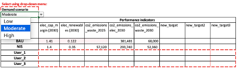

This hands-on exercise helps learners to identify scenarios of future
infrastructure needs by inputting demand drivers into the National
Infrastructure Systems MODel -- International (NISMOD-Int) excel tool,
using the case study of Saint Lucia. The exercise also demonstrates how
to input performance targets into the tool.

# Learning objectives

-   Change the population-based scenarios used in the model to determine
    infrastructure needs

-   Incorporate assumptions around per capita infrastructure use to
    align with different demand scenarios

-   Change and update targets in the model.

# Exercise content

This hands-on tutorial focuses on two steps of the National
Infrastructure Systems MODdelling (NISMOD) excel tool:

-   *'Defining future infrastructure needs'*

-   *'Targets for infrastructure performance'.*

In the NISMOD excel tool, these steps are encoded under the following
tabs:

-   'SCENARIOS': to define the possible range of future infrastructure
    needs based on the selected drivers

-   'NEEDS': to translate these scenarios to future demand for
    infrastructure at the national level

-   'TARGETS': to define the performance values by which the next step
    will select infrastructure investments and policies to meet this
    demand.

The 'Scenarios' tabs allow users to describe future population forecasts
-- in the case of Saint Lucia, this incorporates residential and tourist
scenarios. The 'Needs' tabs translate this to national demand based on
assumptions around per capita infrastructure use. The 'Targets' tabs
will use values defined by stakeholders and policy documents as
performance objectives in each sector.

The tool is available [**WHERE?**], and has been developed by the
Infrastructure Transitions Research Consortium in partnership with the
United Nations Office for Project Services (UNOPS) [@Adshead2020].

{width=100%}

**Figure 2.1:** Tabs used in the NISMOD tool to define future
infrastructure needs and set targets

## Activity 1: Assigning residential population scenarios

First, users are introduced to the population scenarios which drive
future infrastructure needs in the tool. Residential population growth
is a driver that places equal demand on infrastructure across all
different sectors. The 'SCENARIOS Residents' tab uses a series of
population projections taken from the [UN DESA World Population
Prospects](https://population.un.org/wpp/Download/Standard/Population/).
Of the proposed UN scenarios, three were selected as the default high
('high fertility rate'), moderate ('moderate fertility rate') and low
('low fertility rate') scenarios as shown below.

{width=100%}

**Figure 2.2:** Low, moderate and high population scenarios used as a
driver of infrastructure needs in the NISMOD tool

However, the tool allows users to assign and input up to three
population variants in the analysis by using the drop-down menu.

{width=100%}

**Figure 2.3:** Selection of alternate population variants in the tool

**Try it:** Assign alternate population variants to the low, medium, and
high scenarios. See how this changes the range of population forecasts
by 2050.

## Activity 2: Considering the impact of tourism on small-island infrastructure needs

Next, users are encouraged to input key data determining the impact of
tourist arrivals on future infrastructure needs. Projections for
incoming passengers at each of Saint Lucia's airports, cruise ports and
marinas have already been inputted, including expected growth numbers
from expanded facilities such as the international airport and main
cruise terminal.

The data entered in the table in Figure 2.4 will determine the average
number of tourists on the island on any given day. For example, tourists
arriving by airport are expected to stay for a longer period than those
docking in the marina. Notably, cruise ship tourists are considered in a
separate category from 'stay-over tourists' in terms of their
infrastructure demand, since they generally stay for a few hours and
rely to a much larger extent on infrastructure services provided on the
ship.

{width=100%}

**Figure 2.4:** Adjustable parameters for tourism as a driver of
infrastructure need

Together with the residential tourism scenarios developed in the
previous tab, the total number of infrastructure users on the island can
be established, which is shown in the 'SCENARIOS (aggregated)' tab
(Figure 2.5). The estimates include: residential population, peak daily
stay-over tourists, and peak daily cruise ship tourists. In addition,
the figure shows the relative contributions and uncertainties from the
different sources of population growth.

{width=100%}

**Figure 2.5:** Total number of
infrastructure users, with breakdown by residential and tourist

**Try it:** Imagine you are planning expansions to the airport capacity
in Saint Lucia. Change the 'Capacity airport expansion' to see how much
growth in this key tourism facility will add to the island's number of
infrastructure users.

## Activity 3: Translating demand drivers into infrastructure needs

Having established these scenarios around projected infrastructure
users, we now move on to considering what this means for future demand
on each type of infrastructure. This requires inputting parameters to
define per capita uses.

Here, we look specifically at the energy (electricity) sector. In this
instance, the per capita values have been estimated using the 'Current'
tabs on residential and tourist (i.e. hotels and boats) use (Figure
2.6). Putting together all sources of demand, we can project energy
demand across low, moderate, and high scenarios to 2050 (Figure 2.7).
The calculation in year *i* for infrastructure sector *j* is:

*Demand~i,j~ = (ResPop~i~ x ResPC~j~) + (StayOver~i~ x StayOverPC~j~) +
(Cruise~i~ x CruisePC~j~)*

Where *ResPop, StayOver, Cruise* denote the population of each group,
and *ResPC, StayOverPC, CruisePC* denote per capita use of each group.

{width=100%}

**Figure 2.6:** Per capita demand parameters for the energy sector

The "B. NEEDS \<sector\>" tabs describe expected per capita and tourist
demand for electricity, water, wastewater and waste treatment from the
present to 2050. Below, we see the example of electricity.

{width=100%}

**Figure 2.7:** Electricity generation needs derived from population and
tourist scenarios

This model also considers the fact that this per capita electricity use
may not remain static across scenarios. For example, higher per capita
usage may be paired with high-growth scenarios, or lower usage in the
case of austerity and population decline. The tool thus offers different
per capita use assumptions equivalent to other countries and regions
that can be paired with each growth scenario. Users may incorporate the
assumption, for instance, that a high-growth future for Saint Lucia will
bring about electricity use on par with upper middle income countries,
or the European Union.

{width=100%}

**Figure 2.8:** Assigning per capita infrastructure use in future demand
scenarios

**Try it: Test a different scenario of per capita energy use.** By
selecting from the drop-down menu, you can assign per capita use of
energy equivalent to another country or region. You may assume, for
example, that a 'high growth' population scenario may be associated with
increased economic activity and household income, leading to energy use
more in line with the EU or OECD average rate. You can do the same for a
low and moderate growth scenario. **See how this changes the range of
forecast electricity generation capacity needs into the future.**

##

## Activity 4 -- Generating targets

Finally, we look at how targets are inputted into the NISMOD tool,
through the 'Targets' tab. The generation of these targets was described
in mini-lecture 5.4. For example, by consulting [Saint Lucia's first
NDC](https://www4.unfccc.int/sites/ndcstaging/PublishedDocuments/Saint%20Lucia%20First/Saint%20Lucia%27s%20INDC%2018th%20November%202015.pdf),
we can obtain targets for renewable energy generation and emissions
reductions, associated with a particular achievement date. Figure 2.9
shows an abbreviated list of targets used for the Saint Lucia case
study, which were informed by discussions with stakeholders. This
includes a 'business-as-usual' strategy (BAU), which maintains targets
at current performance levels, and a 'national infrastructure strategy',
which aims to achieve more ambitious targets. The formulation of these
strategies is discussed in more depth in the Hands-on 3. In the rows
below, users may create a strategy of their own, based on a specific set
of targets and indicators of their choosing. Similarly, new targets may
be added to existing strategies in the additional columns.

{width=100%}

**Figure 2.9:** Target input table in the NISMOD-Int tool

Where applicable, the target input table will also adjust target values
to correspond to low, moderate, and high demand scenarios developed in
the 'Needs' tabs. For example, the amount of electricity generation
capacity required to meet a capacity margin target expressed as a
percent of demand will change based on whether a low, moderate, or high
scenario is chosen.

**Try it:** Consider the 'National Infrastructure Strategy' or NIS.
Change the renewable generation target for 2030 from 35% to 50% (i.e. by
inputting 0.5 instead of 0.35). Now check the results in 'Pathways --
electricity'. How far off the new target is the NIS strategy with the
current selected interventions?

## Summary

In the exercises above we introduced users to the 'Needs' and 'Targets'
tabs of the NISMOD-Int Excel tool. We experimented with different inputs
to the model -- specifically those concerning future infrastructure
users, both in terms of total numbers and of per capita infrastructure
use. Finally, users were able to inspect the 'targets' table and observe
the impact of changing target values.

## Bibliography
