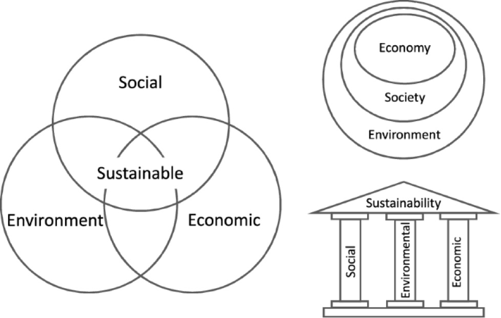
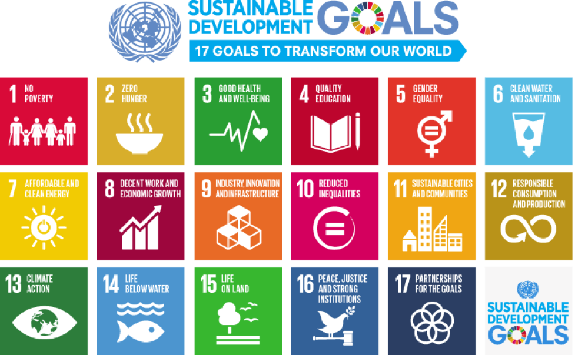
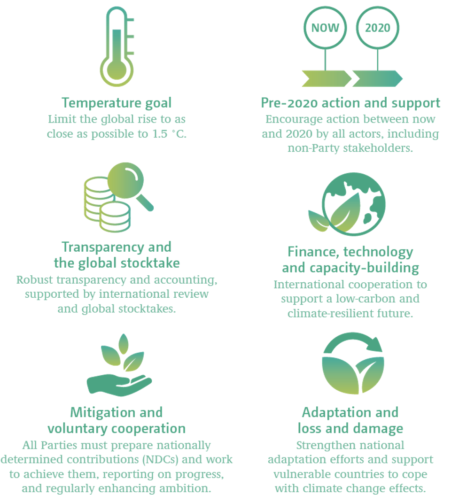
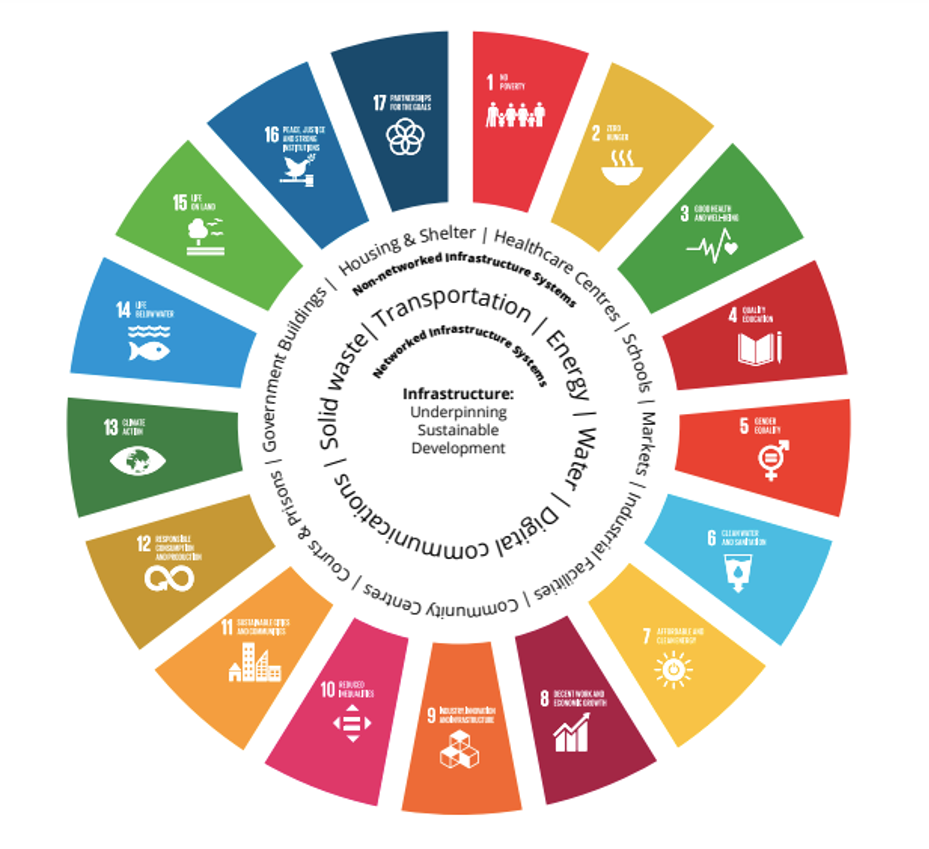
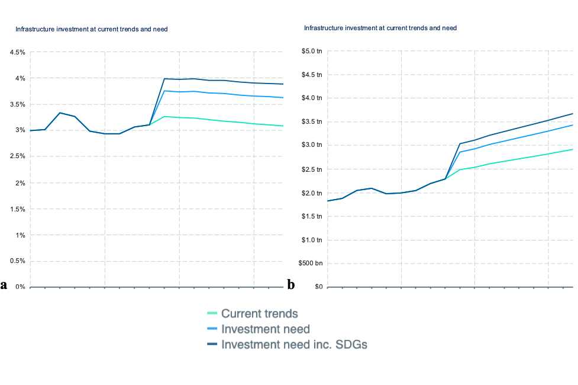

## Short description

This mini-lecture will provide a background to sustainable development,
the global agendas of the Sustainable Development Goals (SDGs), and the
Paris Agreement, and will introduce the role infrastructure can play in
achieving a wide range of sustainable development outcomes.

## Learning objectives

-   Describe the concept of sustainable development and how it frames
    the major global development agendas
-   Identify the general principles of the Sustainable Development Goals
    and the Paris Agreement.

# Lecture content

## Introduction

Sustainable development is key to ensuring the prosperity of our society
for generations to come. To achieve this, infrastructure is essential as
it provides the backbone of economic capacity through the delivery of
effective public services. In addition to its direct implications for
economic growth, the quality of an infrastructure system impacts on
other important aspects of society including human development, social
inclusion and environmental sustainability [@OECD2017]. As societal
demand for infrastructure services adjusts, infrastructure systems must
evolve and adapt to meet these needs effectively and efficiently.

This lecture will first introduce the concept of sustainable development
and the major global agendas that have been devised to formalise the
social, economic, and environmental principles aspired to by the world's
countries. Then it will discuss the important role infrastructure can
play in achieving these objectives.

## Sustainable development and the SDGs

Sustainable development is most famously defined in the 1987 Brundtland
[@WCED1987] report 'Our Common Future' as "development that meets the
needs of the present without compromising the ability of future
generations to meet their own needs". The concept of sustainability is
generally considered and assessed in terms of trade-offs between a set
of core dimensions [@IADB2018]:

-   Social: contributing to enhanced livelihoods and social wellbeing

-   Economic: generating a net positive economic return

-   Environmental: preserving, restoring and integrating the natural
    environment while ensuring resilience to climate risks.

Over the years, researchers have attempted to conceptualise these three
dimensions, or 'pillars' of sustainability, and to understand how they
interact and support one another (Figure 1.2.1). In most modern
interpretations of sustainable development, the 'three circles diagram',
highlighting the intersection of social, economic, and environmental
outcomes, is used. This implies that each of these domains contributes
equally to sustainable development, without priority of one over the
other. For example, environmental sustainability should not be
considered solely in the context of providing resources to support the
economy.

{width=100%}

**Figure 1.2.1:** Different representations of sustainability, composed
of social, economic, and environmental dimensions, with 'three circles
diagram' at left [@Purvis2019]

In order to formalise sustainable development in a policy framework that can be applied universally across countries, the 2030 Agenda for Sustainable Development was adopted by all United Nations Member States in 2015. At the heart of the 2030 Agenda are the Sustainable Development Goals (SDGs), which are an urgent call for action by all countries in a global partnership. The 17 SDGs (Figure 1.2.2) recognise that ending poverty and other deprivations must go hand-in-hand with improving health and education, reducing inequality, and spurring economic growth – all while tackling climate change and working to preserve oceans and forests [@UnitedNations2015].

{width=100%}

**Figure 1.2.2:** The 17 Sustainable Development Goals
[@UnitedNations2015]

## The Paris Agreement on climate change

The Paris Agreement is another major global agenda representing a
legally binding international treaty on climate change, which was
adopted by 196 countries (or 'Parties') in 2015. As its primary
objective, the agreement committed signatory nations to work to keep the
global temperature rise within this century to below 2°C above
preindustrial levels and to pursue efforts to limit it further to 1.5°C
[@UNFCCC2015]. In addition, it provides a framework for financial,
technical and capacity building support to countries which require it
(Figure 1.2.3), and covers both mitigation and adaptation action.

The agreement requires each Party to define their individual commitments
in terms of emission reductions, or Nationally Determined Contributions
(NDCs), in addition to strengthening their abilities to deal with
climate change impacts through adaptation measures. Each country party
to the agreement has communicated its individual mitigation commitments,
although the structure of these varies widely in terms of content, form,
scope, and coverage [@Roelfsema2020; @Taibi2018]. Revisions to these
commitments are expected at certain intervals, including 2020, which
marked the beginning of a new phase of action and programme
implementation to meet ambitious emissions reductions targets.

{width=100%}

**Figure 1.2.3:** Key objectives of the Paris Agreement on climate
change [@UNFCCC2017]

By its nature, there is much overlap between climate and development
objectives and policies. Therefore, there is a shared policy domain
between the SDGs and the Paris Agreement, with the potential for both
synergies and trade-offs [@FusoNerini2019].

In addition to the SDGs and Paris Agreement, other global agendas fall
within the sustainable development sphere, including the [*Sendai
Framework on Disaster Risk
Reduction*](https://www.preventionweb.net/files/43291_sendaiframeworkfordrren.pdf),
which sets out targets to reduce disaster risk and losses in terms of
lives, livelihoods, and other economic, social and environmental
indicators. The [*New Urban
Agenda*](https://habitat3.org/the-new-urban-agenda/) represents another
universal framework for sustainable urban development.

## Infrastructure and sustainable development

Infrastructure has the potential to help achieve many sustainable
development outcomes, highlighting its prominence within the global
development agendas. 'Networked' infrastructure systems such as energy,
transport and water provide basic services to users while also
supporting 'non-networked' infrastructure facilities providing social
and economic outcomes, such as hospitals, schools, and markets (Figure
1.2.4) [@Thacker2018; @Thacker2019].

The Millennium Development Goals (MDGs), the precursor to the current
SDGs, recognised the underpinning role of infrastructure sectors in
delivering pro-poor outcomes [@Jowitt2009], but limited their scope
to formal indicators covering only water and sanitation and access to
phone services. However, significant linkages between infrastructure and
the MDGs were already identified: providing basic social services,
enabling economic growth, and reducing environmental impacts through
efficiencies [@Modi2012].

The formulation of the SDGs established a more explicit role for
infrastructure outcomes as a pathway to global development, with several
goals focused on infrastructure sectors such as energy (SDG 7), water
and wastewater (SDG 6), transport (SDG 11) and solid waste (SDG 12), as
well as a goal devoted to resilient infrastructure itself (SDG 9).

Within the SDGs, attaining progress toward many development areas
simultaneously through infrastructure provision can be achieved. This is
due to the extensive links, networks, and trade-offs between specific
SDG goals and targets [@Weitz2014; @LeBlanc2015; @Nilsson2013]. For
example, energy interventions can assist in the achievement of 143 SDG
targets, including those addressing climate change, pollution, and human
rights abuses. However, they may also imply trade-offs for 65 targets,
such as those related to poverty eradication or access to food or clean
water [@FusoNerini2019].

{width=100%}

**Figure 1.2.4:** Infrastructure underpinning sustainable development:
Networked systems providing the basic services essential for the
functioning of non-networked systems and how they both influence the
SDGs [@Thacker2018]

## The infrastructure gap: Guiding sustainable infrastructure action

Major decisions around infrastructure will thus play a key role in
determining whether sustainable development objectives are achieved in
accordance with these agendas. A commonly-used term among policymakers
is the 'infrastructure gap', which refers to the amount of investment
required to address unmet current or future needs for infrastructure
services in countries or across regions. This accounts for numerous
factors, including demographic changes, economic growth, globalisation,
technology and climate change.

Globally, this need for infrastructure investment has been estimated at
up to USD94 trillion by 2040 [@Reuters2017]. A substantial share of
these investments will be undertaken in the developing world to underpin
the booming economies and growing aspirations of rapidly transitioning
economies [@OECD2007]. However, this notion of the infrastructure gap
as a largely economic concept has a few shortfalls:

-   It does not distinguish between productive or wasted investment.
    That is, if new infrastructure is damaged, destroyed, or not
    otherwise used as intended, it will not contribute to achieving
    sustainable development outcomes.

-   It does not account for the diverse outcomes of sustainable
    development. Specifically, environmental or social dimensions of
    sustainability may be sacrificed in favour of achieving economic
    objectives.

The infrastructure gap approach is nevertheless useful in guiding
infrastructure decisions when sustainable outcomes are accounted for. By
incorporating the specific costs of achieving SDG targets, we can see
that required investment increases by approximately 27% per year (Figure
1.2.5) -- by 2030, this amounts to around 27% beyond the investment
required to match the highest performing countries. To ensure these
targets are met, infrastructure initiatives must be well-coordinated and
aligned with development challenges faced in each national context.

{width=100%}

**Figure 1.2.5** Gap in infrastructure spending between current
(baseline) trends, investment needs to match best-performing countries,
and investment needs including achievement of the SDGs, shown as (left) %
of GDP and (right) trillion USD [@GIHub2020].

## Summary

Sustainable development -- meeting the needs of current and future
generations across social, economic and environmental dimensions --
frames much of the global policy discourse incorporated in the global
development agendas, including the Sustainable Development Goals and the
Paris Agreement. These agendas provide frameworks for achieving the
climate and development outcomes needed to achieve a sustainable future.
Infrastructure plays a very large role by providing a multitude of
services to users and supporting most sectors and domains of our
society. Investment in sustainable infrastructure will thus need to be
ambitious in targeting these sustainable outcomes, above and beyond
providing for basic needs.
