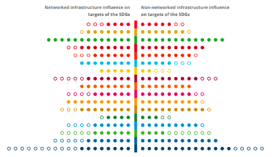
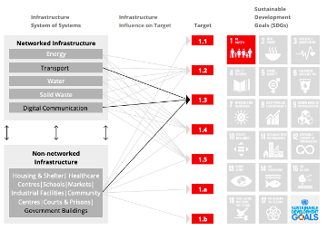
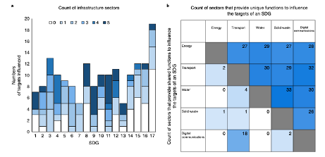

## Short description

This mini-lecture will delve deeper into the links between
infrastructure and sustainable development through the range of services
it provides to enable development outcomes, demonstrating these links
with examples. The lecture will consider the complementarity and
substitutability of services provided by various infrastructure types
within the infrastructure system.

## Learning objectives

-   To describe the concept of an infrastructure service and to give
    examples of the multiple ways it can influence development targets

-   To differentiate between direct and indirect influences of
    infrastructure on development

-   To provide examples of when infrastructure may provide complementary
    or substitutable services.

# Lecture content

## Introduction

Infrastructure systems, including energy, transport, telecommunications,
water, and waste management, provide essential services for the
well‐being of people, the economy, and the planet [@Adshead2021]. To
ensure that infrastructure is built most effectively and efficiently,
policymakers should establish long-term visions for sustainable national
infrastructure systems, informed by the Sustainable Development Goals
(SDGs), and develop adaptable plans that can demonstrably deliver their
vision [@Thacker2019]. This will require a deep understanding of what
services infrastructure systems provide, and how these can be combined
and leveraged through policies, projects and investments.

This lecture will introduce the concept of infrastructure services and
how they enable development outcomes. Recent research to define linkages
between infrastructure and the SDGs will be discussed, including the
extent to which infrastructure sectors can provide unique or
substitutable services in the pursuit of SDG target achievement.

## Introduction to infrastructure services

To address infrastructure's impact on sustainable development it is
important to understand the concept of infrastructure services and how
they are linked to social, economic and environmental outcomes.
Infrastructure services refer to the means by which a system of physical
infrastructure assets can deliver on societal needs. Some researchers
consider an infrastructure service to refer to the resource provided by
the sector itself, such as energy, water, or transportation
[@Briceno-Garmendia2004].

However, more commonly, infrastructure services are defined in terms of
end-uses to individuals, households, and businesses [@Cullen2010;
@Knoeri2016]. For example, energy infrastructure provides services in
the form of lighting or thermal comfort (heat or cooling). Water
infrastructure provides hygiene services, while transportation
infrastructure provides accessibility (e.g. to education, employment, or
recreation) and communication. This definition implies that we can
provide the same service using several means, for example: the same
lighting service can be provided by an energy-efficient lightbulb, using
fewer watts, than a less-efficient lightbulb. This will be important
later on when we consider how we can assemble infrastructure portfolios
most efficiently to meet a demand for infrastructure services.

Understanding how the provision of these services links to development
outcomes such as health, education, equality, justice, and economic
growth is addressed with a closer examination of the SDG framework.

## Achieving the SDGs through infrastructure services

Although infrastructure is the focus of SDG 9 ("Industry, Innovation and
Infrastructure\"), it is recognised as having a much wider range of
development benefits. The extent to which infrastructure systems, and
the services they provide, influence sustainable development outcomes,
can be defined using the SDG targets.

Figure 1.3.1 estimates the extent to which infrastructure either
directly or indirectly influences the SDGs, implying that the
achievement of the target will be enhanced through the provision of
improved infrastructure services that the infrastructure delivers. These
may be direct or indirect:

-   Direct influences on an SDG target include cases in which the SDG
    target is described directly in terms of the service that an
    infrastructure system provides, for example, target 7.1 (*By 2030,
    ensure universal access to affordable, reliable and modern energy
    services*).

-   Indirect influences on an SDG target include cases in which the SDG
    target is not described specifically in terms of the service that an
    infrastructure system provides, but for which evidence indicates
    that achievement of the target will be enhanced through the
    provision of improved infrastructure services. For example, target
    3.9 (*By 2030, substantially reduce the number of deaths and
    illnesses from hazardous chemicals and air, water and soil pollution
    and contamination*) can be indirectly influenced by improved energy,
    transportation, water and waste services.

Overall, networked infrastructure systems such as energy or road
networks or water supply systems are found to influence all 17 of the
SDGs, including 121 of the 169 targets (72%) [@Thacker2019].

{width=100%}

**Figure 1.3.1:** Summary of the influence of infrastructure across all
SDGs. Circles represent the individual targets of each SDG. Circles are
coloured when they can be influenced by at least one type of
infrastructure [@Thacker2018]

## A closer look at achieving the SDGs through infrastructure services

In addition to providing for people in their homes, the services from
networked infrastructure systems support other non-networked
infrastructure systems that are critical for the functioning of society.
These non-networked systems are comprised mainly of a type of building
or facility which supports the delivery of a service, such as hospitals,
schools, government buildings, industrial facilities, or community
centres [@Thacker2018]. As shown in Figure 1.3.1, these non-networked
infrastructures increase the number of targets influenced beyond that of
networked infrastructure, with an overall influence covering 90% of SDG
targets.

Figure 1.3.2 gives a visual representation of how services provided by
networked and non-networked types of infrastructure can contribute to
the achievement of SDG 1 (No Poverty). As a specific example
[@Thacker2018], we can assess infrastructure's potential influences
on target 1.3 (*to implement nationally appropriate social protection
systems and measures for all*), which may enhance achievement of the
target through services including:

- Effective information management systems (digital communications)

- Access to all communities in order to aid data collection (transport)
- Services provided by non-networked facilities such as
  government buildings, which are responsible for managing social
  protection systems.

By understanding the intricate linkages between all types of
infrastructure and specific outcomes enabled by the services they
provide, we can better assess the capability of a particular
infrastructure project, investment, or policy to deliver on sustainable
development. This may imply wider impacts than the project type
suggests. For example, the rehabilitation of a road (transport sector)
may be undertaken so as to improve water and waste sector outcomes
through the incorporation of drainage systems and waste management
connectivity.

{width=100%}

**Figure 1.3.2:** Graphical representation of the influence of networked
and non-networked infrastructure on the targets of SDG 1. The specific
influences related to Target 1.3 are highlighted in black
[@Thacker2018]

## Complementarity and substitutability of infrastructure services

It is useful to understand the degree to which infrastructure services
can be provided by one or more sectors, which can enable more efficient
infrastructure planning suited to a particular context.

Infrastructure sectors may provide unique functions (services), that is,
individual and independent contributions toward achievement of the
target, which may complement one another. By influencing the target in
different ways, the impacts of each sector toward target progress are
additive and non-substitutable. For example, target 4.a (*Effective
learning environments for all*) can benefit from contributions from the
energy, water, waste and digital communications sectors, which each
provide a unique contribution to improving conditions in schools and
other education facilities [@Thacker2019].

Sectors that provide shared functions with regard to a certain outcome
will achieve the same target, but in different ways. This overlap
provides decision-makers with a choice of how to influence certain
targets and can add redundancy or build systemic resilience. For
example, for target 6.1 (S*afe and affordable drinking water*) the
secure provision of safe drinking water can be provided locally through
investments in water infrastructure such as water pipes or by means of
trucks; thus, a reliable road network to access these communities can
substitute for physical water infrastructure [@Thacker2019].

Figure 1.3.3 highlights these functional interdependencies between
networked infrastructure sectors. While SDG 7 requires contributions
from only two sectors, SDG 11 requires all five sectors to achieve its
targets. Furthermore, the transport and digital communications sectors
show a high degree of substitutability, while solid waste provides most
of its contributions as a unique or complementary infrastructure
service.

{width=100%}

**Figure 1.3.3: a.** Counts of the number of different infrastructure
sectors that influence the SDG targets (where 5 is the maximum) that are
identified as being able to influence different targets of the SDGs.
**b**. Counts of the number of interdependencies, which are identified
when more than one sector can influence a target. Interdependencies are
classified as unique when different sectors influence a target in a
different way (top right) and shared when different sectors influence a
target in the same way (bottom left) [@Thacker2019]

##

## Summary

Infrastructure services can influence development targets in many ways,
both directly and indirectly. They enable a wide range of development
outcomes and are integral to achieving the Sustainable Development
Goals. By disentangling the complex linkages between infrastructure
services and development, we can determine the broader societal impact
of an infrastructure project or intervention. This includes
understanding whether infrastructure services are provided in a
complementary or substitutable way across sectors, which can help
planners adapt infrastructure planning to a national or regional
context.
