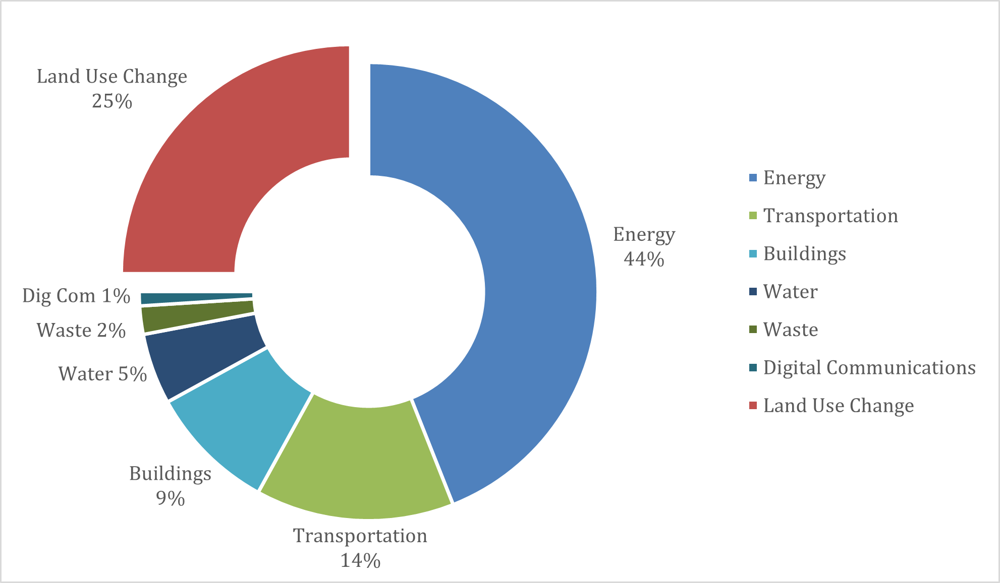
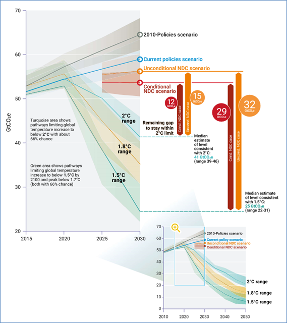

# Metadata

## Keywords

-   Infrastructure

-   Greenhouse gas emissions

-   Emissions gap

## Authors

-   Sapphire Vital

## Short description

This mini-lecture outlines global infrastructure systems' contribution
to greenhouse gas emissions. It provides an overview of the emissions
reduction commitments made through the Paris Agreement and subsequent
Nationally Determined Contributions (NDC). Against this backdrop, the
lecture highlights key reduction activities within critical
infrastructure systems.

## Learning objectives

-   Indicate infrastructure systems' contribution to greenhouse gas
    emissions
-   Describe projected global emissions gap based on NDC commitments
-   Identify effective emissions reduction solutions for infrastructure
    systems.

# Lecture content

## Introduction

Based on the most recent data, global greenhouse gas emissions reached
approximately 59.1 GtCO~2~e (gigatonnes of carbon dioxide equivalent) in
2019. Over the last decade, greenhouse gas emissions have grown annually
at an average rate of 1.4% with no significant or sustained decline.
Throughout 2020 and 2021, a decline has been observed due to the
COVID-19 pandemic. However, unless COVID-19 recovery plans inculcate
green strategies, emissions are expected to rise and continue rising in
the aftermath of the pandemic. Our current emissions pathway is leading
us to more than 3^o^C warming by the end of the century
[@UnitedNations2020].

Being aware of emissions' origin enables effective planning of emissions
reduction measures. Global emissions originate from a variety of
sectors. The major contributors over the past decade have been the
energy, industry, transportation, and agricultural sectors. Within the
energy infrastructure system, electricity and heat generation was the
top emitter from 2010-2019, accounting for 24% of total greenhouse gas
emissions. Together with the other infrastructure systems, such as
transportation and buildings, the infrastructure sector produced more
than half of global greenhouse gas emissions within this period.

The sector therefore stands as a crucial focal point for climate change
mitigation efforts. Further, given the global presence of aging
infrastructure, infrastructure systems offer us an ideal opportunity to
alter our carbon intensive trajectory.

## Greenhouse gas emissions from the infrastructure sector

Taking a more in-depth look, the infrastructure system of systems
generates approximately three quarters of global greenhouse gas
emissions. In descending order of contribution, the energy,
transportation, buildings, water, waste, and digital communication
infrastructure systems produced approximately 75% of 2018 global
emissions. The breakdown devised from a variety of data sources is
detailed in Figure 2.1.1 below.

{width=100%}

**Figure 2.1.1:** Global greenhouse gas emissions sector breakdown
[@Olivier2020; @Malmodin2018; @Wakeel2016; @Deemer2016]

As shown in Figure 2.1.1, each infrastructure system produces varying
proportions of greenhouse gas emissions due to varying emission
generating processes.

For instance, the energy sector generates 44% of global greenhouse gas
emissions via coal, oil, and natural gas production and consumption
[@Olivier2020]. The transportation sector produces 14% of emissions
through oil production and use [@Olivier2020]. The building sector
accounts for 9% of greenhouse gas emissions via cement production and
energy consumption in commercial and residential buildings
[@Olivier2020]. The water sector's 5% of global emissions originates
from reservoir decomposition [@Deemer2016] and energy consumed in the
abstraction, treatment, and distribution of water and wastewater
[@Wakeel2016]. Notably, emissions from organic decomposition in water
bodies such as lakes and dams have been difficult to estimate and are
uncertain. The waste sector contributes 2% of global emissions via
decomposition from landfills [@Olivier2020]. Lastly, the digital
communication sector generates 1% of global greenhouse gas emissions via
energy consumption in the lifecycle of Information and Communication
Technology [@Malmodin2018]; energy is consumed in the manufacture and
operation of user equipment, access networks, and service providers.

## Nationally Determined Contributions' emissions gap

The Paris Agreement requires its signatories to commit to emissions
reduction through non-binding Nationally Determined Contributions
(NDCs). NDCs are a medium to communicate countries' climate actions
based on their national priorities and capabilities. Given that
developed countries have historically contributed the majority of
greenhouse gas emissions, they are expected to lead mitigation action
and provide financial, technical, and capacity-building support to
developing countries. All parties are to submit conditional or
unconditional NDC commitments every five years, ideally with increased
ambition.

Current NDC commitments for 2030 are not enough to meet the Paris
Agreement of 2^o^C or 1.5^o^C goals (See Figure 2.1.2). There is a 12-19
GtCO~2~e and 29-36 GtCO~2~e emissions gap between global annual
emissions and current NDC commitments for the 2^o^C and 1.5^o^C goals,
respectively. These emission gaps translate to a projected temperature
rise of at least 3^o^C by the end of the century
[@UnitedNations2020].

Further, the developed countries that contribute 78% of global
greenhouse gas emissions, are not in line to accomplish their current
NDC commitments. Although many of these countries have recently made
ambitious net-zero emissions pledges, these have not translated into
action plans or updated NDCs [@UnitedNations2020].

Climate change mitigation action needs to be urgently ramped up if we
are to meet the Paris Agreement's targets. According to the 2020 UN
Emissions Gap Report, countries direly need to develop and implement
long-term strategies that are in line with the Paris Agreement.
Countries need to simultaneously update their NDCs to reflect these
plans and other related goals [@UnitedNations2020].

{width=100%}

**Figure 2.1.2**: 2030 emissions gap based on current policies
[@UnitedNations2020]

## Key emission reduction actions

What actions can we take to bridge the emissions gap? Mitigation action
involves the two broad areas of greenhouse gas emissions reduction and
the enhancement of carbon sinks through nature-based solutions (see
Lectures 15-18). The application of these two groups of initiatives can
take a variety of forms within the infrastructure system. Some examples
are shown in Table 2.1.1 below. Notably, nature-based solutions are
particularly applicable to the water sector via ecosystem enhancement to
safeguard water reserves.

**Table 2.1.1:** Possible grey and green infrastructure mitigation
actions

+----------------------------------+----------------------------------+
| **Greenhouse Gas Emissions       |                                  |
| Reduction with Grey and Green    |                                  |
| Infrastructure Actions**         |                                  |
+==================================+==================================+
| **Infrastructure Options**       | **Nature-Based solutions (see    |
|                                  | Lectures 15-18)**                |
+----------------------------------+----------------------------------+
| -   Renewable energy generation: | -   Restoration of degraded      |
|     solar, wind, hydropower,     |     ecosystems (e.g. mangrove    |
|     biomass, ocean technologies, |     restoration, grassland       |
|     geothermal                   |     restoration, restoration of  |
|                                  |     beach and dune systems,      |
|                                  |     wetland restoration)         |
+----------------------------------+----------------------------------+
| -   Energy efficiency            | -   Protection of existing       |
|                                  |     ecosystems (e.g. protection  |
|                                  |     of salt marshes, coral       |
|                                  |     reefs, oyster reefs,         |
|                                  |     protection of grasslands and |
|                                  |     intact forests)              |
+----------------------------------+----------------------------------+
| -   Low-carbon transport:        | -   Improved management          |
|     electric vehicles,           |     practices (e.g. agricultural |
|     low-carbon fuel, efficiency  |     management practices such as |
|     improvements                 |     agroforestry, improved       |
|                                  |     grazing land management)     |
+----------------------------------+----------------------------------+
| -   Zero-energy buildings:       | -   Creation of new ecosystems   |
|     energy efficient appliances  |     (e.g. urban green spaces,    |
|     and lighting, low-carbon     |     green roofs on buildings,    |
|     fuel                         |     constructed treatment        |
|                                  |     wetlands)                    |
+----------------------------------+----------------------------------+
| -   Low-carbon industry:         |                                  |
|     efficiency improvements,     |                                  |
|     low-carbon fuel              |                                  |
+----------------------------------+----------------------------------+
| -   Reduction of fossil fuel     |                                  |
|     subsidies                    |                                  |
+----------------------------------+----------------------------------+

Some initiatives are considered to be low hanging fruit given their
combined low cost and cross-sectoral sustainable development benefits.
The report by IPCC [@Ipcc2018] highlights that mitigation action to
reduce energy demand, decreased material consumption, and lower
carbon-intensive food consumption have the highest potential sustainable
development impact. Within those key areas, energy demand reduction sits
most within infrastructure systems' remit.

The COVID-19 pandemic and the economic challenges triggered may increase
or decrease mitigation impetus. Ideally, COVID-19 recovery plans should
be utilised to accelerate low-carbon growth. Fiscal rescue and recovery
measures that maintain fossil fuel generation and other carbon intensive
activities should not be supported. Rather, emissions reduction
initiatives should be advanced through top-down measures to redesign
infrastructure systems and bottom-up lifestyle changes.

## Summary

The current picture of global emissions is bleak as greenhouse gas
emissions continue to rise. Infrastructure systems are major
contributors to global emissions and therefore should be one of the main
targets for increased climate change mitigation action. Transitioning to
low carbon infrastructure systems is a critical element of bridging the
current emissions gap and achieving the Paris Agreement's targets.
