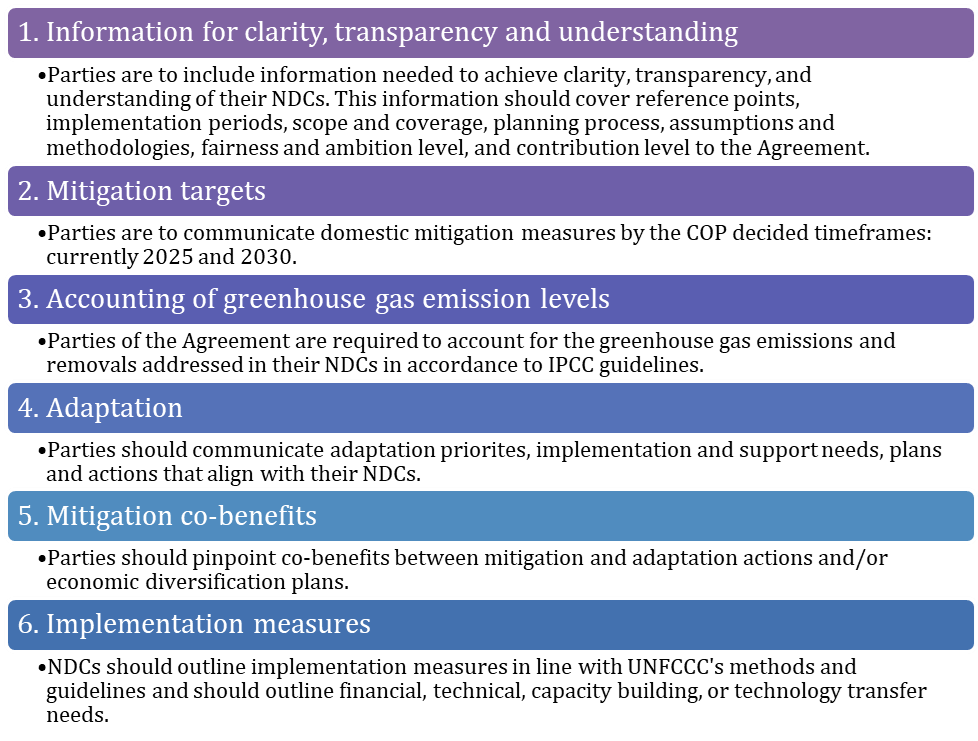
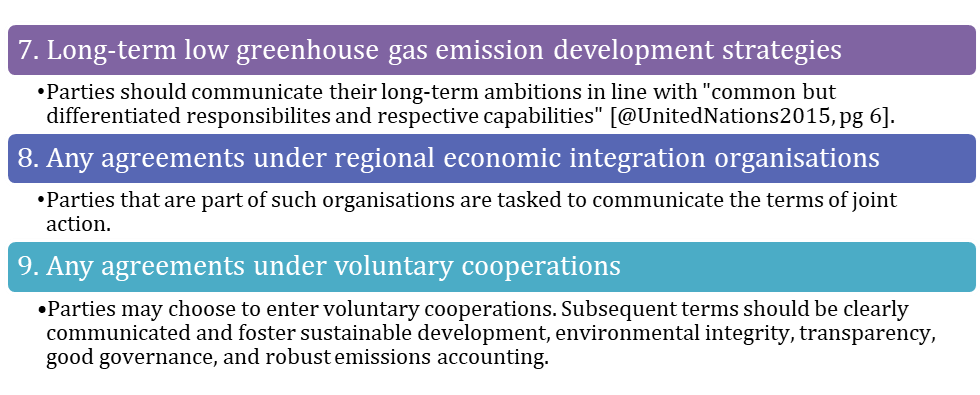
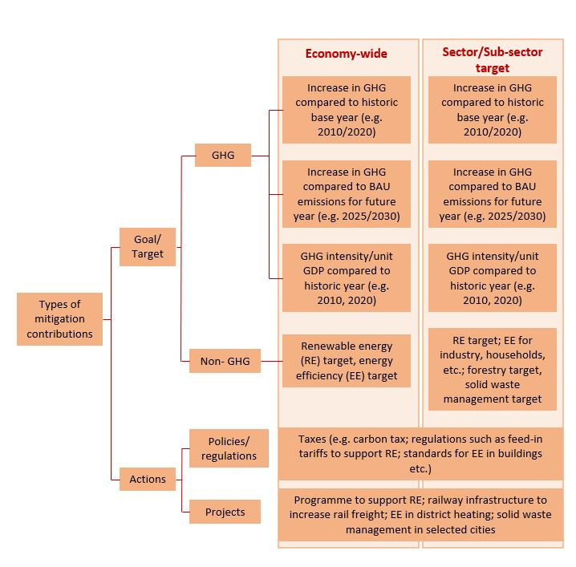
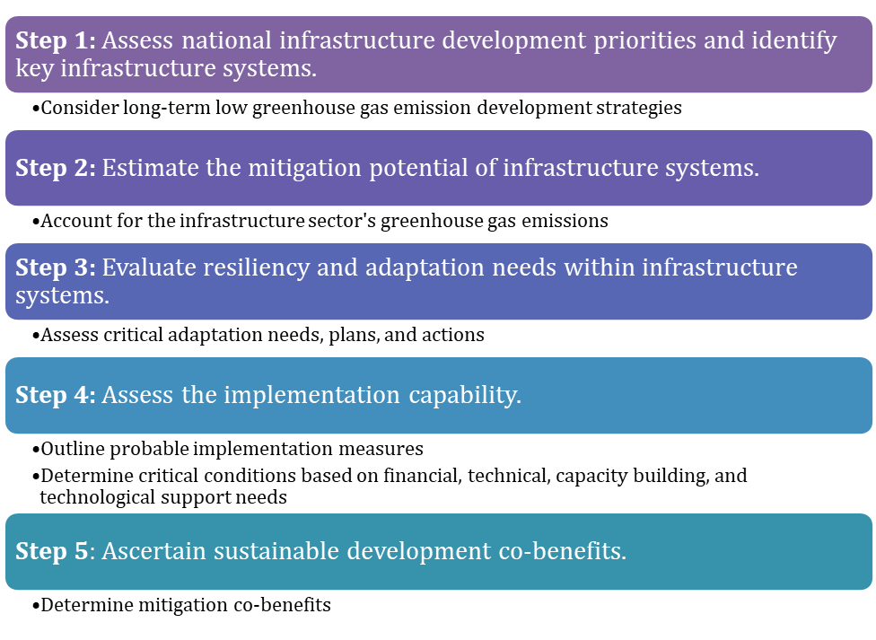
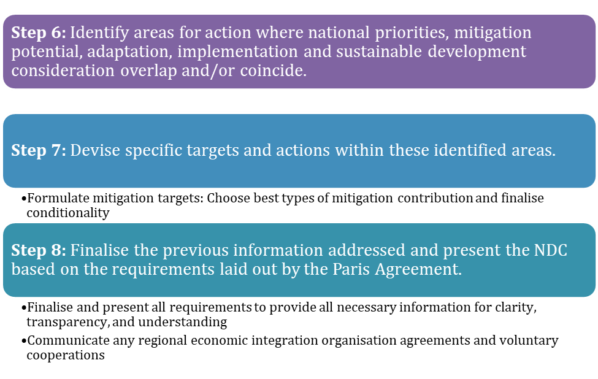

# Metadata

## Keywords

-   Mitigation targets

-   Nationally Determined Contributions

-   Paris Agreement

## Authors

-   Sapphire Vital

## Short description

This mini-lecture delves deeper into understanding Nationally Determined
Contributions (NDCs) by taking a closer look at the NDCs' requirements
and varying responsibilities as well as the types of mitigation targets.
The mini-lecture also proposes an approach to developing infrastructure
targets and presents examples from varying contexts.

## Learning objectives

-   Describe the requirements of NDC targets as stipulated by the Paris
    Agreement
-   Explain the types of mitigation targets
-   Formulate NDC mitigation targets within the infrastructure sector.

# Lecture content

## Introduction

The Paris Agreement requires signatories to submit increasingly
ambitious Nationally Determined Contributions (NDCs) every five years.
The Agreement's Parties were to submit their first NDCs upon
ratification, acceptance, or approval of the Paris Agreement. Subsequent
NDCs were due by 2020 and every five years thereafter
[@UnitedNations2015]. Most Parties submitted their first NDCs in 2016
and many were expected to submit their second NDCs by the 26^th^
Conference of the Parties (COP26) of the UNFCCC which was originally
scheduled for 2020. However, due to challenges brought about by the
COVID-19 pandemic, COP26 has been postponed to 2021 and updated NDCs are
to be submitted as the year progresses. According to the [NDC
registry](https://www4.unfccc.int/sites/NDCStaging/Pages/Home.aspx), of
the 196 Parties to the Agreement, 191 Parties have submitted their first
NDCs while, at present, only 8 Parties have submitted their second NDCs.

High levels of focus are placed on the NDCs because they are the core
implementation mechanism of the Paris Agreement enabling its long-term
success. With this in mind, the COP held the [Talanoa
Dialogue](https://unfccc.int/process-and-meetings/the-paris-agreement/the-paris-agreement/2018-talanoa-dialogue-platform)
in 2018 to take stock of NDC efforts and discuss next the round of
preparations. The COP plans to continue global stock take dialogues from
2023 and every five years thereafter.

It is therefore important to thoroughly understand how to develop NDC
targets. This understanding should be based on a sound grasp of NDC
requirements, responsibilities, and key development considerations.
Given the carbon intensity of infrastructure systems, the following
sections dive deeper into these areas with ultimate focus on the
infrastructure sector.

## Understanding the NDCs in depth: NDC requirements

The [Paris
Agreement](https://unfccc.int/sites/default/files/english_paris_agreement.pdf)
lays out the requirements for NDCs. The relevant articles, particularly
Article 4, detail the following core nine areas for inclusion. A recent
COP decision report relays further critical guidance on these components
[@UNFCCC2019].

{width=50%}
{width=50%}

**Figure 2.2.1:** NDC requirements

## Understanding the NDCs in depth: Countries' varying responsibilities

In addition to the NDC requirements, the Paris Agreement stipulates
varying responsibilities for developed and developing countries. It
states that mitigation actions are to be developed based on countries'
national priorities and capabilities. The Agreement further explains
that developed countries should pursue economy-wide absolute emission
targets while developing countries move progressively towards such
reduction targets with the support of developed countries through the
Agreement's mechanisms.

Acknowledging this, many countries specified a mixture of unconditional
and conditional targets in their Intended Nationally Determined
Contributions (INDCs), communicated prior to COP21, and in their
subsequent NDCs. Unconditional targets are targets which countries
commit to implement given their national resources while conditional
targets are tied to the provision of inter alia technical, financial,
technological, or capacity-building support. Developing countries
specified several types of conditions in their INDCs including those
based on the following areas [@Day2016]:

-   **Provision of international financial and technical support for
    mitigation implementation:** Represented over 80% of conditional
    targets

-   **Collective ambition:** Here Parties based their conditions on
    increased levels of collective NDC ambition

-   **Finalised Paris Agreement rules:** Such commitments based their
    targets on the finalised rules of engagement of the Paris Agreement
    such as the structure of support mechanisms

-   **General circumstance:** Some Parties submitted general conditions
    tied to their national economic, political, or/and social status.

Many countries did attach specific values to their conditions.
Specifying set amounts for finance required, level of collective
ambition needed, or other requirements, facilitates accurate projection
of NDC emission reduction commitments.

## Understanding the NDCs in depth: Types of targets

Infrastructure NDC contributions are mitigation targets or actions.
Whether conditional or unconditional, there are varying ways to define
mitigation contributions [@Taibi2018]. The types of mitigation
contribution can be categorised into four main groups, as shown in
Figure 2.2.2. According to @Taibi2018, mitigation contributions may be
specific targets or actions. Specific targets may be based on:

-   **Greenhouse gas emission (GHG) targets**: GHG targets may be an
    absolute emissions reduction percentage relative to a base year or a
    fixed volume of emissions by a particular year expressed in tonnes
    of CO~2~eq (carbon dioxide equivalent). They may also be expressed
    as relative targets tethered to a reference point. Reference points
    include business as usual (BAU) scenarios or GHG intensity levels.
    GHG intensity is defined as GHG emissions per unit of Gross Domestic
    Product (GDP).

-   **Non-GHG targets**: Non-GHG targets are pledges devised based on
    technologies such as renewable energy or energy efficiency expressed
    as a percentage by a particular year. For example, 100% renewable
    energy electricity generation by 2030.

{width=100%}

**Figure 2.2.2:** Types and examples of NDC mitigation targets (adapted
from @Taibi2018)

Mitigation contributions may also be action-based, with no numerical
quantification attached. Such actions, as seen in Figure 2.2.1, include
specifications on policies and regulation, as well as projects.

The NDCs can include a mixture of GHG and non-GHG targets, and
mitigation actions that best communicate countries' ambition and
capabilities.

## Bringing it all together: An approach to developing infrastructure targets within NDCs

The following approach to developing NDCs synthesises the key
information outlined on NDCs' requirements, varying responsibilities,
and other key attributes. The approach seeks to guide the development of
infrastructure sector mitigation targets for developing countries' NDCs.

The approach specifically considers developing countries' need to
maximise limited human and financial resources. Each step lists key
components presented in the previous sections.

{width=50%}
{width=50%}

**Figure 2.2.3:** NDC development approach

## Developed and developing country examples of NDC targets

In developing NDC targets, it may be beneficial to refer to examples.
The [NDC
Registry](https://www4.unfccc.int/sites/NDCStaging/Pages/All.aspx)
records all the NDCs submitted to date; they are all available for
download and review. The NDCs represent varying levels of ambition
across the Agreement's developed and developing country Parties.
@UNFCCC2021 presents a
[synthesis](https://unfccc.int/process-and-meetings/the-paris-agreement/nationally-determined-contributions-ndcs/nationally-determined-contributions-ndcs/ndc-synthesis-report#eq-5)
of new or updated NDCs submitted by the 31^st^ of December, 2020. A
second version of the synthesis report will be developed in advance of
COP26 to include further submissions. The 75 submissions included in the
first edition of the synthesis report represent 40% of the Parties and
only 30% of global GHG emissions. Examples of new or updated NDC targets
are shown in Table 2.2.1 below.

**Table 2.2.1:** Examples of developing and developed countries' most
recent NDCs [@GovernmentofGrenada2020; @GovernmentofKenya2020;
@EuropeanUnion2020; @AustralianGoverment2020]

  **Country**                                                                                                                                **Mitigation Targets**                                             **Sectors Addressed**                                                                                                     **Support Needed/ Conditionality**
  ------------------------------------------------------------------------------------------------------------------------------------------ ------------------------------------------------------------------ ------------------------------------------------------------------------------------------------------------------------- --------------------------------------------------------------------------------------------
  [Grenada](https://www4.unfccc.int/sites/ndcstaging/PublishedDocuments/Grenada%20Second/GrenadaSecondNDC2020%20-%2001-12-20.pdf)            Reduction of 40% of 2010 GHG emissions levels by 2030.             Energy (including domestic transport), forestry, waste, cooling sector                                                    Implementation anticipated through access to multilateral and bilateral financial support.
  [Kenya](https://www4.unfccc.int/sites/ndcstaging/PublishedDocuments/Kenya%20First/Kenya's%20First%20%20NDC%20(updated%20version).pdf)      32% reduction in GHG emissions by 2030 compared to BAU scenario.   Economy-wide (energy, industrial processes and product use, agriculture, land-use, land-use change and forestry, waste)   International support for 87% of GHG reduction budget
  [European Union](https://www4.unfccc.int/sites/ndcstaging/PublishedDocuments/Germany%20First/EU_NDC_Submission_December%202020.pdf)        55% GHG emissions reduction compared to 1990 by 2030               Economy-wide                                                                                                              \-
  [Australia](https://www4.unfccc.int/sites/ndcstaging/PublishedDocuments/Australia%20First/Australia%20NDC%20recommunication%20FINAL.PDF)   Reduce GHG emissions to 26-28% by 2030                             Economy-wide                                                                                                              \-

## Summary

This mini-lecture provided key information to understand the
requirements of NDCs and thus develop mitigation targets within them.
The approach proposed to develop mitigation targets in the
infrastructure sector considers the Paris Agreement's stipulations and
the NDC's varying responsibilities, all which inform the types of
targets that countries may pursue. Steps 1 to 4 of the approach involve
collecting information which countries should already possess. Steps 5
and 6 critically assess co-benefits across these areas and determine
targeted action. Steps 7 and 8 devise and output mitigation targets. The
next mini-lecture presents further insight into Steps 5 and 6 by
detailing a methodology to evaluate cross sectoral co-benefits.
