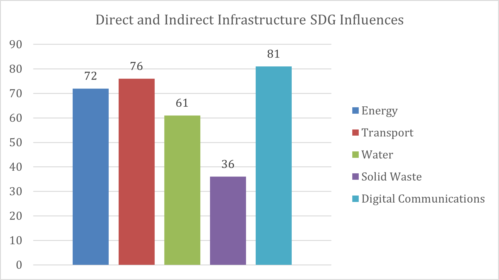
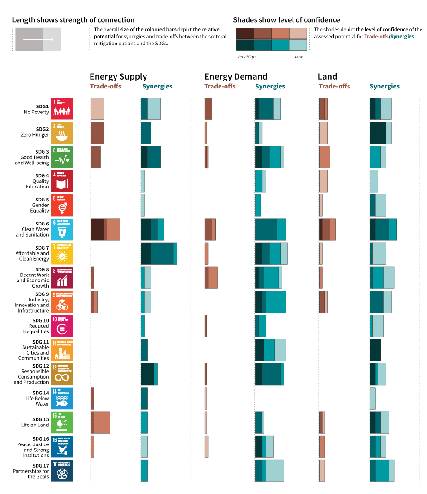
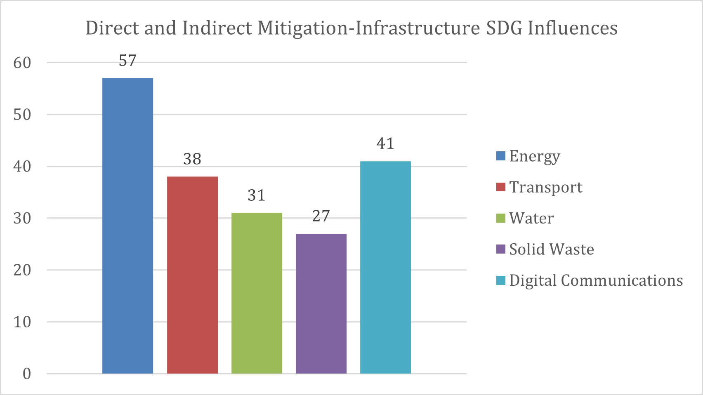
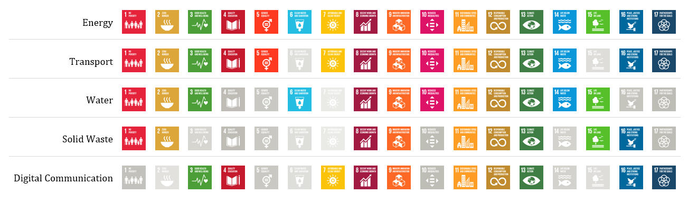

# Metadata

## Keywords

-   Mitigation

-   Co-benefits

-   Sustainable Development Goals

## Authors

-   Sapphire Vital

## Short description

Mini-lecture 2.3 provides an overview of infrastructure and mitigation
action's potential co-benefits using the United Nation's Sustainable
Development Goal (SDG) framework. Through the methodologies presented,
the lecture highlights key infrastructure sectors for mitigation action
and far-reaching cross-sectoral sustainable development.

## Learning objectives

-   Indicate infrastructure's influence on sustainable development using
    the SDG framework
-   Indicate mitigation action's influence on sustainable development
    using the SDG framework
-   Utilise the SDG framework to pinpoint key infrastructure sectors for
    mitigation action based on mutual SDG influence.

# Lecture content

## Introduction

Using the first steps of the Nationally Determined Contribution (NDC)
target development approach from mini-lecture 2.2, we can recognise the
following trends:

-   **Step 1 - Assess national infrastructure development priorities:**
    Globally there is a presence of ageing infrastructure and rapid
    population growth that necessitates increased infrastructure
    services [@Thacker2019].

-   **Step 2 - Estimate their mitigation potential:** Globally the
    infrastructure sector accounts for approximately 75% of greenhouse
    gas emissions. Mitigation potential is vast.

-   **Step 3 - Evaluate resiliency and adaptation needs:** Given the
    present and impending impacts of climate change, countries,
    particularly the vulnerable developing countries and small island
    developing states, urgently need to build resilience into
    infrastructure systems. Critical services such as energy generation,
    water and wastewater treatment, and digital communications need to
    be adapted to the changing climate to ensure their continued use and
    prevent further negative impacts.

-   **Step 4 - Assess implementation capability:** The implementation
    costs of traditionally extensive and technology-intensive
    infrastructure system components are typically high and require
    specific technical expertise over their design, construction,
    commissioning, and maintenance periods.

Given this overarching knowledge there is a need to assess, as directed
by Steps 5 and 6, the cross-sectoral sustainable development benefits of
mitigation action within the infrastructure sector. The Sustainable
Development Goal (SDG) framework provides a comprehensive representation
of society's developmental needs [@UnitedNations2015]. It can
therefore be used to assess the interactions between infrastructure
development, mitigation action, and sustainable development. Points of
intersection present opportunities to utilise limited resources to reach
multiple objectives simultaneously [@Northrop2016].

## Revision of the SDG framework

The widely accepted SDG framework was developed after the end of tenure
of the Millennium Development Goals (MDGs). The MDGs and other
development work at the time, were critiqued for their disjointed
approach. For instance, the MDGs were particularly criticised for
enabling economic growth at the expense of environmental well-being. The
SDGs were therefore intentionally designed as an interlinked network of
17 goals which cover vital economic, environmental, and social
development needs common to countries across the world
[@LeBlanc2015]. The 17 goals consist of 169 targets which focus and
guide implementation action.

{width=100%}

**Figure 2.3.1:** 17 Sustainable Development Goals
[@UnitedNations2021]

## Infrastructure's influence on the SDGs

Infrastructure development has the potential to contribute significantly
to sustainable development. Research undertaken to quantify the
potential influence of infrastructure on the SDGs has shown that
infrastructure development can positively influence all 17 goals and 72%
of their targets either directly or indirectly [@Thacker2019].
Infrastructure development was found to influence all the targets in SDG
3 (good health and well-being), SDG 6 (clean water and sanitation), SDG
7 (affordable and clean energy), SDG 9 (industry, innovation, and
infrastructure), and SDG 11 (sustainable cities and communities).

Each networked infrastructure system directly and indirectly influences
a varying number of SDG targets, as shown in Figures 2.3.2. The results
suggest that infrastructure development in digital communications has
the most potential for far-reaching sustainable development impact.
@Thacker2019 attributes the digital communication system's high rating
to the increasing need of digital communication to support a wide range
of services such as hazard early warning systems, electricity smart
metering, efficient transportation systems, and education. The
transportation and energy systems also display large direct and indirect
influence on sustainable development, as they facilitate access and
functionality across all sectors.

These results pinpoint sectors most influenced by infrastructure
development and illuminate key development entry points that can
initiate extensive impact.

{width=100%}

**Figure 2.3.2:** Number of direct and indirect infrastructure SDG
influences [@Thacker2019]

## Mitigation action's influence on the SDGs

Similar research has been conducted on mapping mitigation with the SDGs.
@FusoNerini2019 revealed that climate action, including both mitigation
and adaptation, has the potential to influence all the SDGs through
approximately 80% of the targets.

Focusing on mitigation, @IPCC2018 evaluated the interaction between
mitigation action in energy supply, energy demand, land management, and
the ocean and the SDGs (see Figure 2.3.3). The research uncovered strong
synergies with SDG 3 (good health and well-being), SDG 7 (affordable and
clean energy), SDG 11 (sustainable cities and communities), SDG 12
(responsible consumption and production), and SDG 14 (life below water).
Additionally, mitigation action in low energy demand, low material
consumption, and low greenhouse gas-intensive food consumption was found
to have the most SDG synergies [@IPCC2018].

{width=100%}

**Figure 2.3.3:** Synergies and tradeoffs between the SDGs and energy
supply, energy demand, and land management [@IPCC2018]

Similar to the research on infrastructure's SDG influence, these studies
illustrate the sustainable development impact of well-planned mitigation
action [@Vital2020].

## Identifying key mitigation action in the infrastructure system by superimposing infrastructure and mitigation SDG influence

Evaluating the overlap between infrastructure and mitigation SDG
influence extracts the potential sustainable impact of mitigation action
within the infrastructure sector. @Vital2019 pursued this aim and found
that mitigation action within networked infrastructure systems
influences all 17 SDGs through 50% of the targets. Based on the number
of targets, the energy, digital communication, and transportation
systems were the top performers (see Figure 2.3.4).

{width=100%}

**Figure 2.3.4:** Direct and indirect SDG influences from mitigation
action within infrastructure systems [@Vital2019]

Further, Figure 2.3.5 shows the broader SDGs influenced by each
infrastructure system. The results reveal an additional layer and
illustrate, for example through the digital communication system, that
infrastructure systems may influence a large number of SDG targets but
not all the SDGs themselves. In these instances, influence is
concentrated in a few SDGs rather than spread across the 17 goals.

These results demonstrate how a well-planned mitigation within an
infrastructure system can positively impact multiple SDGs. For example,
increased renewable energy generation in impoverished regions (meeting
SDG 7) would provide affordable energy access (improving SDGs 1 and 9),
increase residents' work and academic productivity via electricity
(enhancing SDGs 8 and 4), and replace the need for fuel collection and
burning often done by women (contributing to SDGs 3 and 5). This
illustrates the far-reaching sustainable development co-benefits of
mitigation action in the infrastructure sector [@Vital2019].

{width=100%}

**Figure 2.3.5:** SDGs influenced by each networked infrastructure
system. Those not influenced are depicted in greyscale. [@Vital2019]

## Summary  {#summary-1}

This mini-lecture provided insight into evaluating the sustainable
development impact of mitigation actions within networked infrastructure
systems. The lecture highlighted which systems would lead to the most
mitigation co-benefits using the SDG framework. Going more in-depth
into, and applying the methodologies described to a particular context,
will bring critical development pathways to life. The next mini-lecture
addresses how this can practically be achieved via a case study in St.
Lucia.
