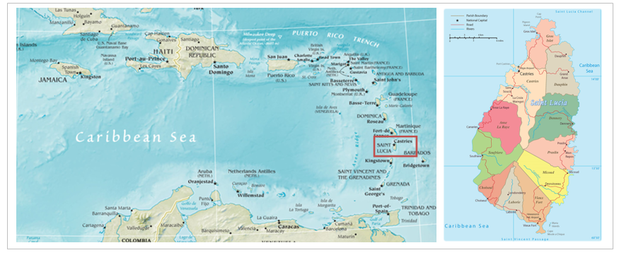
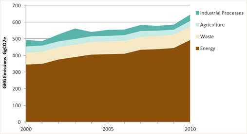

# Metadata

## Keywords

-   Case Study

-   Saint Lucia

-   Nationally Determined Contributions (NDCs)

## Authors

-   Sapphire Vital

## Short description

This mini-lecture, the last in Lecture block 2, brings all the
information from the previous mini-lectures together via a case study on
the small island developing state of Saint Lucia. To do this, the case
study applies the approach to developing infrastructure targets within
NDCs presented in mini-lecture 2.2 step by step.

## Learning objectives

-   Describe Saint Lucia's national priorities, greenhouse gas
    emissions, implementation capacity, mitigation co-benefits, and
    Nationally Determined Contribution (NDC) targets
-   Synthesise the material covered in Lecture block 2 mini-lectures
-   Apply the approach to developing infrastructure targets within NDCs
    to a desired country context.

# Lecture content

## Step 1: Assess national infrastructure development priorities and identify key infrastructure systems

This case study provides a walkthrough of each step (outlined in
mini-lecture 2.2) using relevant information from Saint Lucia. The
information has been extracted from key policy documents, strategies,
plans, Saint Lucia's Intended Nationally Determined Contributions
(INDC), as well as their recently updated NDC.

Saint Lucia is a Small Island Developing State (SIDS) in the Caribbean
region (Figure 2.4.1). The volcanic island is characterised by
mountainous terrain and a tropical climate, attractive to tourism but
prone to meteorological hazards.

Saint Lucia is an independent nation with a middle-income economy driven
primarily by tourism and services. According to Saint Lucia's
Medium-Term Development Strategy, development measures focus on the
healthcare, education, citizen security, agriculture, infrastructure,
and tourism sectors [@GoSL2020].

{width=100%}

**Figure 2.4.1:** Map of the Caribbean and Saint Lucia [@Vital2019]

In 2018 the government's Department of Finance launched the National
Integrated Planning Programme (NIPP) Unit. The NIPP Unit engages in long
term infrastructure planning, implementation, policy development, and
evaluation of the performance of present and future infrastructure
initiatives. The unit is responsible for producing the Saint Lucia
National Vision Plan, National Infrastructure Agenda, and Fast-Track
Analysis.

Saint Lucia's Medium-Term Development Strategy 2020-2023 quotes
infrastructure as a key result area. The strategy highlights the
transport system as crucial for infrastructure development and
identifies sustainable energy in the form of renewable energy and energy
efficiency as a critical cross-cutting development area [@GoSL2020].
These two areas can therefore be considered as Saint Lucia's priority
infrastructure systems.

## Step 2: Estimate the mitigation potential of infrastructure systems

Saint Lucia's 2010 greenhouse gas inventory was conducted in line with
the IPCC Revised Guidelines for National Greenhouse Gas Inventories
(Volumes 1,2, and 3). The inventory covered the energy, industrial
processes, solvent and other product use, agriculture, land-use change
and forestry, and waste. Without Land Use, Land Use Change, and Forestry
(LULUCF), Saint Lucia generated 646.9 GgCO~2~eq (Giga tonnes of carbon
dioxide equivalent) in 2010. Including LULUCF decreased this value to
524.0 GgCO~2~eq due to carbon sequestration of natural vegetation.

As seen in Figure 2.4.2, the energy sector caused the greatest
percentage of these emissions. The energy sector in the inventory
included combustion emissions sourced from the energy industries,
manufacturing industries, construction, civil aviation, road
transportation, navigation, commercial/institutional, residential, and
agriculture, forestry, and fishing. Specifically, energy for electricity
generation and transportation accounted for 38.8% and 30.5% of total
emissions (excluding LULUCF), respectively. Combined, these two sectors
produced 69% of Saint Lucia's greenhouse gas emissions [@GoSL2015a].
Therefore, given their high carbon intensity, the energy and
transportation sectors have immense mitigation potential.

{width=100%}

**Figure 2.4.2:** Sectoral breakdown of Saint Lucia's total greenhouse
gas emissions (excluding LULUCF) [@GoSL2015a]

## Step 3: Evaluate resiliency and adaptation needs within infrastructure systems

Saint Lucia is vulnerable to several hazards due to its seismic
location, position in the tropical cyclone belt, small size, mountainous
terrain, and lack of economic diversification. Climate change
exacerbates and adds to these hazards in the form of, among others,
sea-level rise, changed rainfall patterns, as well as more severe
tropical storms, flooding, landslides, and storm surges [@GoSL2018].

Given these realities, Saint Lucia's National Adaptation Plan (NAP)
defines 271 adaptation measures for the next 10 years across eight
critical areas: water, agriculture, fisheries, infrastructure and
spatial planning, natural resource management, education, health, and
tourism [@GoSL2018].

Under infrastructure and spatial planning, the NAP details measures to
enhance infrastructure resilience. Contributing to this aim, the Saint
Lucia National Infrastructure Assessment evaluated hazard exposure
across the island's economic, social, and natural assets. The assessment
indicated that 80% of the island's economic infrastructure was
susceptible to at least one of four major hazards: sea-level rise, storm
surges, flash floods, or landslides. The assessment found the transport
sector to be most at risk: 57% of the national freight capacity is at
risk of storm surges and flash floods. Also, of notable mention, 12% and
16% of the electricity sector is at risk of flash floods and landslides,
respectively. Further, the water sector was shown to be particularly
prone to landslides [@Adshead2020].

Focusing adaptation efforts on the transportation, electricity, and
water sectors would therefore safeguard against the loss of these
services and the indirect impact on interconnected areas such as
economic growth and healthcare.

## Steps 4-7: Assess implementation capacity; ascertain sustainable development co-benefits; finalise all information; and devise NDC targets

[Step 4:]{.ul}

As a SIDS with limited resources, Saint Lucia's INDC was conditional.
The INDC estimated the cost of achieving its mitigation targets by 2030
to be USD241 million and indicated that its mechanisms could not be
achieved without financial and technical support [@GoSL2015b]. The
government further expressed their intention to pursue a mix of
financing options including private sector financing, regional agency
and programme support, bilateral support, and concessional finance.

[Step 5:]{.ul}

Saint Lucia's INDC recognised the sustainable development benefits of
adaptation and mitigation action. As seen in Table 2.4.1, the INDC
highlighted co-benefits primarily relating to economic growth and
poverty eradication [@GoSL2015b].

**Table 2.4.1:** Sustainable development co-benefits identified in Saint
Lucia's INDC

  **INDC**
  ------------------------------------------ ---------------------------
  **Sustainable Development Co-benefits**    **Directly Related SDGs**
  Investment and technological advancement
  Employment generation
  Fuel foreign exchange savings
  Energy cost savings across sectors
  Human health

[Step 6:]{.ul}

Saint Lucia submitted its updated NDC in January of 2021. The new NDC
brings the country's national priorities, mitigation potential,
adaptation needs, implementation capabilities, and sustainable
development needs together. It focuses mitigation and adaptation on the
electricity generation and transportation systems. As seen in Steps 1 to
5 from various government strategies, plans, and assessments, the energy
and transportation systems are national infrastructure development
priorities, high greenhouse gas emitters, most at risk to hazards, and
lead to sector-wide economic benefits.

[Step 7:]{.ul}

The updated NDC commits to an absolute greenhouse gas emissions
reduction target of 7% relative to 2010 levels by 2030 in the energy
sector given international support. This percentage is an increase from
the INDC's conditional commitment to 2% greenhouse gas emission
reduction within the same constraints [@GoSL2021].

## Step 8: Finalise the previous information addressed and present the NDC based on the requirements laid out by the Paris Agreement

Saint Lucia's NDC provided additional updates and all information
required for clarity, transparency, and understanding. The following
points summarise the major updates:

-   The Government of Saint Lucia plans to develop a Long-Term Strategy
    to 2050 for decarbonisation across all sectors. The strategy will
    inform subsequent NDCs.

-   A 2018 greenhouse gas inventory was conducted in 2020. Its
    publication is currently under development.

-   Under the NAP, Sectoral Adaptation Strategy and Action Plans
    (SASAPs) have been developed for the agriculture, fisheries, and
    water sectors, and for resilient ecosystems. Additional SASAPs are
    to be developed for the other key areas: tourism, infrastructure and
    spatial planning, education, and health.

-   The Government of Saint Lucia has developed an Implementation Plan,
    Financing Strategy, and Partnership Plan for the NDC. The total cost
    of implementing the NDC was estimated to be USD368 million. This
    cost includes the operation, maintenance, fuel expenses, and energy
    savings from the mitigation initiatives. The NDC highlighted the
    need for financial support to enable the implementation of both
    mitigation and adaptation measures. Additionally, the NDC introduced
    adaptation limitations brought about by insurmountable climate
    change impacts such as extreme weather events and slow onset events.
    These limitations lead to the need for financial support for loss
    and damage costs incurred.

-   The updated NDC, following from the INDC, highlighted sector-wide
    sustainable development co-benefits. The NDC specifically mentioned
    benefits to education, health, food security, water and sanitation,
    housing and social protection, economic growth, gender, and youth.

## Summary

This mini-lecture walked through the basic information required to
develop NDCs using Saint Lucia as a case study. The mini-lecture sought
to synthesise the material covered in Lecture block 2 on infrastructure
systems' greenhouse gas emissions, mitigation targets, and sustainable
development impact.
