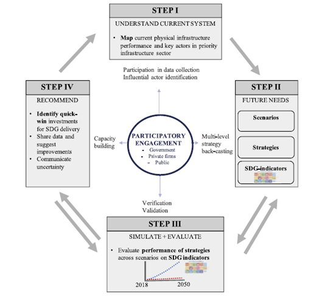
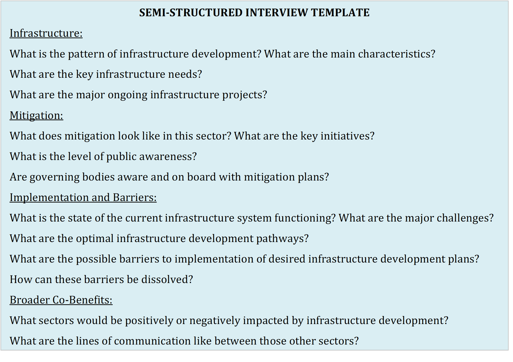

Mini-lecture 3.2 outlines methods of gathering data on infrastructure
assets as well as sources of information. The mini-lecture explores the
use of desktop studies, and stakeholder engagement in conducting
participatory research.

# Learning objectives

-   Describe and utilise effective methods to gather infrastructure
    information.

# Introduction

Mini-lecture 3.1 identified the fields of data that are needed to
evaluate current infrastructure performance. Following on from this,
mini-lecture 3.2 illustrates methodologies to gather the needed data and
points towards key information sources.

Research has shown that evidence-based infrastructure planning rooted in
participatory processes yield the best results [@Fuldauer2019].
Infrastructure planning has often been fragmented; stakeholders from
each infrastructure system have operated in their silos and missed
sustainable development opportunities that arise from collective action.
Participatory research facilitates integrated cross-sectoral
infrastructure planning by involving key stakeholders throughout the
planning process [@Fuldauer2019]. The following sections delve into
two key aspects of participatory research:

-   **Desktop studies**: Involves extracting key information from key
    documents and conducting stakeholder mapping.

-   **Stakeholder engagement**: Involves interviewing key stakeholders
    across the public and private sector and civil society.

# Participatory research in the evidence-based infrastructure development process

Participatory research methods can be utilised throughout evidence-based
infrastructure development process from data collection to scenario
planning, modelling and evaluating infrastructure strategies, and
developing action plans. Figure 3.2.1 depicts how participatory
engagement is involved in key steps in the evidence-based infrastructure
development process.

{width=100%}

**Figure 3.2.1:** Participatory engagement involvement in the
evidence-based infrastructure development process [@Fuldauer2019]

Involving key stakeholders throughout the planning process enables the
stakeholders to take ownership of the development plans. It facilitates
commitment to implementation through interdisciplinary collaboration and
coordinated efforts [@Fuldauer2019].

As highlighted in Figure 3.2.1, stakeholders play a critical role in
collecting the data needed to evaluate the performance of current
infrastructure. This can be achieved through desktop studies,
stakeholder interviews, and workshops -- detailed in the following
sections.

# Desktop studies

Desktop studies consist of conducting research to capture physical
infrastructure data as well as develop a multi-level stakeholder map.
Conducting a multi-level stakeholder map involves identifying
influential stakeholders in each infrastructure system. Stakeholder
mapping should target stakeholders who can influence or be affected by
the infrastructure planning process [@Fuldauer2019].

Information on infrastructure data and stakeholders can be obtained
through open-source policy documents, strategies, plans, assessments,
studies, and reports. These documents can often be found on the websites
of relevant government ministries and departments, utilities, regional
and international research institutions, and international development
agencies, among others. Information from these sources may include
primary or secondary data, or point towards the source of primary data.

# Stakeholder engagement

Knowledge gained from the desktop studies guides and provides background
knowledge for stakeholder engagement. Further, stakeholders should be
consulted to verify the information found, provide the most up-to-date
information, and/or to fill any data gaps. If the key stakeholders
identified are not able to access the most recent data, they are often
able to direct towards another actor who can.

While there are different ways of engaging with stakeholders,
semi-structured interviews and workshops through snowball sampling are
most efficient when the stakeholders' roles are not clearly defined or
easily identified externally [@Fuldauer2019]. Snowball sampling
involves identifying a core group of stakeholders and asking them to
point you towards other stakeholders you should speak to. Further, for
semi-structured interviews researchers develop broad topics and sample
questions they would like to ask but leave room for changes depending on
the direction of conversations. Figure 3.2.2 below depicts an example
set of questions developed for semi-structured interviews to assess
infrastructure development in line with the Paris Agreement and
Sustainable Development Goals.

{width=100%}

**Figure 3.2.2:** Questions used to guide semi-structured interviews on
infrastructure development in line with the Paris Agreement and the
Sustainable Development Goals [@Vital2019]

# Summary

Mini-lecture 3.2 provided an overview of methods to gather
infrastructure information, grounded in participatory processes. The
mini-lecture highlighted the use of desktop studies and stakeholder
engagement. Further application of participatory processes is addressed
in subsequent lectures, which explain future infrastructure needs and
drivers (Lecture 4), setting infrastructure visions (Lecture 5), and
developing and analysing strategic alternatives (Lectures 6-7).
