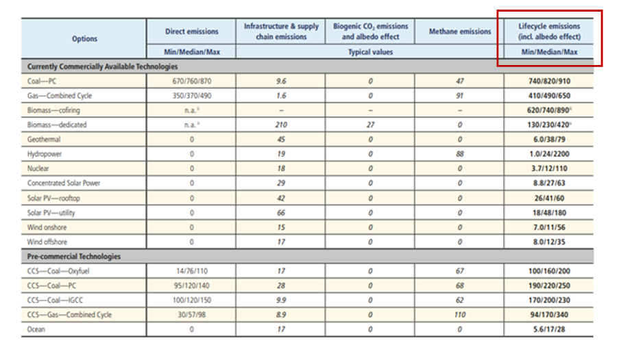
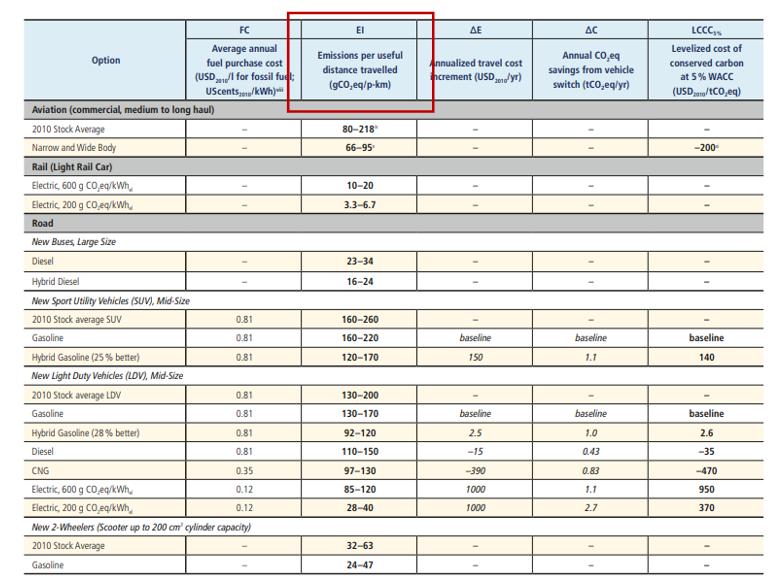
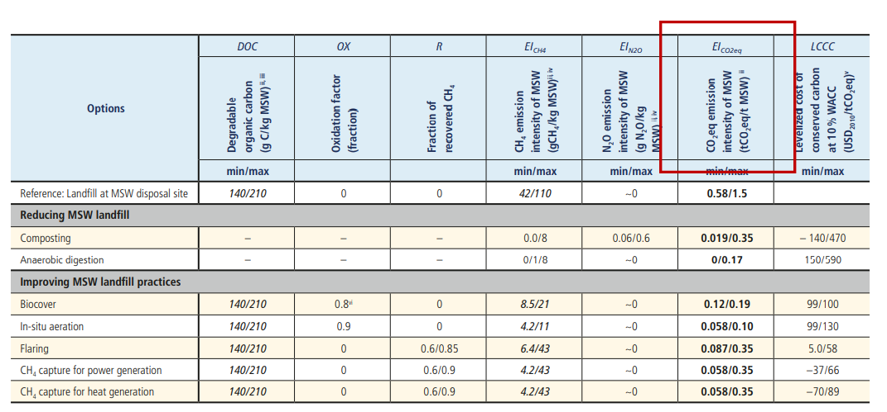
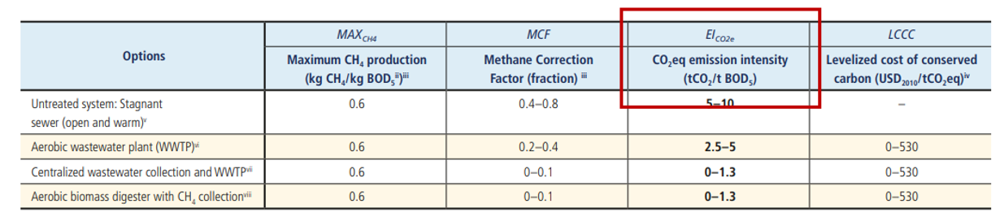

## Short description

Following mini-lecture 3.2, this mini-lecture provides an insight into
estimating infrastructure carbon emissions. Ideally, carbon emissions
data can be sourced from relevant country stakeholders. However, in many
cases the data is not available or insufficient and infrastructure
emissions need to be estimated. This mini-lecture outlines a methodology
for calculating these emissions.

## Learning objectives

-   Estimate gross carbon emissions of infrastructure systems.

# Lecture content

## Gross carbon emissions calculation method

Mini-lecture 3.3 presents the method for estimating gross emissions
utilised by @Adshead2018. This simplified method to estimate the gross
carbon emissions of infrastructure systems includes the following steps:

**[Step 1:]{.ul}** Identify the carbon emissions per unit for each type
of infrastructure asset. The carbon emissions per unit is known as the
capacity factor. For example, the capacity factor of a hydropower system
would be measured in tCO~2~eq/kWh (tonnes of carbon dioxide equivalent
per kilo watt hour).

**[Step 2:]{.ul}** Identify the capacity of the infrastructure assets.

**[Step 3:]{.ul}** Conduct any unit conversion needed. Following on from
the previous example, if the given capacity factor of a hydropower plant
is reported to be 25 gCO~2~eq/kWh (grams of carbon dioxide equivalent
per kilo watt hour) and its capacity is 10 GWh (giga watt hour), unit
conversion needs to take place to ensure correct calculation. The
conversion would be as follows:

1g = 0.000001 tonnes

Therefore: 25 gCO~2~eq/kWh= 0.000025 tCO~2~eq/kWh

1 GWh= 1,000,000 kWh

Therefore: 10 GWh= 10,000,000 kWh

**[Step 4:]{.ul}** Multiply the capacity factor by the capacity of an
infrastructure asset to determine its gross emissions as shown in the
equation below.

$Gross\ Carbon\ Emissions\ (\text{tCO}_{2}eq) = Capacity\ Factor\  \times Capacity$

For instance, the hydropower plant:

Gross Carbon Emissions= 0.000025 x 10,000,000 = 250 tCO~2~eq annually.

## Identifying capacity factors

Emissions capacity factors can be sourced from a variety of academic and
institutional research. One such source, @Schlomer2014, provides a
summary assessment of capacity factors for various sectors as well as
more detailed methodologies for determining carbon emissions. They note
that the availability and quality of carbon emission data vary
significantly across sectors. Further details of their process of
collating research from various sources can be found in the report.

The following sections present the available capacity factors for the
energy, transportation, wastewater and waste infrastructure systems.
Where minimum, median, and/or maximum factors are given, estimates can
be made using the median or average value.

## Energy

The capacity factors for the energy system are described as the
lifecycle emissions and are measured in gCO~2~eq/kWh as shown in Figure
3.3.1 below.

{width=100%}

**Figure 3.3.1:** Emissions of electricity supply technologies
[@Schlomer2014]

## Transport

The capacity factor for the transportation system is noted as
gCO~2~eq/p-km (grams of carbon dioxide equivalent per passenger
kilometre). The capacity would therefore be the number of kilometres
traversed by passengers using a particular transportation mode.
@Schlomer2014 specified data for commercially available technologies,
depicted in Figure 3.3.2 below, and expected future passenger and
freight transportation.

{width=100%}

**Figure 3.3.2:** Passenger transport emissions factors for commercially
available technologies [@Schlomer2014]

## Waste and wastewater

@Schlomer2014 notes several capacity factors for Municipal Solid Waste
(MSW) given the two common greenhouse gases emitted from landfills:

-   **Methane emissions:** Measured in gCH~4~/kg MSW (grams of methane
    per kilogram of Municipal Solid Waste)

-   **Nitrous oxide emissions**: Measured in gN~2~O/kg MSW (grams of
    nitrous oxide per kilogram of Municipal Solid Waste)

These values are then combined and converted to tCO~2~eq/t MSW (tonne of
carbon dioxide equivalent per tonne of Municipal Solid Waste) (see
Figure 3.3.3). This factor would be used to calculate gross carbon
emissions.

{width=100%}

**Figure 3.3.3:** Depiction of the capacity factors for waste treatment
technologies [@Schlomer2014]

##

The capacity factor for wastewater is stated in tCO~2~eq/tBOD~5~ (tonnes
of carbon dioxide equivalent per tonne of biological oxygen demand) as
seen in Figure 3.3.4 below.

{width=100%}

**Figure 3.3.4:** Wastewater capacity factor [@Schlomer2014].

## Summary

Mini-lecture 3.3 illustrated a simple method for estimating the carbon
emissions of infrastructure systems in lieu of detailed in-country data.
The mini-lecture further pointed towards a good source of carbon
emission capacity factors: @Schlomer2014.
