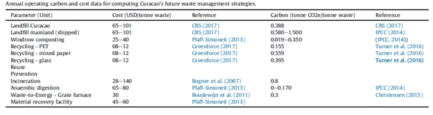
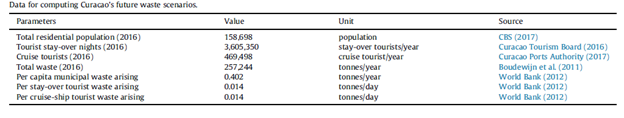
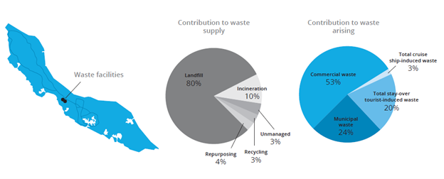
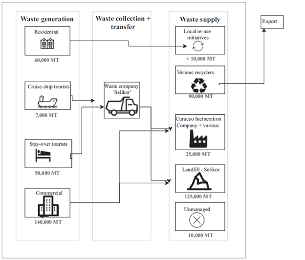

# Short description

Mini-lecture 3.4 presents a case study on collecting infrastructure data
for performance evaluation using the island of Curaçao. The mini-lecture
outlines the data collection method utilised in Curaçao's most recent
infrastructure development assessment and provides examples of the
infrastructure data inputted.

# Learning objectives

-   Apply best practice data collection methods to a specific country
    context.

# Introduction

This case study provides a look into infrastructure planning conducted
for the island of Curaçao in 2018 [@Adshead2018a]. The case study
focuses on the island's solid waste system as elaborated by
@Fuldauer2019.

Curaçao is a Small Island Developing State (SIDS) located off the coast
of Venezuela. The island's main economic activity is tourism. While home
to only 150,000 residents, the island welcomes 750,000 tourists to its
shores annually [@Fuldauer2019]. The strain of this high volume of
tourists on Curaçao's infrastructure systems leads to high per-capita
infrastructure costs. This, coupled with other challenges, such as
fragmented planning and lack of adequate data management systems, make
sustainable infrastructure development, particularly in the solid waste
system, a challenge for the island [@Fuldauer2019].

The following sections detail the steps taken to collect the waste
infrastructure data needed to evaluate the performance of the existing
system. The results for the evaluation feed into scenario planning and
strategy development in the balance of the evidence-based infrastructure
development process employed.

# Solid waste data collected

Data on Curaçao's solid waste system was obtained from two main sources
and complemented by other resources: the Central Bureau of Statistics
Curaçao and the Waste Management Processing Plant Curaçao Design
Feasibility Study. The data collected, or estimated, covered municipal
solid waste as well as commercial, stay-over tourist-generation, and
cruise-ship tourist-generated waste. The data collected specified the
capacity, cost, and carbon emissions of infrastructure assets.
Additional information on the population and per capita waste production
were collected to compute Curaçao's future waste system's needs. Tables
3.4.1 and 3.4.2 illustrate the core data collected [@Fuldauer2019].

**Table 3.4.1:** Core data collected on waste infrastructure assets'
capacity and cost [@Fuldauer2019]

{width=100%}

**Table 3.4.2:** Population and per capita data collected on Curaçao's
waste sector [@Fuldauer2019]

{width=100%}

{width=100%}

**Figure 3.4.1:** Graphical depiction of Curaçao's solid waste sector
[@Adshead2018a]

As seen in the tables, care was taken to document the source of
information to ensure data transparency. Some data was locally sourced
while other data was sourced from international studies. For example,
the number of tourist stay-over nights were sourced locally from
documentation by the Curaçao Tourism Board, while the per capita
municipal waste value was obtained from the World Bank. The study
indicated an average per capita waste generation in the Caribbean of
1.1kg/capita/day [@Fuldauer2019].

@Fuldauer2019 also reported that the most up to date data was obtained
along with the lifespans of infrastructure assets. For example, the
design life of Curaçao's only landfill will end by 2026
[@Adshead2018a].

# Stakeholder engagement

Stakeholder consultation was conducted to complement the data obtained
from the desktop study. The desktop study brought about a list of key
stakeholders. 20 priority stakeholders were specified based on their
organisation, and level and field of education [@Fuldauer2019]. The
most influential actors were found to be:

-   **The Ministry of Health, Environment and Nature:** holds
    jurisdiction over waste management and related policies
-   **Slikor:** Curaçao's main waste management company that collects
    domestic waste, manages the island's sole landfill, incinerates
    special wastes such as chemicals, and cleans up unmanaged waste
-   **Greenforce:** a recycling company
-   **The Caribbean Recycling Company:** a recycling company
-   **Antillean Scrap Co:** a recycling company.

Stakeholders were engaged to provide context for the waste sector and
fill any data gaps via semi-structured stakeholder interviews. The broad
range of stakeholders enabled the researchers to capture a wide variety
of views. Most of the stakeholders agreed that Curaçao's existing waste
sector is unsustainable and action is particularly required to ensure
environmentally safe recycling practices and disposal of chemical waste.

# Resulting map of Curaçao's waste management system

The data collected and the insights gained from the stakeholders
surveyed resulted in the map of the existing waste management system
shown in Figure 3.4.2 below. As seen in the diagram, Curaçao generated
257,000 million tonnes of waste, in decreasing order, by commercial
entities, residential homes, stay-over tourists and cruise-ship
tourists. Only tourists' waste was collected by the island's sole waste
company Selikor. Most of the island\'s waste was disposed of in the
landfill. The balance of the waste, in decreasing order, was recycled,
incinerated, reused or exported.

{width=100%}

**Figure 3.4.2:** Curaçao's existing waste management system; MT=million
tonnes [@Fuldauer2019]

# Summary

Mini-lecture 3.4 provided an insight into the application of the
principles laid out in mini-lectures 3.1- 3.3 to a specific country
context. The mini-lecture provided useful insights on data collection
and stakeholder engagement from an infrastructure development
perspective of the waste sector in the island of Curaçao.
