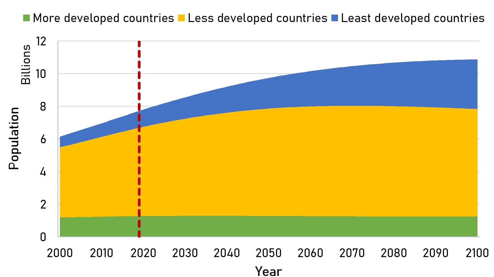
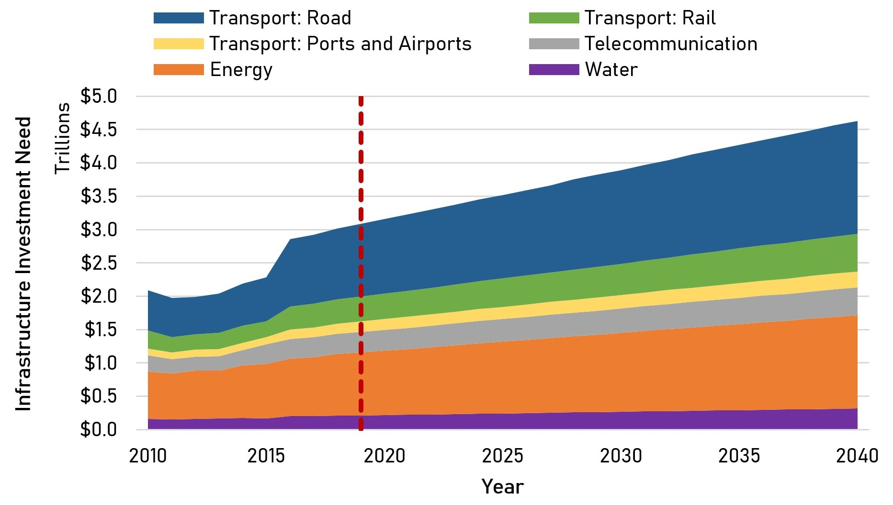
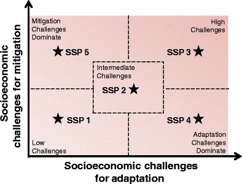
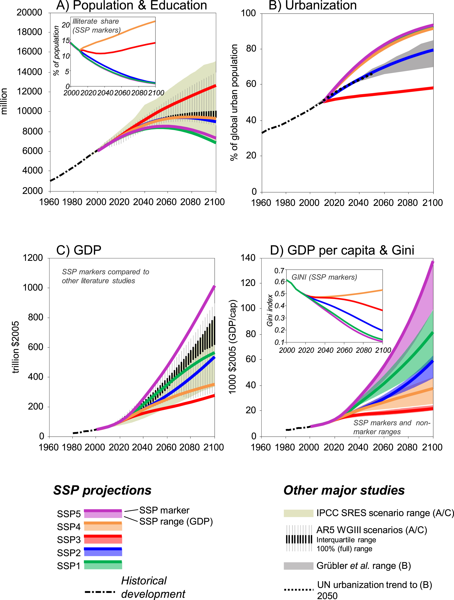

This mini-lecture provides an overview of the future uncertainty for
infrastructure demand, some methods to provide forecasts using scenario
analysis, and a preliminary description of common infrastructure
drivers.

# Learning objectives

-   Recognise the importance of defining uncertainty in future
    infrastructure planning
-   Identify potential drivers of infrastructure demand.

# Introduction

Demand for infrastructure is driven by complex future social, economic
and technological changes, which are highly uncertain and difficult to
estimate. These future trends include demographic changes, urbanisation,
migration, environmental factors, institutional development, etc.

However, the need to forecast future infrastructure demand is crucial
given the high cost of infrastructure investment and its long-term
nature. Moreover, a lack of infrastructure is a major problem for
developing countries, which will likely be exacerbated in the coming
decades due to significant population growth, as shown in Figure 4.1.1.

In this lecture we will introduce some well-known methodologies to
forecast investment/policy needs, usually developed for climate change
adaptation and mitigation, such as the Integrated Assessment Modelling
(IAM) and Shared Socio-Economic Pathways (SSPs). This first overview
will help to understand how uncertainties are considered in other
contexts. Then, we will explore the nature of infrastructure as
long-lived assets, and why it is important not to follow a
predict-then-act approach, but to predict a range of possible futures,
recognising uncertainty. Finally, we will describe the main future
trends in developing countries and their consequences for infrastructure
demand.

{width=100%}

**Figure 4.1.1:** World Population Forecast by 2100 (based on data from
@UNDESA2019)
# Infrastructure as long-lived assets

Emerging markets and developing economies will require annual
infrastructure investments of around USD1 trillion, according to the
World Bank [@WorldBank2015]. Figure 4.1.2 shows a sectoral estimate
for global annual infrastructure investment needs by the Global
Infrastructure Outlook [@GIHub2020]. Electricity and roads account
for more than 66% of the total investment needed by 2040. Furthermore,
from 2016 to 2040, approximately USD 94 trillion (USD 3.7 trillion per
year) will be needed globally.

{width=100%}

**Figure 4.1.2:** Growing annual infrastructure investment requirements
by sector (based on data from @GIHub2020)

Moreover, the high costs associated with infrastructure and the limited
public budget of developing countries increases the importance of
appropriate infrastructure projections and decision-making processes to
prevent locking countries in unsustainable and irreversible development
patterns. This shows the huge infrastructure challenge that the
developing world needs to tackle over the next decades.

Infrastructure lasts for decades so the decisions made in the present
need to recognise the future demand. The nature of these long-term
trends is uncertain and hard to predict [@Thoung2016]. Therefore, a
predict-then-act approach is not recommended for these long-lived
assets, but rather to predict a range of possible futures in recognition
of this uncertainty.
# Scenario analysis for infrastructure investments

During the last decades, there was an important body of literature on
scenario analysis, as a means of developing possible futures and asking
"what if" questions to explore how the uncertainty might unfold. With
this view, a scenario is defined as an internally consistent view of
what the future might turn out to be---not a forecast, but one possible
future outcome [@Porter1985].

One method crafted with the intention of including societal,
environmental and economic uncertainty/complexity is the IAM approach,
which has been used to inform policymaking in the context of climate
change [@vanBeek2020]. Another important concept are the SSPs, which
project global scenarios of socio-economic change to the end of the
century with the intention of characterising uncertainty in mitigation,
adaptation and impacts of climate change. In this framework,
socio-economic and environmental challenges are classified as pertaining
to adaptation or mitigation, as shown in Figure 4.1.2. This way of
characterising uncertainty and its implications of mitigation or
adaptation, enables the exploration of future socio-economic pathways
that make these processes harder or easier [@ONeill2014].

The concepts explored in this lecture highlight the exploratory nature
of this forecasting exercise (presenting multiple future scenarios) as
opposed to normative scenarios (building toward one vision of the
future).

{width=100%}

**Figure 4.1.3:** The challenge space of SSPs [@ONeill2014]
# Shared Socio-economic Pathways (SSPs)

SSPs can be differentiated from each other in terms of their challenges
of mitigation and adaptation. The models that inform SSPs include, at a
minimum, assumptions of future demographics, economic development and a
degree of global integration [@ONeill2014]. Furthermore, these models
incorporate information that allows the development of regional or local
scenarios.

Commonly, five SSP narratives are used and are summarised as follows
[@ONeill2017]:

-   **SSP1**: Sustainability -- Taking the Green Road, in which the
    world shifts gradually toward a more sustainable path. This scenario
    has low challenges to mitigation and adaptation.

-   **SSP2**: Middle of the Road in which historical trends in social,
    economic and technological changes continue. This scenario has
    medium challenges to mitigation and adaptation.

-   **SSP3**: Regional Rivalry -- A Rocky Road, in which nationalism and
    regional conflicts push countries to focus on their own goals and
    needs. This scenario has high challenges to mitigation and
    adaptation.

-   **SSP4**: Inequality -- A Road Divided, in which there are high
    inequalities and technological disparities between different
    regions. This scenario has low challenges to mitigation and high
    challenges to adaptation.

-   **SSP5**: Fossil-fuelled Development -- Taking the Highway, in which
    there is rapid technological progress and growth by exploitation of
    natural resources. This scenario has high challenges to mitigation
    and low challenges to adaptation.

Therefore, we can see how different socio-economic and technological
projections can help us navigate the uncertain future.
# Infrastructure drivers

When confronting with the difficult task of forecasting infrastructure
demand, there are many drivers that may have a potential impact on the
future. Some of the most important drivers that can influence
infrastructure demand are described as follows:

-   **Population growth**, is the most common driver of infrastructure
    demand. There are many global, regional and local population
    forecasts and the proportional growth of population and demand is
    easy to compute.

-   **Economic Development**, can modify future demand given that there
    is a close relationship between economic development and level of
    consumption. On the other hand, infrastructure can produce economic
    development as well.

-   **Consumption patterns**, are related to economic development but
    are also influenced by changes in culture or behaviour. For example,
    an increase in recycling and efficient use of energy and water will
    shape the future demand of infrastructure.

-   **Technology**, is usually related to the supply side (new ways of
    production) but can also influence demand (efficiency, new
    transportation modes).

-   **Urbanisation, migration and tourism**, are of particular
    importance in developing countries in which an important increase of
    rural-to-urban migration is expected.

-   **Demographics (age and gender)**, can influence consumption
    patterns and shape the overall demand for infrastructure.

Figure 4.1.4 shows the forecasting of individual infrastructure drivers
using the SSP scenarios. Here, the large differences in the different
narratives in terms of population, education, urbanisation and GDP are
evident.

{width=100%}

**Figure 4.1.4:** Forecasting of different drivers under the SSPs
[@Riahi2017]
# Summary

In this mini-lecture, the complexity that the future poses on
infrastructure was described. This mini-lecture explains the concept of
Shared Socio-economic Pathways (SSPs) as a tool to project global
scenarios. This concept is also used to introduce some basic ideas about
infrastructure demands and drivers.
