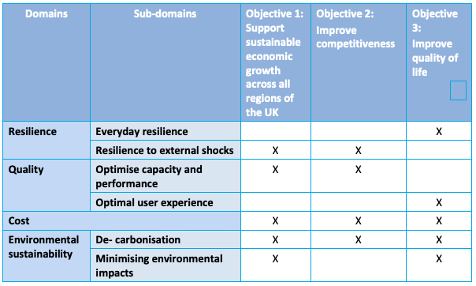

This lecture will review approaches to assessing the performance of
infrastructure through targets and indicators. It will consider
critiques of common indicator frameworks and assess how we can develop
indicators that capture infrastructure performance by reflecting desired
outcomes, with a view to aligning them with sustainability criteria.

# Learning objectives

-   To describe a range of criteria used to develop infrastructure
    performance metrics

-   To list various shortcomings of current infrastructure indicator
    frameworks.

# Introduction

Infrastructure systems provide a wide range of services to society.
However, there is a limit on what we can build or implement, which often
necessitates trade-offs between infrastructure service outcomes. To make
the most informed decisions when designing new infrastructure, we must
fully understand the infrastructure outcomes we seek to deliver, as well
as the means by which to evaluate and measure multiple infrastructure
objectives across sectors ('multi-attribute valuation'). In other words,
what do we want out of infrastructure, which aspects of infrastructure
provision do we most value, and how do we measure them?

When constructed within a robust framework, infrastructure performance
indicators or metrics can help decision-makers choose among available
options. In an early example, the @NationalResearchCouncil1996 outlined
a framework defining measures of infrastructure performance across four
principal dimensions: service delivery, quality of service, regulatory
concerns, and community/economic impacts. Notably, environmental
indicators were loosely scattered between these broad dimensions rather
than forming a performance category in their own right.

This lecture provides an introduction to how indicator frameworks can be
conceptualised, built, and improved upon, using the common
*Pressure-State-Response* model as an example. Critiques of traditional
metrics used for infrastructure assessment in the UK are provided, to
demonstrate drawbacks to traditional approaches. More recent thinking
around multi-attribute valuation in infrastructure indicator
construction is demonstrated using studies created for governments of
the UK and New Zealand. Finally, ways in which researchers have
attempted to link infrastructure performance to sustainability will be
introduced, which will be discussed in more depth in the next lecture,
mini-lecture 5.2.

# Conceptualising performance indicator frameworks

Several comprehensive frameworks for indicator development and use have been developed; these serve the purpose of stimulating countries to produce information that is more responsive to policy needs and public information requirements.

As an example, [@OECD2003] harmonises international environmental indicators using a *Pressure-State-Response* model, which aims to highlight cause-effect relationships and the interconnectedness of performance outcomes across environmental, economic, and other spheres.

As shown in Figure 5.1.1, this framework aims to quantify the human activities that affect the underlying state of the environment (pressures), robust measures of the current quality of the environment (states), and societal responses to tackle identified problems such as economic and social policies or changes in awareness or behaviour. The aim is to further strengthen countries' capacity to monitor and assess environmental conditions and trends so as to increase their accountability and to evaluate how well they are satisfying both domestic objectives and international commitments [@OECD2003]. Three basic criteria for indicator selection used in this framework are: policy relevance and utility for users, analytical soundness, and measurability.

While this framework can be applied in principle to many areas, it has been adapted to evaluate sustainability across a range of infrastructure types, including energy [@Li2019], water [@Kaur2020], and green infrastructure [@Spano2017]. It has also been specifically adapted to impose a structure on infrastructure indicators, by reflecting a) external forces that affect the welfare delivered by infrastructure (pressures); b) the contribution of infrastructure to societal welfare (state); and c) public and private responses to changes in each of these [@Beca2013]. This will be discussed later on.

{width=100%}

**Figure 5.1.1:** The OECD's *Pressure-State-Response* model for
environmental indicators [@OECD2003]

# Critiques of traditional infrastructure indicator approaches

Indicator frameworks that fail to inform strategic decision-making are of limited use. A critique of the indicator framework used to assess infrastructure performance in the UK [@ICIF2015] suggested next steps to develop metrics that better serve the needs of the country's long-term strategic infrastructure vision. This provides many insights on shortcomings related to the structure and selection of indicators for broad themes such as infrastructure.

As reported annually in the UK's National Infrastructure Plan, infrastructure performance indicators covered five sectors, relating to the following areas:

- Capacity, access and availability
- Asset or capacity utilisation
- Service quality and reliability
- Asset condition
-  Safety
-  Efficiency

Specific critiques include the following:

-   It is unclear what the indicators' purpose is, and how they are
    meant to inform the actions of any stakeholders

-   There is no clear link between the data and the direct experienced
    outcomes of those relying on the infrastructure systems they measure
    (societal, environmental and economic)

-   National-level scope means underperforming regions requiring
    attention could be masked by those performing well

-   Data aggregation masks volatility and variance in other dimensions

-   Overlooking the complex relationships in the system to produce
    overly-simplified indicators creates a risk of perverse incentives

-   A lack of articulation of what the infrastructure vision is or what
    the future expected requirements are, hampering understanding of
    whether performance is heading towards or away from these
    requirements.

A proposed framework for indicators is shown in Figure 5.1.2,
highlighting the importance of outcomes defined by stakeholder needs and
delivered by infrastructure systems, and the interplay between them.

{width=100%}

**Figure 5.1.2:** Assessing performance of infrastructure through the
delivery of outcomes, according to [@ICIF2015]

# Expanding and improving criteria for infrastructure performance indicator selection

These critiques highlight the challenge for researchers and policymakers
to provide a more nuanced, robust and convincing assessment of
infrastructure system performance with respect to multiple attributes.
This section provides examples of how national governments can improve
their infrastructure assessment frameworks.

Acknowledging the drawbacks listed in the previous section, a recent
assessment of infrastructure indicators for the UK's National
Infrastructure Commission highlighted the need for a logical framework
for indicators that could better inform infrastructure systems planning
[@JBA2017]. These were organised around four major domains, linked to
overarching objectives aligned with the country's vision for national
infrastructure (Figure 5.1.3). To populate the framework, a shortlist of
performance measures could be narrowed down using a set of defined
criteria.

{width=100%}

**Figure 5.1.3:** Proposed objectives, domains and sub-domains for UK
infrastructure performance indicators [@JBA2017]

Similarly, the National Infrastructure Unit in the New Zealand Treasury
has aimed to reshape infrastructure indicators to enable a) better use
of existing infrastructure; and b) better allocation of new investment
(Figure 5.1.4). An analysis based on the *Pressure-State-Response*
framework demonstrates foundations for a comprehensive set of
performance indicators at the national level, distinguishing between
levels of infrastructure activity (quantity) and measures such as
productivity and efficiency (quality), which are often confused. The
indicators are intended to capture the overall performance of the
country's infrastructure, highlighting key trends and patterns. Of
particular interest are the critical determinants of infrastructure
performance, with a preference for simple indicators, but with
sufficient depth to tell a meaningful story [@Beca2013].

{width=100%}

**Figure 5.1.4:** Criteria for selecting infrastructure performance
indicators according to [adapted from @Beca2013]

Although in practice it will not be possible to satisfy all criteria for
robust indicator selection, these examples represent the adoption of
common methods to develop infrastructure indicators that will be
internationally comparable while addressing the intricacies and
context-specific challenges of each country.

# Moving toward incorporating sustainability and its multiple dimensions in infrastructure assessment

In traditional methods such as cost-benefit analysis, infrastructure
performance has generally emphasised economic considerations
[@EU2014], over the social and environmental 'pillars of
sustainability'. However, in some cases, environmental or user quality
criteria are prioritised over economic considerations, with economic
criteria applied in a later implementation phase, for example to assess
the financial feasibility of identified projects, e.g. @Schmale2015. On
the other hand, some studies have suggested that a robust assessment
process based on cost considerations can simultaneously maximise
security and sustainability objectives as part of an efficient
generation portfolio [@Awerbuch2006].

However, many studies that focus on the sustainability aspect of
infrastructure assessment focus on a single sector such as transport
[@Zegras2006; @Jeon2013; @IAEA2021] (Figure 5.1.5), or a particular
outcome attribute such as environmental sustainability [@Shen2011;
@Pakzad2017]. Some use specialised methods such as multi-attribute
utility theory to address uncertainty in infrastructure planning, by
outlining an objectives hierarchy and aggregating marginal utilities and
weights to facilitate decision-making between stakeholder preferences
[@Scholten2015].

Nevertheless, these approaches have laid the groundwork for continued
efforts to integrate infrastructure assessment with a more comprehensive
definition of sustainability, which is addressed in the next lecture
(mini-lecture 5.2). Understanding how performance measures and metrics
can be designed to use existing datasets to inform a broader range of
attributes will continue to pose a challenge for infrastructure
planners.

{width=100%}

**Figure 5.1.5:** The information hierarchy through the sustainable
indicator prism for the transport sector [@Zegras2006]

# Summary

This lecture has introduced the role of performance indicators in
framing infrastructure assessment. It has provided an example of a
common indicator framework and how it has been applied to infrastructure
decision-making. Key criteria used for indicator selection are proposed,
including policy relevance, analytical soundness, and measurability.
Main drawbacks of traditional approaches are suggested, including
simplified aggregation, lack of alignment with a national infrastructure
vision, and a need to reflect the range of attributes desired by users.
While there has been a shift toward incorporating sustainability
dimensions in infrastructure assessment, many studies have focused on a
single sector or outcome attribute. This calls for a need to think about
sustainable infrastructure assessment from a cross-sectoral perspective.
