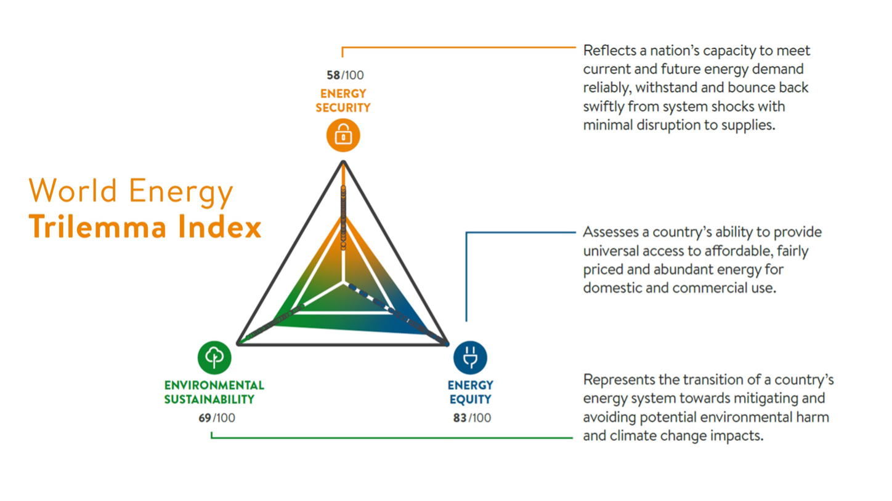
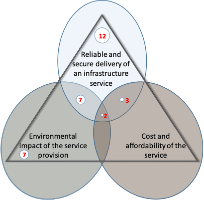
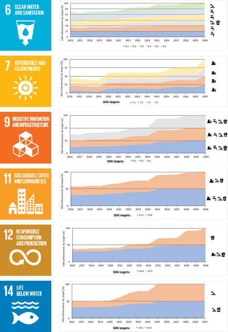

This lecture will demonstrate how we can place infrastructure assessment
in the context of sustainable development through the development of
appropriate indicators. This approach can be used by national
governments to develop a national vision for sustainable infrastructure
which incorporates a multi-dimensional, multi-sectoral approach.

# Learning objectives

-   To recognise the benefits of using metrics of infrastructure
    performance set within a sustainable development framing

-   To identify the contributions of infrastructure sectors and the
    'pillars of sustainability' to infrastructure assessment within
    Sustainable Development Goal (SDG) targets.

# Introduction

A wide variety of metrics can be used to assess national infrastructure performance and shape the implementation strategies for future projects and policies. The last lecture (mini-lecture 5.1) introduced how sustainability criteria are increasingly applied to indicator selection. Numerous government agencies now use the universally-recognised Sustainable Development Goal (SDG) framework to define a sustainable infrastructure vision as part of their national development. Similarly, Non-Governmental Organisations (NGOs) and the private sector increasingly aim to incorporate sustainability objectives into their vision and operation [@UNDP2016; @Busco2017].

In order to operationalise the 2030 Agenda for implementation at the global, regional, national, and sub-national levels, data-driven measurement tools and indicators have been developed to track progress and to identify gaps in indicator availability and coverage [@Schmidt-Traub2017; @Cassidy2014]. These tools and indicators aim to tackle the challenges of assessing global progress toward the SDGs and of quantifying "full" SDG achievement. While SDG targets are applied to all, including developed countries, they are assessed according to the nature and balance of the challenges they represent in each national context. Within each SDG, the UN has assigned multiple indicators as a means to measure achievement. However, these indicators generally reflect existing global datasets rather than ideal measures.

In the context of infrastructure, the 2030 Agenda provides a useful framework for informed decision-making, planning and implementation. It can be used as a means of measuring the potential impacts of investments and policies on long-term development objectives and is applicable to a range of international contexts and development challenges [@Adshead2019]. However, careful indicator development is necessary to ensure that future infrastructure provision reflects a wide range of sustainability criteria

# Framing infrastructure performance around sustainability dimensions: An example

The World Energy Council's 'Energy Trilemma Index' gives an example of
how infrastructure planning can be framed around multiple indicators of
sustainability, in this case, energy security, universal access to
affordable energy services and environmentally sensitive production and
use of energy [@WEC2017] (Figure 5.2.1). Importantly, it restructures
traditional cost-benefit analysis to present the types of trade-offs
that decision-makers must navigate to deliver on each of these
dimensions, with implications for policy coherence and integrated policy
innovation. Although the three pillars of sustainability are reflected
in the trilemma, the core ideas underlying these concepts are not
interchangeable. For instance, security of supply in the context of
infrastructure provision does not contribute exclusively to the
development of social well-being -- it also allows firms to benefit from
reliable infrastructure services required to ensure economic growth
[@Adshead2019].

{width=100%}

**Figure 5.2.1:** The 'Energy Trilemma Index' developed by the World
Energy Council [@WEC2017]

The 'trilemma' concept has been used to structure infrastructure
assessment in other sectors such as transport [@Bryce2014] and water
[@Ives2018], since similar sets of trade-offs between attributes of
infrastructure performance extend across the wider infrastructure
system.

In the context of achieving the SDGs, this concept highlights a key
challenge among infrastructure decision-makers: how to assign indicators
which ensure that multiple sustainability dimensions are captured, which
is a feature of most SDG targets. The relative importance of each
dimension in assessing target achievement is often not explicitly
defined within the SDG framework and will ultimately depend on the
national or regional context. Similarly, an SDG target is seldom
achieved through the contribution of a single infrastructure sector. In
fact, many SDGs require inputs more broadly from across the
infrastructure system.

# Examining the sustainability framing of SDG targets linked to infrastructure

Here, we look at examples of infrastructure-linked SDG targets that are
framed around one or more sustainability dimensions, summarised in
Figure 5.2.2. These are important to understand in order to assign
relevant indicators that capture all dimensions of the target.

Some SDG targets are one-dimensional, meaning they can be measured or
proxied by a single metric, assessing target achievement in terms of a)
provision of a required quantity of the infrastructure service; b)
environmentally sustainable delivery of the infrastructure service; or
c) the affordability and accessibility of the infrastructure service to
those who depend on it.

For example, target 7.2 *("By 2030, increase substantially the share of
renewable energy in the global energy mix")* addresses solely the
environmental dimension of sustainability within the energy sector.
Target 6.1 *("By 2030, achieve universal and equitable access to safe
and affordable drinking water for all")*, on the other hand, specifies a
need for at least two ways to measure performance of the water sector,
covering both adequate provision of the service and its affordability.
Target 11.2 *("By 2030, provide access to safe, affordable, accessible
and sustainable transport systems for all, improving road safety,
notably by expanding public transport, with special attention to the
needs of those in vulnerable situations, women, children, persons with
disabilities and older persons")* incorporates all three sustainability
dimensions. This implies that the target outcome cannot be evaluated
without assessing the affordability, environmental impact and level of
service provision within the transport sector.

{width=100%}

**Figure 5.2.2**: Number of infrastructure-linked SDG targets that incorporate a focus on service delivery, cost and affordability, and environmental impact. Adapted from @Adshead2019.

# Infrastructure sector contributions to SDG target achievement

The construction of indicators to measure infrastructure performance in sustainable development terms similarly requires consideration of how many, and which, infrastructure sectors are required to achieve the SDG target [@Adshead2019]. In some cases, the infrastructure service provided by a sector may be substitutable by another, while in others, each relevant sector is required.

Some targets focus exclusively on a single sector, for example 5.b
(*"Enhance the use of enabling technology, in particular information and
communications technology, to promote the empowerment of women"*). In
this case, the performance of the digital communications sector is
assessed.

Targets may also incorporate individual or interdependent contributions
from multiple sectors, as in 6.2 (*"By 2030, achieve access to adequate
and equitable sanitation and hygiene for all and end open defecation,
paying special attention to the needs of women and girls and those in
vulnerable situations"*). In this case, adequate performance of water
and wastewater systems is required for target achievement.

Finally, SDG targets may refer to system-wide infrastructure without
specifying the contribution of particular sectors, e.g. 9.1 *("Develop
quality, reliable, sustainable and resilient infrastructure, including
regional and transborder infrastructure, to support economic development
and human well-being, with a focus on affordable and equitable access
for all")*. These targets are more difficult to assess in terms of a
specific infrastructure sector intervention. They imply that all
networked infrastructure systems, as well as the non-networked social
and economic infrastructure that rely on them, are functioning at a
suitable level.

This complex relationship between infrastructure sectors and development
outcomes across a range of sustainability dimensions means that
decision-makers require a systematic approach to indicator design in
order to provide a suitable assessment of national infrastructure
performance within the SDG context.

# Using an 'SDG indicator' for infrastructure planning

This section demonstrates how these considerations have been taken into
account to assess infrastructure, and to inform planning within a
national vision of sustainable development.

The SDG targets provide an extensive list of sustainability attributes
valued by policymakers around the world, with a subset of these able to
be directly addressed through the provision of infrastructure.
Decision-makers must therefore prioritise and assign value to each
attribute in order to assess the scope of interventions required in a
particular sector to achieve the desired objectives -- the affordability
of a service, reliability of service provision, the environmental
sustainability of a system, and so on.

However, in each context, the unique value of these sustainability
attributes, and their relative importance to national development
objectives, must be ascertained. Indicators that provide a direct or
proxied measure of the consequences of infrastructure allow us to
understand to what extent sustainability objectives are, or need to be,
satisfied. Decision-makers in each country or context are ultimately
best-placed to determine priorities for development, and to apply
appropriate weighting to the clusters of attributes or required actions
by sector.

In the example below, of the small island of Curaçao, a number of
infrastructure investments and policies have been selected to achieve a
development vision based on the SDGs (Figure 5.2.3). Contributing either
individually or as a system, these infrastructures have been chosen and
sequenced to ensure that all infrastructure-linked targets across SDGs
6, 7, 9, 11, 12, and 14 have been fulfilled according to the outcomes
they aim to achieve. Thus, an 'SDG indicator' can be constructed to
merge infrastructure and sustainable development planning
[@Adshead2019].

{width=100%}

**Figure 5.2.3:** Target contribution to SDGs for Curaçao, showing
trajectory to achievement of infrastructure-linked targets. Required
individual or interdependent sector inputs are displayed for each target
along the right-hand side. Adapted from @Adshead2019.

# Summary

This lecture has demonstrated how a broader framing of infrastructure
performance, with consideration of the impact of infrastructure sectors
on sustainability dimensions, is key to placing infrastructure at the
heart of the Sustainable Development Goals. This can help
decision-makers better assess gaps in infrastructure achievement, and
quantify actions, such as investments and policies, that can be taken to
fully achieve certain SDGs and targets within a country context.
