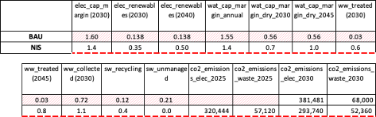
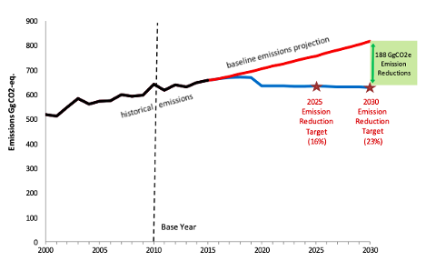
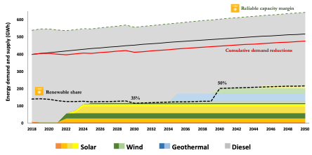
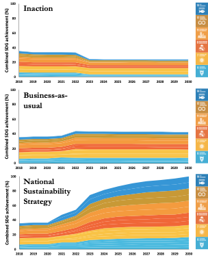

This mini-lecture will demonstrate how development targets have been
incorporated in the infrastructure strategy of Saint Lucia using inputs
from an infrastructure planning tool. It will present results showing
specific targets being met within a broader infrastructure strategy.

# Learning objectives
-   To learn methods for constructing and incorporating development
    targets in infrastructure assessment
-   To demonstrate the construction and use of a 'Sustainable
    Development Goal (SDG) indicator' as a measure of target progress,
    using knowledge developed in the previous lectures.

# Development targets and objectives in national infrastructure planning

Targets and objectives are an integral component of the infrastructure
planning process. As described in mini-lectures 5.1 and 5.2, they allow
decision-makers to determine which development criteria should be
prioritised in infrastructure planning, and to what extent. This
mini-lecture will highlight this aspect of the process in the Saint
Lucia case study, identifying targets which have been set according to
the context-specific characteristics of the small island. Examples of
target selection will be shown, including those in policy documents such
as the Nationally Determined Contributions (NDCs).

Selected results of the study will demonstrate how these targets shape
the overall strategy and outputs. The use of targets should be flexible
and define an infrastructure vision which is subject to dynamic change,
such as the emergence of new data and shifting national priorities.

# A systematic method of infrastructure performance target setting in a national context

Quantified infrastructure performance targets used in the Saint Lucia
assessment were established after a collaborative process of engagement
with decision‐makers in the Government of Saint Lucia and drew on the
development challenges facing the country (see mini-lecture 1.4).

A structured process was developed to identify and assign key sectoral
targets and indicators:

-   First, a series of consultations with government entities, including
    over 130 stakeholders, aimed to identify desired outcomes and
    quantified achievement levels across strategic policy areas. For
    example, a feasible timeline to achieve secure (uninterrupted) water
    access for all regions of the island.

-   Second, a consultation of key national policy and strategy
    documents, such as the Third National Communication on Climate
    Change and the National Policy on Wastewater Management, was
    conducted to incorporate existing government priorities and
    objectives. For example, wastewater collection targets in urban
    areas and electricity reserve margins as entrenched in the
    Electricity Supply Act.

-   Third, several targets were set according to quantifiable
    international commitments, specifically the SDGs and Saint Lucia\'s
    NDCs under the Paris Agreement. For example, the renewable energy
    targets and emissions reductions indicated in Saint Lucia's NDCs,
    and the SDG-based goal to halve untreated wastewater by 2030.

-   Fourth, some existing targets for 2030 were extrapolated for the
    longer term to maintain ambitious development objectives post‐2030.
    For example, targeting higher wastewater treatment levels beyond the
    2030 goal of 'halving untreated wastewater'.

-   Fifth, targets based on international best practice, such as
    outcomes achieved in the United States or the European Union, were
    used as a means to set aspirational objectives for Saint Lucia. For
    example, rates of recycling or organic composting.

These targets were entered into the infrastructure planning tool as
shown in Figure 5.4.1.

{width=100%}

**Figure 5.4.1**: Target inputs for Saint Lucia’s key infrastructure sectors, forming a National Infrastructure Strategy (NIS). Business-as-usual is denoted as BAU.

# Example: Inputting NDC commitments as targets in the planning model

As described in the previous section, the infrastructure planning model
introduced the government\'s mitigation targets, as stated in the NDCs,
to help define the conditions for strategic investments and policies in
the energy and waste sectors. These were assigned per‐unit emissions
values based on the type of fuel or technology used. For example, the
embodied emissions of diesel, solar, or wind generation, or the
emissions associated with various waste treatment options such as
recycling, compost, or landfills. Emissions savings were then calculated
according to the emissions averted through use of the infrastructure
technology of a given capacity. The model used these values to ensure
that a proposed strategy would not exceed the stated emissions targets.

Based on BAU emissions projections from 2010, these mitigation targets
assume a 16% reduction in emissions by 2025 and a 23% reduction by 2030
[@GoSL2015] (Figure 5.4.2). In the electricity sector, energy
efficiency interventions proposed in the NDCs, such as buildings and
appliances, as well as demand reduction measures, were integrated into
the strategy selection. While waste proposals were not quantified in the
NDCs, overall reductions were achieved in this sector through a shift
away from landfill towards lower emitting waste solutions. Although a
high‐emitting sector, transport interventions were not included because
demand in the sector relies on spatial considerations that could not be
aggregated on a national scale.

{width=100%}

**Figure 5.4.2:** Saint Lucia's emissions reductions targets for 2025
and 2030 in its first NDC, in relation to its baseline emissions
[@GoSL2015]

# Structuring investments and policies to meet targets in the energy sector

Figure 5.4.3 shows how the achievement of these targets is presented
within the results of the long-term infrastructure planning assessment
for the energy sector.

Favourable conditions for solar, wind, and geothermal energy on the
island make these the prime supply‐side components of a National
Sustainability Strategy aiming to achieve the government\'s renewable
generation target: this is set at 35% by 2030. A subsequent scale‐up of
this target to 50% is shown by 2040, with additional interventions added
to achieve this.

Saint Lucia's planned solar and wind installations will increase its
renewables share to 14% by 2022 while maintaining strong reserve
margins. This reliable capacity margin, shown as an additional target in
the figure, corresponds to SDG aspirations around secure energy access
for all. Saint Lucia\'s geothermal resources provide another untapped
renewable energy source, identified as a key component of the
government\'s renewable energy strategy. Due to technical constraints on
exploiting this resource economically, the majority of its projected
capacity may not come online until after 2030 but can play a major role
in achieving enhanced sustainability in the sector over the long term.

Demand reductions and system efficiencies in the electricity network are
considered relatively low‐cost interventions that could be feasibly
implemented by 2030 to reduce national energy demand by over 5%,
including through LED street lighting, lighting and cooling efficiencies
in new buildings, and a focus on energy use reductions in the tourism
sector [@Adshead2021].

{width=100%}

**Figure 5.4.3:** Implementation and sequencing of a National
Sustainability Strategy incorporating feasible investments and policies
to meet relevant SDG and mitigation targets [@Adshead2021]

# Using an 'SDG indicator' for infrastructure-linked targets

Figure 5.4.4 aggregates sector-specific targets and relative achievement
under the various strategies developed for the assessment (see Lecture
block 6) into an 'SDG indicator', as introduced in mini-lecture 5.2.
Using a subset of 18 SDG targets across six goals, the figure shows how
development outcomes most directly linked to electricity, water,
wastewater, and solid waste infrastructure in Saint Lucia may fare under
each strategy [@Adshead2021].

Current achievement across these targets is estimated at 36%, based on
measured indicators assigned to each target. While a course of inaction
sees this drop to 24% by 2030 as future demand growth outpaces current
capacity, an infrastructure strategy based on an ambitious
sustainability vision and objectives demonstrates a path to full
achievement of these targets by 2030.

Sector‐specific impacts unique to Saint Lucia\'s development challenges
can be identified, for example:

-   SDG targets that prioritise a secure energy supply (e.g. 7.1, 7.3,
    and 11.1) fare relatively well in all strategies due to Saint
    Lucia\'s implementation of strong reserve margins for diesel
    generation

-   Targets centred on environmentally sustainable energy and waste
    solutions (e.g. 7.2, 9.4, 12.5, and 14.5) fare poorly and decline
    over time without strong interventions

-   The impact of sudden events such as the depletion of landfill
    capacity has immediate and visible effects across numerous targets.

In order to ensure sustained progress toward SDG achievement, planned
infrastructure interventions must also incorporate resilience to the
threat of climate impacts and other external shocks [@Adshead2021].

{width=100%}

**Figure 5.4.4:** Combined SDG performance to 2030 by strategy,
calculated across 18 targets directly linked to the provision of
infrastructure using a scoring method developed by [@Adshead2019].

# Summary

This mini-lecture has demonstrated the incorporation of targets in
infrastructure planning. It has used a small island case study to show
how relevant targets can be identified through stakeholder and document
consultation, global agendas, target extrapolation, and international
best practice. Infrastructure strategies and results should be
explicitly shaped by these targets, which can be altered as new data or
priorities emerge.
