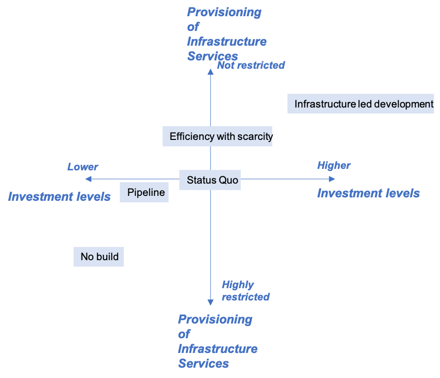
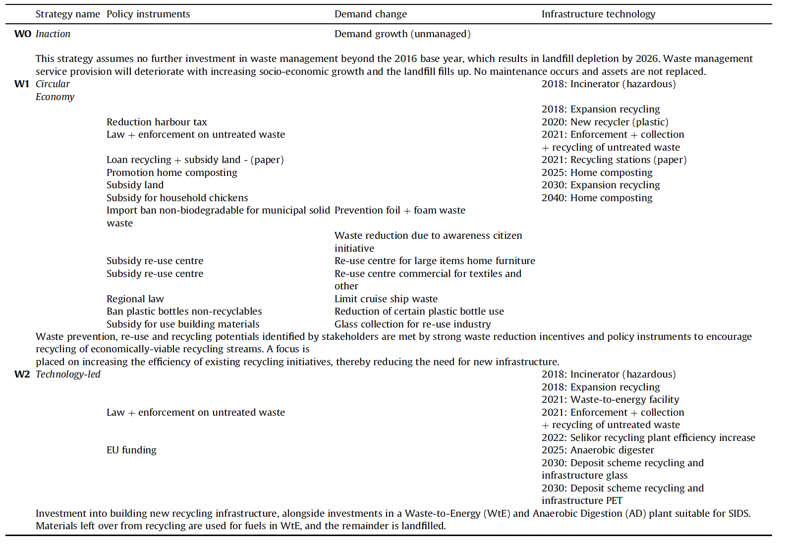
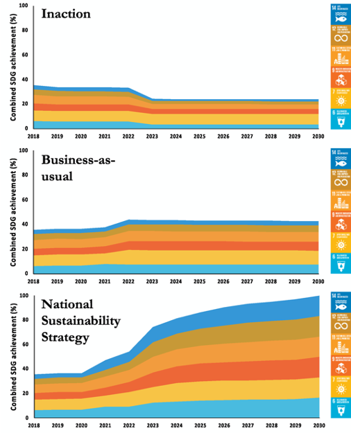
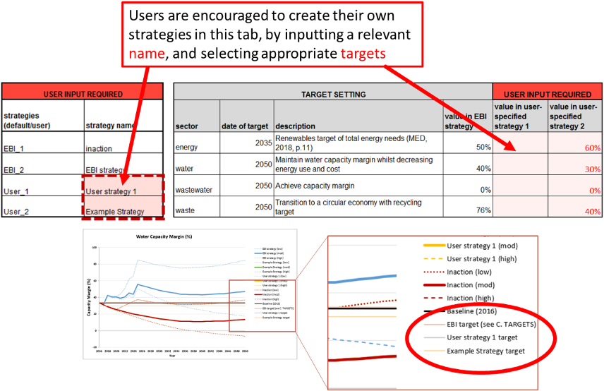
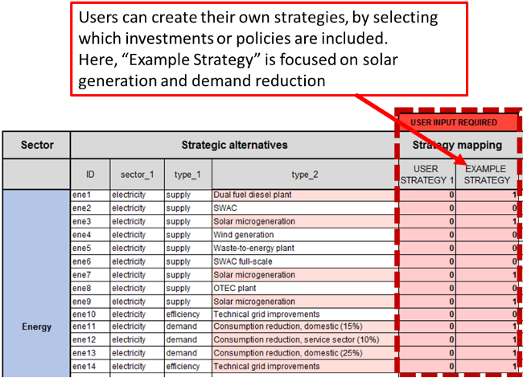

This mini-lecture introduces different case studies of sustainable
infrastructure strategy development, the methods used to develop
strategies in practice, and useful tools to transparently communicate
and describe data quality and data sources.

# Learning objectives

-   Describe an example of an infrastructure strategy in a sector of
    your choice in practice
-   Recall a method used to develop an infrastructure strategy in
    practice
-   Provide an example of a means by which to transparently communicate
    data quality in infrastructure strategy development.

# Introduction to sector and cross-sectoral infrastructure strategies in practice

This mini-lecture will introduce sector and cross-sectoral
infrastructure strategies in practice within strategic infrastructure
planning tools. It will provide examples of how infrastructure
strategies have been developed in different contexts. Finally, the
lecture will reflect on where to embed transparency into infrastructure
strategy development in practice, and provide an outlook on
infrastructure strategy development into the future.

The development of infrastructure strategies is embedded as a key step
in strategic infrastructure planning tools that have been applied in
various contexts [@Ives2019;@Fuldauer2019;@Adshead2021].

A case study of infrastructure planning in Palestine has identified a
broad set of infrastructure strategies in order to meet infrastructure
service demands, as shown in Figure 6.4.1. These strategies differ with
respect to the provision of infrastructure services and investment
levels. Rather than aiming to produce an optimal strategy for Palestine,
a range of strategies have been developed that allow the exploration of
implications of alternative policies [@Ives2019]

{width=100%}

**Figure 6.4.1:** Infrastructure strategies in Palestine, developed with
the aim of exploring implications of alternative policies. Author
compilation, based on [@Ives2019]

The various strategies include a no-built, pipeline, status quo,
efficiency with scarcity, and infrastructure-led development strategy:

-   The no built 'strategy' is a heuristic tool that provides a
    counterfactual to the other, more realistic, strategies. Here,
    infrastructure services will deteriorate through time as demand
    grows
-   This is compared to a pipeline of planned infrastructure investments
    as identified by the Palestinian Authority
-   A status quo strategy uses levels of investment in line with
    historic levels
-   The efficiency with scarcity strategy is based on an in-country
    report which envisions a more autonomous state
-   The infrastructure-led development is an aspirational strategy
    focused on ambitious future visions [@Ives2019].

# Practical examples of sector-specific infrastructure strategies and attributes

Focusing on the waste sector in Curaçao, different infrastructure
strategies were developed through participatory methods, with the aim of
testing different strategies considered feasible and desirable by local
stakeholders [@Fuldauer2019].

Strategy development was conducted using normative backcasting (see
mini-lecture 6.2). Stakeholders were interviewed with the aim of
determining an aspirational sustainable development vision for the waste
sector by 2050. Stakeholders were tasked to consider feasible
investments using five categories (legal, economic, land-use,
infrastructure, information), as well as two different intervention
points (demand reduction and capacity interventions).

The aim of the participatory backcasting process was to group different
investments under contrasting visions for a sustainable waste sector.
This can help diversify the portfolio of strategies for achieving the
vision, ensuring that the analysis does not represent the perspective of
an individual stakeholder, but rather the views of different
stakeholders from multiple backgrounds [@Fuldauer2019; @Varho2005].

Two different visions of the future, i.e. strategies, emerged from the
participatory backcasting exercise of the future of waste in Curaçao,,
including a circular economy strategy as well as a technology-led
strategy, which were compared to an inaction strategy for their
performance on different indicators aligned with the Sustainable
Development Goals (SDGs) (see Table 6.4.1)

{width=100%}

Table 6.4.1: Different waste management strategies in Curaçao, [@Fuldauer2019]

# Practical examples of developing infrastructure strategies

In a practical case study in Saint Lucia, various infrastructure
strategies have been developed using hybrid methods of both
participatory and content analysis [@Adshead2021]. Rather than
organising strategies by broader categories of infrastructure system
transformation [@Otto2016], the aim of the infrastructure strategy
development process here was to define an optimal implementation of
investment and policies to achieve a given set of development-aligned
targets.

The strategy development in Saint Lucia was conducted for a number of
different sectors, including energy, solid waste, wastewater, and water,
utilising sets of pre-defined interventions. These interventions were
assembled through consultation with decision-makers in government
ministries and agencies, as well as a review of numerous infrastructure
studies and appraisals for Saint Lucia [@Adshead2021].

The three strategies considered include an inaction strategy, a
business-as usual strategy (incorporating short-term projects confirmed
by the Government of Saint Lucia) and a 'National sustainability
strategy' (constructed to achieve specific user-defined targets for
infrastructure performance, which are aligned with specific targets of
the SDGs and Saint Lucia's targets for emission reductions as described
in the island's Nationally Determined Contributions (NDCs)).

Comparing these strategies allows for identification of their
performance on certain indicators, such as on combined SDG performance
(see Figure 6.4.2.)

{width=100%}

**Figure 6.4.2:** Performance of strategies on 18 SDG targets directly
linked to the provision of infrastructure [@Adshead2021].

# Transparency and communication in infrastructure strategy development in practice

Transparently communicating data gaps and limitations of infrastructure
strategies is critical to providing decision-makers with the means to
(1) understand and visualise uncertainties, (2) update data with new
sources, and (3) prioritise data collections.

Previous practical studies in Curaçao, and Saint Lucia on long-term
infrastructure planning have generated tools that can be used by
decision-makers to develop their own strategies and identify the
performance of these strategies under various future socio-economic
scenarios [@Fuldauer2018a; @Adshead2021].

Allowing users to develop their own strategies can help understand their
usefulness, and better communicate the advantages as well as drawbacks
of different strategies. As described in detail in hands-on exercise 3,
a National Infrastructure Systems Modelling tool (NISMOD) has been
developed to explicitly include information on the level of confidence
with respect to each data, as well as encoding the source of the data
point (see Figure 6.4.3) [@Fuldauer2018a].

{width=100%}

**Figure 6.4.3:** Confidence interval used in practical tools that embed
strategy development in long-term infrastructure planning
[@Fuldauer2018a].

These confidence intervals and links to data sources are included
throughout the National Infrastructure Systems Modelling tool as
described in hands-on exercise 3, which is exemplified in this example
for Curaçao,. The tool allows users to first define strategies
themselves, which can represent different visions of the future (see
Figure 6.4.4).

{width=100%}

**Figure 6.4.4:** Screenshot of National Infrastructure Systems
Modelling tool where users can develop their own strategies
[@Fuldauer2018a].

The National Infrastructure Systems Modelling tool then enables adding
or deleting certain interventions or investments from a strategy, by
inputting a 1 or 0. Each intervention has a specific level of confidence
attached to it (Figure 6.4.5).

{width=100%}

**Figure 6.4.5:** Screenshot of infrastructure planning tool where users
can add different interventions or investments to an infrastructure
strategy and embed its confidence [@Fuldauer2018a].

# Conclusions and lessons learnt for future infrastructure strategy development

This mini-lecture has outlined practical examples of infrastructure
strategies in different developing country contexts. Whilst
infrastructure strategies in Palestine were used to explore different
visions of the future without aiming to optimise a specific strategy,
the development of infrastructure strategies in Saint Lucia were
explicitly designed to optimise their performance on development and
emission targets.

Participatory methods have proven useful in the small island context in
Curaçao, and Saint Lucia, which, due to their small size, avoids
limitations with respect to time and resource constraints as well as
stakeholder selection -- a fundamental issue in larger country contexts
[@Cairns2013]. The strategy generation process can itself be an
important step in implementing investments needed to achieve certain
visions, as has been exemplified in the Curaçao, context
[@Fuldauer2019].

Future practical applications of strategy development in different
countries could explore infrastructure strategies designed to meet
certain climate adaptation, mitigation or other national targets.
