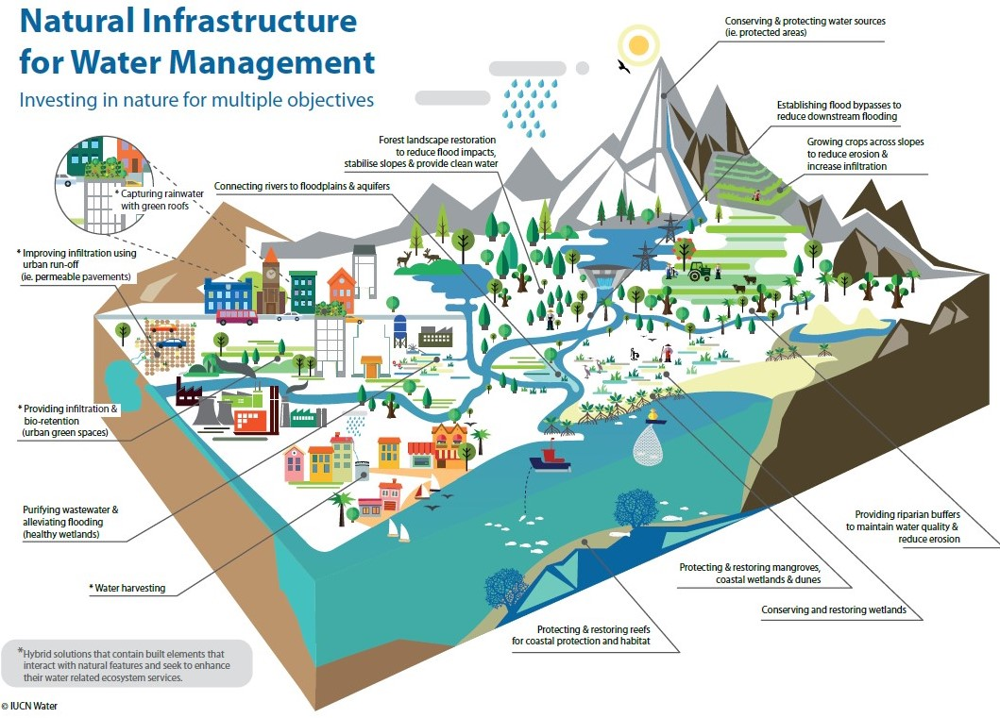
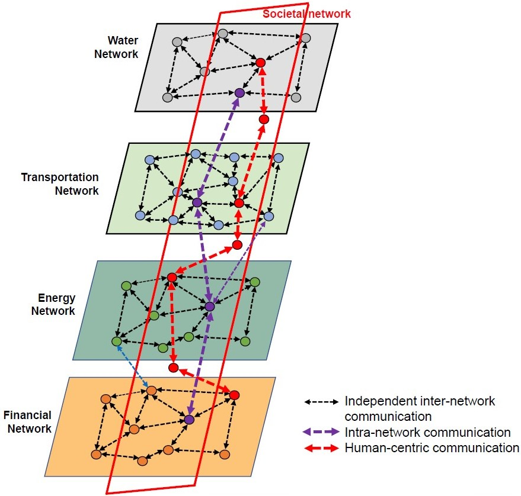
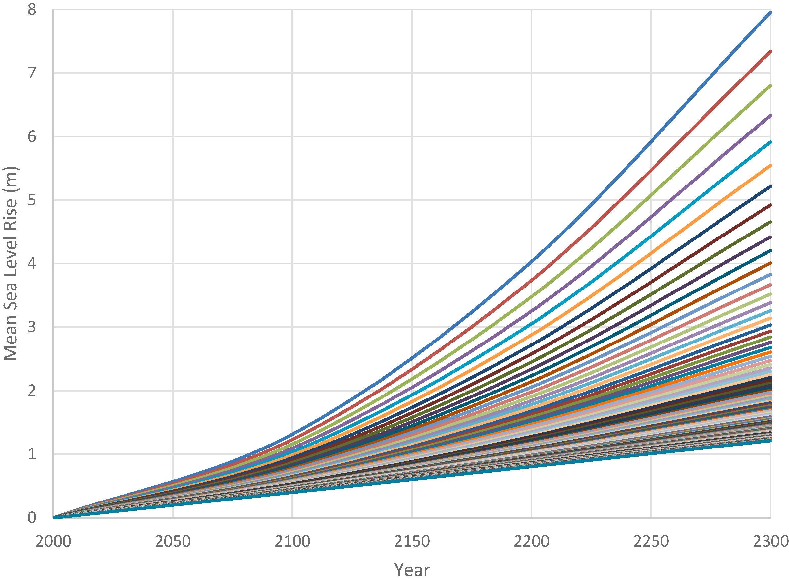
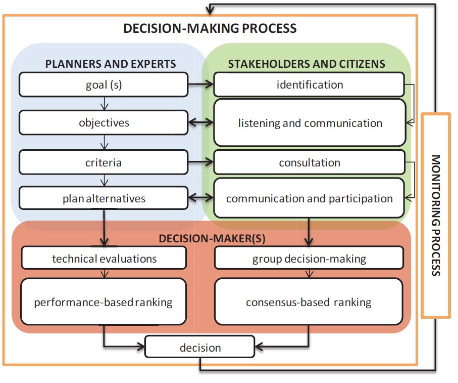

In this mini-lecture we will describe the main considerations and
challenges of making decisions for infrastructure planning.

# Learning objectives

-   List key considerations for infrastructure decision-making
-   Explain why each of them are important.

# Overview of performance evaluation

Following previous lectures, we are already able to:

-   Establish the current state of infrastructure systems
-   Develop forecasts of future infrastructure demands
-   Establish a vision, performance metrics and goals for the future
-   Develop strategic alternatives for future infrastructure provision.

Therefore, in this lecture we will set the basis for decision-making on
evaluating what strategies perform better under future forecasts to
achieve our defined goals.

The lack of strategic long-term planning is seen as one of the main
challenges to overhauling infrastructure systems [@Anheier2016;@OECD2017]. However, making the right decisions about infrastructure
is not an easy task. Infrastructure, as a high-cost long-lived asset,
needs to take into account a variety of factors, scenarios, objectives,
stakeholders and interdependencies with other sectors.

# Multiple objectives

Infrastructure systems don't only provide basic needs, they also
facilitate economic growth and social well-being. Additionally, these
systems account for approximately 70% of global emissions, mainly as a
result of infrastructure construction and operations such as power
plants, buildings, and transport [@Saha2018]. Therefore, making
decisions about infrastructure today, needs to take into account a
variety of different aspects and goals, as described in Lecture 5.

Figure 7.1.1 shows how water infrastructure (in this case natural
infrastructure) can provide a variety of services such as environmental
protection, flood mitigation, reducing erosion and water supply.
Infrastructure impacts are broad, therefore it is common to take
multiple goals in the decision-making process.

{width=100%}

**Figure 7.1.1:** Natural infrastructure for multiple
objectives [@Cohen-Shacham2016]

Common multiple objectives are costs, emissions (mainly for energy and
transport), reliability of the service, access (mainly for water and
wastewater in low-income settings), air and water quality, and other
environmental impacts. One way of taking all these different metrics
into account, is by converting them into monetary values. However, for
planning purposes other methodologies might be preferred, such as
multi-criteria decision-making, in which every metric can be analysed
with its own value, and trade-off evaluations can be performed. One of
the most prominent examples in this regard is energy planning under the
Sustainable Development Goals (SDGs) and the Paris Agreement, in which
planners are expected to consider climate mitigation objectives while
developing a reliable and cost effective energy system
[@Bhardwaj2019].

# Interdependencies between infrastructure sectors

Each infrastructure sector is a multifaceted socio-technical system, that contains a complex web of interconnections. Given the increased recognition of the need to take a more integrated view of infrastructure, many studies have evaluated infrastructure networks by analysing interdependencies between sectors such as the expanding body of research on the water-energy nexus [@Hamiche2016; @Artioli2017]. An example of interdependent infrastructure networks is shown in Figure 7.1.2. In the figure you can see schematic interactions between infrastructure sectors and with societal and financial networks. The interactions are differentiated as intra-network (within the same sector), inter-network and human-centric communication.

{width=100%}

**Figure 7.1.2:** Interdependent infrastructure systems [@Amini2020]

Some system interdependencies can be found between the energy and water sectors, mainly through hydropower plants (which generate water and energy at the same time), and the important amount of energy needed for water treatment and desalination. Interdependencies between the energy and transportation sectors are the fossil fuels used for vehicles and the increasing electrification of transport. Finally, interdependencies between waste and energy are the so-called waste-to-energy projects such as incinerators or anaerobic digesters as well as the methane collection in landfills.
Some direct interdependencies between sectors were described, but it is important to identify other types of indirect dependencies. For instance, if infrastructure is planned centrally, one common budget might be distributed for different sectors, therefore the budget spent in one sector might affect another. On the demand side, a demand-management strategy such as increasing environmental awareness can have an impact on all sectors and can be considered a cross-sectoral intervention.

# Uncertainty on infrastructure forecasts

As seen in Lecture 4, infrastructure drivers are used to predict future
demand. However, the longer the planning timeframe, the more uncertain
the forecasts. A common question that arises when we have a broad range
of scenarios is what we can do with them? Figure 7.1.3 shows the huge
variation of expected sea level rise (between 1m to 8m) for the Thames
river in London.

{width=100%}

**Figure 7.1.3:** Different forecasts of sea level rise for London
[@Hall2019]

When facing that range of uncertainty, different approaches are commonly
used:

-   One can use simple statistic estimations such as the average or the
    median of the forecasts and plan accordingly. This is not considered
    a good uncertainty management.
-   One can be a bit more detailed and evaluate the probability
    distribution of the forecasts. Then, it's possible to better
    evaluate the likelihood of different scenarios and estimate an
    expected value. This holds if the only goal is to maximise the
    overall expected value of the decision.
-   One can take a more conservative approach and decide to use the
    worst-case scenario. In this way the solution might be expensive but
    will always work.
-   As we will see in the next mini-lectures, more specialised
    approaches intending to evaluate the performance of different
    strategies under the whole range of scenarios, can result in robust
    decisions in the present, and propose adaptive approaches through
    time.

# Multiple stakeholders

Given that infrastructure is costly and its impacts are widespread,
infrastructure decisions are usually taken by a group of stakeholders.
This is part of what is called infrastructure governance, which entails
the social and institutional factors that create and sustain
infrastructure relationships [@Turner2018]. Uncertainty on what
decision is better arises when there are many viable alternatives to
follow, when the problem depends upon people's unpredictable behaviour,
and the uncertainty of the decision-making process itself, where various
stakeholders with different worldviews do not agree on a strategy
[@Groves2007].

The multiplicity of stakeholders does not only affect the moment of
making final decisions on infrastructure planning. The variety and
sometimes conflicting opinions need to be accounted for from the framing
of the problem, the development of a vision and objectives, and the
metrics that should be used. This will lead to consensus-based
decision-making. Figure 7.1.4 exemplifies a participatory
decision-making process proposed for transportation planning. As evident
in the figure, this entails a complex and iterative process.

{width=100%}

**Figure 7.1.4:** A framework for the participatory decision-making
process [@LePira2015]

# Summary

In this mini-lecture we reviewed key considerations for infrastructure
decision-making. Infrastructure normally has multiple objectives,
interdependencies, future uncertainty and multiple stakeholders
involved. Making infrastructure decisions is therefore a complex
process.
