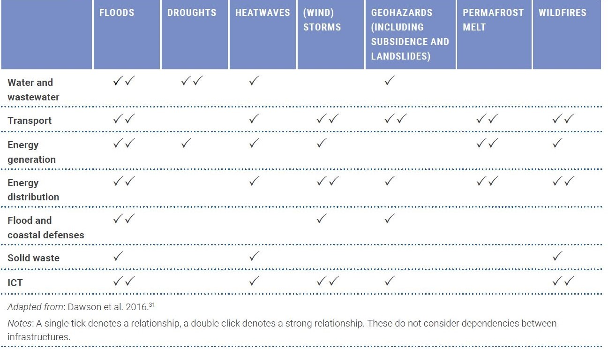

This mini-lecture provides an overview of the climate challenges facing
infrastructure systems around the world and briefly reviews the options
for adapting infrastructure systems in response to these challenges. It
sets the scene for the analysis of climate risks to infrastructure which
is presented in the following lectures.

# Learning objectives

-   Gain an understanding of climate risks to infrastructure systems
-   Recall options for adapting infrastructure systems in the context of a changing climate
-   Explain how risk analysis fits into adaptation decision-making.

# Introduction

Infrastructure systems (energy, transport, digital communications, water
and waste management) sustain civilisations. Many of these systems are
vulnerable to the impacts of climate change: sea level rise, river and
surface water flooding, landslides, wildfires, permafrost melt, droughts
and other extreme events. For example, @Koks2019 estimated that more
than 200,000km of roads are currently exposed to climate-related hazards
worldwide, which could increase to 237,000km by 2050 because of climate
change, without considering the new highway construction that will take
place in that period [@Hall2019].

Expansion and modernisation of infrastructure systems almost always
accompany economic development. It is estimated that US\$80 trillion of
investment in new and existing infrastructure is required worldwide over
the next 15 years [@Thacker2019]. Choices are being made now that
will lock in risks for decades to come, threaten the viability of
infrastructure investments, and burden countries with escalating
economic and human impacts and repair costs [@Hall2019].

To manage these risks, adaptation and resilience need to be embedded
throughout the life cycle of infrastructure planning, project
preparation, finance, design, delivery, operation and maintenance.
Decision-makers need to recognise that infrastructure assets that can
exist for decades or even centuries face a very uncertain future.
Infrastructure investments need to be designed and implemented to cope
with unpredictable threats and extreme events. Climate risk assessment
provides crucial information to inform these decisions [@Hall2019].

The following lecture blocks (8-14) will present the key knowledge,
approaches and tools for assessing climate risk to infrastructure
systems and how to make infrastructure more resilient for
climate-compatible growth.

# Types of climate risks to infrastructure systems

Given their central importance to the functioning of economies and
societies, networked infrastructure systems represent particular points
of vulnerability to climate change (see Figure 8.1). These can be
categorised into three predominant types of climate risks
[@Hall2019]:

1.  **Direct climate damage to infrastructure assets:** Climate change
    is likely to exacerbate the damage that floods, storms, extreme
    temperatures, wildfires, landslides, permafrost melting, coastal
    erosion and other environmental hazards do to infrastructure
    networks. These hazards can completely destroy or badly damage
    assets in ways that render them inoperable and costly to replace or
    repair. In 2018, for example, the global economic impact of natural
    hazards alone was US\$160 billion, of which 78% was climatological,
    14% was hydrological and 8% was geophysical [@Loew2019].

2.  **Climate disruption to the operation of infrastructure networks:**
    Service disruption can occur even without direct damage to
    infrastructure assets. Reservoirs may run dry during prolonged
    droughts, for instance, threatening water supplies and hydropower
    production. Climatic disruptions to infrastructure services impact
    users of those services, sometimes in places that are far from where
    the climate hazard actually hit [@Steinbuks2010]. These impacts
    can ripple through the economy through knock-on effects upon supply
    chains [@Hall2015].

3.  **Infrastructure-induced exposure to climate hazards:**
    Infrastructure enables development in hazardous locations like
    floodplains and mountainsides. Construction of transport
    infrastructure opens up places for development, increasing exposure
    to climate hazards. Increasing exposure is an inevitable consequence
    of development, but choices made about infrastructure often
    determine where and how development takes place and hence how much
    adaptation will be needed in the future. These development patterns
    then further influence the provision of infrastructure.

{width=100%}

**Figure 8.1:** Examples of climate hazards to infrastructure sectors
[@Hall2019;@Dawson2016]

# Priorities for adapting infrastructure systems

Decisions about adapting infrastructure assets and networks need to be
taken at a range of different scales. Design decisions for individual
assets need to consider the projected climatic conditions that assets
will be exposed to in the future. This may include increased flood
levels in extreme events (e.g. due to sea level rise or changed rainfall
patterns), or wind damage to infrastructure during hurricanes (including
direct wind loads and the effect of falling/flying debris). There will
always be a residual risk of a climatic extreme exceeding the design
condition of any asset, especially as future climatic conditions are
highly uncertain [@Hall2019].

Adaptation can never be absolute and there can be no universal target
for the standard of protection as climate risks and adaptation benefits
depend on location and context. Nonetheless, it is reasonable and
necessary to work towards a situation in which climate change is
incorporated in the design and management of every infrastructure asset
and flexible options are prioritised wherever feasible (see Table 8.1.1
for examples). This will be further explored in the following lectures.
Engineering design standards and codes need to be applied and enforced,
whilst nature-based solutions also offer ways of reducing risks that are
more resilient in the long term and yield multiple co-benefits (see
Lectures 15-18) [@Hall2019].

**Table 8.1.1:** Examples of adaptation options for climate-proofing
energy sub-sectors [@Hall2019]

+----------------------+----------------------+----------------------+
| **Energy             | **Technology and     | **Management and     |
| sub-sector**         | structural           | siting measures**    |
|                      | measures**           |                      |
+======================+======================+======================+
| Thermal and nuclear  | -   Adopt            | -   Site plants      |
| power                |     alternative      |     based on water   |
|                      |     cooling          |     access and away  |
|                      |     technologies     |     from high-risk   |
|                      |     such as closed   |     areas            |
|                      |     loop and dry     |                      |
|                      |     cooling          | -   Use alternative  |
|                      |                      |     water sources,   |
|                      |                      |     including grey   |
|                      |                      |     water or         |
|                      |                      |     seawater         |
+----------------------+----------------------+----------------------+
| Hydropower           | -   Enhance          | -   Modify           |
|                      |     reservoir        |     management       |
|                      |     capacity         |     procedures for   |
|                      |                      |     water storage    |
|                      | -   Improve design   |                      |
|                      |     and location of  | -   Site plants      |
|                      |     spillways to     |     based on         |
|                      |     manage changing  |     projections of   |
|                      |     water levels     |     hydrological     |
|                      |                      |     conditions       |
|                      | -   Culvert and      |                      |
|                      |     drainage sizing  | -   Enhance debris   |
|                      |     revised for      |     removal          |
|                      |     hydrological     |                      |
|                      |     uncertainty      | -   Demand-side      |
|                      |                      |     management to    |
|                      | -   Development of   |     reduce water     |
|                      |     upstream         |     consumption and  |
|                      |     sediment control |     enhance water    |
|                      |     facilities or    |     re-use           |
|                      |     sediment bypass  |                      |
|                      |                      | -   Creation of      |
|                      |   tunnels/facilities |     regulatory       |
|                      |                      |     bodies that are  |
|                      | -   Reassessment of  |     mandated to      |
|                      |     dam type to      |     develop and      |
|                      |     allow            |     apply improved   |
|                      |     overtopping      |     operating        |
|                      |     (i.e. concrete   |     strategies       |
|                      |     dam)             |                      |
|                      |                      |                      |
|                      | -   Adapt concrete   |                      |
|                      |     mix design to    |                      |
|                      |     withstand more   |                      |
|                      |     temperature      |                      |
|                      |     variations       |                      |
|                      |                      |                      |
|                      | -   Additional slope |                      |
|                      |     protection and   |                      |
|                      |     stabilisation    |                      |
|                      |     measures         |                      |
|                      |                      |                      |
|                      | -   Installation of  |                      |
|                      |     variable speed   |                      |
|                      |     turbines or      |                      |
|                      |     turbines with    |                      |
|                      |     higher           |                      |
|                      |     efficiency for a |                      |
|                      |     wide range of    |                      |
|                      |     discharges       |                      |
+----------------------+----------------------+----------------------+
| Solar energy         | -   Modify surface   | -   Site solar PV    |
|                      |     material for PV  |     panels based on  |
|                      |     panels for       |     projected        |
|                      |     improved light   |     changes in cloud |
|                      |     diffusion        |     cover and air    |
|                      |                      |     temperature      |
|                      | -   Adapt material   |                      |
|                      |     durability to    | -   Site CSP based   |
|                      |     extreme wind and |     on water         |
|                      |     precipitation    |     availability     |
|                      |                      |                      |
|                      |                      | -   Adjust design of |
|                      |                      |     buildings with   |
|                      |                      |     passive and      |
|                      |                      |     active solar     |
|                      |                      |     heating          |
|                      |                      |                      |
|                      |                      | -   Demand-side      |
|                      |                      |     flexibility --   |
|                      |                      |     enhance the      |
|                      |                      |     installation of  |
|                      |                      |     rooftop solar PV |
+----------------------+----------------------+----------------------+
| Wind power           | -   Alter turbine    | -   Site turbines    |
|                      |     design to        |     based on         |
|                      |     withstand high   |     projected        |
|                      |     winds            |     changes in wind  |
|                      |                      |     speed and        |
|                      | -   Improve material |     direction, and   |
|                      |     durability       |     exposure to      |
|                      |                      |     extreme weather  |
|                      | -   Fortify          |     events           |
|                      |     off-shore        |                      |
|                      |     potential for    |                      |
|                      |     wind energy      |                      |
|                      |                      |                      |
|                      | -   Taller and       |                      |
|                      |     larger wind      |                      |
|                      |     turbines to      |                      |
|                      |     improve          |                      |
|                      |     efficiency       |                      |
+----------------------+----------------------+----------------------+
| Transportation,      | -   Increase T&D     | -   Place T&D lines  |
| transmission and     |     line capacity    |     underground      |
| distribution (T&D)   |     and ability to   |                      |
|                      |     withstand higher | -   Improve          |
|                      |     snow and ice     |     vegetation       |
|                      |     load             |     management       |
|                      |                      |     around wires     |
|                      | -   Modify pipeline  |                      |
|                      |     materials to be  | -   Site pipelines   |
|                      |     waterproof and   |     away from areas  |
|                      |     able to          |     of high flood    |
|                      |     withstand        |     risk, extreme    |
|                      |     freeze-thaw      |     freeze-thaw      |
|                      |     cycles           |     cycles, and      |
|                      |                      |     melting          |
|                      | -   Replace wooden   |     permafrost       |
|                      |     utility poles    |                      |
|                      |     with steel poles |                      |
+----------------------+----------------------+----------------------+
| Ocean energy         | -   Combination of   | -   A comprehensive  |
|                      |     offshore wind    |     set of policies  |
|                      |     power plants     |     is required to   |
|                      |     with wave or     |     encourage        |
|                      |     tidal energy     |     investments in   |
|                      |     production       |     ocean energy     |
|                      |                      |                      |
|                      | -   Continuous       |                      |
|                      |     development of   |                      |
|                      |     wave, ocean      |                      |
|                      |     current and      |                      |
|                      |     ocean thermal    |                      |
|                      |     energy           |                      |
|                      |     production       |                      |
|                      |     potential        |                      |
|                      |                      |                      |
|                      | -   Development of   |                      |
|                      |     offshore tidal   |                      |
|                      |     lagoons          |                      |
|                      |                      |                      |
|                      | -   Turbine          |                      |
|                      |     efficiency       |                      |
|                      |     improvements in  |                      |
|                      |     bi-directional   |                      |
|                      |     flows for tidal  |                      |
|                      |     energy           |                      |
|                      |     production       |                      |
|                      |                      |                      |
|                      | -   Installation of  |                      |
|                      |     variable speed   |                      |
|                      |     turbines or      |                      |
|                      |     turbines with    |                      |
|                      |     higher           |                      |
|                      |     efficiency for a |                      |
|                      |     wide range of    |                      |
|                      |     flows            |                      |
+----------------------+----------------------+----------------------+
| Hydrogen production  | -   Link together    | -   A comprehensive  |
|                      |     with other       |     set of policies  |
|                      |     energy sources,  |     is required to   |
|                      |     to compensate    |     encourage        |
|                      |     when energy      |     private          |
|                      |     production is    |     investments in   |
|                      |     low              |     hydrogen         |
|                      |                      |                      |
|                      |                      | -   Large scale      |
|                      |                      |     storage          |
|                      |                      |     requirements in  |
|                      |                      |     salt caverns or  |
|                      |                      |     storage tanks    |
+----------------------+----------------------+----------------------+

# **Systemic resilience across infrastructure networks**

In addition to these asset-based adaptations, it is important to look at
the big picture of how systemic resilience can be achieved
[@Hall2019]:

-   **Enhancing system resilience**: The ways in which services are
    provided by infrastructure networks can often be made more
    resilient, in order to cope with and recover from extreme and
    disruptive events, for example through the development and operation
    of forecasting, warning and emergency management systems.
    Diversified supply chains with stocks that are sufficient to cope
    through an emergency are inherently more resilient than many of
    today's just-in-time systems. Managing demand for water and energy
    enhances system resilience and saves the costs and impacts of
    consuming these resources. Financial instruments like direct
    payments and well-designed insurance can help people and asset
    owners to cope in extreme events.

-   **Planning for sustainable infrastructure development**: Often the
    greatest opportunities for managing climate risks exist in the early
    stages of planning and designing infrastructure systems. Questions
    of climate risk and adaptation need to be brought 'upstream' in
    long-term development and spatial planning, becoming mainstreamed in
    development policies and plans from the outset. Climate risks to
    infrastructure need to be considered on a broad spatial scale, which
    will open up more resilient options and help to avoid locking in
    vulnerability. Planning climate-resilient infrastructure development
    involves systems thinking for the long-term and exploring diverse
    options in a range of possible futures -- which is a process that
    will yield better and more sustainable infrastructure worldwide.

# Summary

This lecture has examined the nature of climate risks to infrastructure
systems and the options available for adapting to those risks. There are
many ways in which infrastructure can be adapted. Each approach requires
considerations of *how much* adaptation to do, *where* and *when*. These
are difficult decisions. Answering them properly relies upon the
quantification of climate risks to infrastructure systems, both in the
absence of adaptation and the residual risk that will inevitably remain
once an adaptation has been implemented. The risk reduction that is
achieved by an adaptation option is the benefit of that option, which
needs to be compared with the cost, in order to choose what adaptation
option(s) to adopt and when. The remainder of this lecture block
therefore focuses on concepts and quantification of climate risks to
infrastructure systems, and the use of risk analysis for adaptation
planning.
