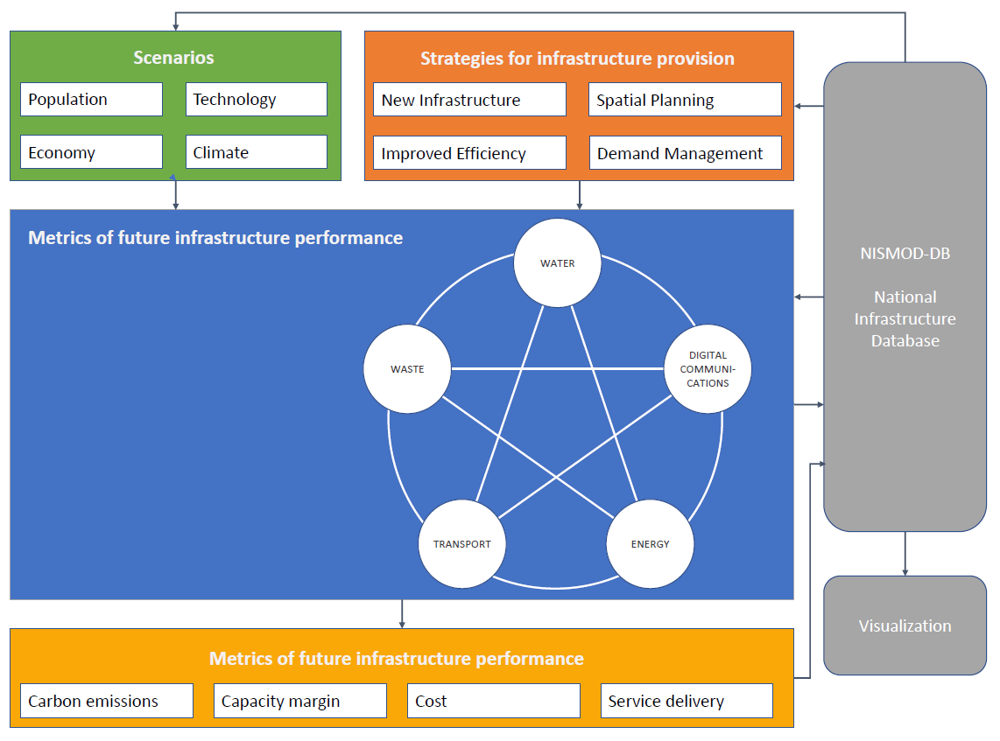
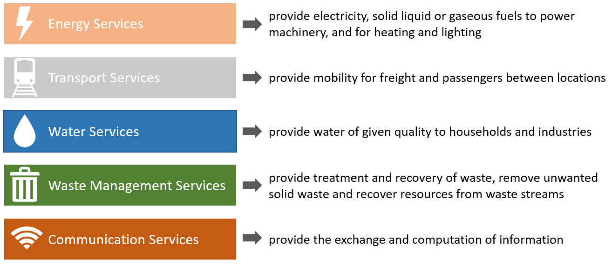
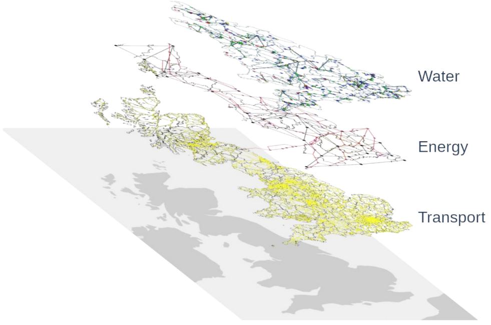
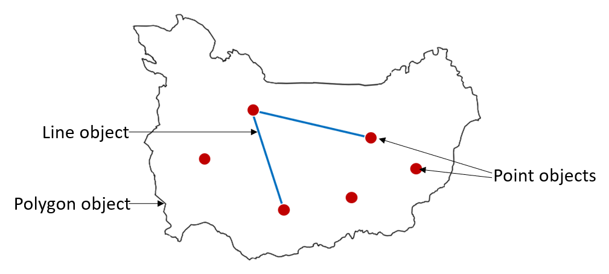

This mini-lecture gives an introduction to the overall lecture
"Modelling infrastructure assets". First, we'll discuss what insights we
can gain from infrastructure modelling. Then, we will take a closer look
at the services infrastructure provides and the spatial aspects of
infrastructure service provision. Finally, a short introduction in using
geospatial data for infrastructure modelling is given. This mini-lecture
provides the basic knowledge, which is then applied to the energy, water
and transport sectors in the following mini-lectures.

# Learning objectives

-   To be able to explain why we model infrastructure
-   To understand which services infrastructure provides and what their
    spatial relation to society is
-   To have a basic understanding on what geospatial data is and where
    datasets for infrastructure modelling can be found.

# Introduction to infrastructure modelling

In this lecture we'll give an overview of how to model infrastructure
networks and take a closer look at applications in the water, energy and
transport infrastructure sectors.

Modelling infrastructure can be a powerful tool for multiple objectives.
It is used in infrastructure planning to make projections of future
demand as well as for exploring possible future scenarios to support
informed decision-making. Additionally, it can be used to assess
infrastructure vulnerability and enable the development of more
resilient infrastructure in the future. It can help to identify risks
such as climate hazards and calculate potential damages or economic and
social consequences from service disruptions.

An example of a framework that combines several infrastructure models is
shown in the figure below.

{width=100%}

**Figure 9.1.1:** Schematic overview of the National Infrastructure
Model (NISMOD) (based on @Hall2017)

It shows the "National Infrastructure Systems Model" (NISMOD) which was
designed by the UK Infrastructure Transitions Research Consortium (ITRC)
to inform infrastructure assessment on a national level [@Hall2016].

# Infrastructure services

In the previous lectures (such as mini-lectures 4.1, 4.2, 8.1 and 8.2)
we have discussed different aspects of infrastructure. Before we start
talking about modelling infrastructure, we should look at infrastructure
from a service perspective. Instead of thinking about different
categories of physical assets such as roads, railway lines, ports and
airports as parts of the transport system, we want to focus on the
services that they provide.

Taking a service perspective instead of just looking at the assets
allows us to consider the possibility of substitution of services
between networks. An example would be the use of electricity, gas or a
district heat network to provide heating services. It is important to
understand that it is the services provided that can enable or enhance
economic activity and human well-being [@Hall2016].

{width=100%}

**Figure 9.1.2:** Services from infrastructure assets (based on
@Hall2016)

Figure 9.1.2 gives an overview of the infrastructure services provided
by the different sectors. Services from energy infrastructure are based
on the provision of electricity or fuels for heating and lighting as
well as to power machinery, including means of transport. Transportation
services provide mobility for passengers and freight. Water supply
services provide households with drinking water and industries with the
water needed for manufacturing processes. The waste sector provides us
with services around the removal, treatment and recovery of solid waste
and wastewater. Lastly, communication services enable the exchange and
computation of information and data. [@Hall2016]

# Spatial relations between infrastructure and society

For infrastructure modelling it is important to get an understanding of the spatial aspect of infrastructure systems and services. From now on, we will focus on the water, energy and transport sector. All three sectors are based on assets that form infrastructure networks covering a region or an entire country.

{width=100%}

**Figure 9.1.3:** The water, energy and transport infrastructure
networks in Great Britain [@Russell2020]

In Figure 9.1.3 you can see the water, energy and transportation
infrastructure networks in Great Britain. All three networks transport
either people, goods, water or electricity from one point to another
point within the network. Thereby, electric power lines, the road
system, as well as water infrastructure networks usually have a branch
network structure. For the energy and water supply systems those
networks connect the different levels of service supply. It starts at
the production or source level, then the energy or water is transported
(in energy networks this is called transmission) and distributed and
finally reaches the consumer.

Additionally, the extent or density of the infrastructure networks in
certain areas should be considered. It can determine how well rural
areas are developed and if people in those areas are provided with
infrastructure services. Supply areas determine how many people are
supplied by one part of the network or depend on one specific
infrastructure asset. In infrastructure modelling those numbers are
crucial for infrastructure planning. Additionally, they enable the
calculation of the number of people affected by a disruption in a
certain part of the network. In the transport sector a similar analysis
can be done, assessing the accessibility of certain points within the
transport network and the amount of passenger or freight transport
that's affected by a malfunction.

# Introduction to geospatial data for infrastructure modelling

As we've seen in the previous section, the spatial aspect is crucial
when looking at infrastructure networks and their service provision.
Therefore, a lot of infrastructure modelling is done using geospatial
data.

Geospatial data includes information on the shape or extent of an object
and its actual location on the planet. The datatype that we want to use
is called "vector data". It can either have a point, line or polygon
shape, which can be used to represent infrastructure assets or networks.
Each of those objects can store additional information (e.g. name, size,
capacity, etc.).

{width=100%}

**Figure 9.1.4:** Point, line and polygon object types in geospatial
data. The points can represent infrastructure assets, or other points in
the network such as households. The lines can represent pipes or
transmission lines and the polygon can be a district or a supply area

To explore this kind of data, software like ArcGIS (license) or QGIS
(open-source) can be used to look at spatial data, explore it, analyse
or process it and visualise the results. For more complex analysis and
modelling usually programming languages are used - in this class we will
work with Python. Several packages in Python, such as GDAL or GeoPandas
enable the processing of geospatial data in Python. In Hands-on 5 you
will get the chance to use QGIS and Python to do some of the analyses
yourself.

When modelling infrastructure, we need not only the right tools and
software, but also data on infrastructure assets, climate hazards or the
population living in an area. Many countries have official websites
where all kinds of datasets including geospatial data is available (e.g.
data.gov.uk. for the UK). For infrastructure data, Open Street Map can
also be a good (open) source to download data from. Another useful
collection of datasets from around the world is the World Bank Data
Catalog. Under the section "geospatial data" you can find all kinds of
spatial datasets. In Hands-on 5, you will learn how to download data
from Open Street Map and other data providers.

# Conclusion and outlook

Now you know more about the service provision of infrastructure networks
and its spatial component. Additionally, you have learnt how to
represent spatial information in data frames and got to know the
different kinds of software you can use to work with geospatial data. On
top of that, we talked about some websites where you can find geospatial
data and download it. This gives you a great foundation to dive deeper
into infrastructure modelling.

In the following mini-lectures, we will take a closer look at the
transport, water, and energy sectors, its components and how to model
those. In Hands-on 5 you will learn more about how to work with some of
the software you were just introduced to and you'll get the chance to
work with some geospatial data.

# Summary

This mini-lecture introduces infrastructure modelling. First, we've
discussed why we want to model infrastructure and what insights we can
derive. Then, we talked about infrastructure services and the spatial
relations between infrastructure and society. Finally, you got a brief
introduction to geospatial data, how to analyse it and where
infrastructure-related data can be found.
