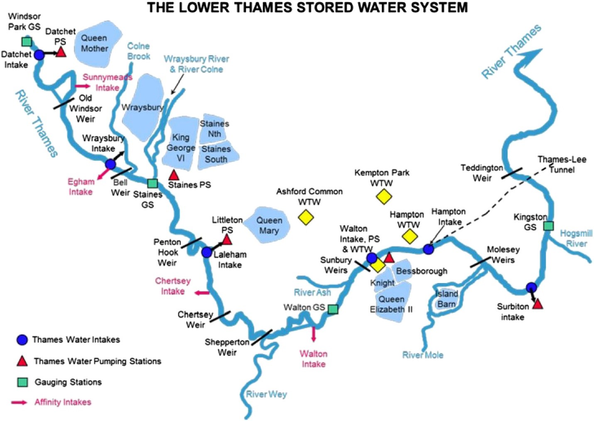
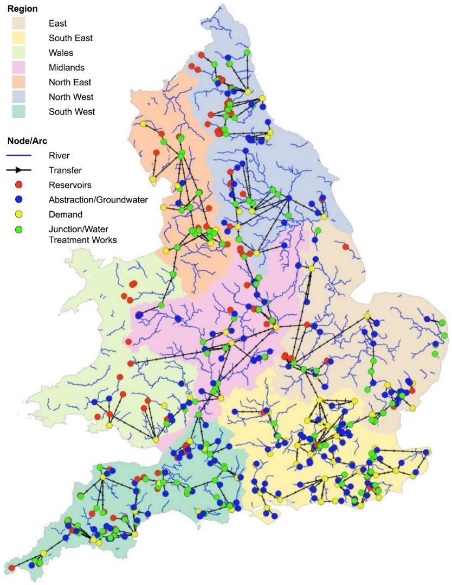
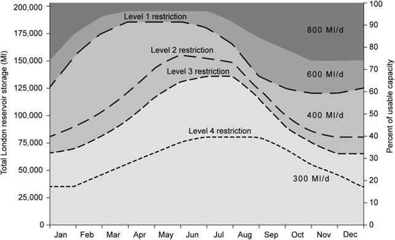

This mini-lecture provides an overview of what constitutes a water
infrastructure network, how water infrastructure is distinct from other
infrastructure networks and the different kinds of disruption that
affect water supplies. The type of causes of water supply disruption,
from asset-related failures to source-related failures, are discussed in
turn.

# Learning objectives

-   Be able to identify the components of water infrastructure systems
-   To recognise the characteristics that make water infrastructure
    stand-out compared to other infrastructure systems
-   To be able to explain the full range of water infrastructure
    disruptions and how they can be modelled.

# Introduction

Water infrastructure systems are made up of the assets that abstract
(intakes), treat (water treatment plants), pump (pumping stations),
convey (pipes) and store water (reservoirs/storage tanks) to supply
municipal and sometimes commercial/industrial demand. Wastewater
infrastructure systems are made up of the assets that transport (sewer),
treat (wastewater treatment plant) and discharge wastewater back to the
natural environment.

Figure 9.3.1 shows locations of water infrastructure along a section of
the Thames, UK. As evident, intakes are assets that abstract water from
the natural network of water resources, i.e. from rivers, lakes and
groundwater.

-   Raw water may be stored in reservoirs or dams before being treated
    at a treatment plant

-   Treated water may be stored in tanks before or after being pumped to
    communities via a network of pipes

-   Wastewater is then transported from communities via a sewer network
    to be treated by wastewater treatment plants, before being returned
    to the rivers and the natural system.

Given that the treatment and pumping of water relies on a reliable
supply of electricity, the electricity supply nodes which serve water
assets are also an important element of the water infrastructure system
to consider.

{width=100%}

**Figure 9.3.1:** Locations of water infrastructure asset along a
section of the river Thames [@Mortazavi-Naeini2019]

Of course, the configuration of water infrastructure varies
significantly depending on the local context. Different countries have
different standards and protocols for water management, for example, for
the level of treatment, the capacity and form of storage, and the kind
of connection to consumers (e.g. household-level, versus standpipes).

# Global datasets on water

Although water infrastructure datasets on treatment plants, intakes and
pumping stations are hard to come by even at national scales, there is a
global database of reservoirs and dams. This can be used for quantifying
the volume of storage capacity and, hence, the resilience of a country's
water supplies to extreme water supply variations [@Gaupp2015;@Hall2014]. There are various global river network and catchment
datasets, HydroSHEDS is one of the most commonly used among these.

Global hydrological models that provide data on runoff and river flows
are also available. For example, the ISIMIP data depository provides a
range of publicly available global hydrological datasets
[@Davie2013].

Further, the Joint Monitoring Programme is responsible for monitoring
the progress of countries towards the UN Sustainable Development Goals.
They provide a database on national-level connections to piped water
supply and sewer networks. This can be used to understand the coverage
of water infrastructure within a country.

The UN Food and Agricultural Organization publishes a database called
AQUASTAT which provides national level water use data for different
demands, for example, agricultural, domestic and industrial, as well as
the volume of wastewater generated. This has been widely applied for
quantifying water stress at a global scale (e.g. @Doeffinger2020).

Table 9.3.1 below provides an overview of some of the global data
sources available on water infrastructure:

**Table 9.3.1:** Overview of some examples of global data sources for
water infrastructure

  **Datasets**                                          **Source**
  ----------------------------------------------------- ---------------------------------------------------------
  Reservoirs and dams                                   [Global Dam Watch](http://globaldamwatch.org/)
  Rivers                                                [HydroSHEDS](https://www.hydrosheds.org/)
  Runoff                                                [ISI-MIP](https://esg.pik-potsdam.de/search/isimip/)
  Connections to piped water supply and sewer systems   [Joint Monitoring Programme](https://washdata.org/data)
  Water use                                             [FAO, AquaSTAT](http://www.fao.org/aquastat/)

# Hazard interactions with water infrastructure

All infrastructure is vulnerable to a range of climate extremes, with
floods, earthquakes and hurricanes imposing a heavy financial burden in
infrastructure damages. Water infrastructure systems stand-out compared
to other infrastructure because both water resources and assets are
vulnerable to climate and hydrological extremes.

1. Flood inundation poses a climate-related risk to **water assets**.
In the event that critical water infrastructures or electricity supply
assets fail due to flooding, they would have to be taken out of
operation, causing further disruptions in the network.
2. Hydrological droughts are among the most widely studied
climate-related risks to **water resources**. Depending on the
capacity of water storage infrastructure, the system may be able to
buffer against droughts, protecting dependent populations from water
shortages.

Thus, multiple hazards disrupt water infrastructure in different ways,
which are summarised in Table 9.3.2 below:

**Table 9.3.2:** Summary of the ways in which hazards disrupt water
infrastructure

+---------+---------+---------+---------+---------+---------+---------+
| **Sub-s | **      | **      | **Land  | **Hurr  | **Earth | **Dr    |
| ector** | Asset** | Flood** | slide** | icane** | quake** | ought** |
|         |         |         |         |         |         |         |
|         |         | **(plu  |         |         |         |         |
|         |         | vial/** |         |         |         |         |
|         |         |         |         |         |         |         |
|         |         | **ri    |         |         |         |         |
|         |         | ver/coa |         |         |         |         |
|         |         | stal)** |         |         |         |         |
+=========+=========+=========+=========+=========+=========+=========+
|         | Sources | **N**   | **N**   | **N**   | **N**   | **Y**   |
|         | (s      |         |         |         |         |         |
|         | prings, |         |         |         |         |         |
|         | wells,  |         |         |         |         |         |
|         | rivers) |         |         |         |         |         |
+---------+---------+---------+---------+---------+---------+---------+
| **      | Dams    | **N**   | **N**   | **N**   | **Y**   | **Y**   |
| Water** | and     |         |         |         |         |         |
|         | re      |         |         |         |         |         |
|         | servoir |         |         |         |         |         |
+---------+---------+---------+---------+---------+---------+---------+
|         | Water   | **Y**   | **Y**   | **N**   | **Y**   | **Y**   |
|         | tr      |         |         |         |         |         |
|         | eatment |         |         |         |         |         |
|         | plants  |         |         |         |         |         |
+---------+---------+---------+---------+---------+---------+---------+
|         | Pumping | **Y**   | **Y**   | **N**   | **Y**   | **N**   |
|         | s       |         |         |         |         |         |
|         | tations |         |         |         |         |         |
+---------+---------+---------+---------+---------+---------+---------+
|         | Potable | **N**   | **N**   | **N**   | **N**   | **Y**   |
|         | storage |         |         |         |         |         |
|         | tanks   |         |         |         |         |         |
+---------+---------+---------+---------+---------+---------+---------+
|         | Pi      | **N**   | **Y**   | **N**   | **N**   | **N**   |
|         | pelines |         |         |         |         |         |
+---------+---------+---------+---------+---------+---------+---------+
| **Waste | Was     | **Y**   | **Y**   | **N**   | **Y**   | **N**   |
| water** | tewater |         |         |         |         |         |
|         | tr      |         |         |         |         |         |
|         | eatment |         |         |         |         |         |
|         | plants  |         |         |         |         |         |
+---------+---------+---------+---------+---------+---------+---------+
|         | Sewers  | **N**   | **Y**   | **N**   | **Y**   | **N**   |
+---------+---------+---------+---------+---------+---------+---------+

The following sections explore the modelling approaches employed to
analyse the risk that flood and drought hazards pose to water
infrastructure systems.

# Risks to water network infrastructure

Water supply disruptions can be caused by flood damage to water
infrastructure assets or dependent electricity supply infrastructure.
Figure 9.3.2 illustrates a network model of water infrastructure,
comprising water infrastructure assets, such as water treatment plants
and network connections to demand centres, in England and Wales.

{width=100%}

**Figure 9.3.2:** Network model of water infrastructure, comprising
water infrastructure assets, such as water treatment plants and network
connections to demand centres, in England and Wales [@Dobson2020]

These network models can be used to understand which demand centres
could be disrupted by the failure of certain assets. The likelihood of
certain assets being disrupted by climate extremes, such as flooding,
can be determined by overlaying flood return period maps. This is put
into practice during Hands-on 6.

The intersection between probability and consequence provides an
indication of risk. For example, combining the likelihood of flood
inundation at water infrastructure assets, or the electricity
substations that supply water assets, with the population dependent on
each asset can be used to quantify the risk of flood-induced water
supply disruptions. If the likelihood of asset failure is unknown, asset
failures and associated network disruptions can be randomly simulated to
identify hotspots of critical assets or worst-case failure scenarios in
water networks.

# Risks to water resources

Water resources variations - such as water shortages and harmful water
quality events - also pose a major risk to water supplies. Water
shortages are often measured according to deviations in the volume of
water stored in reservoirs. This aligns with the operating rules imposed
on utility networks by managers: during droughts that result in the
volume of stored water dropping to, say, 50% of their normal levels,
utilities will put measures in place to ensure that water supplies will
be able to outlast the drought. These measures might be fairly minor,
such as a ban on the use of sprinklers for lawn irrigation, or they
could be incredibly restrictive, such as being requested not to flush
the toilet after urination, which happened during the Cape Town drought
of 2019.

Thus, the risk of water shortages can be determined by analysing the
probability of water shortages of varying severity or untreatable water
quality and associated consequences for dependent populations. For
example, assess the vulnerability of water resources systems to extreme
droughts [@Borgomeo2014]. Level of Service is used as a risk metric,
shown in Figure 9.3.3, quantifying the probability of exceeding planned
frequencies of water shortages of varying severity.

{width=100%}

**Figure 9.3.3:** Thresholds of reservoir storage over a given year that
are associated with water use restrictions of different levels of
severity in the Thames catchment, UK [@Borgomeo2014]

The kinds of risk analysis discussed in this lecture are widely applied
to guiding water infrastructure planning decisions, which will be
discussed in future sections.

# Summary

This mini-lecture provides an overview of the components of water
infrastructure systems, how systems are affected by hazards and how the
risks of different kinds of disruption can be analysed. You should now
be able to identify the range of assets that make up systems of water
infrastructure, recognise what distinguishes water infrastructure from
other types of infrastructure, and be able to explain the different
types of disruptions and hazards that affect water infrastructure.
