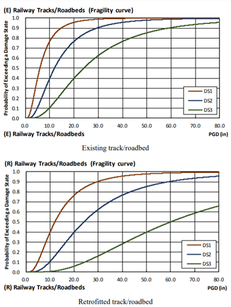
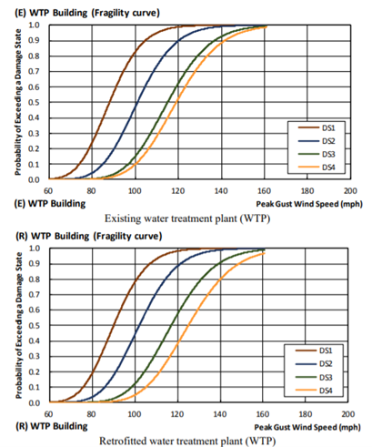
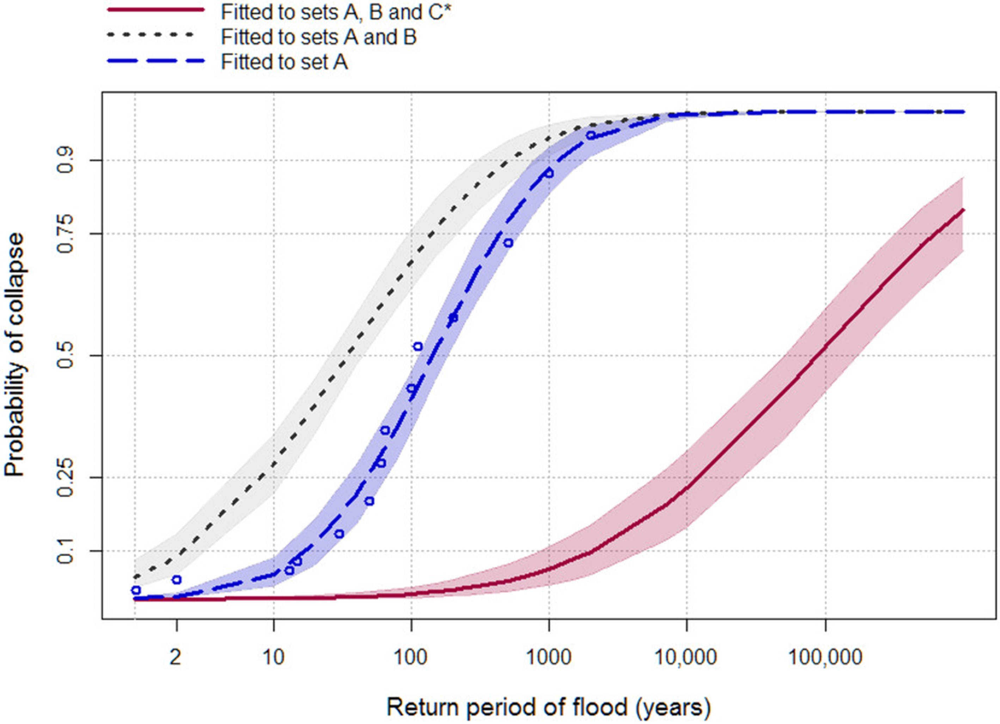
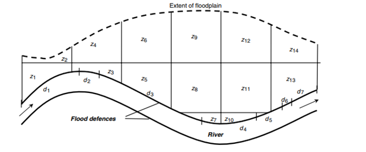
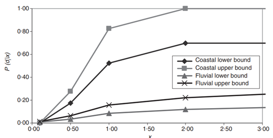

This mini-lecture discusses the concept of asset vulnerability, how
asset vulnerability can be formulated through fragility curves and the
applications of fragility curves for determining the risk of asset
failure.

# Learning objectives

-   To be able to quantify asset vulnerability as the likelihood of
    failure conditional to a given load via fragility curves
-   To recognise the generalisability of fragility curves for a range of
    different hazards and infrastructure asset types.

# Introduction

In the previous mini-lecture, the general concept of fragility and
vulnerability functions was introduced. Here we discuss some real-world
examples of fragility curves. In the literature, the most common hazards
for which such curves are created are earthquakes, cyclones and floods.
In this mini-lecture, we explain these curves for each type of hazard.

# Earthquake fragility curves

Seismic activity poses a significant risk to infrastructure. The main
measure for earthquake severity is Peak Ground Acceleration (PGA). There
is a lot of work on fragility analysis for earthquakes, which is used to
quantify the probability of failure or damage for a given load.

By comparing the probability of failure between assets with and without
protective works, one can compare the costs and benefits of protective
works.

Figure 10.2.1 shows a set of fragility curves for different damage modes
for railway bridge piers. The fragility curves are based on earthquake
fragility functions for railway tracks/roadbeds in the United States,
provided by @FEMA2013a. Damage modes describe the extent of damage,
with DS1 representing relatively minor damages and DS4 representing
complete asset failure.

Each plot compares the fragility curves for piers with (bottom) and
without (top) retrofitting. It can be seen that retrofitted tracks are
less likely to exceed each damage state for a given seismic load.

{width=100%}

**Figure 10.2.1:** Seismic fragility functions for railway
tracks/roadbeds [@WorldBank2019; @FEMA2013a].

# Cyclone fragility curves

Cyclones also impose a heavy burden on infrastructure, for which wind
speed is the main measure of hazard severity.

As for Figure 10.2.1, Figure 10.2.2 shows a set of fragility curves for
different damage modes, but this time for water treatment plants (WTP).
The fragility curves are based on wind fragility functions for buildings
similar to WTP building in the United States, provided by @FEMA2013b.
Note that in the absence of actual data on the fragility of WTP assets,
buildings that are considered to be suitable proxies for WTP buildings
are used.

By comparing the top versus bottom plot, it can be deduced that
retrofitting the plant -- for example, by improving the strength and
resilience of roof-wall connections - is highly effective for reducing
the likelihood of the DS4, or complete asset failure.

{width=100%}

**Figure 10.2.2:** Cyclone fragility functions for water treatment
plants [@WorldBank2019; @FEMA2013b].

# Example of a fragility curve for bridge scour and for a coastal defence

For flood hazards, flood extent return period maps and flood inundation
depth are the main measures of severity.

Figure 10.2.3 shows the likelihood of bridge collapse as a function of
flood return periods [@Lamb2019] based on historical datasets. In
contrast to the previous two examples, @Lamb2019 explore how the
fragility function output varies when considering different subsets of
historical data: (A) historical bridge failures with associated flood
event return periods; (B) historical bridge failures associated with an
unknown flood return period; and (C) bridges that are assumed not to
have failed.

The dark blue curve is fitted to set A. The light grey curve is fitted
to sets A and B. As evident, the grey curve illustrates that failure
probabilities increase compared to the dark blue curve when the
additional failure observations in set B are introduced, but the
dispersion also increases, reflecting uncertainty about the severity of
flood events experienced at those bridges. The red curve is fitted to
sets A, B, and C. Accounting for bridges that have not failed indicates
a much greater resilience than the curves fitted to the failure
observations alone. The shaded areas around each curve communicates the
uncertainty associated with the 95% confidence interval of the Maximum
Likelihood Estimate probability distribution.

{width=100%}

**Figure 10.2.3:** The three curves show the different outcomes for
calculating the likelihood of failure when considering different
datasets: (A) historical bridge failures with associated flood event
return periods; (B) historical bridge failures associated with an
unknown flood return period; and (C) bridges that are assumed not to
have failed [@Lamb2019]

# Multiple asset failures

The aforementioned examples make use of fragility curves to quantify the
likelihood of single asset failure. In the case where an extreme event
impacts multiple assets at once, it may be useful to consider the
likelihood of multiple asset failures. A flood defence structure
provides a clear example where it would be useful to consider possible
instances of multiple failures. The following example is taken from
[@Hall2003].

A flood defence structure can be thought of as being made-up of $n$
sections, $d_{1},d_{2},\ldots d_{n}$. The multiple sections of the
defence structure will be affected simultaneously by an extreme event.
Different instances of single or multiple sections breaching would have
difference consequences in terms of which zones would flood. Figure
10.2.4 illustrates a flood defence structure along a river and flood
impact zones, labelled $z_{1},z_{2},\ldots z_{m}$.

{width=100%}

**Figure 10.2.4:** Illustration of a flood defence system and flood
impact zones [@Hall2003]

Different flood impacts would result from different sections of the
flood defence failing, individually or in combination. Therefore, in
this instance, it would be important to consider the probability of
single and multiple sections of failing at once to understand the likely
extent of flooding.

As discussed, the probability of failure can be described using
fragility curves, see Figure 10.2.5, where the conditional probability
of failure event $D_{i}$ is provided for a given set of loads $x$.

$$1)\ P\left( D_{i} \right) = \ \int_{0}^{\infty}{p\left( x \right)\text{\ P}\left( D_{i} \middle| x \right)\text{\ dx}}$$

{width=100%}

**Figure 10.2.5:** Overtopping fragility curve used in national flood
risk assessment (fluvial and sea defence) [@Hall2003]

Thus, the probability of multiple sections failing can be given as:

$$2)\ P\left( D_{1} \cap \ D_{2}|x \right) = \ P\left( D_{1} \middle| x \right) \times \ P\left( D_{2} \middle| x \right)$$

The following mini-lectures 10.3 and 10.4 explore the phenomenon of
widespread losses incurred by hazards that affect a large area at once,
and the implications of this for aggregating asset-level risks at scale.

# Summary

This mini-lecture explored the applications of fragility curves for
analysing asset vulnerability to different kinds of hazards. It also
briefly discussed how such vulnerability assessments can be used to
assess the likelihood of multiple asset failures. You should now be able
to employ fragility curves for quantifying the likelihood of
infrastructure failures under different hazard loading scenarios.
