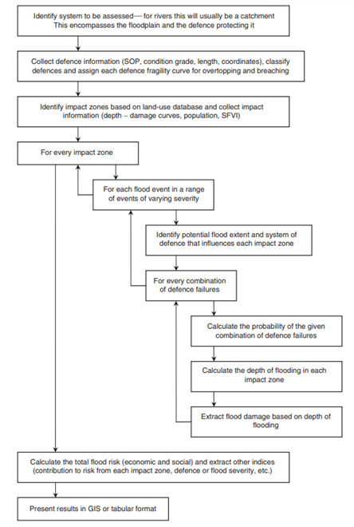
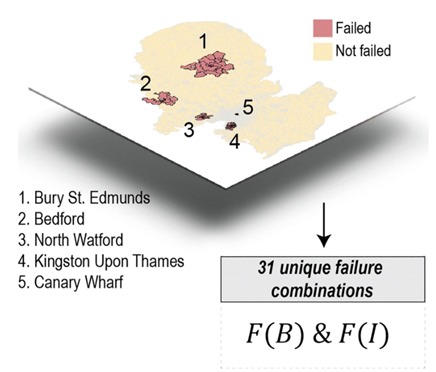
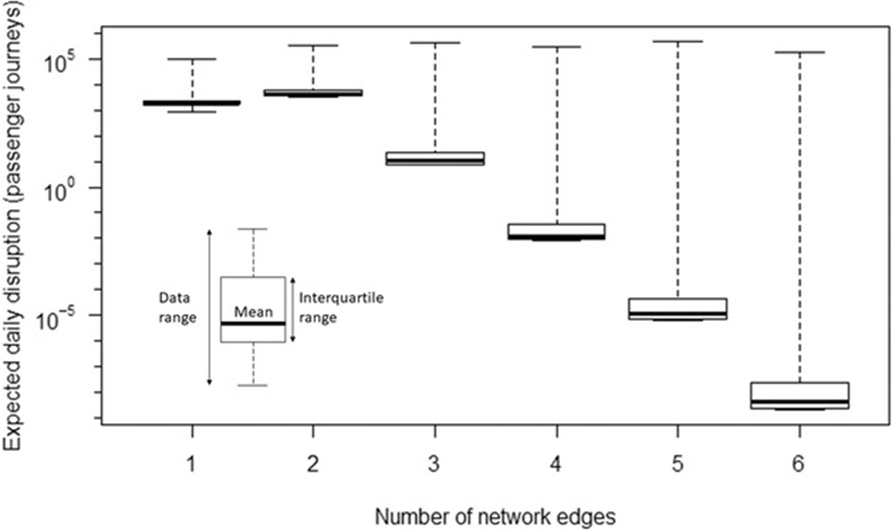

This mini-lecture explores three different examples of how the
likelihood and impacts of multiple infrastructure assets can be
disrupted simultaneously by large-scale hazards. The mini-lecture closes
with a discussion on the pros and cons of applying each of these
approaches.

# Learning objectives

-   To distinguish between different approaches that can be employed to
    analyse the risks of multiple infrastructure asset failures

-   To be able to evaluate the pros and cons of different approaches to
    different applications.

# Introduction

Hazards are often driven by large-scale weather processes that may
impact multiple infrastructure assets at the same time (see mini-lecture
10.3 for further discussion on this topic).

Analysing the likelihood and consequences of multiple assets failing
simultaneously would involve: (1) assessing asset vulnerability, (2)
quantifying the impacts of scenarios in which multiple assets fail, and
(3) quantifying the strength of spatial dependence between hazards (or
the likelihood of multiple hazards) at the multiple sites under
consideration.

This mini-lecture goes through three examples of research that accounts
for the risk of multi-asset failures:

1.  The first example discusses the overall method developed for a
    comprehensive flood risk assessment, from calculating asset-level
    vulnerability through fragility analysis, to understanding the
    impacts of combinations of failures of sections along a flood
    defence [@Hall2003].

2.  The second example illustrates a simplified approach for
    understanding the potential impacts of single and multiple failures
    of a small number of electricity substations [@Koks2019].

3.  The third example undertakes a rigorous assessment of the likelihood
    that hazards affect multiple assets simultaneously and the impacts
    of scenarios in which multiple assets fail. These are undertaken to
    calculate a system‐wide estimate for the risk of scour resulting in
    bridge failures [@Lamb2019].

# Overview of comprehensive risk assessment for flood events

Figure 10.4.1 provides an overview of a potential methodology for
calculating flood risk at a national scale [@Hall2003]. First, data
on the locations of floodplains and flood defences, along with important
characteristics, such as the land use type of the floodplain and the
condition and length of flood defences. Potential flood extent scenarios
are collected and assigned to their respective defence systems. The risk
of combinations of defence section failure are derived based on hazard
likelihood and severity (flood depth and extent) and the characteristics
of the floodplain (depth-damage relationship). The final step is to
aggregate the risk output for each floodplain to provide a national
picture of flood risk.

{width=100%}

**Figure 10.4.1:** Overview of method for national scale flood
assessment [@Hall2003]

Although the methodology includes an assessment of the potential
outcomes of multiple flood defence sections failing at once at
individual floodplains, the joint likelihood of flood hazards affecting
multiple rivers at once is not calculated. Thus, the aggregation of
risks (in term of expected annual damage) across all floodplains across
the country would be affected by the assumption of full dependence, as
discussed in mini-lecture 10.3.

# Simulation of multiple asset failures

@Koks2019 aim to estimate the extent of business disruptions and
economic loss caused by electricity failures and flooding in the UK. To
do this, they also analyse the extent of damages that would be incurred
if multiple electricity substations were to be damaged at the same time
due to a widespread flood event.

They identified five electricity substations that are exposed to a 1 in
1,000-year flood event. Because the number of assets under consideration
is relatively small (5), the computational burden of simulating the full
range of potential combinations of failures is not exhaustive. The study
simulated 31 unique failure combinations, ranging from failure of one
substation up to the failure of all five substations at once.

Figure 10.4.2 below shows a region of the UK, illustrating the location
of these substations and the spatial extent of the affected service
areas.

{width=100%}

**Figure 10.4.2:** The spatial extent of disruption that would occur as
a result of each of five electricity substations failing [@Koks2019]

The extent of disruption to business activities and economic losses
caused by these scenarios of single and multiple asset failures are then
quantified. This approach simplifies the analysis, as the likelihood of
different combinations of failure is not taken into account. However,
the scalability of this method is limited, as it would be
computationally inefficient to quantify the impacts of all potential
combinations of asset failure for a larger number of assets.

# Quantifying likelihood and consequence of widespread flood events

@Lamb2019 calculate a system‐wide estimate for the risk of bridge
failures caused by scour in the UK, by quantifying the likelihood of
passenger journey disruptions and associated economic consequences.

They do this in two stages. First, they quantify the spatial dependence
of flooding at the bridges under consideration using a spatial joint
probability model for extreme river flows for all river gauging sites in
Britain. This is then combined with a model for passenger journey
disruption in the event of a bridge failure.

Figure 10.4.3 represents the distribution of daily expected rates of
passenger journey disruptions caused by the flood-induced failure of
bridges on one railway line or combinations of up to six network railway
lines. The daily rate of passenger disruption attributable to the
failure of bridge(s) on a single railway line (network edge) is only
\~24% of the total risk, whereas risk of disruption caused by
combinations of multiple railway line disruptions is much greater, at
76% of the risk.

{width=100%}

**Figure 10.4.3:** The distribution of all disruptions identified in the
analysis with respect to the number of railway lines simultaneously
disrupted [@Lamb2019]

This example provides a comprehensive risk assessment of scour-induced
bridge failure on railway infrastructure. However, the study only
analysed a single type of asset (bridges) and the consequence for one
infrastructure sector (railway journeys). In the context of multiple
types of assets and multiple, interacting infrastructure systems (water,
electricity and transport) this would be significantly more complex.

# Discussion of different approaches

These examples provide an overview of different approaches for
addressing the problem of assessing multi-failure risks.

Although the first two examples do consider the scenarios of multiple
assets failing, neither quantify the joint probability of hazard loading
at multiple assets. @Hall2003 do consider the potential outcomes of
multiple flood sections failing at the scale of each floodplain,
however, the joint likelihood of flood hazards affecting multiple rivers
at once is not calculated when aggregating risks at the national scale.
For @Koks2019, given the small number of assets, it was possible to
simulate the full range of potential combinations of failures. The
limitation of this is that they do not analyse the likelihood of these
failure combinations.

In contrast, @Lamb2019 provide a comprehensive analysis of both the
likelihood and consequences (in terms of passenger disruptions) of
bridge failure due to large-scale flooding, however this would be
incredibly complex to undertake in the context of multiple
inter-dependent assets and infrastructure systems.

In summary, it is important to consider the complexity and computational
burden of simulating many combinations of failure. Isolating the most
likely potential combinations can be achieved by understanding the
spatial dependence between hazards (e.g. extreme river flows) through
joint-probability statistics. The consequences of the most likely
combinations of asset failures can subsequently be examined to provide
an estimate of risk.

# Summary

This mini-lecture described, evaluated and compared different ways to
analyse the likelihood and impacts of multiple infrastructure assets
being affected simultaneously by large-scale hazards. You should now be
able to distinguish between different approaches that can be employed to
analyse the risks of multiple infrastructure asset failures and evaluate
the pros and cons of each approach.
