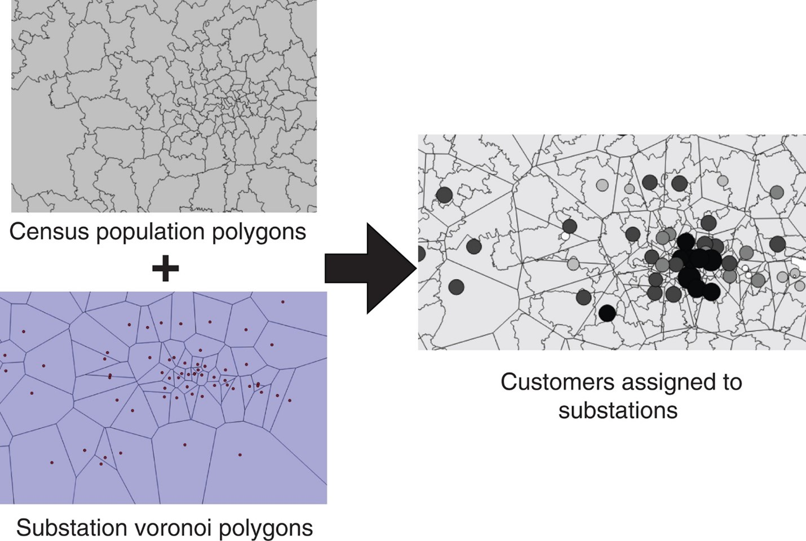
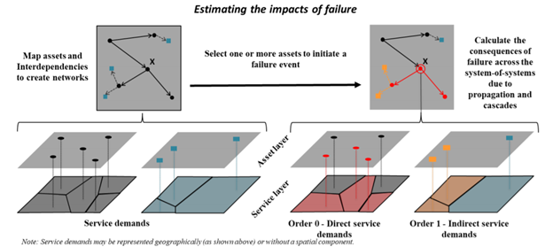
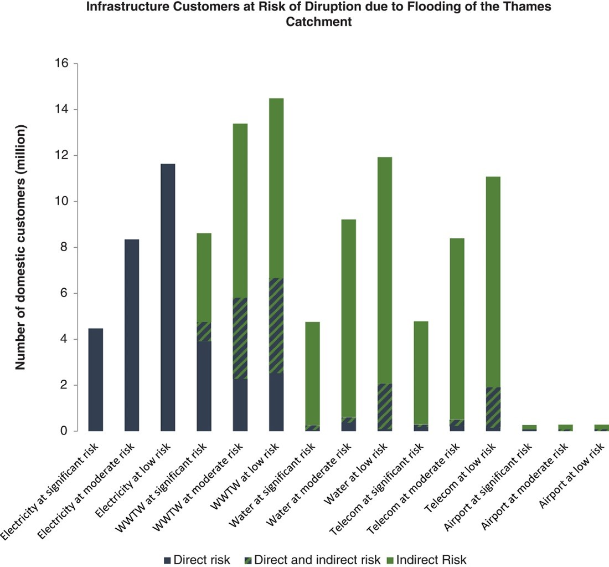

This mini-lecture covers how infrastructure disruptions affect people
who are dependent on infrastructure services. A method for calculating
the extent of people served by infrastructure assets, and hence exposed
to disruptions, at a large scale, is also described.

# Learning objectives

- To recognise society's direct and indirect dependence on infrastructure
- To be able to quantify the number of people affected by disruptions for large-scale analysis.

# Introduction

This mini-lecture explores the extent of infrastructure disruptions in
terms of the population affected. A widely used method for estimating
the population served for different infrastructure assets is described.
This is followed by an overview of how to include the population that is
indirectly served by assets via other infrastructure systems. The
implications of this for criticality analysis, and hence for guiding
adaptation measures, is then briefly discussed. Finally, a case study
that puts these concepts into practice to understand the population
directly and indirectly affected by flooding in the Thames catchment is
explored.

# Identifying which populations are served by infrastructure assets

At large scales, data on which infrastructure assets serve which
populations is largely unavailable. To overcome this, a technique that
involves spatially partitioning the population served by different
assets is often employed.

Voronoi polygons involve partitioning a plane with points
into [polygons](https://mathworld.wolfram.com/ConvexPolygon.html) such
that each [polygon](https://mathworld.wolfram.com/Polygon.html) contains
1) [one](https://mathworld.wolfram.com/ExactlyOne.html)
'generating point' and 2) points that are closer to its 'generating
point' than to any other. By drawing Voronoi polygons around each asset,
each asset is associated with a region within which all villages and
towns will be closer to that asset than to any other.

This process is shown in Figure 11.3.1, with a population layer being
overlaid with the Voronoi polygons dedicated to each electricity
substation. This ultimately indicates which customers are served by
which asset.

{width=100%}

**Figure 11.3.1:** Illustration of how populations can be divided
according to Voronoi polygons dedicated to each electricity substation
in order to estimate how many customers are served by each asset
[@Pant2018]

**Identifying which populations are indirectly served by infrastructure
assets**

The previous section shows how Voronoi diagrams can be used to allocate
the population served directly by each asset. However, certain assets,
such as electricity substations, may serve other types of infrastructure
systems as well, such as water.

Figure 11.3.2 shows how the populations that are directly and indirectly
served by infrastructure assets can be affected by disruptions. In the
top left graph, a network is drawn in black with dependent assets
belonging to another sector in blue. Below, the service demands
associated with each asset both in the first network (black) and the
dependent assets (blue) are identified by drawing Voronoi polygons. The
right-hand side of the figure illustrates what would happen in the event
of failure at asset X. Because X is connected to other assets in the
first network (red), which are in turn connected to two dependent assets
of another sector (yellow), the initial failure propagates to 4 more
assets. By understanding the extent of the service demand area
associated with each, the population disrupted both directly and
indirectly by the failure of asset X can be quantified.

{width=100%}

**Figure 11.3.2:** Illustration of how, by allocating the service demand
areas/populations served per infrastructure asset, one can estimate the
extent of direct and indirect disruptions to customers as a result of
asset failure [@Pant2020]

Evidently, the number of people served by the asset X is much lower than
the total number of people disrupted, highlighting the importance of
understanding the behaviour of infrastructure as an interconnected
network or system-of-systems.

# Consequences for criticality analysis and decision-making

The populations served both directly and indirectly by individual assets
provides an indication of the population exposed to asset failure, and
thus the criticality of different assets.

For example, the criticality of an electricity substation can be
calculated by combining:

1) The number of customers it serves directly (that are potentially
exposed to electricity asset failure) by assigning Voronoi polygons
to individual electricity substation assets; and

2) The number of customers that are served by other infrastructure
systems supplied by that electricity substation, such as gas, water,
wastewater and telecommunications infrastructure.

This metric can be used to guide decision-making by prioritising the
most 'critical' assets for improvement works.

# Putting it into practice

This was put into practice by [@Pant2018] in the Thames catchment.
The number of domestic customers exposed to the direct flood-induced
disruption for a range of infrastructures, from electricity to water to
telecoms, as well as to asset disruption caused indirectly by flooding
as a result on network connections, was calculated.

Figure 11.3.3 shows the result of this work. It is particularly striking
to see the additional number of people indirectly exposed to electricity
disruptions via water supply, wastewater and telecommunications
infrastructure disruptions.

{width=100%}

**Figure 11.3.3:** Number of domestic customers directly and indirectly
exposed to the direct flood-induced disruptions for a range of
infrastructure sectors in the Thames catchment [@Pant2018]

Disruptions to infrastructure services not only affect people, but also
affect various economic activities. This will be explored in the
following section.

# Summary

This mini-lecture discusses the disruptions that infrastructure failures
impose on dependent populations. You should now recognise society's
direct and indirect dependence on infrastructure and be able to estimate
the number of people that would be affected directly/indirectly by
disruptions.
