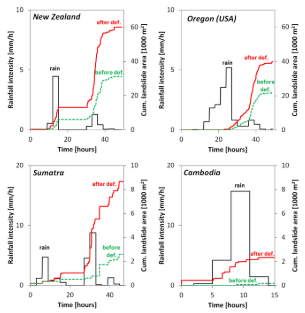

This lecture introduces the future challenges faced by decision-makers
when planning long-term infrastructure projects. It describes four
drivers that can influence risk in the future: (1) climate change, (2)
environmental change, (3) socio-economic change and (4) changes in
societal dependencies on infrastructure.

# Learning objectives

-   Understand how risk has changed over time
-   Identify the different drivers of changing risk
-   Learn what dependencies and feedbacks exist between infrastructure
    and society.

# Introduction

We have seen in the previous lectures that risk is defined as the
interplay between the hazard, the population and assets that are
exposed, and the vulnerability of the exposed population and assets to a
hazard. Therefore, risk is not static, but constantly changing over
time. For instance, Figure 12.1.1 shows the change in global number of
hazards occurring, showing a clear rise in the total number of hazards
[@owidnaturaldisasters].

Given the large time span of infrastructure investments, which can have
lifetimes of 50 years or more, decision-makers need to take scenarios of
changing risk factors into account when designing an infrastructure
system. Underestimating future risk might lead to infrastructure systems
that are under designed, both in use and engineering design, which leads
to rapid deterioration or failure of the asset. On the other hand,
overestimating future risk might cause infrastructure systems to be
overdesigned, resulting in more money being spent than is needed. Hence,
understanding and quantifying the drivers of future risk is imperative
for decision-makers to justify and inform investment decisions.

In this lecture we will briefly introduce the four main drivers of
change in future risk:

1. Changes in the climate which may cause the frequency and
magnitude of hazards to change
2. Changes in the environment which may cause the frequency and
magnitude of hazards to change
3. Changes in the use of existing infrastructure systems and need
for new infrastructure systems due to socio-economic changes
4. Changes in societal dependencies with regards to infrastructure.

{width=100%}

**Figure 12.1.1:** Global reported natural disaster by type between
1970-2019 [@owidnaturaldisasters]

# Introduction to climate change

We start by looking at how climate change might affect the frequency and
magnitude of the hazards. Some hazards are more sensitive to changes in
the climate than others; for instance, a change in the frequency of
heatwaves is directly influenced by changes in the average temperature,
whereas changes in hurricane activity do not follow such a linear
relationship.

How the frequency and magnitude of different hazards change is often
non-intuitive. For instance, for tropical cyclones, it was found that
anthropogenic warming is causing the most intense cyclones to become
more frequent [@Elsner2008]. In addition, it may vary from place to
place. For example, based on 50 years of flood data for Europe
[@Bloschl2019] found that climate change has increased the flood
hazard in some areas while it decreased in others. How climate change
has shifted the river flood timing might differ considerably per
regions, as shown in Figure 12.1.2. In some areas, earlier snowmelt
causes floods to change. In other areas, it is because of shifts in the
arrival of winter storms or because of an increased saturation of the
soil. Therefore, how climate change may affect flooding is region
specific and needs localized analysis in order to capture this.

In mini-lectures 12.2-4, we will investigate this problem in more detail
and illustrate how to model future hazards.

{width=100%}

**Figure 12.1.2:** The change in river flood timing for Europe over the
period 1960-2010, including the four hotspot areas
[@TheIrishTimes2017]

# Introduction to environmental drivers

Apart from changes in the climate system that might affect the
occurrence of natural hazards, changes in environmental factors can also
influence the hazard. This is often associated with either human-induced
or natural change. Two examples of human-induced changes are the
conversion of natural land to built-up areas and the deforestation of
natural landscapes.

Between 1985 and 2015, global urban extent had expanded by around 10,000
square kilometres a year [@Liu2020]. Therefore, initially vegetated
areas with permeable surfaces have been transformed to impermeable
surfaces. This generates a large difference in flood occurrence, for
both pluvial and fluvial flooding. Flood waters that were initially
slowed down and partially buffered by the natural environments now run
off quickly and in larger volumes. In the Linghua Basin in China, for
instance, researchers found that urban expansion over the past 30 years
has increased the peak flood volume by 162% [@Du2015].

On top of the expansion of urban areas, a lot of land has been
deforested, mainly due to the growth of agricultural cropland
[@Curtis2018]. Deforested areas, in particular those located in areas
with steep surface slopes and high rainfall, are prone to landslides.
Research, for instance, showed that large-scale deforested areas are
associated with a large increase in the landslide area in different
regions globally [@Lehmann2019]. This is shown in Figure 12.1.3,
illustrating how extreme rainfall events initiate landslides before and
after deforestation happened [@Lehmann2019].

These two examples highlight that changing land-use patterns might have
unintended consequences on the occurrence of hazards.

{width=100%}

**Figure 12.1.3:** The effect of deforestation on the occurrence of
landslides in four regions worldwide [@Lehmann2019]

# Introduction to socio-economic growth

The spatial locations of assets, and how society depends on these
assets, determines the extent to which assets and populations are
exposed to the adverse impacts of natural hazards. However,
socio-economic growth, meaning population growth and changes in wealth,
can increase this exposure due to: (1) increase in use of existing
infrastructure services, (2) need for new infrastructure systems.

If this growth is happening in hazard-exposed regions, such as
floodplains, future risk might increase rapidly. It has been shown, for
instance, that current trends in increasing global flood losses are
mainly associated with socio-economic growth in hazard-prone areas
[@Tanoue2016].

The socio-economic growth can be further disentangled into three
underlying drivers.

-   **Population changes:** New urban areas are created in hazard prone
    areas leading to an increased exposure. This gives rise to new
    infrastructure provision in expanding areas.

-   **Economic growth:** Economic growth increases the value of assets
    at risk.

-   **Changing living standards:** Changes in living standards influence
    the use and need for existing and new assets. For instance,
    connecting initially unconnected households to the electricity and
    water network increases the total population dependent on such
    services.

Often these changes occur in tandem; rapidly growing economies see an
increase in population and wealth in existing and newly developed urban
areas that demand more infrastructure services. Figure 12.1.4 shows the
rapid urban expansion in multiple cities between 1975 and 2015, showing
how cities are expanding in different ways.

{width=100%}

**Figure 12.1.4:** The urban expansion over time for cities in Sri
Lanka, Viet Nam, China, Bangladesh, Israel, Pakistan [@EspaceMondial]

# Introduction to infrastructure dependencies

The aforementioned drivers of risk are mainly external drivers, meaning
that external processes determine whether an area or asset will
experience more or less risk. However, infrastructure expansion itself
may also initiate changes in risk. More specifically, infrastructure
provision may cause shifts in the societal dependencies on these
infrastructure assets. One example to illustrate this is called the
'reservoir effect'.

@DiBaldassarre2018 describe how the benefits from the construction of a
reservoir can be quickly offset by two processes. First, increasing the
water supply in an area can stimulate the consumption of water, thereby
offsetting the intended increase in water storage. Second, the
construction of a new reservoir can cause an over-reliance on this
infrastructure, resulting in a larger societal disruption if this
reservoir is affected by a drought. This process is illustrated in the
Figure 12.1.5 below, showing that increasing the reservoir storage and
water supply can lead to an increasing dependency and vulnerability when
the reservoir levels are low, resulting in larger economic damages.

{width=100%}

**Figure 12.1.5:** A schematic diagram of the reservoir effect as a
result of positive feedback processes between infrastructure and
society, which can increase the vulnerability of the dependent
population [@DiBaldassarre2018]

# Summary

In this lecture, we have given a brief introduction to how risk changes
over time and identified the four main drivers of future hazard risk.
