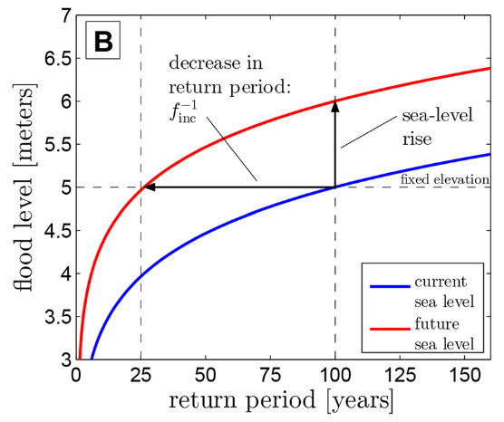
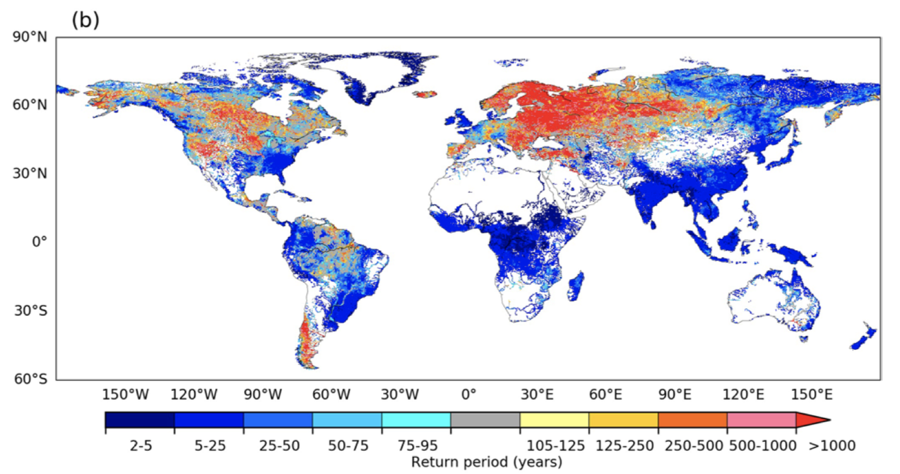
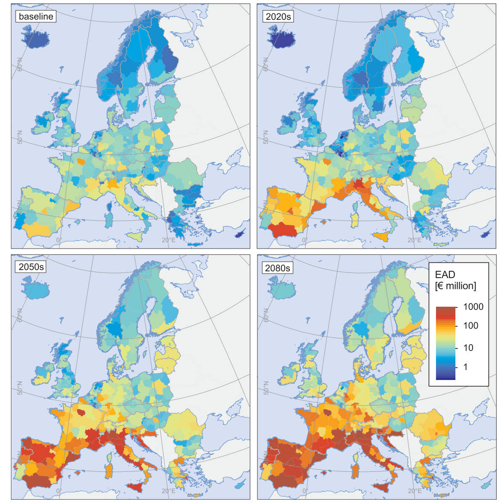
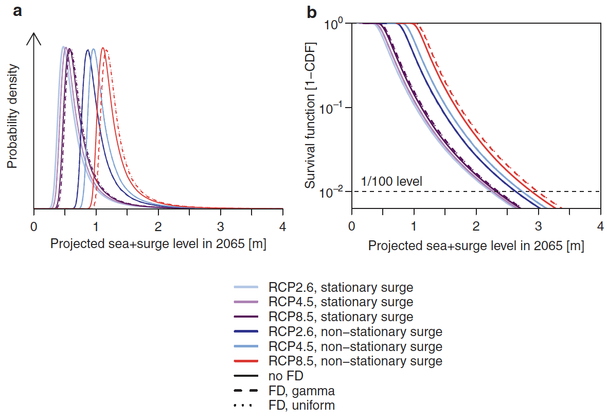

In this lecture we will discuss how climate model outputs can be used to
predict future changes in hazards that can impact infrastructure. We
will distinguish between short-term extreme events (flooding,
hurricanes, storm surges, landslides) and more long-term chronic changes
(temperature rise, sea-level rise).

# Learning objectives

-   Understand how climate change might change the occurrence of hazards
-   Summarise how infrastructure exposure can change in the future
-   Evaluate what the different uncertainties are when predicting future
    hazards.

# Introduction

In mini-lecture 12.2, we identified that climate change might alter the
occurrence of hazards in the future. When evaluating changes in future
hazards we often distinguish between changes in the frequency and the
magnitude of events. This can be illustrated using the example of
changes in the occurrence of coastal flooding due to sea-level rise, as
shown in in Figure 12.3.1 [@Vitousek2017].

Some key concepts to define include:

-   **Frequency:** Frequency changes describe the increase or decrease
    of the occurrence of an event with a certain magnitude (horizontal
    line in Figure 12.3.1). In this example, a 100-year event becomes a
    25-year event, meaning that the frequency increases by a factor
    four.

-   **Magnitude:** Magnitude changes describe the increase or decrease
    of the severity of an event with a certain frequency (vertical line
    in Figure 12.3.1). In this example, the magnitude of a 100-year
    event changes from 5m to 6m (increases by 20%).

In addition, we often differentiate between changes in the occurrence of
short-term extreme events and more long-term chronic changes. For
instance, climate change might affect the frequency of extreme rainfall,
leading to more intense flooding. On the other hand, a rise in mean sea
levels will slowly increase the salinity levels in tidal areas.

Therefore, the way we account for climate change in our modelling
framework depends on the hazard under consideration. Before starting
infrastructure design, it is important to identify what hazards are
affecting your infrastructure system and how the underlying drivers
might change in the future.

{width=100%}

**Figure 12.3.1:** The change in frequency (horizontal line) and
magnitude (vertical line) of different return periods of coastal
flooding [@Vitousek2017]

# Hazard sensitivity to climate change

Some hazards are more sensitive to climate change than others. This
reflects the differences in the underlying physical processes that drive
the hazard, and to what extent an increase in the global mean
temperature can change these processes.

Heatwaves and wildfires are directly influenced by changes in global
mean surface temperature, and hence scale almost linearly with an
increase in the temperature.

On the other hand, floods and droughts are mainly driven by changes in
precipitation patterns. In general, wet places are expected to get
wetter, and dry places are expected to get drier. Total precipitation
values are, however, unevenly distributed, with a few very wet days
contributing to most precipitation. Climate projections show that
precipitation may become even more uneven in the future. For instance,
one fifth of the projected increase in rainfalls occurs during the two
wettest days of the year [@Pendergrass2018], thereby changing
patterns of floods and droughts.

How climate change may alter the occurrence of tropical cyclones is
harder to predict, given the complexity of physical processes at play.
These processes cannot be resolved in the current climate models. Rising
temperatures will increase the moisture content available to fuel
tropical cyclones, making it likely that they will be more intense
[@Knutson2020].

Storm surges from tropical cyclones are likely to increase because of
the increase in sea-levels. At the moment, global mean sea-level rise is
estimated at around 3mm per year [@Nerem2018].

Earthquakes are unaffected by climate and will not change in the future
because of climate change.

# Expected changes in hazard occurrence

We will discuss some of the mean trends identified in the literature on
expected changes in extreme hazards. These estimates are derived by
using the output from climate models and including them in a hazard
model.

-   Hirabayashi et al. analysed changes in frequency of flooding for the
    21^st^ century (see Figure 12.3.2) by comparing the changes in
    100-year return period. A larger increase in flood hazard (lower
    return period) is found for Asia, Africa and South America, while
    parts of Europe will experience less frequent floods
    [@Hirabayashi2021].

-   Sea-level rise will make coastal flooding more likely. In most areas
    a doubling of flood frequency is expected, while in some areas (e.g.
    Tropics) a doubling of flooding is already expected in 2050
    [@Vitousek2017].

-   Changes in tropical cyclones are harder to predict. Currently, it is
    expected that the global frequency of occurrence of tropical
    cyclones will either decrease or remain unchanged, while wind speed
    and precipitation rates are expected to increase [@Knutson2020].

-   How droughts might change depends on the definition of a drought
    adopted. An increasing frequency of drought is expected over large
    land areas resulting from either decreased and/or increased
    evaporation [@Dai2013].

-   Landslides might also become more frequent due to the increase in
    intense precipitation events. For instance, a recent study showed
    that landslide activity in China and Nepal could see a 30 to 70%
    increase in the future [@NASA2020].

{width=100%}

**Figure 12.3.2:** The multi-modal mean change in the global 100-year
flood return period over the 21^st^ century for Representative
Concentration Pathway (RCP) 8.5 [@Hirabayashi2021]

# Future infrastructure exposure

Using the modelled hazard output, we can project the increase in the
exposure and risk of people and infrastructure in the future due to
climate change alone. These numbers assume that the current population
and amount, value and use of infrastructure remains unchanged.

The number of people exposed to future river flooding may increase 7-14
times over the 21^st^ century [@Hirabayashi2013], while the number of
people exposed to coastal flooding is projected to increase 2.5 times by
2100 [@Kulp2019].

Infrastructure exposure will also increase dramatically. For instance,
sea-level rise will threaten cargo flows in ports in Europe and put 900
million tonnes of goods at risk [@Christodoulou2018], while also
increasing the risk of disruptions to global airline ports by a factor
of 17-69 by 2100 due to the inundation of major low-lying airports
[@Yesudian2021].

What hazard will cause the largest rise in risk depends on the type of
infrastructure and the location. In Europe (see Figure 12.3.3), for
example, it is found that the damage to critical infrastructure (energy,
transport, industry, and social) will likely increase 10-fold by the end
of the century, leading to EUR3.4 billion damages per year
[@Forzieri2018]. Drought and heatwaves are the largest drivers in
south Europe, while coastal flooding is the strongest driver overall.
The damages from river flooding, wind storms and wildfires also
increase, but are more region-specific. Figure 12.3.3. shows the
evolution of expected annual damages over time and the geographical
distribution of infrastructure damages.

{width=100%}

**Figure 12.3.3:** The expected annual damages to infrastructure assets
for multiple hazards. The figures show the baseline scenario and the
change in risk for 2020, 2050 and 2080 [@Forzieri2018]

# Future hazard uncertainties

As discussed, the way in which climate change affects hazard occurrence
can be projected using climate scenarios that feed into climate models.
The climate model outputs can then be incorporated into a
hazard-specific model to predict future hazard frequency and magnitude.

Uncertainties accumulate throughout this process. We can distinguish
between three sources of uncertainty:

1.  **Scenario uncertainty:** Differences between the RCP scenarios over
    time

2.  **Climate model uncertainty:** Differences between the climate model
    results

3.  **Knowledge uncertainty:** Additional uncertain factors that are not
    yet properly accounted for in climate scenarios and models.

Below is an example showing the importance of these three sources of
uncertainty for future hazard prediction [@Wong2017].

Figure 12.3.4 shows future sea-level rise + surge values (2065 relative
to 1986-2005) that are used for upgrading a coastal defence structure in
Louisiana, United States. Looking at the thick lines, there is a large
scenario uncertainty; the peak of RCP2.6 is around 0.5m whereas for
RCP8.5 it is 1.3m. Second, the spread of the distribution function
(representing the model uncertainty) determines the shape of the tail,
which is in the end what we are interested in. Thirdly, the potential
increased rise from rapid Antarctic mass loss ('fast dynamics', FD) was
tested, and shows a shift in the distribution curves (dashed lines). For
RCP2.6, no change is visible, whereas for RCP8.5 the peak of the
distribution shifts to the right. The example highlights the sources and
magnitude of climate change uncertainties that need to be considered for
infrastructure design. In Lecture 14 we will come back to this.

{width=100%}

**Figure 12.3.4:** The probability density functions (left) and survival
functions (right) of the expected sea-level rise in 2065 in Louisiana
(United States). The different curves reflect the different climate
scenarios, the model spread and additional uncertainties surrounding the
rapid disintegration of the Antarctic ice sheet (FD) [@Wong2017]

# Summary

In this lecture we have discussed how to use the climate scenarios and
climate models to predict the future occurrence of hazards and the
resulting exposure of infrastructure. Moreover, we have summarised the
three main sources of future hazard uncertainty.
