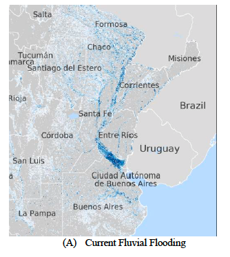

In this lecture we will go through a detailed example on how to include
future climate change in risk analysis. This lecture illustrates the
output that can be generated using the model framework for
infrastructure risk analysis introduced in previous lectures.

# Learning objectives

-   Learn how climate change can influence risk to assets in different
    ways
-   Identify infrastructure risk hotspots
-   Explain how a future climate risk assessment can inform adaptation.

# Introduction

In this lecture, we will go through a detailed example of incorporating
future climate change projections into infrastructure risk analysis. We
will look at how climate scenarios were integrated in hazard modelling
and how it can inform the changes in future risk, how this change in
risk materialises for different assets and regions within a country.
Moreover, we look at two resilience options: improving the asset
engineering standards, and facilitating more efficient re-routing
options in the country's transport system.

The case study used here is the risk analytics performed for the
transport infrastructure network of Argentina [@Pant2019]. In this
study, the nation-wide road (bridges and roads), rail (bridges and rail
lines), waterways and airline transport networks were considered. Using
the methodology described in Lecture 9, flows, expressed in either
tonnage freight or passengers, were allocated to the transport network.
This represents the service provided by the individual assets (see
Figures 12.4.1 and 12.4.2 below). These infrastructure services are also
used to understand the network level response of asset failure; if a
local road is disrupted, some/all of the freight can be re-routed to
other road networks.

As evident in Figure 12.4.1 and 12.4.2, most of the infrastructure is
concentrated in the urban areas in the east and north of the country.
This is particularly evident in the rail network. For this case study,
we will focus on the flood vulnerability of transport infrastructure,
since flooding, both pluvial and fluvial, are considered the major
hazards disrupting the transport infrastructure.

{width=100%}

**Figure 12.4.1:** Argentina's national road and railway networks,
including the tonnage of freight allocated for the different assets
[@Pant2019]

{width=100%}

**Figure 12.4.2:** Argentina's national waterways and airport networks,
including the tonnage of freight allocated for the different assets
[@Pant2019]

# Future hazard scenarios

As mentioned, in this mini-lecture we look particularly at flooding of transport infrastructure assets. For this purpose, flood hazard maps for ten return periods were adopted (ranging between 5 and 1,000-years). In this example, we will mainly focus on river flooding. The flood maps include flood extent and the inundation depth.
To account for future changes in river flooding, the output of 32 Global Climate Models (GCMs) from the CMIP5 model ensemble was used. The 2050 time horizon was adopted in this study across two Representative Concentration Pathway (RCP) scenarios (RCP4.5 and RCP8.5).
The approach taken to simulate future flooding is a so-called scenario-neutral approach. Instead of running detailed flood simulation for all 32 GCMs at a high-resolution (and on a national level), two plausible scenarios are described that are in line with the majority of climate models. These scenarios are based on the expected change of the future 5-day maximum precipitation changes for 2050, which is a good proxy of flood occurrence, and then compared to the baseline (1986-2005).
Two plausible scenarios were created, called the ‘Future Median’ scenario (+6%) and a ‘Future High’ (+12%) scenario, based on the climate model output. This was used to scale the flood extent and inundation depth. For smaller case studies, more scenarios can/should be considered to explore the uncertainty in more detail.
An example of the current 1 in 1,000-year river flood map is shown in Figure 12.4.3, with the intensity of the colour indicating the inundation depth.

{width=100%}

**Figure 12.4.3:** An example of fluvial inundation in the baseline scenario for the north of Argentina [@Pant2019]

# Future infrastructure exposure

By overlaying the current and future hazard maps with the transport
network, insights can be gained on the changes in the exposure of the
infrastructure assets. Critically, the change in exposure differs per
return period (see Figures 12.4.4 and 12.4.5).

For the road network, the changes in roads exposed for the 10- and
100-year return periods equal +8.8% and +5.6% in the Future Median (FM)
scenario, respectively, and up to 18.2% and 11.6% in the Future High
(FH) scenario, respectively. Similar values are found for the rail
network; the length of the rail lines exposed to the 10- and 100-year
return periods increases by 9.2% and 8.9% in the FM scenario,
respectively, and by 19.6% and 11.5% in the FH scenario, respectively.
In short, the consequences of a medium extreme event (10-year) are
changed more than for a very extreme event (100 year), which is critical
to include in the risk analysis.

The change in the exposure of maritime ports and airports is more
trivial. For ports, for instance, only changes in the very extreme
return periods cause an increase in flooding to the port infrastructure.

The changes in the hazard exposure for roads and rail networks for the
FH scenario (10- and 100-year return period), aggregated to the
department level in Argentina, are illustrated in Figures 12.4.4 and
12.4.5.

For the road network (top), it can be seen that there is a relatively
small (0-10%) increase in exposure which is uniform across areas, with
some locations that have a decrease in exposure. For rail however, the
changes are more concentrated, and some areas experience a very large
increase in risk (\>100%). Hence, apart from looking at the aggregate
numbers, understanding the spatial exposure changes is critical.

{width=100%}

**Figure 12.4.4:** The percentage change in road exposure for a 10-year
event and a 100-year event, aggregated to a department level
[@Pant2019]

{width=100%}

**Figure 12.4.5:** The percentage change in railway exposure for a
10-year event and a 100-year event, aggregated to a department level
[@Pant2019]

# Future economic losses

Next, we consider the consequences of disruptions to the exposed
transport assets. Without going into detail of disruption analysis, a
step-wise procedure was followed: every asset was disrupted
individually, and the potential re-routing options were considered.
Re-routing resulted in increased transportation costs. If re-routing is
not possible, a supply disruption to businesses is modelled, resulting
in a reduction of production and economic output. The combined effect of
analysis is the potential economic loss associated with the failure. The
results of the impact analysis are combined with the probability of the
asset being flooded for the current and future scenarios.

Figure 12.4.6 shows the change in expected annual economic loss (EAEL)
for the rail network under the FH scenario. Now we can see on an
individual asset level how the risk of service delivery changes. Some
clear hotspots can be identified with the dark red colour, while there
are also some sections that are expected to become less at-risk (green).
A similar figure for the national road bridges is shown in Figure
12.4.7, again with clear hotspots of changing asset risk, in particular
in the densely populated areas of Argentina.

Identification of these asset hotspots allows us to identify what assets
are likely to need upgrading in the future, in particular given budget
constraints. Moreover, this asset-level analysis also allows us to
evaluate the benefits of resilience measures on an asset level.

{width=100%}

**Figure 12.4.6:** The percentage change in expected annual economic
losses to railway assets by 2050 [@Pant2019]

{width=100%}

**Figure 12.4.7:** The percentage change in expected annual economic
losses to road bridge assets by 2050 [@Pant2019]

# Final considerations

We have considered the different aspects of performing a future climate
risk analysis using Argentina as a case study. Some lessons learned from
this are:

-   The number of future scenarios to consider depends on the spatial
    scale and the level of detail of the analysis. In this study, it was
    only realistically feasible to use two scenarios. However, for more
    local studies, or less detailed analysis, the whole ensemble of
    climate models and scenarios can be explored. We will investigate
    the benefits of considering a greater number of plausible scenarios
    in mini-lectures 14.2 and 14.3.

-   How climate change may increase the likelihood and magnitude of
    hazard occurrence, in this case river flooding, is very location
    specific, even within a country. Therefore, the change in risk may
    differ considerably between infrastructure networks, and between
    individual assets within an infrastructure network. In fact, the
    results showed that some assets experience an increase in risk while
    other experience a decrease. Moreover, we saw that for road and rail
    infrastructure, a similar increase in exposed assets was found
    across different return periods, whereas for ports, only the very
    high return periods changed the exposure of the assets.

-   In terms of the economic losses, the changes in risk are even more
    asset specific. Therefore, the benefits of performing a nation-wide
    risk analysis, but on an asset level, to identify the most at-risk
    assets to future change are clearly demonstrated. This type of
    analysis is the backbone for evaluating the benefits of different
    types of interventions to improve resilience (mini-lecture 14.1).

# Summary

In this lecture, we went through a detailed example of how to perform
and analyse future climate risk to infrastructure assets on a national
scale. It describes the results that can be expected as well as the
approaches to identifying infrastructure risk hotspots.
