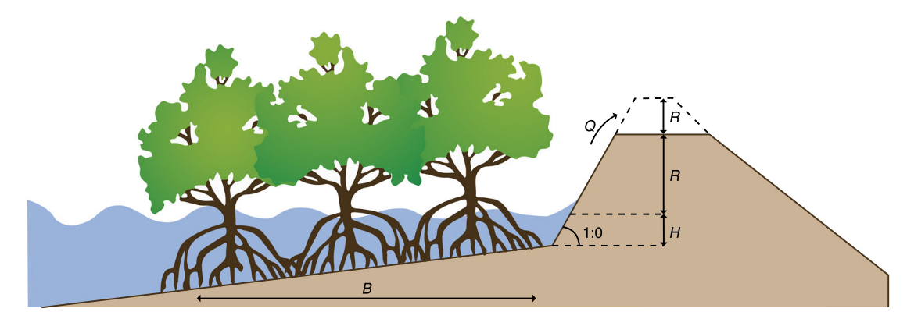
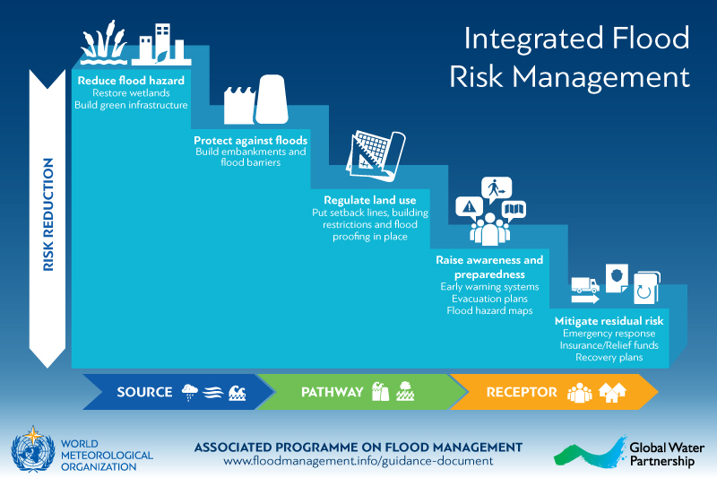
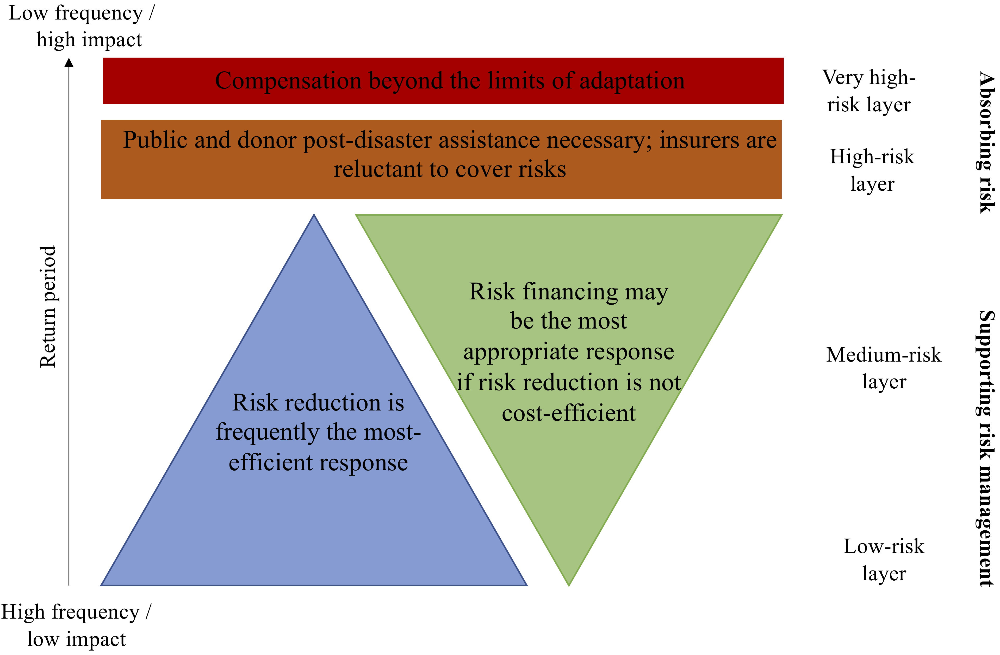
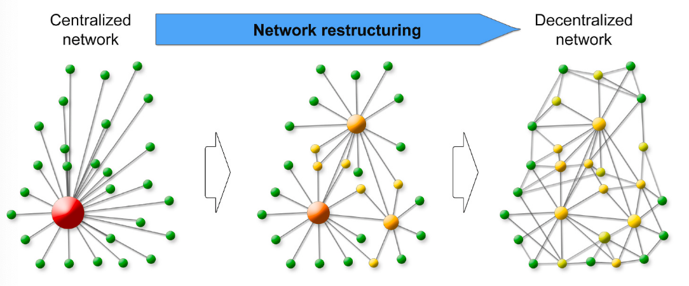
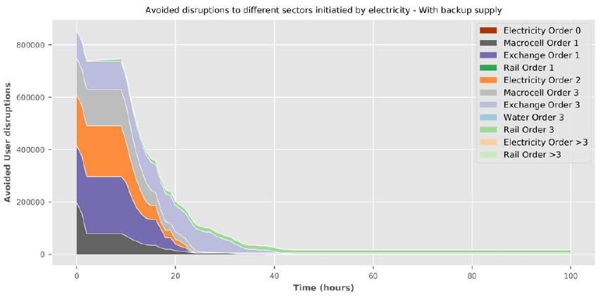

In this lecture we will discuss the various ways in which resilience can
be improved through the use of targeted interventions. A distinction
between the type of interventions and their ability to reduce risk will
be discussed. In addition, we introduce ways to reduce systemic risk.

# Learning objectives

-   Compare and contrast different types of interventions to improve
    resilience
-   Identify how interventions can reduce risk in different ways
-   Describe how to improve the resilience of infrastructure networks.

# Introduction

In the previous lectures, it was shown that risk is increasing over time
and will likely increase in the future due to the combined effect of
climate change and socio-economic growth. Therefore, decision-makers
have implemented various ways of enhancing resilience, both to reduce
the physical asset damages and to improve network-wide resilience. In
this lecture, we will briefly discuss both of these resilience options.

To reduce physical asset damages, a variety of interventions can be
implemented. These interventions are often characterised as either
structural or non-structural solutions.

Structural solutions (also known as engineered solutions) often refer to
any physical construction to reduce or avoid the impacts of hazards.
Structural solutions can be further subdivided into hard and soft
structures. Examples of hard structural solutions are embankments,
floodproof housing, reservoirs, shelters, etc. Soft solutions, however,
are interventions like mangrove restoration and artificial nourishments,
which involve providing a natural buffer to reduce risk.

More recently, the term 'hybrid solutions' has been coined, which
combines hard and soft measures. For instance, mangrove restoration in
front of an embankment can reduce the elevation of the coastal
embankments (see Figure 14.1.1) because of the wave dampening effect of
mangroves (see mini-lecture 16.2 for more information). Moreover, the
combination of beach nourishment with a seawall can reinforce both their
functionalities, with the nourishment buffering small storms, while the
seawall would only be used during very severe events.

Non-structural solutions involve the use of policies, awareness and
post-disaster support to reduce hazard risk. Examples are building
codes, land-use planning, public awareness and emergency preparedness
programmes and insurance.

{width=100%}

**Figure 14.1.1:** An example of a hybrid solution in which mangrove
reforestation in front of embankments can allow reduced embankment
height [@Jongman2018]

# Risk cascade

In practice, interventions are not implemented in isolation. Often a
portfolio of structural and non-structural interventions is designed,
aimed at reducing risk [@Jongman2018]. How different interventions
complement each other can be easily demonstrated through the so-called
'risk cascade', which looks at the sequence of how interventions can
reduce risk, either at the source, the pathways of impact, or the
receptor.

{width=100%}

**Figure 14.1.2:** The risk cascade for flood risk management
[@APFM2020]. Interventions that reduce the hazards, such as wetland
restoration or mangroves, are found at the top (the source). Protection
measures (e.g. embankments) reduce the hazard and exposure of assets.
Land-use planning does not influence the source of the hazard much, but
does influence the exposure of assets. Finally, awareness and
preparedness systems and interventions targeted at reducing residual
risk (e.g. insurance, recovery) mainly help the receptors of the hazard
to become less vulnerable or may help them recover quickly.

It has been recognised that relying on a single cascade will not be
efficient in reducing risk. For instance, wetlands might buffer small
events, but not very severe events. On the other hand, solely relying on
structural measures might make a disaster very severe when it happens,
because there is a lack of awareness and preparedness for such an event.
A well-designed portfolio of risk and resilience measures therefore
combines interventions from different cascades.

# Risk layering

The balance between different interventions within a portfolio depends
on the local risk setting. A good way to look at this is through the
'risk layering' concept [@Mechler2014].

Risk layering can help to differentiate between different levels of
risk, in terms of the probability of occurrence, and the degree of
stress imposed by the risk. It can help the design of risk management
strategies that are effective for low-, medium- and high-probability
events, taking the absorption capacity of communities and governments
into account. This framework can be applied for a specific hazard or
across hazards.

For frequent low-impact events, hazard reduction, protection and
land-use planning measures are often most efficient. For medium-layer
risks, the interventions to reduce risk in the sources and pathways (see
above sub-section) should be combined with insurance and other financial
instruments to cope with the residual risk. For very rare and
catastrophic events, public and international assistance is necessary,
including donor assistance for low-income countries.

For infrastructure systems, a similar concept can be applied.
Engineering design standards often help protect a road or power plant
against frequent events. However, during very extreme events that result
in damage or shutting down of infrastructure systems, it is important to
have a financial buffer available to quickly recover and reconstruct the
infrastructure system after failure. This should be combined with
insurance in order to avoid overwhelming the financial coping capacity
of governments. Hence, stress-testing exercises are extremely helpful to
understand system response to different risk layers.

{width=100%}

**Figure 14.1.3:** The risk layering concept with the return period on
the left and the balance of risk reduction and risk financing in the
middle. It emphasises that different risk and resilience strategies need
to be targeted for different types of events [adapted from
@Mechler2014].

# Improving network resilience: Theory

The unique nature of infrastructure systems means that a single node
failure has the potential to cause far-reaching systemic impacts. The
aforementioned risk frameworks often only focus on reducing the direct
asset failure and impacts but do not consider systemic risks.

Therefore, one should also consider interventions that minimise the
systemic risk by reducing the potential adverse cascading effects of
infrastructure failure. Examples of such network-wide interventions to
improve resilience are, for instance:

-   Incorporating backup options to mitigate disruptions of services

-   Network restructuring

-   Increasing network redundancy and rerouting options (e.g. for
    transport systems)

-   Speeding up the recovery of damaged assets to bring back the network
    to a normal level of service.

Hence, for infrastructure systems, the portfolio is a balanced mix of
both asset-level interventions and network-wide interventions, with the
latter being inherently more complicated to design.

Figure 14.1.4 shows an example of a hypothetical infrastructure system
-- say an electricity network - with the existing network being a very
centralised one (left) [@Hochrainer-Stigler2020]. If the asset in red
fails, a systemic shock will be very large as there is no redundancy at
all in the network. The network in the middle and right are much more
decentralised. If any of the larger, more central, nodes fail, the
service disruption of the electricity is buffered by other nodes taking
over the service. However, having many connections also means that other
components are more easily affected. Therefore, a balance of redundancy
and the risk of transmission is important to consider when improving
network resilience.

{width=100%}

**Figure 14.1.4:** An example of network restructuring from a
centralised network towards a decentralised network
[@Hochrainer-Stigler2020]

# Improving network resilience in practice

Improving the network resilience of real-world infrastructure systems is
often more difficult. This is because:

1.  Networks are often fixed infrastructures that cannot be easily
    restructured

2.  The complex and often non-linear interactions make it hard to know
    where to target interventions to improve network resilience

3.  The benefits of improving network resilience are often harder to
    quantify than reducing asset risk.

Within a risk and resilience study for the United Kingdom
[@Pant2020], the benefits of adding backups to the electricity
network was tested. Failures in the electricity network can easily
propagate to other infrastructure networks (telecoms, water, and
transport). In this idealised scenario using real-world networks, the
effect of having backup for a 100-hour disruptive event was tested.

The difference between the users affected with and without backup is
shown in Figure 14.1.5. In the original scenarios, the disruption was
equal to around 118 million customer-hours. In the situation with
backup, this reduced to 104 million customer-hours, indicating that
adding backup could reduce impacts by 14 million customer-hours in the
first 24 hours. This also shows the significant gains to be made if
networks are repaired within the first 10-24 hours.

In short, such hypothetical model experiments using real-world
infrastructure networks help to understand the benefits of improving
network resilience. However, given that infrastructure networks are
country- and site-specific, care should be taken when extrapolating
these results to other systems.

{width=100%}

**Figure 14.1.5:** The avoided number of users that are disrupted by
electricity failure; illustrating the difference between a scenario with
backup generators to a scenario without in the United Kingdom
[@Pant2020]

# Summary

In this lecture, we summarised the different types of interventions to
improve both asset and network resilience. We discussed how different
interventions reduce risk in different ways and highlighted that
portfolios of complementary interventions need to be designed that are
optimised for the local context.
