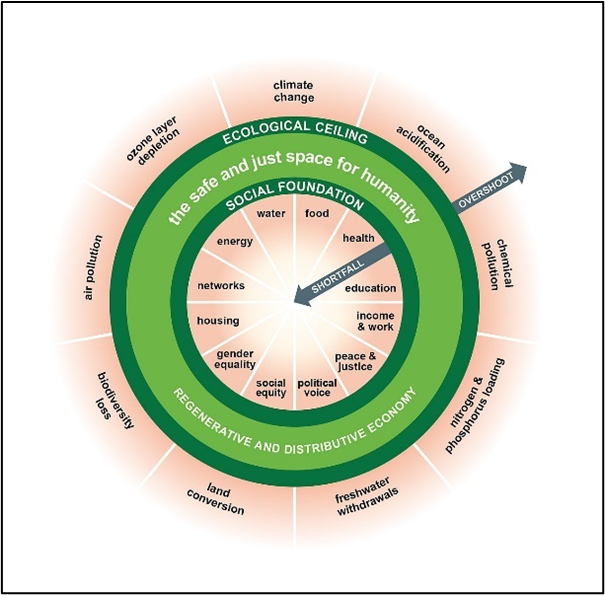
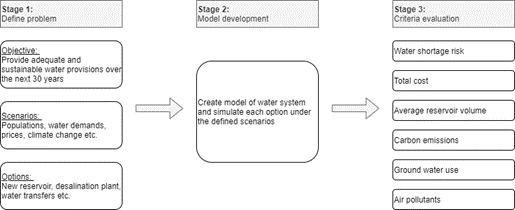
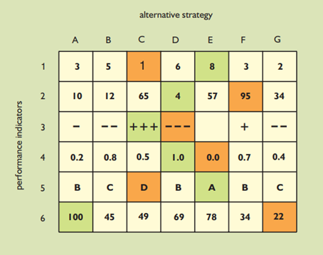

This lecture will cover how decision-makers can evaluate actions when
choosing investment strategies. We will first cover cost-benefit
analysis (CBA), a technique that has been used in decision-making for
decades but has significant limitations. By way of example, we introduce
an alternative evaluation technique, multi-objective analysis, which is
more suitable for infrastructure and environmental problems.

# Learning objectives

-   Understand the history, rationale, and limitations of cost-benefit
    analysis
-   Recognise alternative methods to cost-benefit analysis for option
    evaluation
-   Demonstrate the use of multi-objective analysis to evaluate actions.

# Introduction to cost-benefit analysis

Making decisions on investments in critical national infrastructure
entails the consideration of several options. In theory, decision-makers
within governments and funding bodies will allocate scarce funds to
those projects that are deemed to have the most value to society. Since
industries such as water, energy, and transport are usually public
entities, they are not fiscally profitable and instead rely on
disbursements. Hence, competition for funds is fierce. How can investors
evaluate the benefits of various projects to identify the most valuable
opportunities? **Cost-benefit analyses** (CBAs) have been deployed
widely for this exact purpose.

The fundamental concept of CBA is to value both the costs and benefits
associated with a project. The difference between these values estimates
the viability of the potential investment. Using this framework,
decision-makers often compare the cost-benefit ratio (CBR) of different
options for investment---in concept choosing the option that can deliver
the most benefit for the least cost (referred to as the *least-cost
option*).

CBA has early roots, as its origins can be traced back to the 1840s
[@Ratnaweera2020]. However, the first applications of CBA to
infrastructure and environmental projects appeared in water projects in
the United States in 1936, and in the evaluation of road and rail
projects in the United Kingdom in 1960 [@Ackerman2002]. Ever since,
CBA has continued to form an important role in the decision-making
process in numerous sectors across the world. However, in the modern era
of sustainable development, CBA is being viewed as a process too
reductive to promote sustainable development.

# CBAs: limitations and alternatives

Several critiques of CBA have emerged in recent literature. Such limitations are most evident when illustrated through a simple example: suppose that we wish to evaluate whether to construct a hydroelectric dam over an ecologically diverse forest area to supply electricity to a large town. Nowadays, such a project could be swiftly costed as data on materials and labour are plentiful. However, even the most capable of teams may struggle to value the externalities and benefits. What is the value of the ecosystem that would be displaced? What is the customers’ willingness to pay? Would the residents prefer to keep the natural ecosystem intact over a hydro-electric power facility? CBA requires absolute monetary values for these complex variables.
Despite the obvious limitations of CBA, in that it cannot adequately incorporate the wider benefits of options, it remains a widely used tool in the financial analysis of infrastructure projects. Whether this should remain to be the case is a subject of fierce political debate, with proponents of CBA arguing that analysis frameworks can be improved and standardised [@Ratnaweera2020].

There are at least four alternative approaches to cost-benefit analyses:

1. Multi-objective analysis
1. Decision-making under uncertainty
1. Cost-effectiveness analysis
1. Holistic comparison of costs and benefits.

Since there is significant overlap in these approaches, the remainder of
this lecture delves into one of these techniques: multi-objective
analysis. This was chosen as it is a commonly-used technique in
infrastructure research.

# Multi-objective analysis

CBA measures and evaluates an action in a single dimension: monetary
value. Commodities with unambiguous monetary values can be compared to
one another. However, the natural environment, human health, and
critical infrastructure services involve multiple dimensions that cannot
be quantified in monetary value alone. Multi-objective analysis (also
known as multi-criteria analysis) is a technique that seeks to evaluate
actions based on several dimensions, often three or more. The method
explicitly defines key objectives to the problem and evaluates the
performance criteria of alternative options. For example, an option may
be evaluated for its cost, lifetime carbon emissions, land use, water
requirements, and use of rare earth metals, amongst others. In this
respect, multi-objective analysis distinguishes itself from CBA in its
transparency.

It is important to recognise that multi-objective analyses are not
designed to identify single best solutions. Rather, the goal is to break
apart the key trade-offs between a set of performance criteria, allowing
stakeholders to explore the options that best meet their requirements
and risk tolerances. This does, however, present a weakness in the
methodology in that the final weights given to individual performance
criteria can be subject to biases.

{width=100%}

**Figure 14.2.1:** The doughnut economics model [@Wikimedia2017]

Recent literature has seen a proliferation in the use of multi-objective
analyses, in part driven by the economic movement towards adopting the
doughnut economics model (Figure 14.2.1) [@Raworth2017]. Broadly, the
two ideologies argue that economic development must strive to meet the
basic needs of humans across the world whilst operating within planetary
boundaries.

# Multi-objective analysis: An example (part I)

Let us demonstrate multi-criteria analysis through an example. Suppose
that we wish to plan water resources for the city of London, UK, for the
next 30 years to ensure adequate supplies of drinking water. Planning
water infrastructure investments is a multi-dimensional problem given
that water processes are inherently intertwined with the environment and
hence entails numerous objectives.

{width=100%}

**Figure 14.2.2:** An example framework for water sector planning using
multi-criteria analysis

Figure 14.2.2 shows a multi-objective planning framework that can be
used for such a problem. The framework involves three stages: (1)
problem definition, (2) model development and option simulation, and (3)
criteria evaluation. In the first stage, planners and stakeholders
discuss the scope of the problem. Here, scenarios are used to capture
uncertainties such as forecasts of populations, water demands,
electricity prices, and climate change (e.g. hydrological variability).
We also define a set of options that represent infrastructure and policy
interventions.

The second stage entails exhaustive simulation of each option under the
defined scenarios. This step allows planners to explore *what-if*
scenarios---i.e. what will happen if a particular set of options are
implemented under all scenarios. The simulation model outputs data
related to the criteria being evaluated (Stage 3). In this example,
planners are concerned with the following criteria:

1.  **Minimise** risk of water shortages
2.  **Minimise** total carbon emissions
3.  **Minimise** quantity of air pollutants from the water system
4.  **Minimise** groundwater usage
5.  **Maximise** average level of water in storage
6.  **Minimise** total cost of expenditure.

# Multi-objective analysis: An example (part II)

The final stage of the decision framework is to evaluate system
performance criteria (Figure 14.2.3). Each indicator represents a
variable of interest to analysts and decision-makers. The example we
consider here evaluates six performance indicators as detailed above.

{width=100%}

**Figure 14.2.3:** An example scorecard of system performance indicators
[@Loucks2017]

Multi-objective analyses usually output large amounts of data. Hence,
statistical analysis is used to compute aggregated values based on data
from each option and scenario. For example, we can compute geometric and
arithmetic means, minimum, and maximum values. It is also common to
calculate probabilistic values such as exceedance curves. Such
computations are the basis of the key performance metrics.

Performance indicators can be visualised using a scorecard as shown by
Figure 14.2.3. The table shows a snapshot of each alternative strategy's
performance in relation to the indicators of interest. Colour-coding
allows decision-makers to quickly parse inadequate performance in a
given category (e.g. red squares).

# Summary

This lecture introduced how decision-makers can evaluate options when
devising investment strategies. We discussed that cost-benefit analyses
are too reductive for problems related to infrastructure and the
environment. We showed how an alternative evaluation framework,
multi-objective analysis, can be used in the decision-making process.
