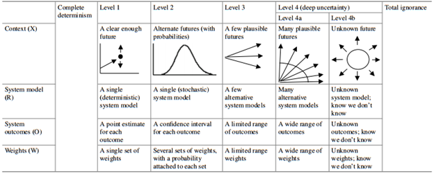
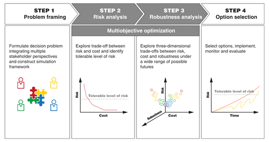
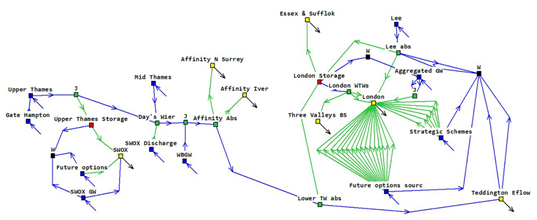
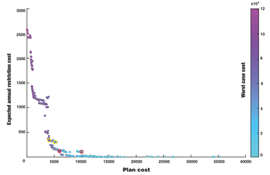

This lecture introduces decision theory under conditions of imperfect or
incomplete information. We will cover how to define and categorise
uncertainties relevant to specific decision problems. After introducing
the basic components of frameworks within decision theory under
uncertainty, we will run through an illustrative example.

# Learning objectives

-   Be able to define and categorise uncertainties
-   Understand the tenets of frameworks within decision theory under
    uncertainty
-   Recognise the importance of robustness within decision-making
    frameworks.

# Uncertainty and decision-making

Making decisions about infrastructure and environmental systems
necessitates a process to anticipate and manage change. Nowadays this
process is becoming increasingly complicated. Populations are changing
rapidly, technological development is accelerating at an unprecedented
pace, and climate change is a serious operational risk to be managed.
For instance, think of how energy sector managers need to ensure
reliable future supplies of electricity for a growing population whilst
decarbonising supply sources, as well as managing the impacts from
climate change and rapidly changing regulation. Such complexities extend
to all infrastructure systems.

These issues are defined by [uncertainty]{.ul}. We can simply define
uncertainty as a situation involving imperfect or unknown information
about the past, present, or future events. For a decision-maker,
uncertainty represents the gap between the best information available to
them and the knowledge they would need in order to make the best choice
[@Marchau2019]. Decision-making under uncertainty (DMUU) is a rich
and developed field that is concerned with making the best possible
choices based on imperfect or incomplete information. It has come to be
recognised as an important aspect in planning and managing
infrastructure systems.

# Types of uncertainty

In order for us to manage uncertainty when making decisions, it is
important to first identify the types of uncertainties that we are
dealing with. We can define two extremes of uncertainty: complete
determinism and total ignorance, within which four levels of
uncertainties exist [@Walker2003].

{width=100%}

**Figure 14.3.1:** Levels of uncertainty [@Marchau2019]

Figure 14.3.1 summarises these categorises of uncertainties. Complete
determinism refers to a state of total uncertainty and is almost
unattainable. Level 1 uncertainty relates to those conditions in which
historical data can be reasonably assumed as predictors for the future.
Examples of this might include operational conditions (e.g. number of
scheduled maintenance days) and asset parameters (e.g. power plant
efficiency). Meanwhile, Level 2 uncertainties are those that can be
defined adequately through probabilistic models describing the system.
The total solar irradiance over a solar energy farm is an example of a
Level 2 uncertainty. Level 3 uncertainties cannot be described in a
probabilistic sense nor can they be safely assumed as identical to
historical observations. However, they can be defined to fall within a
range of plausible futures and hence can be treated with *scenario
analysis*. For example, rate at which population changes in a given
region is a Level 3 uncertainty. Level 4 uncertainties are the deeply
uncertain factors that can only be captured with a vast range of
plausible assumptions (4a), such as electricity prices, or those that
have no known future (4b), such as a global financial crisis.

In any case, the first step in dealing with uncertainties is to list and
categorise each uncertainty relevant to a decision problem. This allows
us to define the best approach to handle the given uncertainty.

# Dealing with uncertainty

Recent times have witnessed a proliferation in the number of
methodologies developed for decision-making under uncertainty. The most
common examples include robust decision-making (RDM) [@Lempert2010],
decision scaling [@Brown2012], real options analysis [@De2006],
dynamic adaptive policy pathways [@Haasnoot2013], and info-gap
analysis [@Ben2006]. Whilst each of these methodologies have their
own nuances and jargon, they all share a common set of tenets
[@Hall2020], in that they all:

-   Extensively test a broad range of uncertainties to which a system
    might be exposed

-   Emphasise the use of multiple objectives in the planning problem

-   Identify solutions that are **robust** to uncertainties.

In other words, investment plans are rigorously stress-tested to the
range of uncertainties defined in the problem formulation stages, as
detailed in the previous section. The results from these stress tests
are evaluated against multiple performance criteria (see mini-lecture
14.2). Finally, analysis and decision-makers identify strategies that
are robust, in that they perform adequately well in relation to multiple
objectives across a range of scenarios and uncertainties---referred to
as *satisficing* *solutions*. The emphasis on robustness is a
distinguishing feature of decision theory under uncertainty. There is a
widespread recognition that no 'best' or 'optimal' option exists.
Rather, it is argued that decision-makers ought to go beyond this frame
of thinking to identify robust solutions, which can perform acceptably
under numerous possible states of the world.

# Robust decision-making: An example (part I)

Let us illustrate decision theory under uncertain conditions through an
example. Building on the contents of mini-lecture 14.2, consider a
planning problem in which we wish to ensure safe and reliable water
supplies over the next three decades. Using a generic for
decision-making under uncertainty, our methodology could be partitioned
into the four steps outlined by Figure 14.3.2. First, we need to
formulate the decision problem, where the crucial first step is to
identify and label uncertainties. For our specific problem, the
following uncertainties can be identified:

1.  Water demands (Level 3)

2.  Hydrological variability (Level 2)

3.  Electricity prices (Level 4a)

4.  Groundwater abstraction licences (Level 1)

5.  Water system operational parameters (Level 1).

Of course, stakeholders might identify additional uncertainties but the
above will suffice for this illustrative example.

{width=100%}

**Figure 14.3.2:** Levels of uncertainty [@Borgomeo2018]

The next stage of problem formulation is to create a computer model
representation of the water system. Here, it is common for
decision-makers to deploy simulation models, which are a digital
representation of a real-world system. A simulation model is a handy
instrument in the planner's toolbox as it allows us to conduct thousands
of simulations of alternative strategies over a vast range of scenarios.
Hence, we can exhaustively stress-test each strategy to see *what*
happens (severity) and for *how long* (duration).

Figure 14.3.3 shows an example simulation model of a water system in the
Thames basin, England, using the WATHNET modelling software. The use of
such models is widespread in infrastructure planning and management.

{width=100%}

**Figure 14.3.3**: An example simulation model constructed for the
Thames basin, England, using the WATHNET platform

# Robust decision-making: An example (part II)

Once we have constructed a system model and formulated a set of
uncertainties and options, we can begin conducting vast number of
simulations in an iterative fashion. This yields a large results
database containing a set of robust strategies and their associated
trade-offs.

In our example, by processing the results we could produce a curve
similar to that presented in Figure 14.3.4. In this curve, we are
visualising the trade-offs between three objectives: cost (x-axis),
water shortage risks (y-axis), and plan robustness (colour bar;
increasing scale represents decreasing robustness).

This curve---known as the Pareto frontier---shows a set of solutions
that are equally efficient in that the performance of one objective
cannot be improved without harming the performance of another objective.
Each point on the Pareto frontier represents a unique water investment
plan. For example, the point on the far-right of the x-axis represents
an investment plan with all options selected, and hence it is the most
expensive option from a cost perspective. Generally, Figure 14.3.4 shows
that increasing the total investment in strategies will decrease water
security and enhance robustness.

{width=100%}

**Figure 14.3.4:** Trade-off curve between cost, water security, and
robustness [@Borgomeo2018]

As previously discussed, decision-making under uncertainty does not seek
to find any elusive 'optimal' solution. Rather, our objective is to find
a set of solutions that are efficient in relation to the defined
uncertainties, which are shown by the Pareto frontier.

Decision-makers can evaluate the frontier and pick solutions for further
investigation that meet their risk thresholds with regards to the three
objectives. In this example, the solutions circled in yellow and red
were analysed further.

# Summary

Making decisions under uncertainty is an inherent part of infrastructure
planning. Whilst it is nearly impossible for us to gain perfect
information, it is possible for us to manage uncertainties when making
decisions. This lecture introduced fundamental concepts within decision
theory in conditions of imperfect or partial information. We highlighted
the concept of robustness, which seeks to identify options that perform
adequately across a range of uncertain conditions.
