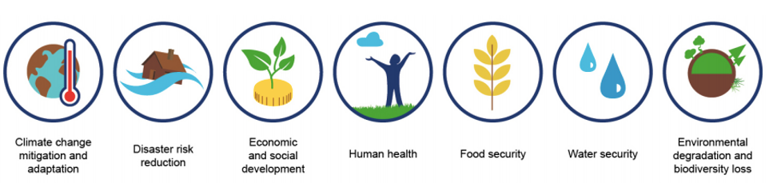

This mini-lecture will provide an introduction to the concept of
nature-based solutions (NbS) and consider the importance and growing
interest in leveraging NbS to progress global agendas. It will examine
the key pitfalls and principles of working with NbS, including the need
to focus on ecosystems beyond forests.

# Learning objectives

-   Describe the concept of NbS and its importance for global agendas

-   Recall potential pitfalls to avoid when working with NbS and the
    principles of NbS that should be adhered to when supporting the
    uptake and scaling of NbS

-   Describe why it is important to consider non-forest ecosystems as
    potential NbS.

# Context

{width=100%}

**Figure 15.1.1:** Nature-based solutions can encompass all types of
ecosystems, including terrestrial and marine, and be applied in varying
locations. From left to right, examples include: salt marshes; refugee
camp gardens; oyster reefs; NbS in urban landscapes; grasslands,
savannas and rangelands; beaches and dune systems; agricultural
management practices; coral reefs; wetlands; watersheds; mangroves;
forests. Photographs: @NBSI2021 and Unsplash Images (Photographers:
Hiroko Yoshii, Brenton Walker, Maitheli Maitra, Veeterzy, Niko Lewman)

The world is experiencing unprecedented challenges of meeting global
development needs whilst addressing the crises of climate change,
biodiversity loss and COVID-19, which threaten societies and the
ecosystems that underpin them.

As introduced in Lecture 1, global agendas have been created to address
these challenges. These include the Sustainable Development Goals
(SDGs), Paris Agreement, Convention on Biological Diversity, Sendai
Framework for Disaster Risk Reduction and the New Urban Agenda. Aligned
with these is the Global Decade of Ecosystem Restoration, which runs
from 2021 until 2030, the last decade of the SDGs.

As our climate is changing and the need to deliver on global goals is
ramping up, there is a growing realisation that these challenges are
interlinked, share many of the same drivers and cannot be addressed
independently [@NbSDigitalDialogues2020]. Furthermore, with
development threatening the ecosystems that society relies upon, there
is a need for more coherent, synergistic approaches [@Seddon2021].

During the last century, nature has remained peripheral in
decision-making on national and global development agendas
[@Seddon2021]. However, there is a growing recognition that nature
underpins societal functioning and has potential to help address these
challenges, whilst delivering multiple co-benefits, if strategically
integrated into development decisions and projects [@IUCN2020b].

Consequently, NbS have emerged as one integrated approach to addressing
the crises of climate change and biodiversity loss while supporting
sustainable development and building societal resilience
[@NbSDigitalDialogues2020].

**Table 15.1.1:** Global agendas and natural ecosystems

Agenda | Description | Role of NBS
---|---|---
[**SDGs**](https://sdgs.un.org/goals){target="_blank"} | 17 interlinked global goals, agreed by the United Nations in 2015, to bring about positive social, economic and environmental outcomes. | Nature underpins the achievement of the SDGs through provision of ecosystem services (see mini-lecture 15.2).
[**Paris Agreement**](https://unfccc.int/process-and-meetings/the-paris-agreement/the-paris-agreement){target="_blank"} | An agreement within the United Nations Framework Convention on Climate Change to address climate change mitigation and adaptation. | Nature can contribute to addressing the causes and consequences of climate change through carbon sequestration and adaptation services (see mini-lecture 15.3).
[**Convention on Biological Diversity**](https://www.cbd.int/){target="_blank"} | Aims include: conservation of biological diversity, sustainable use of biodiversity, and fair and equitable sharing of benefits arising from genetic resources. | Nature underpins the provisioning of habitat and biodiversity.
[**Sendai Framework for Disaster Risk Reduction**](https://www.preventionweb.net/files/43291_sendaiframeworkfordrren.pdf){target="_blank"} | Aims to achieve substantial reduction of disaster risk and associated losses. | Nature provides various adaptation services (see Lecture 16).
[**New Urban Agenda**](https://unhabitat.org/sites/default/files/2019/05/nua-english.pdf){target="_blank"} | Aims to achieve sustainable development of urban areas. | Incorporation of nature in urban landscapes can support their sustainable development (see mini-lecture 17.4).
[**Global Decade of Ecosystem Restoration**](https://www.decadeonrestoration.org/){target="_blank"} | Runs 2021-2030; aims to restore degraded and destroyed ecosystems, contributing to efforts to combat climate change and safeguard the services that they provide. | Nature encompasses various ecosystems and can contribute to efforts on climate change.

# Definition of NbS

Nature-based solutions are *"actions to protect, sustainably manage and
restore natural or modified ecosystems that address societal challenges
effectively and adaptively, simultaneously providing human well-being
and biodiversity benefits"* [@IUCN2020b].

{width=100%}

**Figure 15.1.2:** Visual representation of the concept of NbS
[@Cohen-Shacham2016]

NbS encompass a broad range of actions related to natural or
semi-natural ecosystems and can form part of hybrid 'grey-green'
approaches (engineered and ecosystem). NbS are classified within four
categories:

1)  **Protecting** ecosystems

2)  **Restoring** degraded landscapes

3)  Improved **management** (e.g. improved grazing land management,
    agroforestry)

4)  **Creating new** ecosystems.

NbS are applicable to all terrestrial (green) and marine and coastal
(blue) ecosystems, including (but not limited to) savannas, wetlands and
reefs. While NbS interventions cover a range of ecosystem-based
solutions, they do not include nature-inspired solutions, such as
biomimicry, or nature-derived solutions, such as wind, wave or solar
energy (see @IUCN2020b).

**NbS** is a relatively new term, used first in 2008 by the World Bank
and only formally defined by the International Union for the
Conservation of Nature (IUCN) in 2020 [@IUCN2020a;@Seddon2021]. The
concept 'NbS' is based on the notion that healthy, well-managed
ecosystems deliver multiple ecosystem services, which underpin societal
and environmental well-being (see mini-lecture 15.2). It is an umbrella
term, encompassing other pre-existing ecosystem-based concepts,
including green infrastructure and natural climate solutions
[@Cohen-Shacham2016] (see Figure 15.1.3).

{width=100%}

**Figure 15.1.3:** The concept 'NbS' unites various other
ecosystem-based concepts within a single framework
[@Cohen-Shacham2016]. The umbrella term offers the advantage of
recognising and promoting the role of nature in delivering a broader
range of benefits than these more specific terms. E.g. mangrove forest
restoration can be part of green infrastructure solutions, ecological
restoration, ecosystem-based adaptation to coastal hazards, etc.
simultaneously.

To be considered a NbS, a solution must address one or multiple societal
challenges in an integrated manner [@IUCN2020b]. IUCN currently refer
to seven societal challenges, shown in Figure 15.1.4.

{width=100%}

**Figure 15.1.4:** The seven societal challenges that can be addressed
by NbS. The societal challenge(s) identified should directly affect a
specific group of people (e.g. a NbS to control coastal erosion
endangering a specific municipality) or indirectly impact society as a
whole (e.g. a NbS for mitigation) [@IUCN2020b]

Given the focus of NbS on addressing societal challenges, a solution
cannot be considered a NbS if it is implemented solely for environmental
goals (e.g. conservation). Therefore, if the societal challenge of
ecosystem degradation is being addressed, at least one other societal
challenge must be part of the solution design, to differentiate it from
pure conservation.

{width=100%}

**Figure 15.1.5:** NbS are actions which focus on safeguarding society -
while there is some overlap, not all conservation measures are NbS.
However, NbS may be designed to target conservation outcomes as part of
the overall project objectives [@IUCN2020b]

**Growing interest in NbS**

The breadth of the concept 'NbS' has brought together traditionally
disparate, siloed communities to collaborate, including researchers,
policymakers and practitioners across sectors including climate,
conservation and development [@Seddon2021]. The simplicity of the
concept of 'working with nature to address societal challenges' has
facilitated understanding, conversations and engagement across diverse
sectors and encouraged widespread interest and uptake [@Seddon2021;@Cohen-Shacham2019;@Nesshover2017].

This single 'umbrella' term has united communities within the same
framework, enabling a flexible, synergistic and integrated approach to
tackling interconnected challenges. Through recognising the potential
for NbS to deliver multiple benefits simultaneously (i.e. not limiting
solutions through labels such as 'natural climate solutions'), the
umbrella concept provides a framework for NbS to be designed to achieve
synergies and minimise trade-offs between actions for different goals
[@Seddon2021]. This potential of nature to deliver on multiple
social, environmental and economic goals simultaneously has resulted in
NbS gaining prominence amongst policymakers, in government agendas,
businesses, non-governmental organisations and the wider community,
across sectors and nations around the world.

COVID-19 has served to further raise the prominence of nature in
political agendas as policymakers and other stakeholders realise that
nature underpins many services we depend upon and is key to a resilient
future. Development decision-makers are now increasingly looking to
nature for solutions.

While there is a need for further research, there is a rapidly growing
evidence base demonstrating that well-designed, carefully implemented
NbS can deliver multiple benefits at relatively low costs. Consequently,
many bold pledges have been made, and multiple NbS platforms, projects,
initiatives and funding streams have been announced.

**Table 15.1.2:** Examples of NbS interest are shown below
[@Seddon2021;@NbSDigitalDialogues2020]. See @Seddon2021 for
further examples.

+----------------------------------+----------------------------------+
| Domain                           | Description                      |
+==================================+==================================+
| International Agreements and     | -   Paris Agreement and IPCC     |
| Initiatives                      |     1.5C report highlight the  |
|                                  |     role of nature             |
|                                  |                                  |
|                                  | -   2019 UN Climate Action       |
|                                  |     Summit had NbS as a key    |
|                                  |     action track               |
|                                  |                                  |
|                                  | -   Climate COP26 and            |
|                                  |     biodiversity COP had NbS   |
|                                  |     as major action tracks     |
|                                  |                                  |
|                                  | -   UN Decade on Ecosystem       |
|                                  |     Restoration                |
|                                  |                                  |
|                                  | -   Global Commission on         |
|                                  |     Adaptation has action      |
|                                  |     track on NbS               |
|                                  |                                  |
|                                  | -   IUCN made NbS a major pillar |
|                                  |     of its 2013--2016 Program  |
|                                  |                                  |
|                                  | -   The Leaders Pledge for       |
|                                  |     Nature holds countries (83 |
|                                  |     nations to date) to        |
|                                  |     account in reversing       |
|                                  |     biodiversity loss by 2030  |
|                                  |                                  |
|                                  | -   NbS have been highlighted in |
|                                  |     global assessment reports  |
|                                  |     (e.g., IPCC Climate Change |
|                                  |     and Land Report and IPBES  |
|                                  |     reports).                  |
|                                  |                                  |
|                                  | -   World Economic Forum's       |
|                                  |     Global Risks Report 2019   |
|                                  |     specifically recognised    |
|                                  |     economic risks posed by    |
|                                  |     biodiversity loss and      |
|                                  |     ecosystem collapse and the |
|                                  |     need for nature-positive   |
|                                  |     solutions.                 |
+----------------------------------+----------------------------------+
| Regional Initiatives             | -   Several national governments |
|                                  |     and the European Union     |
|                                  |     have pledged to plant      |
|                                  |     billions of trees (E.g.,   |
|                                  |     Bonn Challenge, New York   |
|                                  |     Declaration on Forests,    |
|                                  |     the '4 pour 1000           |
|                                  |     Initiative', AF100,        |
|                                  |     Africa's Green Wall)       |
|                                  |                                  |
|                                  | -   The World Business Council   |
|                                  |     on Sustainable Development |
|                                  |     Vision 2050                |
|                                  |                                  |
|                                  | -   European Commission (EC) is  |
|                                  |     focusing on NbS and green  |
|                                  |     infrastructure.            |
|                                  |     Nature-based Solutions for |
|                                  |     Climate Manifesto includes |
|                                  |     32 countries, EU           |
|                                  |     commission and civil       |
|                                  |     society organizations      |
+----------------------------------+----------------------------------+
| National agendas                 | -   Countries recognising the    |
|                                  |     role of nature in NDCs and |
|                                  |     NAPs (L15.3).              |
|                                  |                                  |
|                                  | -   Governments aiming to        |
|                                  |     prioritise nature in       |
|                                  |     economic and political     |
|                                  |     decisions for post-COVID   |
|                                  |     recovery to 'build back    |
|                                  |     better'.                   |
|                                  |                                  |
|                                  | -   Several major NGO            |
|                                  |     initiatives on NbS have    |
|                                  |     been established.          |
+----------------------------------+----------------------------------+
| Financial flows                  | -   Numerous funding streams     |
|                                  |     have been announced.       |
|                                  |                                  |
|                                  | -   Climate finance went from    |
|                                  |     3-8% for NbS in 2020.      |
+----------------------------------+----------------------------------+
| Private Sector (See @Seddon2021 | -   Lots of commitment from      |
| for a table of private sector    |     large corporates (Apple,   |
| pledges)                         |     Microsoft, Airlines,       |
|                                  |     Fossil Fuel Industry)      |
|                                  |                                  |
|                                  | -   Coalition of \>50            |
|                                  |     organisations called       |
|                                  |     'Business for Nature'      |
|                                  |     (includes WEF, World       |
|                                  |     Business Council for       |
|                                  |     Sustainable Development,   |
|                                  |     the We Mean Business       |
|                                  |     Coalition, the             |
|                                  |     International Chamber of   |
|                                  |     Commerce, and groups       |
|                                  |     representing countries on  |
|                                  |     almost all continents).    |
|                                  |     530 companies have         |
|                                  |     committed to reversing     |
|                                  |     nature loss and restoring  |
|                                  |     vital natural systems,     |
|                                  |     mainly through business    |
|                                  |     partnerships.              |
|                                  |                                  |
|                                  | -   The Capitals Coalition       |
|                                  |     provides practical tools   |
|                                  |     to help companies assess   |
|                                  |     dependence on and impacts  |
|                                  |     on nature via the Natural  |
|                                  |     Capital Protocol.          |
|                                  |                                  |
|                                  | -                                |
|                                  | The [1t.org](http://1t.org/){target="_blank"} (of |
|                                  |     the World Economic Forum)  |
|                                  |     has a cross‐industry       |
|                                  |     corporate alliance.        |
+----------------------------------+----------------------------------+

# Pitfalls and principles of NbS

While NbS offer multiple social, environmental and economic co-benefits
in principle, there are a number of potential pitfalls of implementing
NbS which are important to note [@Seddon2021;@Cohen-Shacham2019]:

1.  NbS are being used as a form of 'green washing' to excuse
    business-as-usual fossil fuel use.

2.  NbS are distracting from and delaying the urgent need to phase out
    fossil fuels and reduce greenhouse gas emissions across all sectors.

3.  A focus on forests, framed as a 'silver bullet' solution to climate
    change, is coming at the cost of other native, intact ecosystems,
    which risks the project failing or doing more harm than good.

4.  Adverse impacts on local and indigenous communities (e.g. where land
    is appropriated for NbS, communities are excluded or not consulted).

5.  Potential unintended consequences, where NbS are implemented without
    consideration of ecological and social context.

To address these pitfalls, in 2020, 4 overarching principles for NbS
were agreed [@Seddon2021] (see Figure 15.1.6).

{width=100%}

**Figure 15.1.6:** Overarching principles of NbS

The impact of NbS depends on many factors, including the local and
wider-scale ecological and social contexts, species type and ecological
suitability, landscape prior to the intervention, the management regime,
the extent of community involvement, and the scale at which outcomes are
measured.

There is now a global standard on NbS, which the IUCN launched in 2020
[@IUCN2020a]. This defines 8 further principles of NbS (see Table
15.1.3), which should be adhered to in order to ensure the design and
implementation of NbS are robust, resilient, deliver multiple, long-term
societal, environmental and economic benefits, and address the global
challenges outlined above.

**Table 15.1.3:** The 8 Principles of NbS

  The 8 Principles of NbS
  ------------------------- -----------------------------------------------------------------------------------------------------------------------------------------------------------------------------------------------------
  **Principle 1**           NbS embrace nature conservation norms and principles
  **Principle 2**           NbS can be implemented alone or in an integrated manner with other solutions to societal challenges
  **Principle 3**           NbS are determined by site-specific natural and cultural contexts (including traditional, local and scientific knowledge)
  **Principle 4**           NbS produce societal benefits in a fair and equitable way, in a manner that promotes transparency and broad participation
  **Principle 5**           NbS maintain biological and cultural diversity and the ability of ecosystems to evolve over time
  **Principle 6**           NbS are applied at a landscape scale
  **Principle 7**           NbS recognise and address the trade-offs between the production of a few immediate economic benefits for development, and future options for the production of the full range of ecosystem services
  **Principle 8**           NbS are an integral part of the overall design of policies, and measures or actions, to address a specific challenge

# NbS beyond forests

{width=100%}

**Figure 15.1.7:** NbS encompass all ecosystems, despite the large focus
to date on forests (Unsplash)

Depending on how NbS are implemented and managed, they can either
contribute to addressing societal challenges, or exacerbate the problem.
To date, much NbS focus has been on the potential of forests. This is
reflected across academic literature [@Bastin2019;@Lal&Singh2000],
as well as regional and national initiatives, funding, government and
private sector pledges (see annex).

It is often assumed that grasslands are deforested or degraded forests.
Nine million hectares of ancient grassland are wrongly classified as
degraded land suitable for afforestation [@Seddon2020]. A highly
profiled paper [@Griscom2017] pointed to a large potential for forest
restoration in grassy biomes, and much of Africa's savannas are
earmarked for forest restoration. This overlooks the services and
social, environmental and economic importance of non-forest biomes and
risks potentially devastating consequences. For example, Africa's
grasslands are home to 300 million people, and are important for
biodiversity, soil carbon storage, nutrient cycling and livelihoods
[@NbSDigitalDialogues2020].

Concerns related to forests (beyond pitfalls mentioned above) include
[@Seddon2020;@Seddon2021]:

-   Tree-based initiatives are often monoculture or low-diversity
    plantations of non-native species (e.g. 45% of 350 million
    hectares (Mha) currently pledged for reforestation is to become
    commercial monoculture plantations). This has implications for
    resilience to climate change, pests, disease, carbon storage, and
    risks potential unintended consequences.

-   Services of native ecosystems are overlooked, which can compromise
    benefits provided to local communities and biodiversity and risk
    further loss of non-forest ecosystems.

-   Overemphasis on forests can lead to maladaptation to climate change.

There is a major opportunity and need to scale up NbS across a range of
ecosystems in addition to forests, including reefs, wetlands, soils and
grassland landscapes.

{width=100%}

**Figure 15.1.8:** Photograph sources: @UNDP2019 and Unsplash images
(Photographers: Niko Lewman, A. Shuau, Dylan de Jonge).

# Summary

Nature-based solutions (NbS) refer to the restoration, management,
protection and creation of all types of ecosystems. The concept is
relatively new, only formally defined in 2020. NbS have rapidly
increased in agendas of governments, business and development
practitioners due to the simplicity of the concept and potential of NbS
to deliver multiple benefits. There are various caveats which must be
considered when designing and implementing NbS. To support uptake and
scale-up and in order to avoid potential pitfalls, 4 overarching
principles and 8 sub-principles of NbS have been defined, including the
need to consider all ecosystems in project design.

# Annex

Table 15.1.4 Examples of major tree planting initiatives
[@Seddon2021]

+----------------------+----------------------+----------------------+
| Name                 | Organizers / funders | Targets and methods  |
+======================+======================+======================+
| **Global             |                      |                      |
| initiatives**        |                      |                      |
+----------------------+----------------------+----------------------+
| [Bonn Challenge][bc] | Launched by IUCN and | -   42 nations       |
|                      | German Government in |     committed to     |
|                      | 2011. National       |     collectively     |
|                      | governments work     |     bring about      |
|                      | with stakeholders to |     350Mha forest    |
|                      | develop strategies   |     restoration by   |
|                      |                      |     2030             |
|                      |                      |                      |
|                      |                      | -   173 Mha pledged  |
|                      |                      |     (May 2020)       |
|                      |                      |                      |
|                      |                      | -   Accompanied by   |
|                      |                      |     Atlas of 2000    |
|                      |                      |     Mha 'deforested  |
|                      |                      |     and degraded'    |
|                      |                      |     land considered  |
|                      |                      |     suitable for     |
|                      |                      |     tree planting,   |
|                      |                      |     which,           |
|                      |                      |     problematically, |
|                      |                      |     includes         |
|                      |                      |     savannas and     |
|                      |                      |     other grassy     |
|                      |                      |     biomes           |
|                      |                      |                      |
|                      |                      | -   43% new forest   |
|                      |                      |     pledges          |
|                      |                      |     considered       |
|                      |                      |     commercial       |
|                      |                      |     plantations      |
|                      |                      |                      |
+----------------------+----------------------+----------------------+
| New York Declaration | Voluntary commitment | -   Halve            |
| on Forests           | signed at UN summit  |     deforestation    |
|                      | (2014). Governments, |     and restore      |
| [Link][nydf]         | businesses, NGOs,    |     150 Mha forests  |
|                      | communities.         |     by 2020          |
|                      |                      |                      |
|                      |                      | -   Target not met   |
|                      |                      |     (NYDF Assessment |
|                      |                      |     Partners         |
|                      |                      |     [@Seddon2021])   |
|                      |                      |                      |
|                      |                      | -   41 national and  |
|                      |                      |     21 subnational   |
|                      |                      |     governments      |
|                      |                      |     (together with   |
|                      |                      |     61 companies, 22 |
|                      |                      |     Indigenous       |
|                      |                      |     groups and 66    |
|                      |                      |     non‐governmental |
|                      |                      |     organizations)   |
|                      |                      |     pledged to halt  |
|                      |                      |     deforestation by |
|                      |                      |     2030 as          |
|                      |                      |     signatories of   |
|                      |                      |     the New York     |
|                      |                      |     Declaration on   |
|                      |                      |     Forests          |
+----------------------+----------------------+----------------------+
| Trillion Trees       | BirdLife             | - End                |
|                      | International,       |   deforestation      |
| [Link][tt]           | Wildlife             |   / improve          |
|                      | Conservation Society |     forest           |
|                      | and World Wide Fund  |     protection and   |
|                      | for Nature           |     restore forests  |
|                      |                      |                      |
|                      |                      | -   Emphasis on      |
|                      |                      |     'right tree,     |
|                      |                      |     right place'     |
+----------------------+----------------------+----------------------+
| Trillion Tree        | Plant for the Planet | -   Plant 1 trillion |
| Campaign             | (NGO supported by    |     trees            |
|                      | UN)                  |                      |
| [Link][ttc]          |                      | -   13.8 billion     |
|                      |                      |     planted by May   |
|                      |                      |     2020             |
|                      |                      |                      |
|                      |                      | -   Campaign         |
|                      |                      |     initiated by     |
|                      |                      |     children; builds |
|                      |                      |     on earlier UN    |
|                      |                      |     billion trees    |
|                      |                      |     target           |
|                      |                      |                      |
|                      |                      | -   Donations fund a |
|                      |                      |     productive       |
|                      |                      |     plantation in    |
|                      |                      |     Mexico, and app  |
|                      |                      |     gathers details  |
|                      |                      |     of trees planted |
|                      |                      |     elsewhere        |
|                      |                      |                      |
|                      |                      | -   Assumes that 1   |
|                      |                      |     trillion trees   |
|                      |                      |     will offset      |
|                      |                      |     25--33% of       |
|                      |                      |     anthropogenic    |
|                      |                      |     CO2 emissions    |
|                      |                      |     released so far  |
|                      |                      |                      |
|                      |                      | -   Sweeping         |
|                      |                      |     statements used  |
|                      |                      |     such as 'Trees   |
|                      |                      |     can be planted   |
|                      |                      |     almost anywhere' |
+----------------------+----------------------+----------------------+
| Trillion Tree        | World Economic Forum | -   Conserve,        |
| Platform             |                      |     restore and grow |
|                      |                      |     1 trillion trees |
| [Link][ttp]          |                      |     by 2030          |
|                      |                      |                      |
|                      |                      | -   Platform to      |
|                      |                      |     support the      |
|                      |                      |     Trillion Trees   |
|                      |                      |     community and    |
|                      |                      |     the UN Decade on |
|                      |                      |     Ecosystem        |
|                      |                      |     Restoration      |
|                      |                      |     2021--2030, led  |
|                      |                      |     by UNEP and FAO  |
|                      |                      |                      |
|                      |                      | -   Website states   |
|                      |                      |     that tree        |
|                      |                      |     planting is 'not |
|                      |                      |     a silver bullet' |
+----------------------+----------------------+----------------------+
| WeForest             | NGO offering carbon  | -   Transform 250    |
|                      | offsets to companies |     kha of forest    |
| [Link][wf]           |                      |     landscape by     |
|                      |                      |     2021; restore 25 |
|                      |                      |     kha of forest    |
|                      |                      |     with 25 million  |
|                      |                      |     trees            |
|                      |                      |                      |
|                      |                      | -   Use forest       |
|                      |                      |     restoration best |
|                      |                      |     practice across  |
|                      |                      |     different        |
|                      |                      |     ecosystems       |
+----------------------+----------------------+----------------------+
| [Ecosia][ecosia]     | Ecosia Internet      | -   Plant 1 billion  |
|                      | Browser              |     trees            |
|                      |                      |                      |
|                      |                      | -   116 million      |
|                      |                      |     trees planted by |
|                      |                      |     2020, across     |
|                      |                      |     9000 tropical    |
|                      |                      |     sites            |
|                      |                      |                      |
|                      |                      | -   Many projects    |
|                      |                      |     involve          |
|                      |                      |     agroforestry,    |
|                      |                      |     for example,     |
|                      |                      |     with cocoa or    |
|                      |                      |     bamboo           |
|                      |                      |                      |
|                      |                      | -   Free internet    |
|                      |                      |     browser that     |
|                      |                      |     uses the profit  |
|                      |                      |     from searches to |
|                      |                      |     fund             |
|                      |                      |     tree‐planting    |
+----------------------+----------------------+----------------------+
| **Regional           |                      |                      |
| Initiatives --       |                      |                      |
| related to Bonn      |                      |                      |
| Challenge and / or   |                      |                      |
| New York Declaration |                      |                      |
| on Forests**         |                      |                      |
+----------------------+----------------------+----------------------+
| African Forest       | \$1.4 billion from   | -   100 Mha FLR by   |
| Landscape            | Germany and the      |     2030             |
| Restoration          | World Bank to        |                      |
| Initiative (AFR100)  | African governments  | -   Much of this     |
|                      |                      |     will be          |
| [Link][afr100]       |                      |     commercial       |
|                      |                      |     plantations and  |
|                      |                      |     much will be on  |
|                      |                      |     savannah         |
+----------------------+----------------------+----------------------+
| Initiative 20 × 20   | \$2.4 billion so     | -   20 Mha of        |
|                      | far, from impact     |     degraded land in |
| [Link][i20x20]       | investors and        |     Latin America    |
|                      | businesses.          |     and Caribbean    |
|                      |                      |     brought into     |
|                      |                      |     restoration      |
|                      |                      |     using forests by |
|                      |                      |     2020 - achieved  |
|                      |                      |                      |
|                      |                      | -   Next goal:       |
|                      |                      |     additional       |
|                      |                      |     30 Mha by 2030.  |
|                      |                      |     Includes timber  |
|                      |                      |     plantations      |
+----------------------+----------------------+----------------------+
| ECCA30               | European, Caucasian  | -   30 Mha forest    |
|                      | and Central Asian    |     restoration in   |
| [Link][ecca30]       | governments and      |     Europe, the      |
|                      | investors            |     Caucasus and     |
|                      |                      |     Central Asia by  |
|                      |                      |     2030             |
+----------------------+----------------------+----------------------+
| **Other regional     |                      |                      |
| initiatives**        |                      |                      |
+----------------------+----------------------+----------------------+
| EU Biodiversity      | European Union       | -   Plant 3 billion  |
| Strategy to 2030     |                      |     trees by 2030,   |
|                      |                      |     including in     |
|                      |                      |     urban and rural  |
|                      |                      |     areas            |
+----------------------+----------------------+----------------------+
| **National           |                      |                      |
| Initiatives:** Most  |                      |                      |
| of the high‐level    |                      |                      |
| government targets   |                      |                      |
| for NbS focus on     |                      |                      |
| forests. For         |                      |                      |
| example, nearly half |                      |                      |
| of the 64 adaptation |                      |                      |
| targets included in  |                      |                      |
| 30 NDCs involve the  |                      |                      |
| protection and/or    |                      |                      |
| restoration of       |                      |                      |
| forest, and          |                      |                      |
| afforestation        |                      |                      |
| accounts for 22% of  |                      |                      |
| nature‐based         |                      |                      |
| adaptation targets   |                      |                      |
+----------------------+----------------------+----------------------+
| Grain for Green      | Chinese Government   | -   29 Mha of trees  |
| Program              | (1999--2018)         |     planted across   |
|                      |                      |     China to reduce  |
|                      |                      |     severe soil      |
|                      |                      |     erosion and land |
|                      |                      |     degradation      |
+----------------------+----------------------+----------------------+
| UK Nature for        | £640 M from the UK   | -   Plant 30 kha of  |
| Climate Fund         | government.          |     trees and        |
|                      |                      |     restore 35 kha   |
|                      |                      |     of peatland in   |
|                      |                      |     England by 2025  |
+----------------------+----------------------+----------------------+
| Green Legacy         | Ethiopian government | -   Plant 1 billion  |
| Programmes           |                      |     trees by 2028    |
|                      |                      |                      |
| [Link][glp]          |                      | -   149 planted so   |
|                      |                      |     far              |
|                      |                      |                      |
+----------------------+----------------------+----------------------+
| [NGP][ngp]           | Government of the    | -   Restore 1.5 Mha  |
|                      | Philippines          |     of degraded      |
|                      |                      |     forest 2011-2016 |
|                      |                      |     -- achieved      |
|                      |                      |                      |
|                      |                      | -   Now extended to  |
|                      |                      |     restore the      |
|                      |                      |     remaining 7.1Mha |
|                      |                      |     of degraded      |
|                      |                      |     forest land by   |
|                      |                      |     2028, with the   |
|                      |                      |     aim of providing |
|                      |                      |     forest products, |
|                      |                      |     reducing poverty |
|                      |                      |     and enhancing    |
|                      |                      |     the carbon sink  |
|                      |                      |                      |
+----------------------+----------------------+----------------------+

[bc]: https://www.bonnchallenge.org/ "Bonn Challenge" {target="_blank"}
[ngp]: https://www.denr.gov.ph/index.php/priority-programs/national-greening-program "National Greening Program" {target="_blank"}
[glp]: https://www.mpi.govt.nz/forestry/funding-tree-planting-research/one-billion-trees-programme/about-the-one-billion-trees-programme/ "Green Legacy Programmes" {target="_blank"}
[ecca30]: https://infoflr.org/index.php/bonn-challenge/regional-initiatives/ecca30 "ECCA30" {target="_blank"}
[i20x20]: https://initiative20x20.org/ "Initiative 20x20" {target="_blank"}
[nydf]: https://forestdeclaration.org/ "New York Declaration on Forests" {target="_blank"}
[tt]: https://www.trilliontrees.org/ "Trillion Trees" {target="_blank"}
[ttc]: https://www.trilliontreecampaign.org/ "Trillion Trees Campaign" {target="_blank"}
[ttp]: https://www.1t.org/ "Trillion Trees Platform"  {target="_blank"}
[wf]: https://www.weforest.org/ "We Forest" {target="_blank"}
[ecosia]: https://info.ecosia.org/what "Ecosia Internet Browser" {target="_blank"}
[afr100]: https://afr100.org/ "African Forest Landscape Restoration Initiative" {target="_blank}
