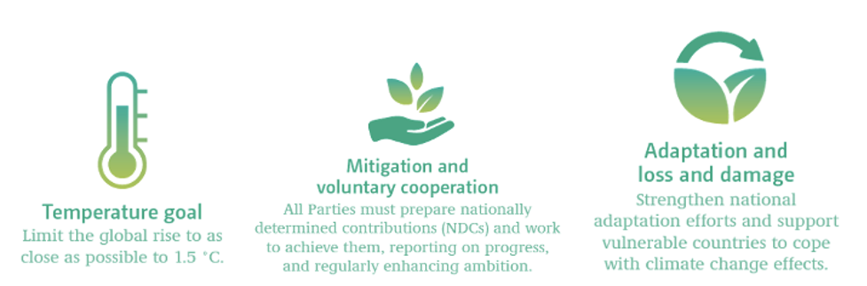

This mini-lecture provides an overview of the potential for nature-based
solutions (NbS) to enhance progress on the Paris Agreement through
supporting climate outcomes. It will consider the potential for
infrastructure practitioners to leverage nature in order to contribute
to climate and development goals, which will be explored in subsequent
lectures.

# Learning objectives

-   Recall the potential of NbS for meeting the goals of the Paris
    Agreement (mitigation and adaptation)
-   Gain insight into the potential for NbS in existing and future NDCs
-   Consider the integration of NbS into infrastructure systems in order
    to enhance progress on the Paris Agreement.

# Recap on the Paris Agreement and inclusion of NbS

As introduced in mini-lecture 1.2, the Paris Agreement is a global
climate change agenda, with the objective to keep global temperature
rise below 2°C above preindustrial levels by 2100, and to pursue efforts
to limit global temperature rise to the more stringent goal of 1.5°C
[@UNFCCC2015]. The Paris Agreement includes actions spanning both
climate mitigation and adaptation, recognising that while mitigation is
necessary to limit global temperature increase, some climate impacts are
unavoidable.

{width=100%}

**Figure 15.3.1:** Key objectives of the Paris Agreement on Climate
Change of relevance to nature-based solutions [@UNFCCC2017]

The Paris Agreement explicitly refers to ecosystems and their
significance for both climate mitigation and adaptation. For example,
the preamble acknowledges "*the importance of ensuring the integrity of
all ecosystems, including oceans, and the protection of biodiversity*".
The Agreement makes further references relevant to NbS throughout
several articles (see Table 15.3.1). This follows UNFCCC Article 4.1(d):
to "*promote sustainable management, (...) conservation and enhancement,
as appropriate, of sinks (...), including biomass, forests and oceans as
well as other terrestrial, coastal and marine ecosystems*"
[@UNFCCC1992].

Through leveraging ecosystems and their services, NbS have a key role in
enhancing progress on the Paris Agreement. As countries revise or
prepare new Nationally Determined Contributions (NDCs) in support of the
Paris Agreement, there is a major opportunity to increase global
ambition on climate change through strengthening the contribution of NbS
in mitigation and adaptation commitments.

-   **Mitigation**: Globally, ecosystems capture and store significant
    amounts of carbon, and thereby can contribute to progress to
    limiting global temperature increase [@IPCC2019]

-   **Adaptation: A** growing research base has provided evidence on the
    potential for NbS to protect vulnerable communities and
    infrastructure from climate impacts [see Lecture 16].

**Table 15.3.1:** Examples of relevant Paris Agreement Articles
[@Seddon2019 -- see p.4 for full list]

  Article   Specific quote/reference
  --------- ----------------------------------------------------------------------------------------------------------------------------------------------------------------------------------------------------------------------------------------------------------------------------------------------------------------------------------------------------------------------------------------------------------------------------------------------------------------------------------
  4.7       Mitigation **co-benefits** resulting from Parties' adaptation actions and/or economic diversification plans can contribute to mitigation outcomes under this Article
  4.13      Parties shall account for their Nationally Determined Contributions (NDCs). In accounting for anthropogenic emissions and **removals** corresponding to their NDCs, Parties shall promote **environmental integrity, transparency, accuracy, completeness, comparability and consistency**, and ensure the avoidance of double counting, in accordance with guidance adopted by the Conference of the Parties (COP) serving as the meeting of the Parties to this Agreement
  5.1       Parties should take action to **conserve and enhance, as appropriate, sinks and reservoirs of greenhouse gases as referred to in Article 4, paragraph 1(d), of the Convention, including forests**
  6.1       Parties recognise that some Parties choose to pursue voluntary cooperation in the implementation of their NDCs to allow for higher ambition in their mitigation and adaptation actions and to **promote sustainable development and environmental integrity**
  7.2       Parties recognise that adaptation is a global challenge faced by all with local, subnational, national, regional and international dimensions, and that it is a key component of and makes a contribution to the long-term global response to climate change **to protect people, livelihoods and ecosystems**, taking into account the urgent and immediate needs of those developing country Parties that are particularly vulnerable to the adverse effects of climate change
  8.4       Accordingly, areas of cooperation and facilitation to enhance understanding, action and support may include: **Resilience of communities, livelihoods and ecosystems.**

# An introduction to NbS in Nationally Determined Contributions

The Paris Agreement requires each signatory nation to define their
individual commitments in terms of mitigation reductions in the form of
Nationally Determined Contributions (NDCs) [@UNFCCC2021].

To date, most NDCs have included reference to NbS, and approximately
two-thirds (66%) of the signatories of the Paris Agreement have
specified NbS to contribute towards achieving their national mitigation
and/or adaptation objectives [@Seddon2019]. 70 countries have
included actions broadly aligned with Ecosystem-based Adaptation (EbA),
and a further 33 countries refer to conservation actions in the context
of adaptation.

NDC commitments which include reference to nature or NbS are more
prevalent amongst developing or low-income countries (as defined by the
World Bank), compared to high-income countries. For example, a recent
report [@Seddon2019] highlights that all low-income countries refer
to NbS in the adaptation component of the NDC, compared to only 27% of
high-income nations. Where NbS are included in NDCs, the report finds a
general lack of robust, evidence-based targets. For example, only 17% of
NDCs with current or planned actions involving NbS for adaptation set
quantifiable, robust targets. Equally, while more than 70% of NDCs
contain references to forest-based actions, only 20% include quantified
targets and only 8% include targets in tonnes of CO~2~eq (carbon dioxide
equivalent).

The focus on forests (as explained in mini-lecture 15.1) extends to
NDCs, and non-forest ecosystems such as grasslands, wetlands, soils and
marine ecosystems (e.g. mangroves, reefs) are under-represented. For
example, only 19% of countries with coastal ecosystems refer to them for
mitigation in their NDC [@Seddon2019].

# Contributing to the Paris Agreement through synergising NbS for adaptation and mitigation

NbS have potential to contribute to both climate mitigation and
adaptation objectives simultaneously, and at relatively low-cost, while
delivering multiple additional benefits for people and nature
[@Seddon2020].

However, within current NDCs, there is a lack of synergy between NbS
commitments for adaptation and NbS commitments for mitigation, with
references to NbS largely siloed [@UNFCCC2021]. For example, only 17
countries aim to address adaptation and mitigation together or have
sections in the adaptation components of their NDCs which explicitly
highlight mitigation benefits of nature-based adaptation options
[@Seddon2019].

As such, there is a need for integrated NbS action, which simultaneously
delivers both adaptation and mitigation benefits, as well as supports
progress for positive impacts on sustainable development and
biodiversity.

For example, the protection, restoration and sustainable management of
peatlands, wetlands, rangelands, mangroves and intact forest ecosystems
are critical for mitigation goals, due to their ability to sequester and
store significant amounts of carbon [@Griscom2017]. At the same time,
if implemented with consideration, these ecosystems can contribute to
adaptation goals through the delivery of services including flood
mitigation, wave dissipation, soil stabilisation, and through services
such as food and water provisioning, which can increase the resilience
of communities and biodiversity in the face of climate change
[@Kapos2019].

Similarly, the loss of natural ecosystems will further exacerbate
climate change and the severity of climate impacts. For example, it is
estimated that deforestation and forest degradation release
approximately 4.4 GtCO~2~/yr (Gigatonnes of carbon dioxide per year),
approximately 12% of anthropogenic emissions, while deforested
landscapes increase the risk of landslides, flooding and nutrient
depletion [@IPCC2019].

{width=100%}

**Figure 15.3.2:** Protecting and restoring ecosystems along coastlines
or in upper catchments can contribute to adaptation by protecting
communities and infrastructure from coastal hazards, such as flooding,
erosion or storm surges, while simultaneously sequestering carbon and
protecting biodiversity (see mini-lecture 16.2). Photograph from
Unsplash (Photographer: Vishwasa Navada K).

{width=100%}

**Figure 15.3.3:** Investing in NbS in
urban landscapes, such as through green roofs, green balconies and green
spaces, can contribute to climate adaptation through services including
air quality regulation and reduction of the urban heat island effect,
whilst sequestering carbon and providing benefits for mental health and
well-being (see mini-lecture 16.4). Photograph from Unsplash
(Photographer: Victor Garcia).

# Contributing to the Paris Agreement through enhanced ambition on NbS

Well-designed NbS, which are implemented with consideration of the local
socio-economic and ecological context (see Lecture 18) and which
incorporate diverse, native species, have the potential to enhance
progress on mitigation and adaptation goals whilst delivering wider
co-benefits [@Seddon2019].

All countries, and particularly high-income nations, have the
opportunity to enhance their NDCs through incorporation and synergy of
NbS across adaptation and mitigation components. However, in recognition
of the principles of NbS (outlined in mini-lecture 15.1), commitments
and actions on NbS should not detract ambition from actions to
decarbonise across all sectors.

NbS commitments within NDCs should be informed by scientific and local
indigenous knowledge, based on robust carbon estimates in the case of
mitigation, and address specific climate vulnerabilities in the case of
adaptation [@Seddon2019].

There are various resources available to support countries in
integrating NbS into NDCs. These include a report by the International
Union for the Conservation of Nature (IUCN) [@Seddon2019], which has
identified key information that can be included in NDCs to help track
ambition on nature more systematically. Furthermore, the 'Nature-based
Solutions for NDCs Toolkit' and associated 'Framework' has identified
more than 100 tools and resources on NbS that can support
decision-makers in enhancing their NDCs, including spatial datasets,
guidance documents and other toolkits [@UNDP2019a; @UNDP2019b].

Most NDCs that have included NbS, have highlighted the need for external
financing and support. Therefore, in leveraging NbS to enhance progress
on the Paris Agreement, there remains an urgent need for supportive
enabling conditions, including new financial and policy support
[@Seddon2019].

# Contributing to the Paris Agreement and supporting sustainable development through integration of NbS in infrastructure

Infrastructure is responsible for 87% of greenhouse gas (GHG) emissions
globally [@Thacker2019]. Furthermore, climate impacts pose a high
risk to infrastructure systems, threatening service provision and
development gains [@IPCC2018; @Hallegatte2019]. Infrastructure
decisions are therefore a key determinant of progress on global efforts
on climate mitigation, adaptation and development.

Decisions on infrastructure can be taken on different parts of the
infrastructure system: (1) enabling environment (e.g. policies); (2)
built environment (e.g. engineered assets); and (3) natural environment
(e.g. NbS).

While traditional infrastructure approaches have focused on the built
environment, leveraging NbS can enhance the resilience of infrastructure
systems whilst advancing progress on development and climate agendas
including the Paris Agreement [@Seddon2020].

Globally, ecosystems can sequester large amounts of carbon dioxide
[@Anderson2019; @IPCC2019). The IPCC Climate Change and Land Report
found that all scenarios consistent with the Paris Agreement's 1.5°C
temperature goal rely on land use mitigation strategies in addition to
decarbonisation [@IPCC2019]. Equally, a widely cited study suggests
NbS could provide one-third of cost-effective mitigation needed by 2030
to stabilise warming below 2°C [@Griscom2017].

While there are some caveats to the ability of NbS to contribute to
mitigation goals (e.g. concerns around saturation, resilience of
ecosystems to climate change, longevity in the face of socio-political
change, existing land appropriation for other uses), NbS provide a
critical opportunity to support progress on the Paris Agreement through
avoided emissions from land use change, and through sequestering carbon
dioxide, if integrated into development decisions. The subsequent
mini-lectures will consider how development practitioners can integrate
NbS into infrastructure systems, in order to deliver on global
development agendas such as the Paris Agreement and SDGs.

{width=100%}

**Figure 15.3.4:** Different types of ecosystems can provide carbon
sequestration and protective services, and thus contribute to addressing
the causes and consequences of climate change. These include (but are
not limited to) forests, wetlands, savannas, soils, coral and oyster
reefs and seagrass. Photographs from Unsplash.

# Summary

Through carbon sequestration and adaptation services, ecosystems can
contribute to addressing the causes and consequences of climate change.
As such, Nationally Determined Contributions (NDCs) can leverage
nature-based solutions (NbS) in order to progress on the goals of the
Paris Agreement. While many NDCs already refer to natural ecosystems to
some extent, there are opportunities to enhance ambition, including
through increasing the prominence and robustness of NbS in NDCs, and
synergising NbS-related adaptation and mitigation commitments.
Development decision-makers can also integrate NBS into infrastructure
systems to support progress on climate goals. Opportunities for
integrating NbS into built infrastructure systems will be explored in
subsequent lectures.
