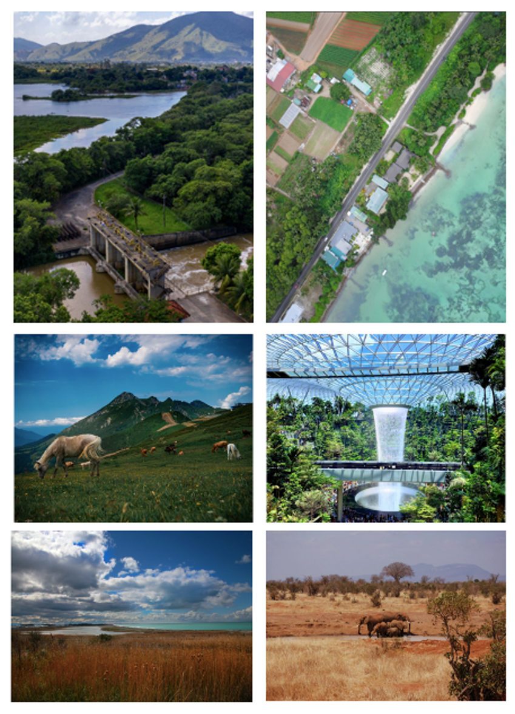
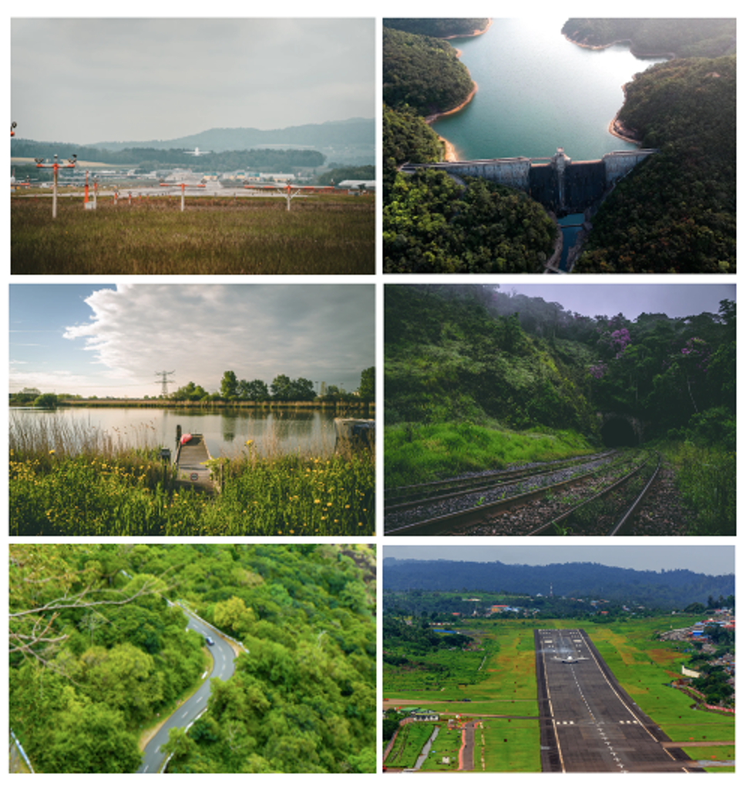
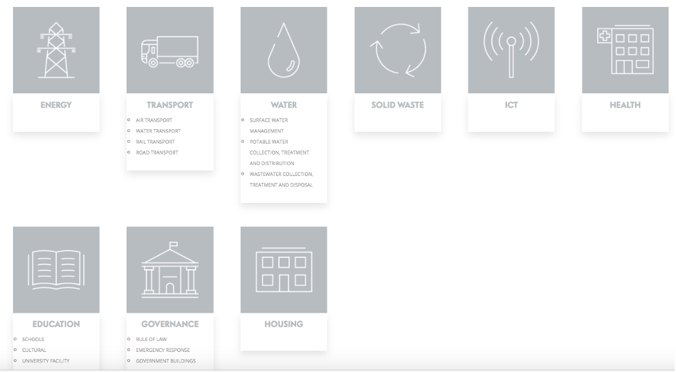

This mini-lecture provides an introduction to nature-based solutions
(NbS) in the context of infrastructure development, which will be
expanded upon in subsequent mini-lectures. It provides a background as
to why and how nature-based solutions can be strategically included in
different infrastructure sectors.

# Learning objectives

-   Explain the importance of NbS in built infrastructure systems

-   Differentiate between the types of services that nature can provide
    to positively impact infrastructure sectors

-   Recall which tool can be used to support users in identifying *how*
    NbS can be included into different infrastructure sectors for the
    delivery on the SDG targets.

# Importance of planning for NbS in built infrastructure systems

With huge global infrastructure needs and infrastructure investment at a
global high (approximately USD2.3 trillion per year, almost USD100
trillion earmarked for investment by 2040), there is huge opportunity to
influence the achievement of the global goals and move development
towards sustainable, low carbon and resilient outcomes
[@GlobalInfrastructureHub2017].

Long lifespans, high costs and difficulty of reversal of traditional
engineered infrastructure means infrastructure investments lock in
patterns of development for decades to come [@Thacker2019]. There is
therefore a risk that, if the right decisions are not made,
infrastructure investment could lock in unsustainable development
pathways, high-carbon development, render countries vulnerable to
climate impacts and cause increasing social, economic and environmental
costs, including the loss and degradation of existing ecosystems
[@Hall2016]. Integrating natural, 'green' infrastructure with
traditional engineered 'grey' approaches offers an opportunity to
support the achievement of global agendas including the Paris Agreement
and the United Nations Sustainable Development Goals (SDGs), meet
infrastructure and development needs, and simultaneously reverse
ecosystem degradation [@Seddon2020].

It is therefore imperative that nature-based solutions (NbS) are
integrated into plans and decisions on development, infrastructure,
adaptation and investment from the outset, to ensure they are optimised
for sustainable, resilient and climate-compatible development. To do so
requires informed decision-making on infrastructure planning and
investments. This can be challenging, given multiple complexities and
future uncertainties associated with demographic trends, social
perspectives, new technologies, climate change, economic developments
and associated impacts [@Sayers2012; @Haasnoot2019]. The integration
of NbS in such decisions adds additional layers of complexity and
uncertainty, as shown in Table 15.4.1.

**Table 15.4.1:** Sources of uncertainty and complexity surrounding NbS
[@Seddon2020]

  Uncertainty / complexity   Description
  -------------------------- -----------------------------------------------------------------------------------------------------------------------------------------------------------------------------------------------------------------------------------------------------------------------------------------------------------------------------------
  Resilience                 Climate change is likely to impact ecosystems (altitude, location, extinction), but this is not yet well understood
  Functional performance     Predicting NbS performance can be imprecise due to NbS' adaptive nature, condition and uncertainties surrounding long-term potential to maintain service delivery
  Temporal factors           Many NbS take time to implement and achieve full potential for service delivery and some have seasonal functionality, which can be a factor in suitability for implementation. Delays to benefit accrual mean cost-benefit ratios can vary over time
  Unforeseen consequences    Interconnectedness of nature means actions in one area can impact elsewhere in the system, but these are not always understood. For example, species type and diversity impact surface, sub-surface and atmospheric processes, including water tables, biodiversity, pest resilience, disease, climate change and NbS performance
  Governance                 Managing NbS under shifting social, economic and political conditions is challenging, particularly where land rights are unclear.

# Introduction to infrastructure and NbS

Without consideration of nature in infrastructure planning and
decision-making, there is a risk that development could undermine the
provision of existing ecosystem services through the loss, displacement
and degradation of nature. Poorly planned infrastructure can impact
ecosystems, biodiversity and the natural environment in multiple ways,
including through carbon emissions, habitat fragmentation, opening up
habitats to new exploitation, biodiversity loss, pollution with solid,
liquid and gaseous toxins, exacerbation of soil erosion and slope
instability, and nutrient leaching.

NbS offer opportunities to address these problems and progress
development agendas including the SDGs, Paris Agreement and Global
Decade of Ecosystem Restoration, at the same time as providing multiple
benefits to engineered infrastructure systems, through strategic
integration with built infrastructure solutions [@Seddon2020;
@Kapos2019]. NbS can substitute for core infrastructure services,
complement built infrastructure in order to reduce built infrastructure
requirements, increase the resilience of engineered solutions through
protective services, and provide benefits to sector workers whilst
simultaneously delivering co-benefits [@Browder2019].
Correspondingly, loss of nature can undermine built infrastructure
system performance, leading to reduced resilience, higher climate
damage, increased costs and undermining progress on the SDGs
[@Fuldauer2021].

{width=100%}

**Figure 15.4.1:** Erosion in the watershed
of Peligre dam in Haiti has reduced its capacity by half, reducing the
hydrogeneration potential and its ability to support irrigation and
flood control. Photograph: Unsplash

{width=100%}

**Figure 15.4.2:** Deforested lands can cause landslides or runoff and
damage transport networks. Photograph: Unsplash

{width=100%}

**Figure 15.4.3:** Loss of riparian
vegetation can cause turbidity issues and sedimentation of water courses
and reservoirs. Photograph: Unsplash

Green infrastructure proponents argue that strategic integration of NbS
in different infrastructure sectors can enhance positive impacts through
the ability of NbS to provide multiple co-benefits, both within and
beyond the sector, if implemented with consideration. These include
increased flexibility, adaptability, resilience to climate change,
carbon sequestration, empowered communities, lower costs, and additional
benefits for biodiversity and society [@Cohen-Shacham2016;@Ozment2015;@Blicharska2019].

**Table 15.4.2:** Potential benefits of integrating NbS in built
infrastructure sectors [@Browder2019;@Kapos2019]

  Benefit                          Description
  -------------------------------- ------------------------------------------------------------------------------------------------------------------------------------------------------------------------------------------------------------------------------------------------------------------
  Increased resilience             NbS can naturally regenerate after a hazard and are more adaptable to changing climates. NbS can safeguard grey infrastructure
  Flexibility for adaptation       NbS can adapt to climate change (e.g. landward shift of mangroves), and address climate impacts. By using pure NbS or hybrid (engineered and natural) approaches, infrastructure systems can recover and adapt to changing conditions better
  Improved service delivery        For example, restoring upland forests and riparian vegetation can support delivery of water or hydropower energy through stabilising sediments and reducing sedimentation of reservoirs
  Relative ease of reversibility   Many NbS offer ease of reversibility, particularly those relating to management of ecosystems
  Climate mitigation               Many NbS offer opportunities for carbon sequestration (e.g. peatlands, wetlands, soils, seagrass, reefs as well as forests)
  Empowered communities            Well-implemented NbS are based on active engagement with local and indigenous communities
  Lower cost / cost-effective      Many NbS enable infrastructure services to be provided at a lower cost by reducing grey infrastructure and maintenance requirements. NbS can provide additional economic benefits due to co-benefits
  Co-benefits                      NbS offer many potential economic, social and environmental co-benefits. These include biodiversity conservation, climate mitigation, conservation of traditional knowledge, recreation and tourism, enhanced food security, job creation and inward investment.

# NbS underpinning built infrastructure

Infrastructure systems depend on various ecosystem services to fulfil
their functions [@Browder2019]. However, to date, infrastructure
assessments and investments have traditionally focused on the built
environment, encompassing grey engineered infrastructure and the
services that built infrastructure can provide, rather than nature-based
infrastructure. As such, traditional infrastructure has played an
important role in overcoming development challenges to date and will
continue to provide many essential services going forward
[@Kapos2019]. However, in the face of increasing global challenges,
there is growing recognition that grey infrastructure approaches alone
can no longer provide the climate resilience and services required
[@Browder2019].

Engineered infrastructure systems are falling short of meeting
socio-economic needs, with issues of affordability, reliability,
resilience, integration and damage. Many engineered infrastructure
systems serve to exacerbate environmental issues through displacement of
nature, loss of natural carbon sinks and emissions of greenhouse gases.

Moreover, climate change and associated impacts pose a high risk to
infrastructure and threaten the infrastructure services and development
gains achieved to date. As climate change increases the frequency and
intensity of climate impacts (e.g. extreme weather events, sea level
rise), existing infrastructure systems are exposed to increasing stress,
and countries risk having development progress stalled, and face
mounting debt burdens for infrastructure repairs [@IPCC2018].

The dependencies of infrastructure systems on nature have not yet been
fully understood or appreciated, and there is a growing realisation that
the services provided by nature have been undervalued in development
decisions and investments [@Fuldauer2021; @Seddon2020].

{width=100%}

**Figure 15.4.4:** Ecosystems provide
services which benefit infrastructure. For example, forests can support
hydropower generation. Coastal mangroves and reef systems can dissipate
wave energy and protect coastlines and ports from coastal hazards.
Improved grazing management can reduce soil erosion and sedimentation of
reservoirs. Urban green spaces can reduce the urban heat island effect
and improve cognitive functioning and economic productivity. Reed beds,
wetlands and salt marshes can filter pollutants, contributing to
wastewater treatment. Grasslands can tolerate wildfire, retain moisture
and support resilience to heat and drought. Photographs from Unsplash
and @Browder2019.

# Integrating the green and the grey

In many circumstances, combining green infrastructure with grey
infrastructure, such as dams, levees, reservoirs, treatment systems, and
pipes, can provide next generation solutions that enhance system
performance and better protect communities [@Browder2019;
@Kapos2019]. Benefits include:

-   **Core infrastructure services:** Natural ecosystems are recognised
    for their ability to substitute for core infrastructure services,
    particularly flood management, water purification and storage
    [@Thacker2019]. NbS are increasingly being used in urban areas,
    for example for Sustainable Urban Drainage Systems

-   **Complementary infrastructure services:** NbS can be integrated
    into infrastructure sectors to support service delivery and reduce
    requirements for grey solutions. For example, using ponds and reed
    beds to treat sewage can reduce requirements for engineered
    wastewater treatment solutions; using wetlands to help recharge
    groundwater and afforestation to substitute for flood protection can
    provide risk management services; restoring riparian vegetation can
    reduce sedimentation of reservoirs, supporting potable water supply

-   **Protective services:** NbS offer opportunities to increase the
    resilience of engineered infrastructure and support the achievement
    of climate and development outcomes. The vulnerability of different
    sectors to many of the same climate-related hazards means that NbS
    for specific hazards may be applicable in multiple sectors

-   **Workforce health:** Integrating NbS into buildings and across
    different infrastructure sectors can enhance mental well-being of
    sector workers, improve health and reduce work absences, and
    increase cognitive functioning and productivity

-   **Co-benefits:** Well-managed, healthy ecosystems can offer a
    multitude of additional environmental, social and economic
    co-benefits, beyond those of traditional ecosystems.

{width=100%}

**Figure 15.4.5:** Integrating nature in
infrastructure sectors can provide a variety of benefits, including the
provision of protective services (e.g. protection from flooding). NbS
can enhance built infrastructure lifespan and reduce maintenance
requirements. At the same time, nature provides aesthetic value and
benefits including improved air quality, mental health and well-being
and carbon sequestration. Photographs from Unsplash

# Enhancing service provision and delivering on the SDGs through integrating NbS into built infrastructure systems

As introduced in mini-lecture 15.2, nature has the potential to
influence multiple targets of the SDGs, beyond those specific to
ecosystems (SDG goals 14 and 15). Building on this understanding,
infrastructure and development decision-makers can strategically
incorporate nature into infrastructure projects to maximise impact on
the SDGs or progress specific SDGs and targets of interest.

Recent research undertaken by the United Nations Office for Project
Services (UNOPS), the United Nations Environment Programme (UNEP) and
the University of Oxford has identified the potential for NBS to be
included into a broad range of different infrastructure sectors, in
order to deliver on the targets of the SDGs. In an online tool called
'[*The SustainABLE Module on Nature-based
solutions*](https://sustainable.unops.org/)', this research shows
specific actions, best practice resources and case studies to inform
infrastructure practitioners on *how* to strategically integrate nature
to increase the potential influences across the SDG targets.

{width=100%}

**Figure 15.4.6:** The SustainABLE tool covers a broad range of sectors
[@UNOPS2019]

This research found that, across all sectors, the strategic integration
of NbS for solely sector-related benefits can influence 82% of the SDGs
(14) and almost half of SDG targets (78; 46%). Integration of NbS for
wider co-benefits beyond the sector has the potential to influence all
SDGs and 59% of SDG targets (100).

The next 8 mini-lectures will further explore *how* NbS can be
strategically integrated into different infrastructure sectors in order
to deliver benefits within and beyond the sector. Hands-on 10 provides a
step-by-step walkthrough of the SustainABLE tool.

# Summary

NbS underpin the functioning of infrastructure through delivery of
ecosystem services. They can be leveraged to provide various benefits to
infrastructure, including substituting for or complementing service
delivery, reducing built infrastructure or maintenance requirements,
increasing resilience of infrastructure systems and enhancing the health
and productivity of sector stakeholders. By integrating different
ecosystem services provided by nature into built infrastructure sectors,
we can achieve positive influences for the sector, and broader social,
environmental and economic gains. The SustainABLE tool can help those
who want to leverage nature to understand how NbS can be incorporated
into different sectors to achieve these benefits.
