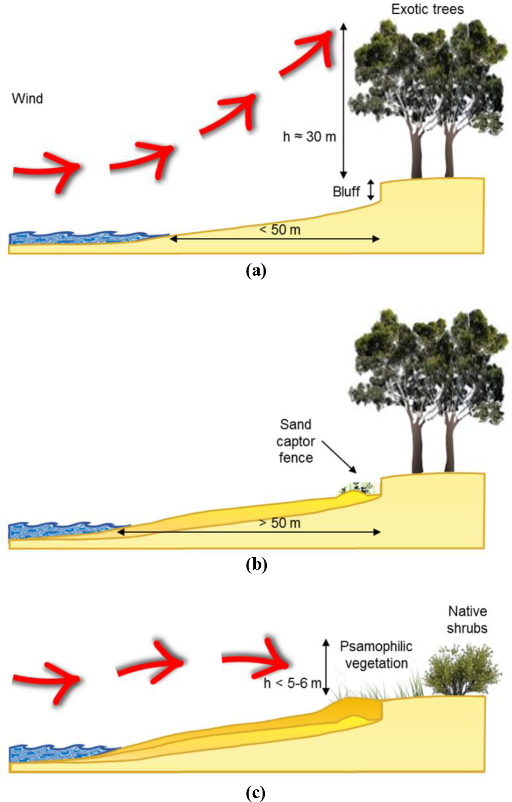

This lecture provides an overview of the applications of nature-based
solutions for coastal protection. The principles underlying such
applications are illustrated, particularly, how nature-based solutions
provide flexibility and adaptation under a changing climate. Examples of
implementing nature-based solutions for coastal protection in practice
are presented. 

# Learning objectives

-   Recognise the value of nature-based solutions for coastal protection

-   Obtain a basic understanding of how nature-based solutions will
    adjust and adapt to future climate along the coast.

# Vital coastal ecosystems

Human settlements are concentrated near the coast (Figure 16.2.1). Over
40% of the world's population lives within 100 km of the coastline
[@Martinez2017]. The coastal urban population has doubled in the last
40 years from 45 to 88 million [@Martino2016]. Seven of the world's
10 largest cities are coastal [@Martino2016]:

1. Los Angeles, USA (coastal)

2. Tokyo, Japan (coastal)

3. Jakarta, Indonesia (coastal)

4. Guangzhou/Dongguan (coastal)

5. New York City, USA (coastal)

6. Chicago, USA

7. Johannesburg/Pretoria, South Africa

8. Dallas, USA

9. Miami, USA (coastal)

10. Osaka, Japan (coastal).

{width=100%}

**Figure 16.2.1:** Global population grid in 3D[@Martino2016]

Various coastal ecosystems, such as coastal wetlands including mangroves
and marshes, coral and oyster reefs, sand beaches and dunes, and
seagrass, are located around different regions of the world (Figure
16.2.2). These coastal ecosystems provide vital provisioning,
regulation, supporting, and cultural services:

-   **Provisioning service:** products generated from the ecosystem,
    such as fish, shellfish, and wood 

-   **Regulating service:** the regulation of ecosystem processes, such
    as erosion control, flood regulation, storm protection, water
    purification, and climate regulation 

-   **Supporting service:** the support of all other ecosystem services,
    such as soil formation, primary production, and nutrient cycling 

-   **Cultural service:** the spiritual and emotional benefits people
    obtain from ecosystems, such as cultural heritage values, tourism,
    and recreation.

These services can be vital to coastal communities, such as food
provision and storm protection, and to the global society, such as
biodiversity conservation and climate mitigation. 

{width=100%}

**Figure 16.2.2:** Global distribution of kelp forests, mangroves, salt marsh, and seagrass [@RN501]

This lecture will provide an overview of the applications of
nature-based solutions in coastal protection. The principles underlying
such applications will be illustrated, particularly how nature-based
solutions provide flexibility and adaptation under a changing climate.
Examples of implementing nature-based solutions for coastal protection
in practice will also be presented. 

# Nature-based solutions for coastal protection

Under a changing climate, coastal communities are under increasing
threats from rising sea-levels and more frequent and intense tropical
cyclone. By 2050, sea-level rise of at least 0.5m compared to the 2000
to 2004 baseline period will affect nearly 600 low-lying coastal cities,
leading to potential economic losses of up to USD1 trillion
[@Kapos2019]. The globally-averaged storm intensity is expected to
increase by 2--11% by 2100 due to greenhouse warming, and the storm
surges are likely to increase with the rising sea-level [@Knutson2010;
@Smith2010].

One of the most important services coastal ecosystem provide is the
protection to coastal communities. Nature-based solutions for coastal
protection include protecting, managing, or restoring coastal ecosystems
to act against hazards such as flooding, shoreline erosion, storm damage
and sea-level rise. The world's existing mangroves are estimated to
reduce the number of people affected by coastal flooding globally by
some 39%, and the total value of flooding-related property damage by
16% [@Losada2018]. Without the world's coral reefs, global annual
damages from coastal flooding would double, the costs from frequent
storms would triple, and the costs of flood damage from severe storms
(100-year events) would increase by over 90% to USD272 billion
[@Kapos2019].  

Nature-based solutions are more sustainable and ecologically sound
compared to conventional coastal engineering structures, and are able to
provide valuable co-benefits. Table 16.2.1 summarises the engineered and
nature-based options for coastal protection and highlights some of the
co-benefits of the nature-based solutions. 

**Table 16.2.1:** Nature-based solutions for coastal protection and their co-benefits [@Kapos2019; @WorldBank2016]

+----------------+----------------+----------------+----------------+
| Hazards        | Hard           | Nature-based   | Co-benefits    |
|                | Engineering    | solutions      |                |
|                | options        |                |                |
+================+================+================+================+
| Flooding       | -              | -   Coastal    | -   Provision  |
|                |   Seawall/dyke |     wetlands   |     of fishery |
|                |                |     such as    |     and forest |
|                | -   Levees     |     mangroves  |     products   |
|                |                |     and        |                |
|                |                |     marshes    | -              |
|                |                |     can        |  Opportunity   |
|                |                |     provide    |  for           |
|                |                |     areas of   |  tourism       |
|                |                |     extra      |  and           |
|                |                |     water      |  recreation    |
|                |                |     storage    |  opportunities |
|                |                |     and        |                |
|                |                |     prevent    |                |
|                |                |     storm      | -              |
|                |                |     surges     |    Enhancement |
|                |                |     from       |     of         |
|                |                |     reaching   |   biodiversity |
|                |                |     inland     |     and        |
|                |                |     areas      |     habitats   |
|                |                |                |     for        |
|                |                |                |   economically |
|                |                |                |     or         |
|                |                |                |   ecologically |
|                |                |                |     important  |
|                |                |                |     species    |
|                |                |                |                |
|                |                |                |                |
|                |                |                | -   Carbon     |
|                |                |                |  sequestration |
|                |                |                |     for        |
|                |                |                |     climate    |
|                |                |                |     mitigation |
+----------------+----------------+----------------+----------------+
| Shoreline      | -              | -   Protect    |                |
| erosion        |   Seawall/dyke |     remaining  |                |
|                |                |     intertidal |                |
|                | -              |     ecosystems |                |
|                |    Breakwaters |     such as    |                |
|                |                |     muds,      |                |
|                |                |   saltmarshes, |                |
|                |                |     mangrove,  |                |
|                |                |     seagrass,  |                |
|                |                |     and        |                |
|                |                |     vegetated  |                |
|                |                |     dunes from |                |
|                |                |     further    |                |
|                |                |   degradation, |                |
|                |                | fragmentation, |                |
|                |                |     and loss   |                |
|                |                |                |                |
|                |                | -   Coastal    |                |
|                |                |     wetlands   |                |
|                |                |     can trap   |                |
|                |                |     sediment   |                |
|                |                |                |                |
|                |                | -   Coastal    |                |
|                |                |     ecosystems |                |
|                |                |     can reduce |                |
|                |                |     energy of  |                |
|                |                |     tidal      |                |
|                |                |     waves and  |                |
|                |                |     storm      |                |
|                |                |     surges,    |                |
|                |                |     and thus   |                |
|                |                |     reduce     |                |
|                |                |     their      |                |
|                |                |     height and |                |
|                |                |     velocity   |                |
+----------------+----------------+----------------+----------------+
| Storm damage   | -              | -   Coastal    |                |
|                |   Seawall/dyke |     marsh and  |                |
|                |                |     dune       |                |
|                | -   Levees     |     management |                |
|                |                |     and        |                |
|                |                |    restoration |                |
|                |                |     can        |                |
|                |                |     dissipate  |                |
|                |                |     wave       |                |
|                |                |     energy and |                |
|                |                |     storm      |                |
|                |                |     winds      |                |
+----------------+----------------+----------------+----------------+
| Sea-level rise | -              | -   Coastal    |                |
|                |   Seawall/dyke |     wetlands   |                |
|                |                |     such as    |                |
|                | -   Levee      |     mangroves  |                |
|                |                |     and        |                |
|                | -   Pumping    |     marshes    |                |
|                |     stations   |     trap       |                |
|                |                |     sediment   |                |
|                |                |     and        |                |
|                |                |     increase   |                |
|                |                |     elevation  |                |
+----------------+----------------+----------------+----------------+
| Pollution,     | -   Wastewater | -   Re-        |                |
| eutrophication |     treatment  | establishment  |                |
| hypoxia        |     plant      |     and        |                |
|                |                |    restoration |                |
|                |                |     of coastal |                |
|                |                |     wetlands   |                |
|                |                |     to reduce  |                |
|                |                |     nutrients  |                |
|                |                |     and other  |                |
|                |                |     pollutants |                |
|                |                |     in coastal |                |
|                |                |     waters     |                |
|                |                |                |                |
|                |                | -              |                |
|                |                |    Restoration |                |
|                |                |     or         |                |
|                |                |     creation   |                |
|                |                |     of         |                |
|                |                |     shellfish  |                |
|                |                |     reefs to   |                |
|                |                |     restore    |                |
|                |                |     active     |                |
|                |                |     filtration |                |
|                |                |     of         |                |
|                |                |     suspended  |                |
|                |                |     sediments  |                |
|                |                |     and        |                |
|                |                |     removal of |                |
|                |                |     nutrients  |                |
|                |                |     and other  |                |
|                |                |     pollutants |                |
+----------------+----------------+----------------+----------------+
| Salinisation   | -   Irrigation | -   Coastal    |                |
|                |                |     wetlands   |                |
|                |                |     can        |                |
|                |                |     stabilise  |                |
|                |                |     shoreline  |                |
|                |                |     and        |                |
|                |                |     prevent    |                |
|                |                |     sea water  |                |
|                |                |     reaching   |                |
|                |                |     inland     |                |
|                |                |     areas      |                |
+----------------+----------------+----------------+----------------+

Index-based and processing-driven tools are developed to spatially
estimate the role and value of natural habitats in coastal protection
and risk reduction, including the Coastal Vulnerability Module in the
Integrated Valuation of Ecosystem Services and Trade-offs (InVEST), the
Artificial Intelligence for Ecosystem Services (ARIES), and the
Multiscale Integrated Models of Ecosystem Services (MIMES). A more
through discussion of the tools can be found in a report by the World
Bank [@WorldBank2016].

# The flexibility and adaptation of nature-based solutions under climate change

As discussed above, coastal ecosystems provide protection against
natural hazards and are able to self-adjust under different future
climates. Conventional grey solutions, on the other hand, may fail in a
future climate that is different than the one they were designed for.
Coastal vegetation is able to adjust to sea-level by inorganic and
organic accretion[@WorldBank2016], leading to self-expansion and
increase in land area despite a rising sea-level [@Zhai2019].

Moreover, coastal vegetation can mitigate climate change by sequestering
CO~2~. The carbon stored in coastal wetlands is an important component
of the global carbon budget[@Duarte2013]. Coastal marshes have high
primary production, efficiently trapping suspended organic carbon when
flooded, and undergoing slow carbon decomposition rates under anaerobic
conditions [@McLeod2011; @Nellemann2009]. The amount of carbon
stored per unit area in stable coastal marshes can be far greater than
that of forests, and the carbon stored may remain for millennia, as
compared to decades or centuries in forests [@Windham-Myers2018].
Figure 16.2.3 shows the key processes of vegetated coastal habitats for
climate change mitigation and adaptation.

{width=100%}

**Figure 16.2.3:** Key processes of vegetated coastal habitats for
climate change mitigation and adaptation [@Duarte2013].
Processes that affect the capacity for climate change mitigation
(CO~2~ sinks) and adaptation (shoreline protection from rising sea level)
are shown for seagrass meadows (upper panel), salt marshes (middle panel)
and mangrove forests (lower panel).
Blue arrows indicate transport of atmospheric or dissolved material,
red arrows show transport of particulates and purple arrows indicate vegetative growth.

However, the ability of coastal ecosystem to adjust to a changing
climate can be impaired by anthropogenic activities, such as land
convention and limiting the potential expansion of the
ecosystem[@Richards2016]. In order to have effective nature-based
solutions, strategies should also account for the natural and human
constraints in the region of interest.

# Nature-based solutions for storm protection: Case study in Bangladesh

Bangladesh, a tropical developing country, faces high stress from
hurricanes, but also houses the world's largest stretch of mangrove
forests. The mangroves provide various goods and services to the local
population. Particularly, mangroves in the area can substantially reduce
water flow velocity (by 29--92%) and surge height (by 4--16.5 cm)
[@Dasgupta2019]. Nevertheless, the mangrove forests are subject to
rapid degradation (Figure 16.2.4). Since 1966, Bangladesh has
established different coastal afforestation programmes to conserve and
restore their mangrove for cyclone protection and improved stabilisation
of the coastal area. These programmes aim to:

-   Mitigate disastrous effects of cyclones and storm surges (primary)

-   Supply urgently needed resources for the national economy (i.e.
    timber and new land for agriculture)

-   Create employment opportunities for remote rural communities

-   Develop suitable environments for wildlife, fish, and other
    estuarine and marine fauna.

{width=100%}

**Figure 16.2.4:** Land cover maps of the Sundarban mangrove forest, obtained from Landsat image classification for (a) 1975/1977, (b) 1989, (c) 2000 and (d) 2010. Cyclone tracks of November 1970, November 1988, and that of cyclone SIDR in November 2007 are shown on classified image of 1975, 1989 and 2010 respectively [@Quader2017]

The program has achieved a certain level of success by accreting
approximately 500km^2^ of new land in Bangladesh each year
[@Iftekhar2004]. However, the survival rate of the planted mangrove
is low due to the dynamic nature of the Bangladesh coast, requiring
replacement planting every 3 years on average [@Saenger1993]. In
addition, while it usually takes 20 years for the new land to become
mature enough for human settlement, people start to clear forest and
begin living and developing shrimp farms on the new land 5 to 6 years
after new land formation [@Iftekhar2004].

# Nature-based solutions for coastal resilience: Case study in Uruguay

Over 10 % of Uruguay's population live in the low elevation coastal zone
[@Villamizar2016]. In 2012, Kiyú, at the Rio de la Plata's tidal
river estuary coast, was impacted by a storm and experienced a total
direct loss of USD1,000,000. After the event, a sub-national government,
the Departmental Office of Climate Change (DOCC), was formed to lead a
pilot adaptation programme of using nature-based solutions to improve
the resilience of Kiyú against extreme events [@Carro2018].

This programme was implemented through:

1. An integrated coastal management framework with five phases:
    identification and selection of key management elements; action
    planning; formal adoption and funding; implementation; and
    evaluation

2. A vulnerability reduction assessment to assess local stakeholders'
    vulnerability and risk perception

3. Ecosystem-based adaptation measures to achieve a three-way synergy
    between ecosystem conservation, socioeconomic development, and
    climate adaptation

4. A beach profiling programme to monitor changes in the beach slope
    and width.

The implemented ecosystem-based adaptation measures are a mix of
nature-based solutions and hard engineering approaches:

1. Building 1,200m of captor fences to capture the sand moved by the
    wind

2. Re-structuring local forest vegetation by cutting large-size
    Eucalyptus trees (\~30m high) and planting native shrubs behind the
    fence captor (Figure 16.2.5)

3. Constructing over 600m of gutters (storm drains) to reduce erosion
    and re-profiling coastal roads to allow the rainwater to enter the
    gutters.

{width=100%}

**Figure 16.2.5:** Schematic representation of the beach profile (a) before, and (b) after the implementation of soft interventions. Panel (c) shows the desired near-future state, illustrating an ideal rebuilding of both beach profile and ridge of dunes [@Carro2018].

The Kiyú pilot project was implemented in 2013 and 2014. It demonstrated
sufficient success for Uruguay to launch a second cycle of coastal
management projects, expanding the actions along the coast of San José,
starting 2015.

# Summary

Nature-based solutions provide effective coastal protection. More
importantly, nature-based solutions offer extra flexibility and
adaptation to a changing climate compared to traditional grey
engineering options. The case studies of restoring mangroves in
Bangladesh for storm protection and of planting native shrubs in Uruguay
for preventing shoreline erosion have demonstrated how nature-based
solutions can be implemented to protect coastal communities in the real
world.
