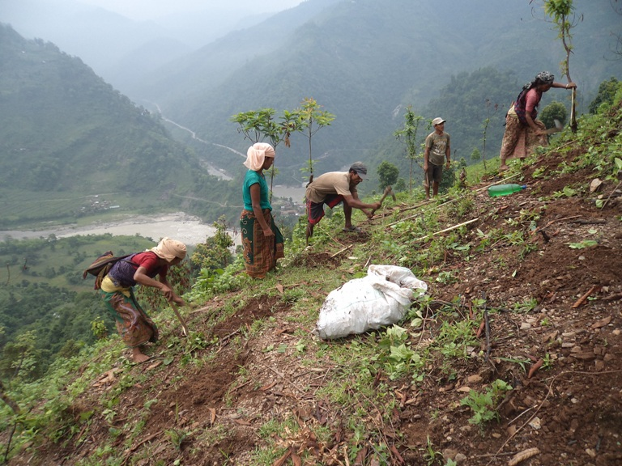

This mini-lecture provides an overview of how nature-based solutions can
be used for erosion and landslides control. Case studies are presented
to show some of these solutions in practice.

# Learning objectives

-   Obtain a portfolio of nature-based solutions for both erosion and
    landslide mitigation
-   Appreciate the value of nature-based solutions in addressing the
    hazards of erosion and landslides.

# Introduction

Climate change is anticipated to make extreme events more common.
Intense precipitation events can lead to soil erosion and landslides
that can have dramatic consequences on the livelihoods of affected
people. Between 2004 and 2016, almost 56,000 people were killed by
landslides globally [@Kapos2019], with most frequent occurrences in
India, China, the Philippines and Nepal where high precipitation events
and frequent earthquakes coincide [@Stokes2014;@EEA2015]. Soil
erosion similarly has huge consequences, particularly on the
agricultural sector where economic losses from erosion of arable lands
have been estimated at USD400 billion globally per year [@Kapos2019].
Shallow landslides and upstream soil loss can also generate high
sediment yields that are transported downstream, causing reservoir
sedimentation and pollution; riverbanks and dikes are particularly
sensitive to damage from such scouring forces from increased sediment in
the river [@Stokes2014].

The global increase in landslides is caused by more extreme rainfall
events, combined with overexploitation of natural resources,
deforestation, uncontrolled land use, grazing and/or construction
[@EEA2015;@Stokes2014]. The destruction of forest cover for
clear-cut areas and logging roads have been identified as particularly
important driving factors [@EEA2015].

In this mini-lecture, we will look at how nature-based solutions can be
used to address the challenges of soil erosion and landslides. First, we
will assess nature-based solutions for erosion control with an example
in Bangladesh, and then for landslide management with a case study in
Nepal.

# Nature-based solutions for erosion control

Climate-related erosion occurs predominantly near waterbodies, as the
force of water or waves exert pressures on unstable soils. A clear
pattern emerges in the literature on nature-based solutions for erosion
control, which is that planting vegetation along coastlines and
riverbanks can play an important role in soil stabilisation. This is
exemplified in Table 16.3.1 below, which provides a portfolio of
different nature-based solutions for erosion in both riverine and
coastal environments.

**Table 16.3.1:** Nature-based solutions for riverine and coastal
erosion [@Kapos2019]

+----------------+----------------+----------------+----------------+
| **Erosion      | **Ha           | **Nature-based | **             |
| type **        | rd Engineering | solutions **   | Co-benefits ** |
|                | options **     |                |                |
+================+================+================+================+
| **Riverine**   | -   River      | -   Riparian   | -   Reduced    |
|                |     walls      |     buffers-   |     fluvial    |
|                |                |     vegetate   |     flood risk |
|                | -   Concrete   |     riverbanks |                |
|                |     river      |     to         | -   Improved   |
|                |                |     stabilise  |     water      |
|                |    embankments |     the soils  |     quality    |
|                |                |     from       |     through    |
|                | -   Riverine   |     erosion    |     natural    |
|                |     groynes    |                |                |
|                |                | -              |    filtration  |
|                | -   Sandbags   |   Agroforestry |                |
|                |     (not truly |     and/or     | -   Carbon     |
|                |     hard       |                |                |
|                |                |  "conservation |  sequestration |
|                |   engineering) |                |     and        |
|                |                |   agriculture" |     storage    |
|                |                |     within     |                |
|                |                |     watershed  | -              |
|                |                |     -- enhance |    Pollination |
|                |                |     canopy     |     services   |
|                |                |                |                |
|                |                |   interception | -              |
|                |                |     of         |   Biodiversity |
|                |                |     rainfall   |                |
|                |                |     reducing   |   conservation |
|                |                |     soil       |                |
|                |                |     exposure   |                |
|                |                |     and        |                |
|                |                |     erosion    |                |
+----------------+----------------+----------------+----------------+
| **Co           | -   Coastal    | -   Mangrove   | -   Reduced    |
| astal/Tidal ** |     dykes and  |     protection |     coastal    |
|                |     levees     |     and        |     flood risk |
|                |                |                |                |
|                | -   Sea walls  |    restoration | -   Improved   |
|                |                |     to anchor  |     fish       |
|                | -   Temporary  |     sediments  |     stocks     |
|                |     storm      |     and        |                |
|                |     barriers   |     dissipate  | -              |
|                |                |                |   Biodiversity |
|                | -              |   wave energy  |                |
|                |   Breakwaters  |                |  conservation  |
|                |                | -   Coastal    |                |
|                |                |     marsh and  | -   Carbon     |
|                |                |     dune       |                |
|                |                |     management |  sequestration |
|                |                |     and        |     and        |
|                |                |                |     storage    |
|                |                |    restoration |                |
|                |                |     to         | -   Tourism    |
|                |                |     dissipate  |     and        |
|                |                |                |                |
|                |                |   wave energy  |    recreation  |
|                |                |                |                |
|                |                | -   Coral      |                |
|                |                |                |                |
|                |                |    reef and/or |                |
|                |                |     oyster     |                |
|                |                |     re         |                |
|                |                | ef restoration |                |
|                |                |     and        |                |
|                |                |     management |                |
|                |                |     to         |                |
|                |                |     attenuate  |                |
|                |                |     wave       |                |
|                |                |     energy     |                |
|                |                |                |                |
|                |                | -   Sea        |                |
|                |                |     grass --   |                |
|                |                |     stabilises |                |
|                |                |     sediment   |                |
|                |                |                |                |
|                |                |  and regulates |                |
|                |                |     water      |                |
|                |                |     currents   |                |
|                |                |     that       |                |
|                |                |     contribute |                |
|                |                |     to coastal |                |
|                |                |     erosion    |                |
+----------------+----------------+----------------+----------------+

As evident from the table, vegetating river catchments, particularly along the riverbanks, can stabilise the soil and reduce the risk to erosion. This vegetation also acts as cover for soil, reducing its exposure to surface soil erosion. In coastal areas, measures are centred around reducing the wave energy reaching the coastline. Mangroves are the most well-known nature-based solution for coastal protection from erosion; however, in areas where mangroves are not native, such as the UK for instance, sea grass has played a key role in regulating water currents and stabilising sediments, reducing the rates of erosion observed.
We will now show how nature-based solutions have been used in addressing the erosion challenges faced in Bangladesh.

# Case study of nature-based solutions for erosion control: Bangladesh

Bangladesh is a nation of rivers. It is home to the
Ganges-Brahmaputra-Meghna (GBM) delta, with over 700 tributaries and
distributaries. Mini-lecture 16.2 illustrated how the Sundarban mangrove
forest can protect Bangladesh from storm-surge flooding in the coastal
zone; here, we use Bangladesh as an example of nature-based solutions
for riverine erosion.

Riverine erosion is one of the main drivers of pushing new households
into poverty in Bangladesh. Approximately 15-20 million people are at
risk from the impacts of erosion across the country [@Rahman2015].
Along the Brahmaputra alone, 870km^2^ of land has been lost since 1973.
After decades of hard-engineering management measures, it has become
evident that engineering structures are not able to control the dynamic
nature of these vast river systems. Instead, a mosaic of nature-based
solutions in different local areas along riverbanks and coastal regions
have shown to be effective with erosion management:

-   Planting vetiver grass *(Chrysopogon zizanoides)* to protect the
    surface of existing earthen embankments from erosion [@Zaman2016]

-   Encouraging farmers to leave a few centimetres of stem from their
    crops during harvest in order to trap suspended sediments and
    prevent soil erosion [@Khalequzzaman1994]

-   Breaching of existing embankments (locally termed Tidal River
    Management) in order to re-establish the natural sedimentation
    patterns between river and floodplain and reduce the scouring on
    existing erosion and flood infrastructure.

In this complex and dynamic environment, one solution will not solve the
issue of erosion, but rather a combination of localised mitigation
measures, and strong collaboration between decision-makers, researchers,
engineers, local authorities and local communities.

# Nature-based solutions for landslides

Similar to nature-based solutions for erosion, vegetation can be used to
stabilise slopes that are prone to landslides. Thick roots act like
nails in the soil on slopes, reinforcing the soil [@Stokes2014;@EEA2015].
To effectively stabilise a slope against shallow
landslides, plant roots must cross the sheer surface, which may be up to
2m deep [@Stokes2014; ADPC2020]. Thinner and finer roots can hold the
topsoil together and can reinforce soil by adding cohesion
[@Stokes2014]. The effectiveness of vegetation in protecting slopes
depends on the architecture and extent of the root system; root depth
and distribution have been identified as the most important properties
for slope stabilisation [@ADPC2020]. Vegetation can therefore
stabilise soil through its roots, but also protect the soil surface from
surface erosion as well as from gully formation [@ADPC2020].

Vegetating slopes for stabilisation is predominantly done by planting
live cuttings and rooted plants into the ground in various arrangements
and geometric arrays, in a way that will reinforce soil and create
barriers to earth movement [@ADPC2020]. This will help drain excess
water from the slope, enhancing drainage and avoiding soil saturation
and slumping of earth materials [@ADPC2020].

We will now show the use of nature-based solutions for landslide
mitigation in Nepal.

# Case study of nature-based solutions for landslides: Nepal

Nepal is located in a region of heavy precipitation (monsoon
seasonality) and frequent earthquakes. This makes the country one of the
most vulnerable countries in the world to landslides. Nepal has been hit
with more than 4,000 landslides since the devastating earthquake in
April 2015 [@IUCN2021]. Shallow landslides, involving the top 2m of
soil, are very frequent in the hillslopes [@IUCN2014]. Much of the
country's terrain is under stress with the numbers of poorly secured
roads increasing, making slopes even more vulnerable to failure.

Nature-based solutions, in the form of vegetating slopes for
stabilisation, are a cost-effective and locally adapted method along
roadside slopes, riverbanks or cultivated terraces. Examples of
approaches include planting grass lines along contours, turfing, jute
netting together with seedlings, bamboo fencing and vegetated stone
pitching [@IUCN2014]. Typically, a drainage canal, similar to
bioswales, is also built alongside roads to capture some of the excess
runoff during heavy rainfall events and direct it to agricultural fields
[@IUCN2021]. In particular, an indigenous plant called *Amriso* (also
known as broom grass) has been widely used to stabilise slopes in rural
Nepal (Figure 16.3.1). This is a tall and fast-growing plant that has a
weblike network of roots, capturing the soil and holding it together
[@IUCN2021]. Moreover, the plant also provides leaves for good fodder
and stems for fuel and is used to make sweeping brooms [@WWF2013].
The implementation of *Amriso* has caused a noticeable reduction in mud-
and landslides across rural Nepal[@IUCN2021].

The successes of slope stabilisation in Nepal are also linked with
strong involvement of communities in establishing and maintaining these
natural measures of soil stabilisation [IUCN2021].

{width=100%}

**Figure 16.3.1:** Local communities planting *Amriso* along unstable
steep slopes [@WWF2013]

# Summary

This mini-lecture provided an overview of the challenges faced with
erosion and landslides and how nature-based solutions can provide
alternative options to traditional hard-engineering measures. Two case
studies were presented: natural riverine erosion management in
Bangladesh and natural landslide management in Nepal.
