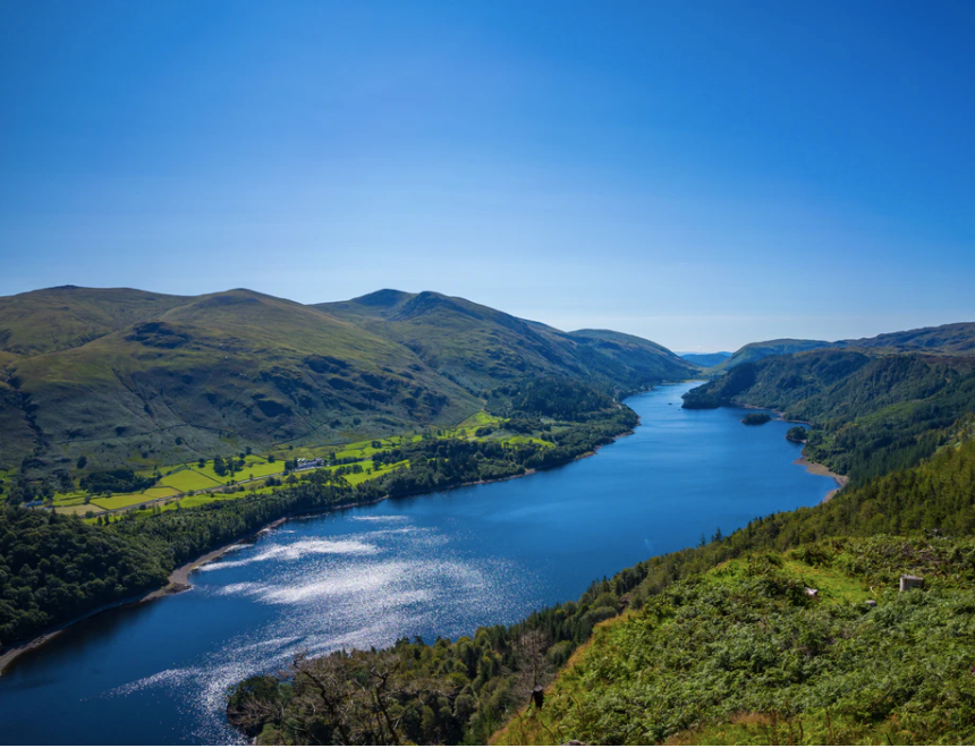

This lecture will consider how nature-based solutions (NbS) can be
strategically incorporated to support the delivery of freshwater supply.
A range of NbS services are illustrated, including their services for
provisioning freshwater, enhancing water quality and preventing
salination of water supplies.

# Learning objectives

-   To recall a range of nature-based solutions which can support the
    delivery of freshwater

-   To consider the ways in which nature-based solutions can enhance
    water quality

-   To recognise the value of integrating nature-based solutions with
    built infrastructure solutions for water supply.

# Introduction

Currently, one-third of people globally do not have access to safe
drinking water, and 5.7 billion people could face some level of water
scarcity by 2050 [@UN2020; @Gurria2020]. A sufficient supply of
quality freshwater is critical for societal functioning, for ensuring
the 7.6 billion people globally have sufficient water for meeting basic
domestic water needs (e.g. water for drinking, cooking and sanitation),
for supporting agriculture and food supply (e.g. water for livestock or
irrigation), and health and industrial activities (e.g. water for
manufacturing) [@UNEP2014].

Grey water infrastructure, including engineered water reservoirs,
treatment plants and distribution pipes, have played a key role in
meeting water-related development needs to date and will be an essential
component of such strategies going forward [@Tremolet2020]. However,
as freshwater originates from the broader natural landscape of
ecosystems, watersheds and underground aquifers, nature-based solutions
have a critical role to play in in regulating water flows, water quality
and ensuring sustainable supplies going forward (see Figures 17.1.1 and
17.1.2) [@UNEP2014].

{width=100%}

**Figure 17.1.1:** The wider natural landscape of watersheds, ecosystems
and underground aquifers have a key role to play in meeting
water-related needs. Photograph from Unsplash.

Through management and restoration of water-related ecosystems, NbS can
complement built infrastructure and reduce requirements for engineered
solutions, often at lower costs, while providing various co-benefits
[@Browder2019]. For example, wetlands can filter contaminants,
reducing requirements for engineered infrastructure such as water
treatment plants, and provide co-benefits including carbon
sequestration, air purification, aesthetic and recreational appeal, food
production, ecotourism, and contribute to risk management [@UNEP2014;
@Blicharska2019].

NbS can support coastal freshwater supplies by acting as a protective
buffer and reducing saline intrusion of inland water supplies
[@UNEP2014]. They can also enhance urban freshwater supplies, by
capturing rainwater for reuse, and mitigating flooding which can
contaminate urban water courses [@IDB2020].

Furthermore, by mitigating climate impacts such as storm surges, NbS can
prevent and reduce damage to built water infrastructure, such as water
reservoirs [@Kapos2019] (see Lecture 16).

{width=100%}

**Figure 17.1.2:** Nature-based solutions for water regulation
[@Cohen-Shacham2016] 

**Table 17.1.1:** Examples of NbS and services for water provision.
Where these ecosystem functions have been degraded or lost, water
providers are likely to face increased costs to provide a regular supply
of quality freshwater [@Tremolet2020;@UNEP2014].

+----------------------------------+----------------------------------+
| Example nature-based solution    | Example services                 |
+==================================+==================================+
| Protection of watersheds         | -   Cities depend on surrounding |
|                                  |     rural areas for water        |
|                                  |     supply. To protect the water |
|                                  |     sources, it often means      |
|                                  |     investing in rural areas far |
|                                  |     beyond city boundaries       |
+----------------------------------+----------------------------------+
| Restoration and protection of    | -   Regulation of peak flows,    |
| upstream forests                 |     recharge of groundwater      |
|                                  |     supplies                     |
+----------------------------------+----------------------------------+
| Restoration, protection and      | -   Regulation of peak flows,    |
| management of riparian           |     recharge of groundwater      |
| vegetation along rivers,         |     supplies                     |
| including wetlands and           |                                  |
| floodplains                      | -   Reduced sedimentation and    |
|                                  |     nutrient pollution in water  |
|                                  |     courses (riparian buffers    |
|                                  |     have efficiency of \>70%)    |
+----------------------------------+----------------------------------+
| Reconnecting rivers to           | -   Regulation of peak flows,    |
| floodplains                      |     recharge of groundwater      |
|                                  |     supplies                     |
|                                  |                                  |
|                                  | -   Setting back or removing     |
|                                  |     levees at the edge of river  |
|                                  |     channels can help increase   |
|                                  |     channel capacity and reduce  |
|                                  |     exposure to floodwaters and  |
|                                  |     erosion risk. Providing more |
|                                  |     room for meandering and      |
|                                  |     healthy floodplains enables  |
|                                  |     the creation of forest and   |
|                                  |     wetland habitats that store  |
|                                  |     water and decrease           |
|                                  |     sedimentation                |
+----------------------------------+----------------------------------+
| Creation of green roofs and      | -   Capture rainfall for         |
| rainwater harvesting systems in  |     domestic use. Regulate       |
| urban areas                      |     runoff and delay peak flows, |
|                                  |     preventing urban water       |
|                                  |     supplies from being          |
|                                  |     contaminated through sewer   |
|                                  |     overflow                     |
+----------------------------------+----------------------------------+
| Creation of permeable pavements  | -   Help water infiltration and  |
| and green spaces in urban areas  |     recharge of water supplies   |
|                                  |     during drought. Support      |
|                                  |     water infiltration and       |
|                                  |     mitigation of flooding and   |
|                                  |     sewer overflow during flood  |
|                                  |     events                       |
+----------------------------------+----------------------------------+
| Improved agricultural management | -   Land use within catchment    |
| practices                        |     areas has a major influence  |
|                                  |     on determining whether       |
|                                  |     watersheds are healthy and   |
|                                  |     can deliver environmental    |
|                                  |     services, and impacts        |
|                                  |     erosion and associated       |
|                                  |     sedimentation                |
+----------------------------------+----------------------------------+
| Protection of coastal ecosystems | -   Coastal ecosystems can       |
| such as oyster and coral reefs   |     protect coastlines and water |
| and mangroves                    |     supplies from saline         |
|                                  |     intrusion                    |
+----------------------------------+----------------------------------+

# Provision and regulation of freshwater flows

Nature-based solutions support freshwater provision through services
including water infiltration and storage, recharging aquifers, ponds and
wetlands [@UNEP2014].

Watersheds and ecosystems located upstream and along watercourses have a
critical role in ensuring water resources, through regulating runoff and
peak flows. For example, Atewa Forest in Ghana has been cited for its
services to ensuring water supply in downstream communities along the
river systems which originate from the forest (Figure 17.1.3)
[@IUCN2016]. Located at the source of the Densu river, which supplies
the Volta Reservoir and Weija dam, the forest regulates water supply to
the capital city of Accra, and safeguards supplies in the face of
drought.

Protection and management of Atewa forest provides benefits to
engineered infrastructure, including reducing requirements for water
discharges from the Weija dam (through regulating peak flows), reducing
desilting requirements and costs, and reducing water treatment
requirements.

{width=100%}

**Figure 17.1.3:** Location of the Atewa Forest, at the source of the
Ayensu, Birim and Densu Rivers which together provide water for 5
million people. Protecting the forest provides co-benefits, including
biodiversity (e.g., internationally recognised coastal wetlands which
are fed by the rivers), carbon sequestration, and supporting local
livelihoods [@IUCN2016].

Wetlands and floodplains can also support water provision through
storing water and supporting infiltration into soils and groundwater
supplies (e.g. underground aquifers). For example, seasonal flooding of
rivers in north-east Ghana recharges wetlands and ponds, which provide
water for livestock [@Mul2015]. This has important impacts on
livelihoods and the SDGs, as sales of livestock in these regions are
used to pay for education, fuel for electricity, health costs, as well
as providing a source of food to communities.

In urban areas, green roofs and rainwater harvesting systems can be
incorporated into buildings for rainwater capture for domestic use,
relieving pressure on urban water supplies [@Enzi2017]. They also
provide key functions to cities, including delaying runoff during
storms, and preventing contamination of urban water supplies due to
sewer overflow.

# Regulation and maintenance of water quality, including reduced sedimentation

A major challenge of meeting water-related development needs is ensuring
and maintaining water quality [@UNEP2014]. Pollution of water
supplies can occur from various point and non-point sources, including
the inflow of organic pollutants from agricultural runoff, heavy metals
which leach from landfills and industry, sedimentation of watercourses
from erosion, and pollution from sewer overflows during flood events.
This has implications for human health (e.g. water-borne diseases),
terrestrial and marine ecosystems, and economic functioning (quality
water underpins industrial functioning and water treatment can incur
high costs).

NbS can play an important role in addressing these challenges, including
reducing erosion and sedimentation within watercourses. For example,
healthy and well-managed ecosystems on high-gradient terrain, along
watercourses (riparian vegetation) and upstream of water systems can
protect potential sediment sources [@UNEP2014]. NbS can stabilise and
protect hill slopes, riverbanks and shorelines, reducing erosion,
associated sedimentation and pollution of watercourses (see mini-lecture
16.3). This preserves the functionality of grey infrastructure such as
water reservoirs, reduces dredging requirements, can increase grey
infrastructure lifespans and result in lower costs to the sector
[@Browder2019].

Improved agricultural management (e.g. improved grazing, agroforestry)
can contribute to soil stability and reduce sedimentation of water
courses resulting from soil erosion on agricultural lands. For example,
conversion of natural lands to cropland accounts for more than
two-thirds of overall soil loss in Europe [@Tremolet2020].

Wetlands and reed ponds can support natural pollution filtration, via
bioretention, infiltration and chemical conversion, by trapping and
removing sediments, heavy metals and other pollutants from water
supplies, which can protect groundwater from contamination (Figure
17.1.4) [@UNEP2014; @Gopal1999].

{width=100%}

**Figure 17.1.4:** Natural wetlands and reed ponds can contribute to
enhanced water quality [@Browder2019]. The Muthurajawela integrated
coastal wetland system in Sri Lanka (right) assimilates pollutants from
domestic and industrial sources, ensuring quality water to downstream
communities [@Browder2019;@UNEP2014]

Water harvesting systems on buildings (e.g. green roofs), and green
spaces and permeable pavements in urban areas can reduce stormwater
runoff and contamination of urban water supplies, including from sewer
overflow (Figure 17.1.5) [@Yao2015].

{width=100%}

**Figure 17.1.5:** Bioswales can be implemented in urban areas to
enhance water quality of urban water supplies, through capturing and
storing rainfall and preventing stormwater runoff and overflow
[@Yao2015]. Photograph from @UNEP2014.

# Water temperature control, biological control and turbidity control

Water temperature directly and indirectly affects aquatic ecosystems and
their ability to provide water purification services [@UNEP2014].
Thermal pollution occurs when the natural temperature of a water body is
elevated (or sometimes reduced) due to human activities, such as waste
heat from industrial activities [@UNEP2014]. NbS can help to mitigate
thermal pollution through the provision of shade by riparian vegetation
(Figure 17.1.6).

{width=100%}

**Figure 17.1.6:** Riparian vegetation can provide shade to waterways
and help to reduce thermal pollution [@UNEP2014]. Photograph from
Unsplash.

NbS can also play an important role in contributing to or reducing water
quality through biological control. For example, healthy ecosystems are
considered to be more able to control pests, invasive species and
waterborne diseases [@UNEP2014].

Turbidity of watercourses is another challenge in water management
[@Tremolet2020] and can create costly damage to water reservoirs,
increased dredging requirements and downtime due to reduced reservoir
storage capacity (Figure 17.1.7) [@Browder2019]. Reducing
sedimentation of rivers and reservoirs can help combat turbidity. As
such, NbS that stabilise soils, reduce runoff from floods, and reduce
sedimentation of watercourses contribute to mitigating turbidity.

{width=100%}

**Figure 17.1.7:** The Thirlmere reservoir in the UK had such high
turbidity in 2015 that it was put out of service [@Tremolet2020].
Photograph from Unsplash.

Improved agricultural management practices can provide benefits to the
water sector, given that agricultural lands are a known cause of soil
erosion and can lead to harmful algal blooms that may render water
supplies unusable [@UNEP2014]. Planting hedgerows, cover crops and
agroforestry systems can reduce sedimentation, while improved grazing
land management can ensure functioning of natural ecosystems and can
help to reduce the need for fertilisers that can cause algal blooms
[@Tremolet2020].

Utilisation of ecosystems for biological control in pollution management
requires expert knowledge about the ecological suitability of the
ecosystems, to avoid unintended consequences. Water hyacinth, for
instance, is an aquatic plant that is ideal for purification of waters
in lagoons or ponds adjacent to waterways. However, it is often an
invasive pest. Therefore, implementation of NbS for water quality
control should be based on an understanding of the ecological context
and suitability of the NbS, including its ability to assimilate
pollutants [@Honlah2019].

# Protecting water supplies from saline intrusion and being mindful of caveats for NbS implementation

Coastal water supplies are likely to be impacted under future climate
change as a result of saline intrusion by saltwater, as storm surges and
coastal flooding increase in frequency and strength. Coastal NbS can
help to safeguard potable water supplies by acting as a buffer zone
[@UNEP2014]. For example, mangrove forests, dune and beach systems,
coastal salt marshes and barrier oyster and coral reefs can protect
coastal areas from erosion and saltwater intrusion, in similar ways as
engineered solutions such as dykes and levees (Figure 17.1.8)
[@Kapos2019]. This reduces the need for desalination water treatment.

{width=100%}

**Figure 17.1.8:** Coastal ecosystems such as beaches and native
vegetation can help to prevent terrestrial inundation of seawater and
salination of water supplies. Photograph from Unsplash.

As discussed throughout the lecture, nature-based solutions can be used
in conjunction with grey infrastructure to deliver significant results.
Many types of NbS can be deployed to address key water challenges and
enhance water security, independently or combined with grey
infrastructure [@UNEP2014]. The role of NbS in contributing to water
management will vary depending on the context, challenge and type of NbS
used.

While service needs for freshwater may be localised to a smaller site
e.g., a city, NbS need to be considered in the wider landscape context,
for example at the level of the whole watershed or ridge-to-reef
[@IUCN2020; @Cohen-Shacham2016] (see lecture 18.2). It is also
critical to consider the local context for NbS, including ecological
suitability, to avoid unintended consequences which may undermine water
supplies or result in other environmental or social impacts within or
outside the project area [e.g. @Shi2012; @UNEP2014]. For example,
while reducing sedimentation of river courses can support potable water
supply, it can impact biodiversity within rivers and in downstream
deltas, such as the Densu Delta in Ghana [@IUCN2016].

**Table 17.1.2:** Integrating NbS can provide various benefits to water
service providers. Examples are shown here [@Tremolet2020;
@Browder2019; @UNEP2014].

+----------------------------------+----------------------------------+
| Benefit type                     | Example                          |
+==================================+==================================+
| Net cost savings                 | Cost savings for water providers |
|                                  | can offset the costs of          |
|                                  | implementing NbS. Watershed      |
|                                  | degradation impacts drinking     |
|                                  | water for more than 700 million  |
|                                  | people, and costs global cities  |
|                                  | US\$5.4 billion in water         |
|                                  | treatment annually. Worldwide,   |
|                                  | annual costs to replace lost     |
|                                  | reservoir storage capacity due   |
|                                  | to sedimentation---in the form   |
|                                  | of constructing new or raising   |
|                                  | existing dams--- are estimated   |
|                                  | at \$10 - \$20 billion.          |
+----------------------------------+----------------------------------+
| Reduced operation and            | Water service providers          |
| maintenance costs                | typically rely on grey           |
|                                  | infrastructure and costly water  |
|                                  | treatment processes in order to  |
|                                  | deliver safe water supplies. NbS |
|                                  | can reduce water pollution and   |
|                                  | lead to lower maintenance        |
|                                  | requirements and associated      |
|                                  | costs by water treatment plants. |
|                                  | The Nature Conservancy estimated |
|                                  | that a 10% reduction in sediment |
|                                  | can result in a reduction of     |
|                                  | 2.6% in operation and            |
|                                  | maintenance costs for water      |
|                                  | providers.                       |
+----------------------------------+----------------------------------+
| Energy cost savings              | Many water treatment processes   |
|                                  | rely on large quantities of      |
|                                  | energy. By reducing water        |
|                                  | treatment requirements, water    |
|                                  | providers can save on energy     |
|                                  | costs.                           |
+----------------------------------+----------------------------------+
| Capital cost savings             | NbS such as forest restoration   |
|                                  | can provide an alternative to    |
|                                  | engineered infrastructure. For   |
|                                  | example, New York City, which    |
|                                  | gets its water supply from 3     |
|                                  | watersheds (75% forested and     |
|                                  | privately owned) invested in a   |
|                                  | working forests pollution        |
|                                  | prevention programme in addition |
|                                  | to existing agricultural         |
|                                  | management best practices to     |
|                                  | address watercourse pollution.   |
|                                  | This provided an alternative to  |
|                                  | building a \$US8-10 billion      |
|                                  | water treatment plant.           |
|                                  |                                  |
|                                  | NbS can reduce requirements for  |
|                                  | additional materials such as     |
|                                  | flocculants in water treatment   |
|                                  | processes. For example, to       |
|                                  | address increasing sedimentation |
|                                  | of water courses, water          |
|                                  | providers need to use greater    |
|                                  | quantities of water filtration   |
|                                  | materials such as flocculants,   |
|                                  | which requires additional        |
|                                  | capital investment compared to   |
|                                  | NbS.                             |
+----------------------------------+----------------------------------+
| Reduced asset damage             | Turbidity from sedimentation in  |
|                                  | water courses can damage dams    |
|                                  | and reservoirs. By implementing  |
|                                  | NbS, damage can be prevented,    |
|                                  | and additional cost savings      |
|                                  | incurred through reduced         |
|                                  | dredging needs.                  |
+----------------------------------+----------------------------------+
| Resilience                       | NbS can increase the resilience  |
|                                  | of urban and other water         |
|                                  | supplies in the face of climate  |
|                                  | change.                          |
+----------------------------------+----------------------------------+
| Co-benefits                      | NbS generate various             |
|                                  | co-benefits, including improved  |
|                                  | air quality, aesthetic value and |
|                                  | carbon sequestration.            |
+----------------------------------+----------------------------------+

# Summary

Freshwater supplies originate in the broader watershed and are impacted
by ecosystems and land use practices within the wider landscape context.
Through implementing NbS, such as the restoration of riparian ecosystems
and improved agricultural management practices, NbS can provide various
benefits to water service providers. These include regulation of
freshwater flows, maintenance of water quality, reduction of turbidity,
and prevention of saline intrusion. NbS can support water delivery in
inland, coastal and urban areas, and provide various economic benefits
to service providers, including through reduced requirements for
engineered infrastructure, reduced maintenance needs and extending the
lifespan of built assets.
