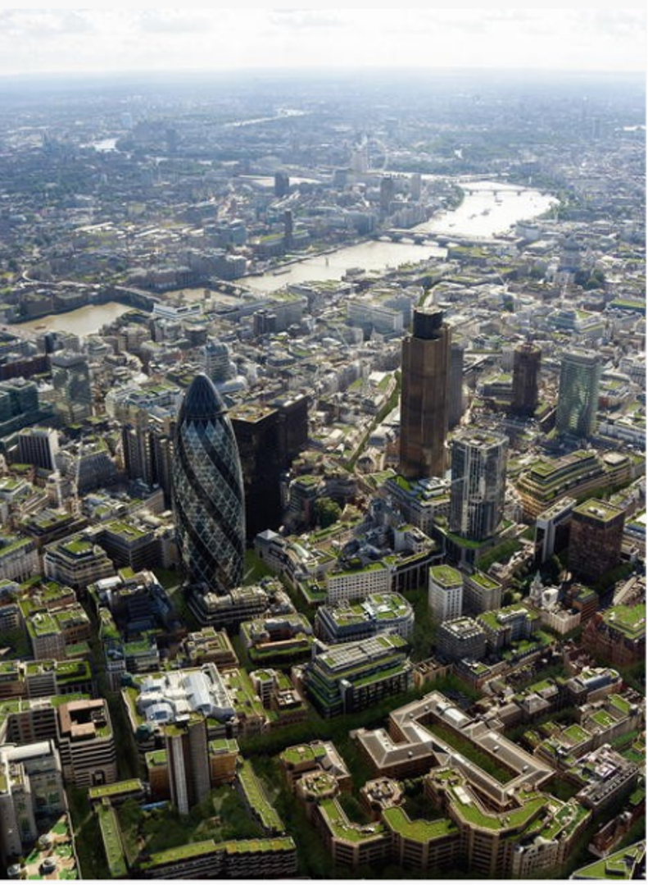

This lecture will consider how nature-based solutions (NbS) can be
integrated into different aspects of the urban environment. It will
provide examples of how NbS can be integrated into buildings and cities,
and other aspects of urban contexts.

# Learning objectives

-   Recall how NbS can be integrated to enhance building sector services

-   Recall how NbS can be integrated to promote positive outcomes in
    urban environments

-   Consider the ways in which NbS can benefit occupants across
    different sectors.

# Introduction to nature-based solutions in the built environment

Nature-based solutions (NbS) can be strategically integrated into
buildings across all infrastructure sectors, including residential,
office, transport, hospitals, schools, emergency response (e.g. police
stations) and industrial buildings.

Beyond simple aesthetic and environmental appeal, NbS can provide
various services which can benefit the building sector and urban
landscape [@Enzi2017;@Blicharska2019]. For example, green roofs and
walls can shade external building facades from weather and climate
impacts, enhance their durability and lifespan, reducing maintenance and
associated costs.

NbS can support the delivery of basic services to buildings, including
sanitation, water and food supplies, and sustainable energy. For
example, constructed treatment wetlands can be incorporated into
buildings to reduce wastewater treatment infrastructure and support
sanitation and hygiene [@Revitt2001; @Stefanakis2019]. Equally,
green roofs, rainwater harvesting systems and landscaped areas can
capture rainwater for reuse. This can support provision of freshwater
for domestic purposes, support sanitation and hygiene and increase
resilience of buildings and cities to drought. Green roofs can also
anchor rooftop solar panels, while evapotranspiration of plants keeps
solar panels cool, increasing their productivity rate by up to 20% and
supporting renewable energy supply [@Enzi2017].

NbS can provide various cost savings to building occupants. For example,
green roofs and walls can insulate buildings, reduce heat exchange and
associated requirements for heating and cooling, leading to increased
energy efficiency and reduced expenditure on energy (see mini-lecture
16.4).

Various cities are integrating green roofs and urban farming, including
New York, Berlin, Hong Kong and Singapore, and sectors including air
transport, schools and hospitals [@Newman2014].

{width=100%}

**Figure 17.4.1:** Rooftop farming in Vienna. Green roofs can enhance
building durability whilst doubling as space for activities that support
economic, societal and environmental health [@Enzi2017]

{width=100%}

**Figure 17.4.2:** Green roof on a gym in Paris. Green roofs can enhance
durability of building structures whilst delivering co-benefits
including air quality, mental health and well-being, space for
recreation and aesthetic value [@Enzi2017]

**Table 17.4.1:** Examples of economic benefits of integrating NbS into
buildings [@EuropeanCommission2013; @GMCA2019]

+----------------------------------+----------------------------------+
| Economic benefit                 | Description                      |
+==================================+==================================+
| Increased lifespan of engineered | -   Green roofs can increase the |
| infrastructure                   |     lifespan of engineered       |
|                                  |     roofs. For example,          |
|                                  |     @Liu&Baskaran2003 report an |
|                                  |     increased lifespan of 44.4%, |
|                                  |     while @Wong2003 find        |
|                                  |     vegetative roofs can last    |
|                                  |     three times longer.          |
|                                  |                                  |
|                                  | -   Fewer roof replacements      |
|                                  |     required means reduced       |
|                                  |     expenditure on replacement   |
|                                  |     costs.                       |
+----------------------------------+----------------------------------+
| Reduced maintenance costs        | -   The maintenance costs of     |
|                                  |     green roofs are reported to  |
|                                  |     be lower than those of grey  |
|                                  |     infrastructure.              |
+----------------------------------+----------------------------------+
| Increased property prices        | -   Inclusion of NbS, such as    |
|                                  |     street trees and urban       |
|                                  |     parks, can lead to increased |
|                                  |     residential and commercial   |
|                                  |     property prices.             |
|                                  |                                  |
|                                  | -   Incorporation of NbS can     |
|                                  |     help to make sites and       |
|                                  |     premises easier to sell or   |
|                                  |     rent and help to retain      |
|                                  |     occupants.                   |
+----------------------------------+----------------------------------+
| Additional economic              | -   Green roofs can support      |
| opportunities                    |     income generation activities |
|                                  |     through increased demand for |
|                                  |     green building materials and |
|                                  |     urban farming opportunities. |
+----------------------------------+----------------------------------+
| Reduced wastewater treatment     | -   Rain gardens and bioswales   |
| costs                            |     on buildings reduce          |
|                                  |     stormwater runoff,           |
|                                  |     minimising the amount of     |
|                                  |     water requiring treatment.   |
|                                  |                                  |
|                                  | -   Cost savings arise from      |
|                                  |     reducing energy cost         |
|                                  |     expenditure due to reduced   |
|                                  |     consumption needs for water  |
|                                  |     treatment.                   |
+----------------------------------+----------------------------------+
| Reduced energy costs             | -   Green walls and street trees |
|                                  |     can provide shading to       |
|                                  |     buildings, while green roofs |
|                                  |     can promote thermal          |
|                                  |     performance of roof          |
|                                  |     membranes, enhancing         |
|                                  |     evaporative cooling. This    |
|                                  |     reduces cooling needs in     |
|                                  |     summer and expenditure on    |
|                                  |     ventilation.                 |
|                                  |                                  |
|                                  | -   In winter, through seasonal  |
|                                  |     leaf fall, the building can  |
|                                  |     profit from warming sun      |
|                                  |     energy, leading to reduced   |
|                                  |     costs on heating.            |
|                                  |                                  |
|                                  | -   Studies show energy savings  |
|                                  |     from green roofs in the      |
|                                  |     range of 15-45% (for cool    |
|                                  |     and white roofs up to 65%),  |
|                                  |     through lower cooling needs. |
|                                  |                                  |
|                                  | -   @Karteris2016 found green   |
|                                  |     roofs led to 16% reduction   |
|                                  |     in energy used for cooling,  |
|                                  |     and 5% for heating.          |
|                                  |                                  |
|                                  | -   In Singapore, the energy     |
|                                  |     consumption of the KTP       |
|                                  |     hospital is 30% less than    |
|                                  |     comparable new hospitals,    |
|                                  |     saving USD1million per year. |
+----------------------------------+----------------------------------+
| Reduced building expenditure     | -   Green roofs have a reduced   |
|                                  |     payback time and increased   |
|                                  |     return on investment (ROI).  |
|                                  |                                  |
|                                  | -   Green roofs and walls act as |
|                                  |     buffers for extreme          |
|                                  |     temperatures which can cause |
|                                  |     damage to building           |
|                                  |     structures, leading to       |
|                                  |     recurring maintenance costs. |
+----------------------------------+----------------------------------+

# Nature-based solutions in cities

Integrating NbS in urban landscapes such as cities can provide multiple
social, environmental and economic benefits to the urban context
[@GINW2013].

NbS, such as green roofs, walls, balconies, bus shelters, car parks,
gardens, graveyards, parks and other green spaces, can support
sanitation and hygiene in urban areas by regulating water quantity,
reducing stormwater runoff, reducing pollutant loads and preventing
sewer system overflows, safeguarding urban water supplies.

{width=100%}

**Figure 17.4.3:** Green roofs can reduce annual stormwater runoff by up
to 50-90% for smaller storms (up to 25mm) and at least 30% for larger
storms [@GMCA2019;@Enzi2017].

By leveraging NbS in urban areas, cities can increase economic
generation, including by attracting inward investment and through
increased property prices [@GMCA2019; @GINW2013]. Furthermore,
through mitigating climate hazards (e.g. flooding) and delivering
protective services (e.g. enhanced building durability), NbS can lead to
lower insurance premiums.

NbS can have profound impacts on the health of urban populations, by
reducing temperatures and the urban heat island effect (mini-lecture
16.4), purifying air and increasing the physical and mental health of
urban dwellers [@Turhan&Akkurt2018]. This can deliver wider
benefits, including reduced government expenditure on health services
through prevention and reduction of health problems.

Green spaces such as urban parks, when implemented with proper
consideration, can increase community cohesion and reduce violence in
urban areas. NbS can also support the safety of urban transport
networks, including by increasing the attention span and reducing the
speed of drivers [@GMCA2019].

In Singapore, in the central commercial and shopping area, there is now
a requirement that all new or refurbished buildings must replace the
whole footprint coverage of a building with green space (e.g. green
roofs, walls, balconies). In this way, the whole city is designed to
have access to nature [@Newman2014].

{width=100%}

**Figure 17.4.4:** Green spaces can provide benefits to the physical and
mental health of populations, through opportunities for exercise,
reduction in the urban heat island effect and improving air quality, as
well as aesthetic appeal. Photograph from @Browder2019.

{width=100%}

**Figure 17.4.5:** Green spaces in cities can shield buildings from
weather impacts. Photograph from @Kapos2019.

{width=100%}

**Figure 17.4.6:** NbS can form part of a larger network of wildlife
corridors in urban and suburban areas, supporting wider biodiversity
goals, and contribute to carbon sequestration. Photographs from
Unsplash.

# Strategically integrating NbS to benefit offices, finance and retail

Integration of NbS has been shown to increase the effectiveness and
productivity of workforces. Studies show that high quality accessible
green spaces can improve health, cognitive functioning, alleviate stress
and enhance motivation of workforces. For example, a 2003 report by The
California Energy Commission found that workers in a call centre in
Sacramento performed 10-25% better on memory function tests when they
had a view of vegetation, compared to no view [@GINW2013]. Moreover,
people's access to natural scenery is significantly correlated to job
satisfaction, health and productivity.

NbS can further benefit offices and other sectors such as finance and
retail by improving health outcomes and reducing staff absences from
work. For example, @Elzeyadi2011 found that employees who had a view of
trees and natural landscapes took an average of 57 hours of sick leave
per year, compared to 68 hours of sick leave for employees who had no
view of nature. The study concluded that integrating views of nature
into office space can save over USD2,000 per employee.

High quality green spaces can help businesses build a good image and
reputation, encouraging inward investment and employment [@GMCA2019].
For example, well-managed NbS, through increasing the attractiveness and
quality of public space, is considered to increase attractiveness of
retail centres, leading to higher commercial retail rents, increased
occupancy, and increased footfall by visitors. Studies show that this
leads to additional economic benefits, including through increased
spending of visitors in local restaurants. Similarly, lack of nature or
degraded natural spaces can lead to poor perceptions of an area, and act
as a barrier to investment, recruitment and staff retention.

{width=100%}

**Figure 17.4.7:** A green roof on top of a car park and rail yard in
Illinois. The roof helps slow stormwater runoff and provides the
surrounding offices with a view of nature [@Browder2019]

# Strategically integrating NbS to benefit industrial sectors

NbS can be integrated into industrial sectors, including solid waste,
wastewater and manufacturing and production, to generate cost savings
and support their economic productivity and growth, while delivering
important benefits to their workforce.

For example, as discussed in mini-lecture 17.2, industrial sectors can
integrate NbS such as constructed treatment wetlands and reed beds to
support treatment of wastewater streams arising from production and
other industrial processes, reducing wastewater treatment requirements
and associated costs [@Langergraber2013]. Furthermore, by restoring
ecosystems surrounding factories, landfills and other industrial
buildings, NbS can help to reduce the leaching of industrial pollutants
and safeguard local water courses [@Aluko2005; @Lamb2013].

NbS could improve air quality in and around factory buildings, by
absorbing pollutants and oxygenating the environment, and can also
regulate the indoor microclimate of factories [@Blicharska2019]. This
could lead to improved health outcomes for sector staff leading to
improved physical well-being, and reduced incidence of respiratory
illnesses associated with industrial processes. Integration of green
spaces into factories could also reduce stress of workers and increase
their attention span, helping to ensure improved mental health and a
happier, more productive workforce [@GMCA2019]. Furthermore,
integration of nature on factory buildings, such as green roofs and
living walls, could help to regulate the urban heat island effect and
local environment, leading to benefits for surrounding communities
[@Turhan&Akkurt2018].

{width=100%}

**Figure 17.4.8:** NbS could be integrated in and around factory
buildings for various benefits including increasing the health,
well-being and productivity of workers. Photograph from Unsplash.

# Strategically integrating NbS to benefit health and education

## Health

Integrating NbS into urban areas can provide a variety of services which
improve mental health and well-being. These include (but are not limited
to) the provision of opportunities for exercise, reducing stress levels
and improving mental health through aesthetic appeal and spiritual
appreciation, offering visual relief in the built environment and
improved quality of life, as well as improved thermal comfort (see
Figure 17.4.9) [@GMCA2019; @GINW2013].

Equally, NbS can enhance physical health through regulating the urban
heat island effect, improving air quality and reducing the incidence of
respiratory illnesses, purifying the environment, provisioning
nutritious food, reducing disease and maintaining quality water supplies
[@Blicharska2019; @CNT2010].

{width=100%}

**Figure 17.4.9:** Natural ecosystems provide various benefits which
contribute to good health outcomes [@LivingPlanetReport2020]

As well as helping to prevent health-related issues, studies have shown
that integrating nature into hospitals can reduce patient recovery time
and associated costs with long hospital stays [@Viray2018;
@Newman2014]. Therapeutic gardens can be specifically incorporated
into hospital buildings and grounds. Plants are considered to have
healing views, that help to reduce blood pressure and heart rates.
@Ulrich1984 found that people recover quicker from surgery if they had
a view of trees from their hospital room, rather than a view of a wall,
through restorative influences.

## Education

NbS can also support education outcomes, by increasing cognitive
functioning, attention spans and providing opportunities for students to
learn about aspects such as sustainable development, biodiversity and
climate change [@Stenfors2019; @Bratman2015]. Furthermore, by
integrating green roofs and rainwater harvesting devices on school and
university buildings, students can have access to food and water,
supporting the reduction in malnutrition, enable learning about
vegetable growing, and take part in educational planting projects.

# Summary

This lecture has provided an overview of some of the ways in which
nature-based solutions can be integrated into urban contexts. There are
various options for integrating NbS, beyond green roofs, including
therapeutic gardens, green balconies and greenspaces around factories.
By investing in NbS in buildings, urban landscapes, and sectors
including industry, retail, offices, health and education, cities and
their occupants can benefit in multiple ways, including from improved
economic productivity, improved environmental quality and health
benefits.
