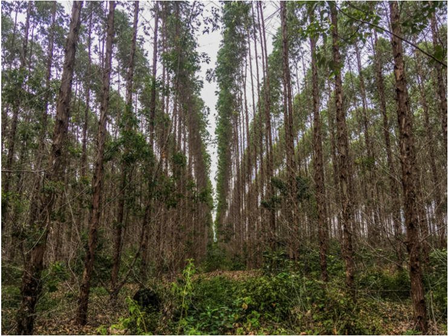
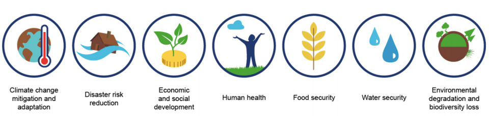

This lecture will discuss the importance of taking a landscape approach
to designing and implementing projects involving nature-based solutions.
It will provide an overview of the key data requirements for developing
solutions using nature. These include ecological, climate and
socio-political data requirements.

# Learning objectives

-   Describe the key data requirements for implementing NbS
-   Recall the importance of taking a system-wide landscape approach
-   Consider potential data sources for undertaking a baseline
    assessment.

# Landscape approach but rooted in the local ecological and socio-economic context

When aiming to integrate nature-based solutions (NbS), it is critical
that planning, decision-making and actions take a systems perspective,
in the context of the larger landscape [@Cohen-Schacham2016;
@IUCN2020a]. This includes the ecological, economic and socio-cultural
landscape [@IUCN2020b].

The need for a landscape approach to NbS is twofold:

1.  Ecosystems are highly dependent on wider-scale environmental
    processes and anthropogenic influences. These include sediment and
    nutrient fluxes, hydrodynamics, ecology, riverine and coastal
    processes, as well as human use, existing infrastructure networks
    and development. **The integrity and health of ecosystems at
    landscape scales determine the potential of NbS to deliver the
    required service (e.g. flood protection, soil stabilisation) to the
    target area.**

2.  The interconnectedness of nature means that actions in one area can
    impact elsewhere in the system. For example, the type and diversity
    of species forming an NbS impact surface, sub-surface and
    atmospheric processes, including water tables, biodiversity, pest
    resilience, disease, climate change and NbS performance. **Given the
    interconnectedness of nature, a systems approach is crucial to avoid
    unintended negative consequences which may occur downstream from an
    intervention, or elsewhere beyond the target area.**

The wider landscape context may be at scales such as a watershed, large
forest or ridge-to-reef. It is important to take into account the
interactions within and between ecosystems and people within the
landscape context, and the distribution of potential impacts (positive
and negative) [@Cohen-Schacham2019; @Seddon2020].

NbS have a tendency to be highly context-specific, which means that
their potential effectiveness and ecological suitability needs to also
be assessed within the local context [@Seddon2021]. This will be
discussed in the below sections. Potential negative impacts of not
taking into account the local context are highlighted in Figures 18.2.1
and 18.2.2.

{width=100%}

**Figure 18.2.1:** A number of studies have highlighted how Eucalyptus
forests have been implemented, to dire effect (e.g. @Chanie2013). Their
water-hungry and flammable nature has been known to lead to a drop in
the water table and increased prevalence of fires, which may have dire
consequences if implemented in drought-stricken countries. Monoculture
eucalyptus plantations also support lower biodiversity levels.
Photograph @GlobalForestCoalition2018.

# Defining the societal challenge and understanding where NbS can help to meet service needs

As introduced in mini-lecture 15.1, to be considered a NbS, a solution
using nature must be designed to address one of 7 societal challenges,
as defined by the International Union for the Conservation of Nature
(IUCN).

{width=100%}

**Figure 18.2.2:** The 7 societal challenges that can be addressed by
NbS. The societal challenge(s) identified should directly affect a
specific group of people (e.g. a NbS to control coastal erosion
endangering a specific municipality) or indirectly impact society as a
whole (e.g. a NbS for mitigation) [@IUCN2020b]

Project practitioners will need to broadly identify the service need
that the NbS is intended to address [@IUCN2020b; @Albert2020]. For
example, this may be the need for solutions to address issues of
sedimentation and turbidity in a water course in order to address the
societal challenge of water security.

In order to establish the service need and inform the design of a
solution using nature, a needs assessment will be required, conducted by
a NbS expert. A needs assessment is important for:

-   Identifying relevant opportunities for NbS to meet various service
    needs in a given project context

-   Enabling the decision-maker to define targets which result in an
    acceptable level of service

-   Establishing a basis for analysing the effectiveness of various
    measures for delivering the service.

In order to establish the service need and understand how NbS can best
be leveraged to provide the service or enhance service delivery, a
well-founded, evidence-based understanding of current and projected
environmental, social and economic conditions is necessary
[@IUCN2020b]. This will enable the development of a range of
potential solutions using nature and the identification of relevant
costs and benefits.

The relevant data needs are outlined throughout the rest of this
lecture, however, in practice, the exact data requirements will be
specific to the challenge that is being addressed and to the context in
which it is situated.

# Ecological data

A baseline assessment should be undertaken to identify the baseline
condition of the target landscape, including ecosystem extent, condition
and functioning (see Table 18.2.1) [@IUCN2020a; @WorldBank2017].
This should be broad enough to characterise the ecological state,
drivers of ecosystem loss and opportunities for net improvement.

**Table 18.2.1:** Ecological data and information requirements for
developing a solution using nature [@IUCN2020b]

+----------------------+----------------------+----------------------+
| Ecological           | Description          | Potential source of  |
| information          |                      | data                 |
+======================+======================+======================+
| Ecosystem structure  | -   Trophic dynamics | -   Geospatial       |
|                      |                      |     ecosystem maps   |
|                      | -   Vegetation       |                      |
|                      |     strata           | -   Government       |
|                      |                      |     resources        |
|                      | -   Spatial          |                      |
|                      |     distribution and | -   NGO datasets and |
|                      |     extent           |     reports          |
|                      |                      |                      |
|                      | -   Degree of        | -   Literature       |
|                      |     degradation      |     review           |
|                      |                      |                      |
|                      |                      | -   NBS and local    |
|                      |                      |     consultation     |
+----------------------+----------------------+----------------------+
| Species composition  | -   Abundance of     | -   IUCN Red List    |
|                      |     species from key |                      |
|                      |     taxonomic groups |                      |
|                      |     (e.g. plants,    |                      |
|                      |     mammals, birds,  |                      |
|                      |     soil             |                      |
|                      |     microorganisms)  |                      |
+----------------------+----------------------+----------------------+
| Key ecosystem        | -   Provisioning     | -   Literature       |
| functions /          |     services (e.g.   |     review and NbS   |
| ecosystem services   |     rates of         |     expert           |
| (see mini-lecture    |     productivity)    |     consultation for |
| 15.2)                |                      |     quantitative     |
|                      | -   Regulating       |     information on   |
|                      |     services (e.g.   |     provisioning and |
|                      |     wave height      |     regulating       |
|                      |     attenuation,     |     services         |
|                      |     flow reduction   |                      |
|                      |     rate)            | -   IUCN Red List of |
|                      |                      |     threatened       |
|                      | -   Supporting       |     species (for     |
|                      |     services (e.g.   |     information on   |
|                      |     rare and endemic |     rare             |
|                      |     biodiversity)    |     biodiversity)    |
|                      |                      |                      |
|                      | -   Cultural         | -   UNESCO World     |
|                      |     services (e.g.   |     Heritage Site    |
|                      |     cultural and     |     for cultural /   |
|                      |     natural          |     natural heritage |
|                      |     heritage,        |                      |
|                      |     walking trails,  |                      |
|                      |     ecotourism)      |                      |
+----------------------+----------------------+----------------------+
| Key features of the  | -   E.g. location of | -   Geospatial       |
| natural environment  |     water bodies;    |     ecosystem maps   |
|                      |     nuance on water  |                      |
|                      |     quantity/quality | -   Government       |
|                      |                      |     resources        |
|                      |                      |                      |
|                      |                      | -   NGO datasets and |
|                      |                      |     reports          |
|                      |                      |                      |
|                      |                      | -   Literature       |
|                      |                      |     review           |
|                      |                      |                      |
|                      |                      | -   NbS and local    |
|                      |                      |     consultation     |
+----------------------+----------------------+----------------------+
| Connectivity         | -   Identifying      | -   Geospatial       |
|                      |     existing or      |     ecosystem maps   |
|                      |     potential        |                      |
|                      |     corridors of     | -   NGO datasets and |
|                      |     vegetation       |     reports          |
|                      |     across the land  |                      |
|                      |     or seascape that | -   Literature       |
|                      |     link             |     review           |
|                      |     prot             |                      |
|                      | ected/semi-protected |                      |
|                      |     areas, refugia   |                      |
|                      |     for biodiversity |                      |
|                      |     and support      |                      |
|                      |     genetic exchange |                      |
+----------------------+----------------------+----------------------+
| External threats to  | -   External threats | -   IUCN Red list of |
| ecosystems           |     may include      |     Threatened       |
|                      |     development      |     Species          |
|                      |     plans or climate |                      |
|                      |     change impacts   | -   Red List of      |
|                      |                      |     Ecosystems       |
|                      | -   Where possible   |                      |
|                      |     this should be   |                      |
|                      |     determined by    |                      |
|                      |     the IUCN Red     |                      |
|                      |     List of          |                      |
|                      |     Threatened       |                      |
|                      |     species and Red  |                      |
|                      |     List of          |                      |
|                      |     Ecosystems       |                      |
|                      |                      |                      |
|                      | -   This should      |                      |
|                      |     account for      |                      |
|                      |     future external  |                      |
|                      |     trends           |                      |
+----------------------+----------------------+----------------------+
| Existing or planned  | -   Existing or      | -   Literature       |
| conservation         |     ongoing          |     review           |
| interventions        |     conservation     |                      |
|                      |     interventions in | -   Government       |
|                      |     the target or    |     reports          |
|                      |     adjacent         |                      |
|                      |     landscape        |                      |
+----------------------+----------------------+----------------------+

A baseline ecological assessment is required to determine:

-   Degree of ecosystem degradation (degraded ecosystems are less
    effective at delivering services than healthy ecosystems)

-   Where ecosystems are vulnerable (e.g. to development or climate
    change -- to ensure that existing ecosystems present a viable option
    for addressing future service needs -- some options available today
    may not be in the future)

-   The need for NbS and how NbS actions can help meet societal goals

-   Project objectives

-   A benchmark for determining efficacy, effects, and identifying where
    and when adaptive management actions are required.

It is important to note that the area relevant from an ecosystem
management or NbS perspective may be much larger than the area in direct
need of the service, and so it is necessary to continue to apply a
landscape approach to assessment.

Historical trends and changes in ecosystems may be researched in order
to understand the ecosystem's stability and resilience, and its original
services, particularly in the cases of degraded landscapes.

In order to be evidence-based, the baseline assessment should include
both local knowledge and scientific understanding. Quantitative and
qualitative evidence can be gathered from:

1. Published and/or grey literature through a literature review process

2. Stakeholder consultation, drawing upon local and expert knowledge

3. Surveys and site-specific data collection

4. Geospatial datasets (see table 18.2.2 for geospatial datasets).

**Table 18.2.2:** Geospatial data sources

+----------------------------------+----------------------------------+
| Data source                      | Description                      |
+==================================+==================================+
| World Terrestrial Ecosystems Map | -   Classifies the world into    |
|                                  |     areas of similar climate,    |
|                                  |     landform and landcover,      |
|                                  |     which form the basic         |
|                                  |     components of any            |
|                                  |     terrestrial ecosystem        |
|                                  |     structure.                   |
|                                  |                                  |
|                                  | -   Provides a World Ecosystems  |
|                                  |     Dataset which uses the       |
|                                  |     ArcGIS Combine tool (Spatial |
|                                  |     Analyst) -- this             |
|                                  |     characterises ecosystems at  |
|                                  |     a resolution of 250m and in  |
|                                  |     431 World Ecosystems         |
|                                  |     Classes.                     |
|                                  |                                  |
|                                  | -   Provides a layer that can be |
|                                  |     used in analysis at global   |
|                                  |     and local regions.           |
|                                  |                                  |
|                                  | -   Has provided an *[ArcGIS Pro |
|                                  |     Package](https://www         |
|                                  | .arcgis.com/home/item.html?id=3b |
|                                  | fa1aa4cd9844d5a0922540210da25b)* |
|                                  |     for large-scale spatial      |
|                                  |     analysis. This contains      |
|                                  |     original [raster             |
|                                  |     data](https://ww             |
|                                  | w.arcgis.com/home/item.html?id=d |
|                                  | 9434e94c817434c8448445501aee60a) |
|                                  |     with multiple table          |
|                                  |     attributes.                  |
|                                  |                                  |
|                                  | -   For simple mapping           |
|                                  |     applications, there is a     |
|                                  |     *raster tile* layer.         |
|                                  |                                  |
|                                  | -   Produced by adopting and     |
|                                  |     modifying the IPCC approach  |
|                                  |     on the definition of         |
|                                  |     Terrestrial Ecosystems and   |
|                                  |     development of standardised  |
|                                  |     global climate regions.      |
|                                  |                                  |
|                                  | -   It can be accessed           |
|                                  |     [here](https://www           |
|                                  | .arcgis.com/home/item.html?id=92 |
|                                  | 6a206393ec40a590d8caf29ae9a93e). |
+----------------------------------+----------------------------------+
| World Protected Areas Database   | -   The above layer can be       |
|                                  |     combined with the [World     |
|                                  |     Protected Areas              |
|                                  |     Database](https://ww         |
|                                  | w.arcgis.com/home/item.html?id=a |
|                                  | e78aeb913a343d69e950b53e29076f7) |
|                                  |     to assess the types of       |
|                                  |     ecosystems that are          |
|                                  |     protected, and progress      |
|                                  |     towards meeting conservation |
|                                  |     goals.                       |
|                                  |                                  |
|                                  | -   This layer updates monthly   |
|                                  |     from the United Nations      |
|                                  |     Environment Programme.       |
+----------------------------------+----------------------------------+
| Protected Planet                 | -   Provides country level data. |
|                                  |     For example, for             |
|                                  |     [Ghana](https://www.         |
|                                  | protectedplanet.net/country/GHA) |
|                                  |     and for                      |
|                                  |     [Jamaica](https://www.p      |
|                                  | rotectedplanet.net/country/JAM). |
|                                  |                                  |
|                                  | -   It also provides regional    |
|                                  |     level data.                  |
+----------------------------------+----------------------------------+
| Nature Map                       | -   Nature map can be accessed   |
|                                  |     [here](https:                |
|                                  | //explorer.naturemap.earth/map). |
+----------------------------------+----------------------------------+
| UN Biodiversity Map              | -   Data is available from       |
|                                  |     [here](http                  |
|                                  | s://www.unbiodiversitylab.org/). |
+----------------------------------+----------------------------------+

# Climate data

Present and future conditions need to be taken into account when
determining the appropriateness of potential NbS options and their
feasibility [@IUCN2020b; @WorldBank2017]. Solution identification
needs to reflect how ecosystems change over time, taking into account
the range of conditions that could occur.

Climate data will be necessary to understand:

1.  Potential risks to existing ecosystems and future NBS

2.  Where a solution can leverage NbS to enhance resilience to potential
    climate impacts in or around the target location (see earlier module
    on *Infrastructure for climate resilience* (Lectures 8-14) for
    information on identifying climate impacts).

Identification of potential existing and future risks to NbS is
important to understand if there are factors that could undermine NbS
and for identifying risk management solutions. Climate change impacts
may result in shifting location, altitude or degradation of existing
ecosystems. It is important to assess this in order to understand if and
how the service provision of the current ecosystem will change.
Furthermore, climate change may cause the loss of existing ecosystems,
and so some options that are available today may not necessarily be
present in the future.

A climate impact assessment can be undertaken to identify climate change
vulnerabilities and the extent to which ecosystem services are impacted
[@Kapos2019].

As outlined above, a landscape approach should be adopted, which
explores risks to ecosystems, but also to ecosystems that impact the
wider functioning of the target area (e.g. in the context of the wider
watershed or upstream in the watercourse).

# Socio-political data

NbS are specifically intended to address societal challenges, and so
each solution should be rooted in the local socio-economic and
institutional context [@IUCN; @Browder2019]. There are various
aspects to consider in an assessment.

A rigorous stakeholder mapping process should be undertaken to identify
the following:

-   Who uses and depends upon existing ecosystems and how?

-   Who would be *directly* and *indirectly* affected by the
    intervention, both *positively* AND *negatively*?

-   Which actors have the power to influence and make decisions
    regarding the environment, and who controls natural resources in the
    area?

-   Willingness and capacity of local stakeholders to participate in a
    project over the long-term

-   Skills and resources different stakeholders bring (i.e. local
    capacity to build and maintain desired interventions)

-   Where stakeholders are subject to inequality, inequity or
    marginalisation in terms of power, social position, culture or
    financial status. The underlying causes should be understood in
    order to reduce or avoid such inequities through the intervention
    and reduce conflicts.

Stakeholders to consider include government and relevant government
agencies, civil society organisations, local and indigenous communities,
the private sector, women and youth [@Naumann2011].

The legal, regulatory, financial, socio-economic and political contexts
should be assessed for their potential effects on the feasibility of
various NbS solutions to be considered. For example, local or national
policies or priorities may affect government prioritisation of different
ecological or engineering interventions [@EC2019].

Relevant national and regional development strategies should also be
consulted to identify opportunities to build on existing strategies
through leveraging NbS.

# Summary

Planning, designing and implementing NbS must start with a system-wide
landscape approach. This is critical given the interconnectedness of
nature with other aspects of the ecological and social system, both
within and beyond the target area. In order to design an effective
solution, it is necessary to undertake a needs assessment in order to
understand the various service needs of the target area, and how nature
may be leveraged to enhance service delivery. Solutions should be
grounded in the local context, and therefore a baseline assessment
should be conducted, to understand and map ecological and social
aspects, and identify potential risks to the solution.
